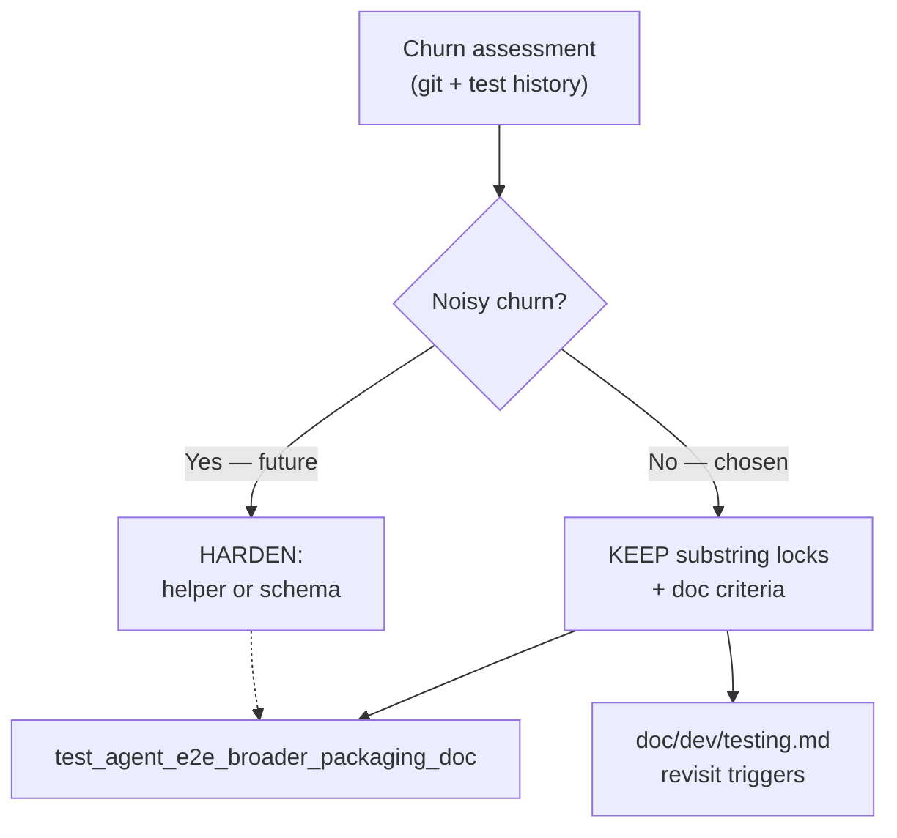

# PYPOST-938: Harden agent-e2e broader packaging doc locks

## Research

### Parent / source

- [PYPOST-922](https://pypost.atlassian.net/browse/PYPOST-922) — broader
  packaging docs + locks.
- Lock module: `tests/test_agent_e2e_broader_packaging_doc.py` (3 tests).
- Makefile locks: `TestAgentE2eTargetRecipe`, `TestHelpTarget` (922).
- Related pattern: `tests/test_agent_e2e_ci_double_run_doc.py` (873-style;
  still substring-based after 907/908/930 extensions).

### Churn assessment (2026-08-01)

| Surface | Since PYPOST-922 | Lock maintenance | False failures |
| --- | --- | --- | --- |
| `test_agent_e2e_broader_packaging_doc.py` | **1 commit** (922 landing) | **0** follow-up edits | **0** reported |
| Locked docs (`agent_e2e`, `agent_golden_e2e`, `testing`) | Multiple commits for **other** stories (930, 937, …) | Tokens preserved; **7/7** contract tests green | **0** |
| Makefile `test-agent-e2e` help/recipe | Help/recipe unchanged for 922 semantics; 937 shared parsers only | **0** token churn on 922 asserts | **0** |

**Verdict:** Token churn is **low**. Sibling doc edits did not require lock
updates. No maintainer pain from brittle substring failures.

### Hardening options considered

| Option | Pros | Cons |
| --- | --- | --- |
| A. **KEEP** 873-style substring locks + document revisit criteria | Matches project practice; zero false-failure risk from refactor | Still brittle if prose rephrased without tokens |
| B. Structured doc front-matter / schema | Robust to prose edits | Over-engineered for 3 stable docs; new convention |
| C. Shared doc-lock helper module (parse sections) | DRY for future locks | No churn problem yet; PYPOST-928 pattern is for YAML jobs |
| D. Semantic / LLM assert | Flexible | Flaky, slow, non-deterministic |

### Decision: **KEEP CURRENT STRATEGY**

**Rationale:** Churn is not noisy. Hardening now would add complexity without
demonstrated pain. Acceptance for “more resilient lock strategy” is met by
**documented when-to-harden triggers** in `doc/dev/testing.md` (same pattern as
PYPOST-930 continued DEFER checklist — decision recorded, locks unchanged).

**Future HARDEN triggers (any two within one sprint):**

1. ≥2 lock-test edits required **only** for prose rephrasing (not new
   packaging semantics) within 90 days.
2. ≥1 CI or local false failure from substring mismatch on an otherwise
   correct doc update.
3. Locked doc count grows beyond the current trio **and** a second packaging
   doc-lock module copies the same token block (DRY pressure — consider shared
   helper like PYPOST-928/937, not necessarily semantic hardening).

## Implementation Plan

1. **Step 3** — N/A (no behavioral change; KEEP leaves locks as-is).
2. **Step 4** — Add `doc/dev/testing.md` § **Packaging doc lock strategy
   (PYPOST-922 / PYPOST-938)** with KEEP decision + revisit triggers; extend
   lock module docstring with PYPOST-938 pointer; add 938 row to Makefile
   automation table.
3. **Green** — run 922 packaging contract tests (doc + makefile).

**Mandatory — Failing Repro (Step 3):** **N/A — no behavioral change.** This
task records an evidence-backed KEEP decision; lock assertions are unchanged.

## Architecture

## Q&A

| Q | A |
| --- | --- |
| Why not share a doc-lock helper now? | No DRY pain — single module, one commit since 922. Revisit at trigger #3. |
| Does KEEP fail acceptance? | No — resilient strategy includes explicit criteria without false failures. |
