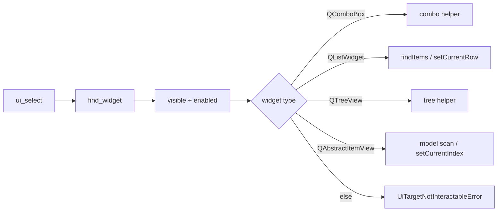

# PYPOST-939: QListView / QAbstractItemView in ui_select

## Research

### Jira / parent debt

- Issue: [PYPOST-939](https://pypost.atlassian.net/browse/PYPOST-939) —
  support `QListView` / generic flat `QAbstractItemView` in `ui_select`.
- Parent: [PYPOST-916/60-tech-debt.md](../PYPOST-916/60-tech-debt.md) TD-1.

### Current code

| Piece | Behavior |
| --- | --- |
| `ui_select` dispatch | `QComboBox`, `QListWidget`, `QTreeView`; else error |
| `_select_list` | `QListWidget.findItems` / `setCurrentRow` |
| `_select_tree` | Model DisplayRole walk + `setCurrentIndex` |
| Tests | Combo, `QListWidget`, `QTreeView`; no plain `QListView` |

### Decision: **ENABLE** — extend `ui_select` dispatch (not a sibling)

Same rationale as PYPOST-916: one documented agent primitive.

### Architectural decisions

| Decision | Choice | Rationale |
| --- | --- | --- |
| API shape | Unchanged `option: str \| int` | Symmetric with list/tree |
| Dispatch order | Combo → `QListWidget` → `QTreeView` → `QAbstractItemView` | Subclass ordering |
| Model list | `setCurrentIndex` on column 0 | Matches Qt selection model |
| Text match | Linear scan DisplayRole column 0 | Flat list; no recursion |
| Index | `0 .. rowCount()-1` on root model | Same contract as list widget |
| Logging | Existing `ui_action_applied` scalars | NFR3 |

## Implementation Plan

1. **Step 3 (red)** — add `QListView` + `QStandardItemModel` fixture tests;
   expect `not a selectable list/combo/tree` until Step 4.
2. **Step 4** — `_select_item_view` helper; dispatch branch; update docstrings.
3. **Step 8** — `doc/dev/ui_actions.md` type table + examples.

**Red test run:**

```bash
make test PYTEST_ARGS='tests/test_ui_actions.py::test_ui_select_list_view_by_text -v'
```

## Architecture



| Module | Responsibility |
| --- | --- |
| `pypost/agent/ui_actions.py` | `_select_item_view` + dispatch |
| `pypost/agent/lifecycle.py` | Session docstring |
| `tests/test_ui_actions.py` | `QListView` fixture proofs |
| `doc/dev/ui_actions.md` | Documented API (Step 8) |
