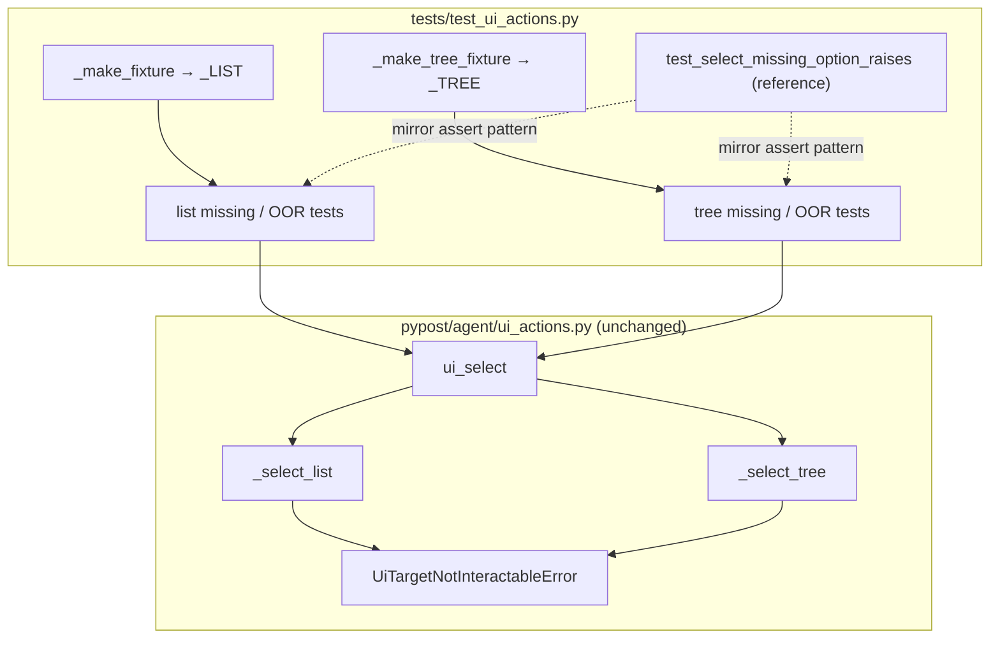

# PYPOST-942: List/tree out-of-range and missing-option tests

## Research

### Parent debt and scope

- Closes [PYPOST-916/60-tech-debt.md](../PYPOST-916/60-tech-debt.md) TD-4: combo
  missing-option is covered; list/tree negative paths are not.
- Parent implementation: [PYPOST-916/20-architecture.md](../PYPOST-916/20-architecture.md)
  — `ui_select` dispatches to `_select_list` / `_select_tree` with shared error
  strings.

### Current production behavior (no change expected)

| Helper | Missing text | Out-of-range index |
| --- | --- | --- |
| `_select_combo` | `option not found: {option!r}` | `option index out of range: {option!r}` |
| `_select_list` | same | same (`count()` rows) |
| `_select_tree` | same | same (top-level `model.rowCount()` only) |

All raise `UiTargetNotInteractableError(widget_id, reason)`; full message includes
`widget_id` and `reason` (see `pypost/agent/ui_actions.py`).

### Existing test coverage

| Module | What it proves |
| --- | --- |
| `tests/test_ui_actions.py` | Happy-path list/tree select; combo missing option (`test_select_missing_option_raises`) |
| `tests/test_tree_index_walk.py` | Tree missing text via `ui_select` on a deep tree using `objectName` (PYPOST-941) |

Gaps (TD-4):

- No list missing-text or out-of-range tests in the fixture suite.
- No tree out-of-range index test in the fixture suite.
- Tree missing-text in `test_tree_index_walk.py` uses a different fixture style
  (`objectName`, not `set_widget_id` / `_make_tree_fixture`); TD-4 asks for
  dedicated parity tests alongside combo coverage in `test_ui_actions.py`.

### Reference pattern (combo)

```python
def test_select_missing_option_raises(qapp: QApplication) -> None:
    root, _ = _make_fixture(qapp)
    try:
        with pytest.raises(UiTargetNotInteractableError) as exc_info:
            ui_select(root, _COMBO, "PATCH")
        assert "option not found" in str(exc_info.value)
    finally:
        root.close()
```

New list/tree tests mirror this: same exception class, same substring assertions,
same module-level `pytestmark` timeout (60s) and offscreen Qt fixture style.

### Fixture inventory (reuse, no new helpers)

| Fixture | Widget id | Rows (display) | Teardown |
| --- | --- | --- | --- |
| `_make_fixture` | `_LIST` (`fixture_list`) | Alpha, Beta, Gamma (3) | `root.close()` |
| `_make_tree_fixture` | `_TREE` (`fixture_tree`) | Top-level: Folder (nested Child), Sibling (2) | `close_item_view_fixture(..., QTreeView)` |

List negative cases use `_make_fixture` (already embeds `_LIST`). Tree negative
cases use `_make_tree_fixture` (isolated tree; same as happy-path tree tests).

### Decision: tests-only, no production modules

| Option | Verdict |
| --- | --- |
| Add tests in `test_ui_actions.py` only | **Chosen** — matches NFR3 and combo precedent |
| Extend `test_tree_index_walk.py` | Rejected — wrong suite; different fixture contract |
| New test module | Rejected — unnecessary split for four small cases |
| Change `ui_actions.py` | Out of scope unless Step 3 reveals a bug |

## Implementation Plan

1. **Step 3 — contract tests** — add four dedicated tests (or parametrize index
   boundaries) in `tests/test_ui_actions.py` next to existing select tests.
2. **Step 4 — development** — run full `tests/test_ui_actions.py`; fix
   production only if a test fails (unexpected per requirements).
3. **Step 5–8** — minimal cleanup/observability; no dev-doc changes unless
   Step 7 finds doc drift.

**Mandatory — Failing Repro (next Step 3):**

**N/A — no behavioral change.** Error paths are implemented in
`_select_list` / `_select_tree`. Step 3 adds **regression/contract tests** that
assert existing behavior; they are expected **green on first run**. If any test
fails, treat that as an implementation bug to fix in Step 4 (not a deliberate
red-before-green cycle).

Suggested Step 3 tests and assertions:

| Test name (proposed) | Call | Assert |
| --- | --- | --- |
| `test_select_list_missing_option_raises` | `ui_select(root, _LIST, "PATCH")` | `UiTargetNotInteractableError`, `"option not found"` |
| `test_select_list_index_out_of_range_raises` | `ui_select(root, _LIST, -1)` and `ui_select(root, _LIST, 3)` | `UiTargetNotInteractableError`, `"option index out of range"` |
| `test_select_tree_missing_option_raises` | `ui_select(root, _TREE, "PATCH")` | `UiTargetNotInteractableError`, `"option not found"` |
| `test_select_tree_index_out_of_range_raises` | `ui_select(root, _TREE, -1)` and `ui_select(root, _TREE, 2)` | `UiTargetNotInteractableError`, `"option index out of range"` |

Run after Step 3:

```bash
make test PYTEST_ARGS='tests/test_ui_actions.py::test_select_list_missing_option_raises tests/test_ui_actions.py::test_select_list_index_out_of_range_raises tests/test_ui_actions.py::test_select_tree_missing_option_raises tests/test_ui_actions.py::test_select_tree_index_out_of_range_raises -v'
make test PYTEST_ARGS='tests/test_ui_actions.py -v'
```

Sequencing: add contract tests → green (or fix bug in Step 4) → full module green.

## Architecture

Test-only change; production module graph unchanged from PYPOST-916.



| Module | Responsibility |
| --- | --- |
| `tests/test_ui_actions.py` | Add four negative-path contract tests; reuse fixtures |
| `pypost/agent/ui_actions.py` | Existing error implementation (read-only unless bug) |
| `tests/test_tree_index_walk.py` | Unchanged; deep-tree walk proofs stay separate |

### Interfaces under test

No API changes. Tests lock the existing contract:

```python
# str path — no matching DisplayRole / list item text
UiTargetNotInteractableError(..., reason="option not found: 'PATCH'")

# int path — index < 0 or >= row count (tree: top-level only)
UiTargetNotInteractableError(..., reason="option index out of range: 3")
```

### Patterns

| Pattern | Justification |
| --- | --- |
| Mirror combo negative test | Consistent CI failure messages; FR alignment |
| Reuse `_make_fixture` / `_make_tree_fixture` | No duplicate widget setup; matches happy paths |
| `pytest.raises` + substring assert | Same as `test_select_missing_option_raises`; avoids brittle full-string match |
| Parametrize index `-1` and `count` | One test function per widget type satisfies FR2/FR4 with two boundaries |
| Module `timeout(60)` | Already present; NFR2 satisfied without per-test markers |

## Q&A

| Q | A |
| --- | --- |
| Why not red-before-green? | Production errors exist; task is coverage debt (TD-4). |
| Duplicate tree missing test in `test_tree_index_walk.py`? | That file tests shared walk + deep tree; this task adds fixture-suite parity with combo using `_make_tree_fixture` and `set_widget_id`. |
| Test nested tree index OOR? | Out of scope — tree index is top-level only (PYPOST-916 contract). |
| Include QListView negatives? | Out of scope — PYPOST-939. |
| Parametrize vs separate tests? | Parametrize index boundaries is acceptable; keep missing-text as dedicated tests for clarity (mirror combo). |
