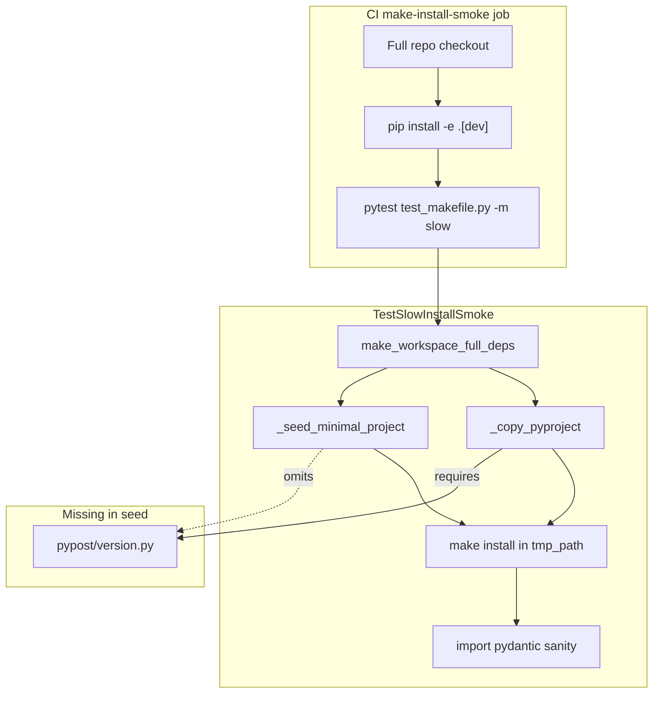
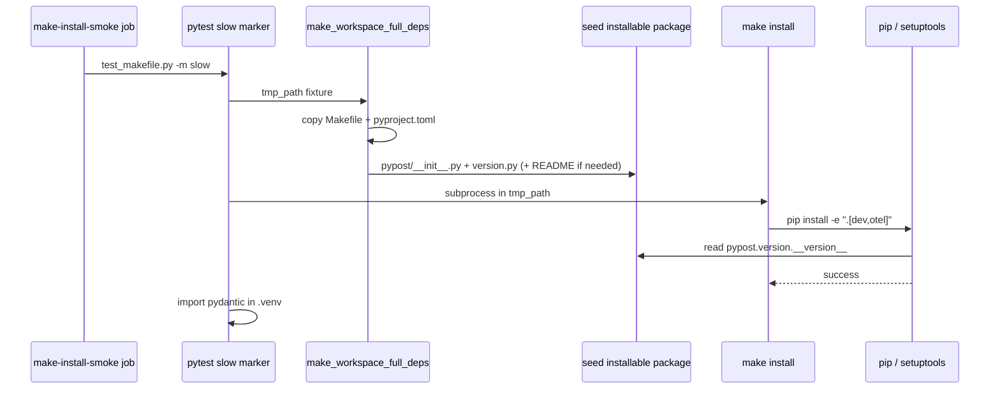

# PYPOST-943: Restore CI make install smoke (slow) gate

## Research

### Failure evidence

| Source | Finding |
| --- | --- |
| GitHub Actions run [30691352912](https://github.com/koctep/pypost/actions/runs/30691352912) | `make-install-smoke` job red on docs-only push to `dev`; peer jobs (`test`, `agent-e2e`) green on same run |
| Local `make test-slow` (2026-08-01) | Reproduces failure deterministically on current HEAD |
| Failure signature | `ModuleNotFoundError: No module named 'pypost'` during setuptools dynamic version resolution when isolated workspace runs `pip install -e ".[dev,otel]"` |

Peer jobs install from a **full checkout** (all of `pypost/` present). The smoke job runs
`TestSlowInstallSmoke`, which builds an **isolated `tmp_path` workspace** — the contract gap
is in how that workspace is seeded, not in CI infrastructure or pip cache.

Incidental workflow annotations (Node.js 20 deprecation, pip cache HTTP 400 restore warning) are
**not** the install failure; the subprocess exits non-zero during editable install metadata
resolution before any post-install import check.

### Root cause classification

| Classification | Verdict |
| --- | --- |
| Test contract gap | **Yes** — deterministic |
| Environment / cache flake | No |
| Infrastructure outage | No |

**Causal chain:**

1. **PYPOST-808** replaced static `version = "0.1.0"` in `pyproject.toml` with
   `dynamic = ["version"]` and `[tool.setuptools.dynamic] version = { attr =
   "pypost.version.__version__" }`.
2. **PYPOST-806** moved slow smoke from copied `requirements.txt` to copied real
   `pyproject.toml` (`make_workspace_full_deps`).
3. `_seed_minimal_project` still creates only `pypost/__init__.py` (empty stub) and a noop
   test — it does **not** copy `pypost/version.py`.
4. `make install` → `pip install -e ".[dev,otel]"` invokes setuptools, which must import
   `pypost.version.__version__` at build time. Without `pypost/version.py`, resolution fails.
5. Full-checkout jobs (`pip install -e ".[dev]"` / `".[dev,otel]"` in workflow) succeed
   because the real tree includes `pypost/version.py`.

PYPOST-806 explicitly deferred “validating setuptools package discovery in a dedicated slow
test”; PYPOST-808 changed packaging metadata without updating the slow-smoke seed contract.

### Current module map

### Packaging fields the seed must satisfy

Committed `pyproject.toml` references these install-time artifacts in the isolated workspace:

| Field | Requirement | Present in seed today |
| --- | --- | --- |
| `[tool.setuptools.dynamic] version.attr` | `pypost/version.py` with `__version__` | **No** |
| `[tool.setuptools.packages.find] include` | `pypost/` package dir | Partial (`__init__.py` only) |
| `[project] readme` | `README.md` on disk | **No** (may warn; validate in Step 3) |
| `[project] dependencies` | Network fetch of pinned wheels | Yes (via real pyproject) |

Fast Makefile tests use `_MINIMAL_PYPROJECT` with static `version = "0.0.0"` — they are
unaffected. Only `make_workspace_full_deps` + real `pyproject.toml` hits the gap.

### Related prior work

| Ticket | Relevance |
| --- | --- |
| PYPOST-559 | Introduced slow marker + isolated workspace smoke |
| PYPOST-806 | Switched seed from `requirements.txt` to `pyproject.toml` |
| PYPOST-808 | Dynamic version attr — **trigger** for current failure |
| PYPOST-923 | Fixed Qt/EGL apt parity for smoke job collection; separate issue, already addressed |

## Implementation Plan

High-level sequence for Steps 3–4 (no production fix in this step):

1. **Confirm red repro** — existing `TestSlowInstallSmoke::test_install_succeeds_with_project_pyproject`
   is already failing locally and in CI; Step 3 documents it as the primary repro (no new
   network-heavy test required unless README omission also fails).
2. **Add fast seed-contract guard** — static test deriving required seed files from
   `pyproject.toml` (dynamic version attr, readme path) and asserting the slow-smoke seed
   helper materializes them. Pattern: PYPOST-923 workflow YAML contract tests.
3. **Fix seed** — extend `_seed_minimal_project` or add `_seed_installable_package` used by
   `make_workspace_full_deps` to copy/create minimum files setuptools needs (at minimum
   `pypost/version.py`; add `README.md` stub or copy if Step 3 proves required).
4. **Verify green** — `make test-slow` locally; CI `make-install-smoke` on push.
5. **Docs touch (Step 8 scope)** — note in `doc/dev/testing.md` that slow smoke seeds must
   mirror packaging metadata requirements, not only dependency pins.

No changes to `.github/workflows/test.yml`, root `Makefile`, or `pyproject.toml` are expected
unless README seeding requires a one-line stub policy decision.

**Mandatory — Failing Repro (Step 3):**

| Item | Design |
| --- | --- |
| Primary red test | **Existing** `tests/test_makefile.py::TestSlowInstallSmoke::test_install_succeeds_with_project_pyproject` — asserts `make install` exit 0 in isolated workspace with real `pyproject.toml`, then `import pydantic`. Already red on HEAD; forces failure without live external deps beyond pip/network (same as CI). |
| Sequencing | (1) Run slow test → confirm red with version attr error → (2) add fast seed-contract test → red until seed fixed → (3) fix seed → both green. |
| Supplementary guard | New fast test (e.g. `tests/test_makefile_install_seed_contract.py`) parsing `pyproject.toml` and checking seed helper output includes `pypost/version.py` (and `README.md` if validated). No network; runs in default `make test`. |

## Architecture

### Components and responsibilities

| Component | Responsibility | Change |
| --- | --- | --- |
| `_seed_minimal_project` / new `_seed_installable_package` | Materialize minimum `pypost/` tree for editable install | **Extend** — include `version.py` (copy from repo or minimal canonical stub) |
| `make_workspace_full_deps` | Isolated workspace with real manifest | **Wire** to installable seed |
| `TestSlowInstallSmoke` | End-to-end `make install` + import sanity | Unchanged assertion; green once seed fixed |
| Seed contract test (new) | Prevent packaging/seed drift | **Add** — fast, no network |
| `make-install-smoke` CI job | Run slow marker on 3.11 with pip cache | **No change** |
| `make test-slow` | Local parity entry | **No change** |
| `pyproject.toml` / `Makefile` | Install contract source of truth | **No change** |

### Module interaction (after fix)

### Architectural patterns

| Pattern | Application |
| --- | --- |
| **Isolated workspace / black-box subprocess** | Preserved from PYPOST-559 — slow smoke never mutates repo `.venv` (NFR4). |
| **Contract testing** | Fast static test locks seed requirements to `pyproject.toml` metadata; slow test remains integration proof. |
| **Single version source (PYPOST-808)** | Seed copies real `pypost/version.py` from repo root rather than inventing a second version string. |
| **Makefile as primary interface** | Fix lives in test seed helpers; install path stays `make install` (NFR1). |

### Interfaces

| Interface | Contract |
| --- | --- |
| `make_workspace_full_deps(tmp_path) -> Path` | Returns directory with `Makefile`, committed `pyproject.toml`, installable `pypost/` tree, minimal `tests/test_noop.py`. |
| `_seed_installable_package(workspace)` | Creates/copies files required for `pip install -e` against current `pyproject.toml` (dynamic version attr, package discovery, readme if required). |
| `TestSlowInstallSmoke` | `_run_make(..., "install", timeout=170)` → returncode 0; `.venv/bin/python -c "import pydantic"` → returncode 0. |
| Seed contract test | Given repo `pyproject.toml`, assert seed output paths exist before any network install. |

### Design decisions

| Decision | Choice | Rationale |
| --- | --- | --- |
| Fix location | Test seed helpers, not CI workflow | Peer full-checkout installs pass; gap is fixture-only. |
| Version file in seed | Copy `pypost/version.py` from repo | Honors PYPOST-808 single source; avoids duplicate version literals in test code. |
| README handling | Copy repo `README.md` if install requires it; else omit | PEP 621 `readme` field may be mandatory for sdist metadata; validate in Step 3 red/green cycle. |
| New slow test | Reuse existing `TestSlowInstallSmoke` | Already encodes FR2/FR3; currently red — satisfies Step 3 repro without duplication. |
| Hardening | Add fast seed-contract test | Catches future dynamic metadata or readme changes without waiting for 3-minute CI smoke. |
| CI matrix redesign | Out of scope | Per requirements; smoke job structure stays. |

## Q&A

| Q | A |
| --- | --- |
| Why did docs-only push fail CI? | Smoke job always runs; seed gap predates the push and fails on every run. |
| Is this a flake? | No — reproduced locally with same setuptools version attr error. |
| Why not change `pyproject.toml` back to static version? | Would revert PYPOST-808; violates FR5 and single-source version goal. |
| Do cache / Node warnings matter? | No for this failure; install subprocess fails before post-install checks. |
| Does agent-e2e passing prove install works? | Yes for full checkout; smoke tests a stricter isolated-workspace contract. |
| [setuptools dynamic version docs](https://setuptools.pypa.io/en/latest/userguide/pyproject_config.html#dynamic-metadata) | Attr lookup requires importable module at build time — seed must provide it. |
