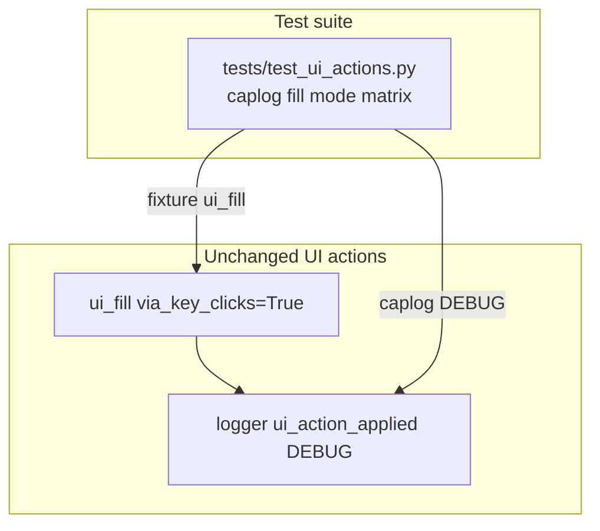

# PYPOST-944: Caplog assert for via_key_clicks=true on ui_fill

## Research

### Origin

- Jira: [PYPOST-944](https://pypost.atlassian.net/browse/PYPOST-944), Low Debt,
  from [PYPOST-917](https://pypost.atlassian.net/browse/PYPOST-917)
  (`ai-tasks/PYPOST-917/60-tech-debt.md` TD-1 — Caplog assert for
  `via_key_clicks=true`).
- Requirements: `ai-tasks/PYPOST-944/10-requirements.md`.
- Parent feature: [PYPOST-917](https://pypost.atlassian.net/browse/PYPOST-917)
  optional fill-via-keyClicks (delivered).

### Current production contract (unchanged)

`pypost/agent/ui_actions.py` — successful `ui_fill`:

```text
ui_action_applied primitive=fill widget_id=... outcome=ok
  duration_ms=... via_key_clicks=false|true
```

- Scalar uses `str(via_key_clicks).lower()` — expect literal `true` / `false`.
- Fill text is never logged (PYPOST-851 / NFR3).
- Logger: `pypost.agent.ui_actions`, level DEBUG.

Documented in `doc/dev/ui_actions.md` and `doc/dev/logging.md`.

### Existing tests

| Test | Coverage |
| --- | --- |
| `test_ui_action_applied_caplog` | Default fill; asserts `via_key_clicks=false`, no fill text |
| `test_ui_fill_via_key_clicks_on_fixture` | Opt-in fill behavior on fixture `QLineEdit` |
| `test_ui_fill_via_key_clicks_session` | Session accepts `via_key_clicks=True` (behavioral) |
| **Missing** | Caplog assert for `via_key_clicks=true` on opt-in fill |

### Caplog pattern (false path — template to mirror)

```python
with caplog.at_level(logging.DEBUG, logger="pypost.agent.ui_actions"):
    ui_fill(root, _INPUT, secret, via_key_clicks=True)
records = [
    r for r in caplog.records
    if r.name == "pypost.agent.ui_actions" and "ui_action_applied" in r.message
]
msg = records[-1].getMessage()
assert "via_key_clicks=true" in msg
assert secret not in caplog.text
```

Fixture: `_make_fixture(qapp)` + `_INPUT` widget id (same as
`test_ui_action_applied_caplog` and `test_ui_fill_via_key_clicks_on_fixture`).

### Decision

**Test-only change.** Extend caplog coverage in `tests/test_ui_actions.py` —
either parametrize `test_ui_action_applied_caplog` over
`(via_key_clicks, expected_scalar)` or add a sibling test dedicated to the
true path. No production edits expected unless the new test reveals a
regression.

## Implementation Plan

1. Keep `pypost/agent/ui_actions.py` and `pypost/agent/lifecycle.py`
   unchanged unless the new test fails for a real contract gap.
2. Extend `tests/test_ui_actions.py`:
   - **Preferred:** parametrize fill caplog over `(False, "false")` and
     `(True, "true")` in one test (DRY, symmetric FR5).
   - **Alternative:** sibling `test_ui_fill_via_key_clicks_caplog` mirroring
     false-path structure.
3. Run focused:
   `make test PYTEST_ARGS='tests/test_ui_actions.py::test_ui_action_applied_caplog -v'`
   (or renamed parametrized test id).
4. Step 8 (optional): note symmetric fill caplog proof in `doc/dev/ui_actions.md`
   Tests section if not already implied.

**Mandatory — Failing Repro (next Step 3):**

**N/A — no behavioral change.** PYPOST-917 already emits
`via_key_clicks=true` in production. The gap is missing test coverage only;
adding the caplog assert in Step 4 should pass immediately on current code.
No red product repro or `pytest.fail` placeholder is required — Step 4 is
verification lock-in, not feature delivery.

## Architecture

### Modules



### Responsibilities

| Component | Responsibility |
| --- | --- |
| `ui_fill` (existing) | Emit DEBUG scalar with correct `via_key_clicks` |
| `test_ui_action_applied_caplog` (extend) | Assert false + true scalars; no fill text |
| `doc/dev/ui_actions.md` | Document fill logging contract (already present) |

### Patterns

- Mirror PYPOST-851 / PYPOST-917 false-path caplog: scoped logger, filter
  `ui_action_applied` records, assert on last fill record.
- Use fixture `_make_fixture` — no `agent_e2e` session required for caplog.
- Module `pytestmark = timeout(60)` already present.

### Interfaces exercised

```text
ui_fill(root, widget_id, text, via_key_clicks=True)
  → DEBUG ui_action_applied ... via_key_clicks=true
```

## Q&A

| Q | A |
| --- | --- |
| Change production log message? | No — assert existing shape from PYPOST-917. |
| Parametrize vs sibling test? | Parametrize preferred (one caplog pattern, both modes). |
| Is Step 3 N/A? | **Yes** — logging exists; Step 4 test should be green on first write. |
| Session caplog too? | Out of scope — fixture matches false-path caplog scope. |
