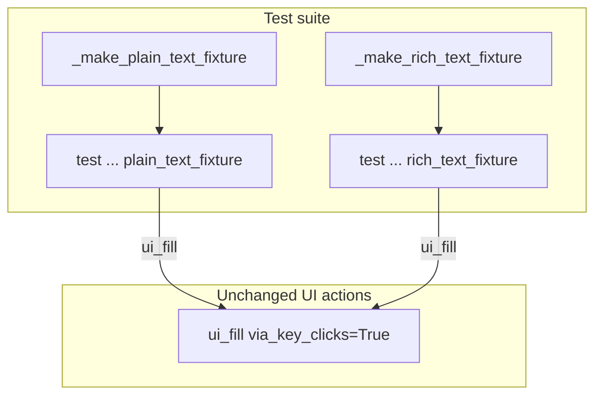

# PYPOST-945: Fixture keyClicks for QPlainTextEdit / QTextEdit

## Research

### Origin

- Jira: [PYPOST-945](https://pypost.atlassian.net/browse/PYPOST-945), Low Debt,
  from [PYPOST-917](https://pypost.atlassian.net/browse/PYPOST-917)
  (`ai-tasks/PYPOST-917/60-tech-debt.md` TD-2 — Fixture keyClicks coverage for
  plain/rich text edits).
- Requirements: `ai-tasks/PYPOST-945/10-requirements.md`.
- Parent feature: [PYPOST-917](https://pypost.atlassian.net/browse/PYPOST-917)
  optional fill-via-keyClicks (delivered).

### Current production contract (unchanged)

`pypost/agent/ui_actions.py` — opt-in `ui_fill`:

```text
clear → setFocus → _pump → QTest.keyClicks(widget, text) → _pump
```

- Accepted types: `QLineEdit`, `QPlainTextEdit`, `QTextEdit`.
- KeyClicks path is type-agnostic after the trio guard.
- DEBUG `ui_action_applied` with `via_key_clicks=true` (PYPOST-917).

### Existing tests

| Test | Coverage |
| --- | --- |
| `test_ui_fill_via_key_clicks_on_fixture` | Opt-in fill on fixture `QLineEdit` |
| `test_ui_fill_via_key_clicks_session` | Session accepts `via_key_clicks=True` (URL field) |
| `test_ui_action_applied_caplog` | Caplog scalar for both fill modes (line edit) |
| **Missing** | Opt-in keyClicks on fixture `QPlainTextEdit` / `QTextEdit` |

### Fixture pattern (line edit — template to mirror)

```python
root = _make_plain_text_fixture(qapp)
try:
    ui_fill(root, _PLAIN_TEXT, "plain-via-keys", via_key_clicks=True)
    plain = find_widget(root, _PLAIN_TEXT)
    assert isinstance(plain, QPlainTextEdit)
    assert plain.toPlainText() == "plain-via-keys"
finally:
    root.close()
```

Isolated fixtures follow `_make_list_view_fixture` — single widget per root,
`set_widget_id`, `show` + `processEvents`.

### Decision

**Test-only change.** Add two isolated fixtures and sibling tests in
`tests/test_ui_actions.py`. No production edits expected unless a new test
reveals a regression.

## Implementation Plan

1. Keep `pypost/agent/ui_actions.py` and `pypost/agent/lifecycle.py`
   unchanged unless a new test fails for a real gap.
2. Extend `tests/test_ui_actions.py`:
   - Constants `_PLAIN_TEXT`, `_RICH_TEXT`.
   - `_make_plain_text_fixture`, `_make_rich_text_fixture`.
   - `test_ui_fill_via_key_clicks_on_plain_text_fixture`.
   - `test_ui_fill_via_key_clicks_on_rich_text_fixture`.
3. Run focused:
   `make test PYTEST_ARGS='tests/test_ui_actions.py::test_ui_fill_via_key_clicks_on_plain_text_fixture tests/test_ui_actions.py::test_ui_fill_via_key_clicks_on_rich_text_fixture -v'`
4. Step 8 (optional): note plain/rich keyClicks fixture proofs in
   `doc/dev/ui_actions.md` / `doc/dev/testing.md`.

**Mandatory — Failing Repro (next Step 3):**

**N/A — no behavioral change.** PYPOST-917 already implements keyClicks fill
for the widget trio. The gap is missing test coverage only; adding fixture tests
in Step 4 should pass immediately on current code. No red product repro required.

## Architecture

### Modules



### Responsibilities

| Component | Responsibility |
| --- | --- |
| `ui_fill` (existing) | keyClicks fill on plain/rich editors |
| Isolated fixtures | Offscreen `QPlainTextEdit` / `QTextEdit` with widget ids |
| New tests | Assert final plain text after opt-in fill |
| `doc/dev/ui_actions.md` | Cross-ref fixture coverage (Step 8) |

### Patterns

- Mirror PYPOST-917 line-edit keyClicks test structure.
- Isolated fixtures (not bloating `_make_fixture`) — same as list/tree views.
- Module `pytestmark = timeout(60)` already present.

### Interfaces exercised

```text
ui_fill(root, widget_id, text, via_key_clicks=True)
  on QPlainTextEdit → toPlainText() == text
  on QTextEdit      → toPlainText() == text
```

## Q&A

| Q | A |
| --- | --- |
| Change production? | No — assert existing keyClicks branch from PYPOST-917. |
| Extend `_make_fixture`? | No — isolated fixtures keep combo/list tests lean. |
| Is Step 3 N/A? | **Yes** — behavior exists; Step 4 tests should be green on first write. |
| Session body keyClicks? | Out of scope — fixture matches line-edit keyClicks scope. |
