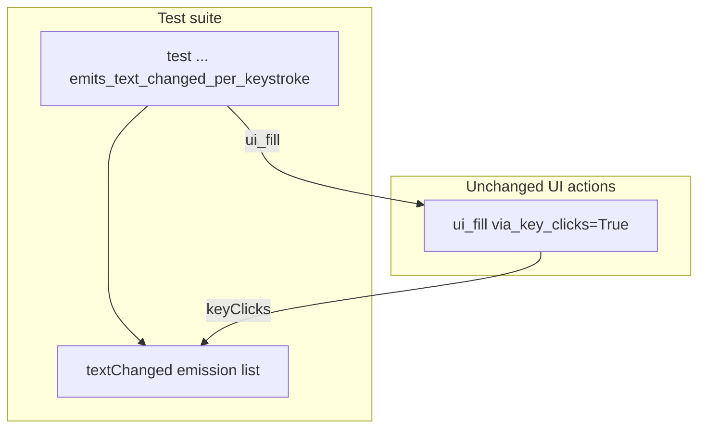

# PYPOST-946: Optional textChanged multi-emit assert

## Research

### Origin

- Jira: [PYPOST-946](https://pypost.atlassian.net/browse/PYPOST-946), Lowest Debt,
  from [PYPOST-917](https://pypost.atlassian.net/browse/PYPOST-917)
  (`ai-tasks/PYPOST-917/60-tech-debt.md` TD-3 — Optional `textChanged`
  multi-emit assert for keyClicks).
- Requirements: `ai-tasks/PYPOST-946/10-requirements.md`.
- Parent feature: [PYPOST-917](https://pypost.atlassian.net/browse/PYPOST-917)
  optional fill-via-keyClicks (delivered).

### Current production contract (unchanged)

`pypost/agent/ui_actions.py` — opt-in `ui_fill`:

```text
clear → setFocus → _pump → QTest.keyClicks(widget, text) → _pump
```

### Existing tests

| Test | Coverage |
| --- | --- |
| `test_ui_fill_via_key_clicks_on_fixture` | Final text on `QLineEdit` |
| `test_ui_fill_via_key_clicks_on_plain_text_fixture` | Final text on plain edit |
| `test_ui_fill_via_key_clicks_on_rich_text_fixture` | Final text on rich edit |
| **Missing** | `textChanged` emission count on keyClicks path |

### Qt offscreen probe (architecture research)

Empty-start widget, `clear → focus → keyClicks("abc")`:

| Widget | `clear` emits | Total | Per-key |
| --- | --- | --- | --- |
| `QLineEdit` | 0 | 3 | 3 (= len) |
| `QPlainTextEdit` | 1 | 4 | 3 |
| `QTextEdit` | 1 | 4 | 3 |

`QLineEdit.textChanged` passes `str`; plain/rich use no-arg signal — scope
line edit only for this story.

### Decision

**Test-only change.** Add one sibling test on the existing line-edit fixture
that connects `textChanged`, calls `ui_fill(..., via_key_clicks=True)`, and
asserts `len(emissions) == len(fill_text)` with an inline comment documenting
Qt behaviour. No production edits expected.

## Implementation Plan

1. Keep `pypost/agent/ui_actions.py` unchanged.
2. Extend `tests/test_ui_actions.py`:
   - `test_ui_fill_via_key_clicks_emits_text_changed_per_keystroke`.
   - Use short fill text (`"abc"`) for readable expected count.
   - Connect `line.textChanged.connect(emissions.append)` before fill.
3. Run focused:
   `make test PYTEST_ARGS='tests/test_ui_actions.py::test_ui_fill_via_key_clicks_emits_text_changed_per_keystroke -v'`
4. Step 8: note multi-emit proof in `doc/dev/ui_actions.md` /
   `doc/dev/testing.md`.

**Mandatory — Failing Repro (next Step 3):**

**N/A — no behavioral change.** PYPOST-917 keyClicks fill already emits
per-key `textChanged` on `QLineEdit`. Step 4 assertion should pass on first
write; no red product repro required.

## Architecture

### Modules



### Responsibilities

| Component | Responsibility |
| --- | --- |
| `ui_fill` (existing) | keyClicks fill unchanged |
| Emission spy | Collect `textChanged` payloads during fill |
| New test | Assert count == len(fill_text); final text unchanged |
| `doc/dev/ui_actions.md` | Cross-ref multi-emit proof (Step 8) |

### Patterns

- Mirror sibling keyClicks fixture teardown (`try`/`finally`, `find_widget`).
- Document expected count in test docstring and inline comment.
- Module `pytestmark = timeout(60)` already present.

### Interfaces exercised

```text
ui_fill(root, widget_id, text, via_key_clicks=True)
  on QLineEdit → len(textChanged emissions) == len(text)
                 and line.text() == text
```

## Q&A

| Q | A |
| --- | --- |
| Change production? | No — assert existing keyClicks branch. |
| Why not plain/rich? | Different clear emit semantics and no-arg signal; line edit suffices for TD-3. |
| Is Step 3 N/A? | **Yes** — behaviour exists; Step 4 test green on first write. |
| Assert `> 1` only? | Acceptance prefers per-keystroke count; `== len(text)` documents expectation. |
