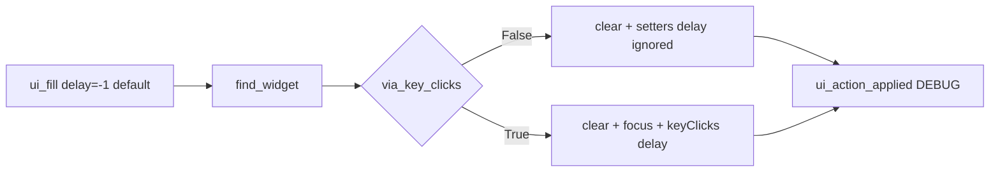

# PYPOST-947: Optional delay kwarg on keyClicks fill

## Research

### Parent debt

- Source: [PYPOST-917](https://pypost.atlassian.net/browse/PYPOST-917)
  `60-tech-debt.md` TD-4 — optional `delay` kwarg on keyClicks fill.
- [PYPOST-917](https://pypost.atlassian.net/browse/PYPOST-917) architecture
  deliberately omitted delay for CI speed; this story exposes it opt-in only.

### Current code

| Piece | Behavior |
| --- | --- |
| `ui_fill` keyClicks branch | `QTest.keyClicks(widget, text)` — Qt default delay |
| `AgentAppSession.ui_fill` | Passes `via_key_clicks` only |
| Tests | Final text, caplog, emission count — no delay forwarding proof |

### Qt guidance

- `QTest.keyClicks(widget, sequence, modifier=NoModifier, delay=-1)` —
  `delay` is milliseconds between keys; `-1` is Qt default
  ([Qt QTest::keyClicks](https://doc.qt.io/qt-6/qtest.html#keyClicks)).
- PySide6 accepts `delay` as keyword (`delay=0` verified offscreen).

### Decision: **ENABLE** — keyword on existing `ui_fill`

| Option | Pros | Cons |
| --- | --- | --- |
| **`delay: int = -1` on `ui_fill`** (chosen) | One primitive; default unchanged | Ignored on setter path |
| New sibling primitive | Narrow API | Duplication with session/docs |
| Always slow keyClicks | Realism | Breaks NFR5 / CI cost |

## Implementation Plan

1. **Failing repro (Step 3)** — add
   `test_ui_fill_via_key_clicks_forwards_delay_kwarg` calling
   `ui_fill(..., via_key_clicks=True, delay=42)`. Expect **red**
   (`TypeError: unexpected keyword argument 'delay'`) until Step 4.
2. **Step 4** — add `delay: int = -1` to module + session `ui_fill`; on
   keyClicks branch call `QTest.keyClicks(widget, text, delay=delay)`.
3. **Observability** — no new log fields; existing `via_key_clicks` scalar
   suffices (delay is harness tuning, not logged).
4. **Docs (Step 8)** — document `delay` on opt-in keyClicks fill in
   `doc/dev/ui_actions.md` and testing cross-ref.
5. **Green** — re-run targeted `tests/test_ui_actions.py` tests.

**Mandatory — Failing Repro (Step 3):**

- **Where:** `tests/test_ui_actions.py`
- **Assert:** patched `QTest.keyClicks` receives `delay=42` when caller passes
  `delay=42` with `via_key_clicks=True`.
- **Force red:** do not change `ui_actions.py` / `lifecycle.py` in Step 3.
- **Run:**

```bash
make test PYTEST_ARGS='tests/test_ui_actions.py::test_ui_fill_via_key_clicks_forwards_delay_kwarg -v'
```

## Architecture



| Module | Responsibility |
| --- | --- |
| `pypost/agent/ui_actions.py` | Accept `delay`; forward on keyClicks branch |
| `pypost/agent/lifecycle.py` | Session pass-through |
| `tests/test_ui_actions.py` | Delay forwarding smoke |
| `doc/dev/ui_actions.md` | Document opt-in delay (Step 8) |

### Interface sketch

```python
def ui_fill(
    root: QWidget,
    widget_id: str,
    text: str,
    *,
    via_key_clicks: bool = False,
    delay: int = -1,
) -> None:
    """Replace editable text; opt into keyClicks with optional per-key delay."""


# AgentAppSession
def ui_fill(
    self,
    widget_id: str,
    text: str,
    *,
    in_current_tab: bool = False,
    via_key_clicks: bool = False,
    delay: int = -1,
) -> None:
    ...
```

## Q&A

| Q | A |
| --- | --- |
| Log delay? | No — same contract as fill text (never logged). |
| Validate delay >= 0? | No — pass through to Qt; negative values match Qt API. |
| Session smoke? | Fixture mock test suffices; session mirrors signature only. |
