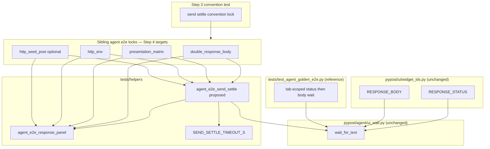

# PYPOST-948: Migrate sibling agent e2e to wait_for_text settle

## Research

### Parent / debt context

- [PYPOST-920](https://pypost.atlassian.net/browse/PYPOST-920) shipped
  `RESPONSE_STATUS` / `RESPONSE_BODY` on `ResponseView`, migrated golden Send
  settle to identity-scoped `wait_for_text`, and deferred sibling locks (TD-1).
- This ticket completes TD-1: test-only migration; **no production UI or wait-API
  changes** (requirements FR scope).

### Golden reference (PYPOST-920 — already green)

| Piece | Location | Pattern |
| --- | --- | --- |
| Status wait | `tests/test_agent_golden_e2e.py` | `wait_for_text(tab, RESPONSE_STATUS, FIXTURE_STATUS_LABEL, …)` |
| Body wait | same | `wait_for_text(tab, RESPONSE_BODY, FIXTURE_BODY_DISPLAY, …)` |
| Body display form | same | `json.dumps(json.loads(FIXTURE_BODY), indent=2)` |
| Timeout wrap | `_golden_fill_send_and_settle` | `UiWaitTimeoutError` re-raise with `step` + `response_excerpt` |
| Post-settle | golden flow | No panel-walk readiness; excerpt helper only for diagnostics |

Golden roots `wait_for_text` at the current `RequestTab` widget. Siblings today
use `session.wait_for_snapshot(_response_ready, …)` on `session.window`.

### Sibling state (mandatory + optional)

| Module | Send settle today | Body expected (readiness) | Post-settle (unchanged intent) |
| --- | --- | --- | --- |
| `test_agent_e2e_double_response_body.py` | `wait_for_snapshot(_response_ready)` | plain token `LOCK_DOUBLE_BODY` | `joined.count(token) == 1` after 100 ms flush wait |
| `test_agent_e2e_presentation_matrix.py` | per-cell `_response_ready` + snapshot | plain cell token + `Status: {code}` | body/status count == 1 per cell |
| `test_agent_e2e_http_env.py` | `_response_ready` (×2 tests) | compact `_BODY_IN_SNAPSHOT` in panel join | `joined` contains status + body token |
| `test_agent_e2e_http_seed_post.py` (optional) | `_response_ready` on Send paths | compact `_BODY_IN_SNAPSHOT` | tree-open stays snapshot-based |

Shared legacy predicate shape:

```python
def _response_ready(snap: dict[str, Any]) -> bool:
    joined = joined_panel_values(snap)
    return status_label in joined and body_token in joined
```

Env/seed JSON modules name the body constant `_BODY_IN_SNAPSHOT` (compact
`json.dumps` without indent). Golden and developer docs require **display-form**
body text for `wait_for_text` (`indent=2`, matching `ResponseView.display_response`).
Plain-text locks (double-body, matrix) use the same literal for wait and assert.

### Existing convention-test precedent

`tests/test_agent_e2e_response_panel.py` (PYPOST-869) already AST-scans Send
consumer modules to forbid local `_walk_values` / `_subtree_by_name` copies.
Same file lists golden + the three mandatory siblings in `_CONSUMER_MODULES`.
Extending this guard (or a sibling module beside it) is the natural Step 3 red
signal — no live network, no new production code.

### Wait API / scoping

- `AgentAppSession.wait_for_text(widget_id, expected, …)` roots at
  `session.window` (first matching `objectName`).
- Golden uses module-level `wait_for_text(tab, …)` for current-tab scoping.
- Siblings are single-tab except seed POST tree Send (`in_current_tab=True` on
  click only). Requirements accept window-first-match for text waits until
  [PYPOST-949](https://pypost.atlassian.net/browse/PYPOST-949).
- **Decision:** migrate siblings with `session.wait_for_text(RESPONSE_STATUS, …)`
  then `session.wait_for_text(RESPONSE_BODY, …)` to match existing
  `session.wait_for_snapshot` call sites and minimize diff. Seed POST tree Send
  keeps `in_current_tab=True` on click; text waits stay window-scoped.

### Architectural decisions

| Decision | Choice | Rationale |
| --- | --- | --- |
| Production scope | None | Requirements: test-only |
| Settle pattern | Status then body `wait_for_text` on catalog ids | Golden / PYPOST-920 contract |
| JSON body expected | `json.dumps(json.loads(raw), indent=2)` | Display form; decouple from sanitize snapshot |
| Plain body expected | Literal stub token | Already display text |
| Post-settle | Keep snapshot helpers + cardinality / caplog | FR5; only readiness migrates |
| Chunk-flush delay | Keep `_CHUNK_FLUSH_SETTLE_MS` + `QTest.qWait` | Preserves double-body / matrix intent |
| DRY settle wrap | Optional shared helper in `tests/helpers/` | Golden + 4 siblings share timeout diagnostics |
| Seed POST | Optional fourth module in migration + convention list | FR4; tree-open snapshot waits untouched |
| Tab-scoped text wait | Out of scope | PYPOST-949 |

## Implementation Plan

1. **Failing repro (Step 3)** — add convention lock (below). CI red until Step 4
   migrates all listed modules.
2. **Shared helper (Step 4, recommended)** — extract
   `wait_response_after_send(session, *, status_label, body_text, step, …)` into
   `tests/helpers/agent_e2e_send_settle.py` mirroring golden timeout wrap
   (`response_panel_excerpt`, stable `step`, optional extra diagnostics keys).
3. **Migrate mandatory siblings (Step 4)** — replace Send `wait_for_snapshot`
   blocks; drop `_response_ready` where unused; import `RESPONSE_STATUS`,
   `RESPONSE_BODY`; introduce `_BODY_DISPLAY` for JSON modules.
4. **Optional seed POST (Step 4)** — migrate Send response settle only; leave
   `_seed_post_editor_ready` snapshot waits.
5. **Verify suite (Step 4)** — `make test-agent-e2e` green; spot-check forced
   timeout diagnostics still carry `step` + `response_excerpt` per scenario.
6. **Docs (Step 8)** — update `doc/dev/agent_e2e_response_panel.md` and sibling
   dev docs to state siblings use text-wait settle (remove “may still settle via
   panel snapshot” for Send readiness).

**Mandatory — Failing Repro (next Step 3):**

- **Where (primary):** extend `tests/test_agent_e2e_response_panel.py` **or**
  add `tests/test_agent_e2e_send_settle_convention.py` (prefer extension to keep
  one convention home; new file if AST helpers grow large).
- **Modules under lock (mandatory):**
  - `test_agent_e2e_double_response_body.py`
  - `test_agent_e2e_presentation_matrix.py`
  - `test_agent_e2e_http_env.py`
- **Modules under lock (optional — include if Step 4 will migrate seed POST):**
  - `test_agent_e2e_http_seed_post.py`
- **Asserts (desired behavior — structural, no Qt window):**
  - Each locked module **imports** `RESPONSE_STATUS` and `RESPONSE_BODY` from
    `pypost.ui.widget_ids`.
  - Each locked module **uses** identity-scoped text waits for Send settle:
    `wait_for_text` (or `session.wait_for_text`) called with `RESPONSE_STATUS`
    then `RESPONSE_BODY` after `ui_click(SEND_BUTTON)`.
  - Each locked module **does not** define `_response_ready` **nor** call
    `wait_for_snapshot(_response_ready` (or equivalent panel-walk readiness
    predicate) on the Send → response path.
  - JSON modules (`http_env`, optional `http_seed_post`) **do not** pass compact
    `_BODY_IN_SNAPSHOT` as the body `wait_for_text` expected string (enforce
    display-form constant name such as `_BODY_DISPLAY` or inline
    `json.dumps(..., indent=2)`).
- **Force red without Step 4 fix:** do not edit sibling Send modules in Step 3.
  Today all three mandatory modules still define `_response_ready` and call
  `wait_for_snapshot` — the convention test **must fail** with a message naming
  the module and the missing text-wait pattern.
- **Implementation sketch (AST / source scan):** follow
  `_toplevel_def_names` in `test_agent_e2e_response_panel.py`; add
  `_module_source(path) -> str` and checks for required substrings / forbidden
  patterns. Prefer explicit failure messages over brittle full AST call-graph
  analysis.
- **Run:**

```bash
make test PYTEST_ARGS='tests/test_agent_e2e_response_panel.py -k settle -v'
# or, if new file:
make test PYTEST_ARGS='tests/test_agent_e2e_send_settle_convention.py -v'
```

- **Sequencing:** research → **red convention test** → migrate siblings (+ optional
  helper) → green convention + green `make test-agent-e2e` → docs.

## Architecture

### Module diagram



### Module responsibilities

| Module | Responsibility |
| --- | --- |
| `tests/test_agent_e2e_double_response_body.py` | Send settle via status/body text waits; keep cardinality lock + red-path test |
| `tests/test_agent_e2e_presentation_matrix.py` | Per-cell Send settle via text waits; keep smoke/slow marks + count asserts |
| `tests/test_agent_e2e_http_env.py` | Both Send scenarios settle via text waits + display-form JSON body |
| `tests/test_agent_e2e_http_seed_post.py` | Optional: Send response settle only; tree-open snapshot unchanged |
| `tests/helpers/agent_e2e_send_settle.py` (new) | DRY Send settle + timeout diagnostics shared by siblings |
| `tests/helpers/agent_e2e_response_panel.py` | Unchanged: post-settle joins, excerpts, cardinality |
| `tests/test_agent_e2e_response_panel.py` | Extend with Send settle convention guard (Step 3 red) |
| `tests/test_agent_golden_e2e.py` | Unchanged reference; may adopt shared helper later (out of scope) |
| `doc/dev/agent_e2e_response_panel.md` | Step 8: document sibling text-wait settle |

### Interface sketch

```python
# tests/helpers/agent_e2e_send_settle.py (Step 4 — proposed)
def wait_response_after_send(
    session: AgentAppSession,
    *,
    status_label: str,
    body_text: str,
    step: str,
    timeout: float = SEND_SETTLE_TIMEOUT_S,
    diagnostics_extra: dict[str, Any] | None = None,
) -> None:
    """Wait status then body on RESPONSE_STATUS / RESPONSE_BODY; re-raise with excerpt."""
    try:
        session.wait_for_text(RESPONSE_STATUS, status_label, timeout=timeout)
        session.wait_for_text(RESPONSE_BODY, body_text, timeout=timeout)
    except UiWaitTimeoutError as exc:
        excerpt = response_panel_excerpt(session.ui_snapshot())
        raise UiWaitTimeoutError(
            f"Send settle failed ({step}): {exc}; response_excerpt={excerpt!r}",
            timeout_s=exc.timeout_s,
            condition=exc.condition,
            diagnostics={
                **exc.diagnostics,
                "step": step,
                "response_excerpt": excerpt,
                **(diagnostics_extra or {}),
            },
        ) from exc


# JSON body display helper (env / seed modules)
def json_response_body_display(raw: str) -> str:
    return json.dumps(json.loads(raw), indent=2)


# double-body (plain token — same literal for wait and assert)
wait_response_after_send(
    session,
    status_label=_STATUS_LABEL,
    body_text=LOCK_DOUBLE_BODY,
    step="wait_response_after_send",
)
QTest.qWait(_CHUNK_FLUSH_SETTLE_MS)
snap = session.ui_snapshot()
# joined.count(LOCK_DOUBLE_BODY) == 1  — unchanged
```

### Interaction scheme

1. Harness reaches UI ready (existing fixtures; env uses seeded session).
2. Harness fills request fields and clicks Send under deterministic HTTP stub.
3. **New:** `wait_response_after_send` (or inline twin `session.wait_for_text`
   calls) on `RESPONSE_STATUS` then `RESPONSE_BODY`.
4. Existing post-settle delay (`QTest.qWait`) and snapshot-based cardinality /
   caplog / stub identity asserts run unchanged in business meaning.
5. On timeout, harness surfaces stable `step` + `response_excerpt` (matrix adds
   `cell` in diagnostics_extra).
6. CI: convention test green + full `make test-agent-e2e` green.

### Selected patterns

| Pattern | Why |
| --- | --- |
| Identity-scoped text wait (golden contract) | Removes sanitize-coupled panel-walk readiness |
| Convention test before migration | Clear red/green gate for test-only sweep |
| Shared settle helper | One timeout-diagnostic shape across siblings |
| Display-form JSON body | Matches `wait_for_text` / `toPlainText()` semantics |
| Retain panel snapshot helpers post-settle | Cardinality locks and excerpts still need tree walks |

### Dependency rules

- No imports from `tests/` into production code.
- Siblings import constants from `pypost.ui.widget_ids` and waits from
  `pypost.agent` / session methods — no inline id string literals.
- Do not change `joined_panel_values`, HTTP stubs, or presenter behaviour.
- Golden and PYPOST-950 timeout-diagnostics lock remain untouched.

### Out of scope (architecture boundary)

- Production UI / widget identity changes (already shipped in PYPOST-920).
- Golden e2e edits and PYPOST-950 diagnostics alignment.
- Tab-scoped `wait_for_text` (PYPOST-949).
- Migrating non-listed modules (e.g. `http_mapping_multi_url`).
- Redesigning snapshot helpers or Send fixtures.
- User-facing `doc/user/` docs.

## Q&A

| Q | A |
| --- | --- |
| Why a convention test instead of migrating one sibling in Step 3? | Production ids already exist; migrating one module would go green immediately and would not guard the full sibling set. Structural red proves the contract before the sweep. |
| Why `session.wait_for_text` vs golden’s tab root? | Matches existing sibling `session.wait_for_snapshot` sites; window-first-match is accepted per requirements until PYPOST-949. |
| Must post-settle asserts stop using snapshots? | No — only Send **readiness** migrates (FR5). |
| What changes for env/seed JSON body constants? | Readiness waits use display form (`indent=2`); rename away from `_BODY_IN_SNAPSHOT` for wait expected text. Post-settle `joined` checks may need the same display substring where they currently reference compact form — verify during Step 4 without weakening intent. |
| Is seed POST required? | No — optional; convention list includes it only if Step 4 migrates it. |
| Shared helper mandatory? | Recommended for DRY diagnostics; inline duplicate of golden wrap is acceptable if kept identical. |
| Approval gate? | Sprint-task-runner autonomy: Step 2 completed without user pause (orchestrator instruction). |

## Worklog

```
tokens_used: 0
role: execution
step: 2
step_name: Architecture
```
