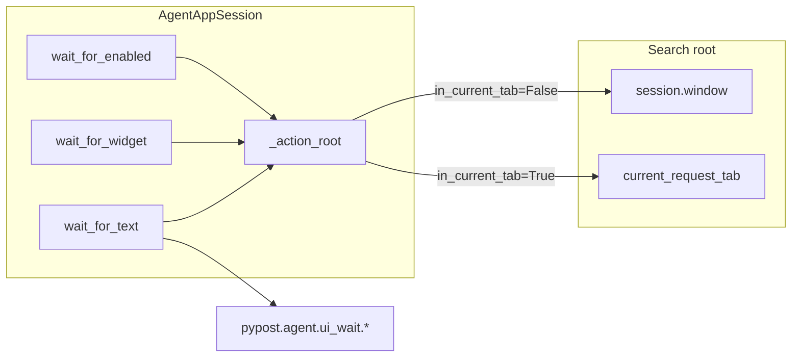

# PYPOST-949: Tab-scoped wait_for_text on AgentAppSession

## Research

- **PYPOST-851** added `current_request_tab`, `find_in_current_tab`, and
  `in_current_tab` on `ui_click` / `ui_fill` / `ui_select` / `ui_send_key`
  via `_action_root(in_current_tab=…)`.
- **PYPOST-920** golden uses module-level `wait_for_text(tab, …)`; session
  `wait_for_text` stayed window-rooted (architecture Q&A deferred tab scope).
- **PYPOST-948** `wait_response_after_send` passes
  `session.current_request_tab()` to free `wait_for_text` when
  `in_current_tab=True` — workaround for missing session flag.
- **Multi-tab failure mode:** each `RequestTab` stamps `RESPONSE_STATUS` /
  `RESPONSE_BODY`. Window `findChild` returns first match; inactive tab keeps
  `"Status: -"` while active tab shows `"Status: 200"` after Send — window
  scoped wait never sees 200.

## Implementation Plan

1. Add optional `in_current_tab: bool = False` to
   `AgentAppSession.wait_for_text`, `wait_for_widget`, `wait_for_enabled`.
2. Route root through existing `_action_root(in_current_tab=…)`.
3. Step 3 red test: two request tabs; Send on second; assert window-scoped
   `wait_for_text` times out on status 200; tab-scoped succeeds.
4. Step 4: implement flags; optionally simplify `wait_response_after_send` to
   call `session.wait_for_text(..., in_current_tab=True)`.
5. Step 8: document session wait helpers in `doc/dev/ui_wait.md` and cross-link
   from `agent_e2e_send_settle.md`.

**Failing Repro (Step 3):**

| Item | Detail |
| --- | --- |
| File | `tests/test_ui_wait.py` |
| Test | `test_session_wait_for_text_in_current_tab_after_multi_tab_send` |
| Setup | `agent_e2e_session`; add second tab; fill/Send with `stub_agent_e2e_http(CANNED_GOLDEN_OK)` on active tab |
| Assert (desired) | `session.wait_for_text(RESPONSE_STATUS, "Status: 200", in_current_tab=True)` succeeds; same call without flag raises `UiWaitTimeoutError` within short timeout |
| Red reason (pre-fix) | `TypeError` (unknown kwarg) or timeout on tab-scoped path if kwarg ignored |

## Architecture



### Module changes

| Module | Change |
| --- | --- |
| `pypost/agent/lifecycle.py` | `in_current_tab` kwarg on three wait methods; root = `_action_root(...)` |
| `tests/test_ui_wait.py` | Multi-tab red/green test |
| `tests/helpers/agent_e2e_send_settle.py` | Use `session.wait_for_text` when tab-scoped (DRY) |
| `doc/dev/ui_wait.md` | Session helper table + example |
| `doc/dev/agent_e2e_send_settle.md` | Note session API parity (PYPOST-949) |

### Dependency rules

- No imports from `tests/` into production.
- Free-function `wait_for_text(root, …)` unchanged.
- Default `in_current_tab=False` preserves all existing call sites.

### Out of scope

- Golden e2e rewrite to session waits.
- PYPOST-950 timeout-diagnostics alignment.
- New observability events (reuse existing wait timeout diagnostics).

## Q&A

| Q | A |
| --- | --- |
| Root override vs flag? | Flag only — matches actions; `_action_root` already centralizes choice. |
| Include `wait_for_snapshot`? | No — snapshot is window-level by design; multi-tab proofs use widget ids. |
| Why test in `test_ui_wait.py`? | Existing session wait integration tests live there (`test_session_wait_for_text_after_fill`). |

## Worklog

```
tokens_used: 12000
role: execution
step: 2
step_name: Architecture
```
