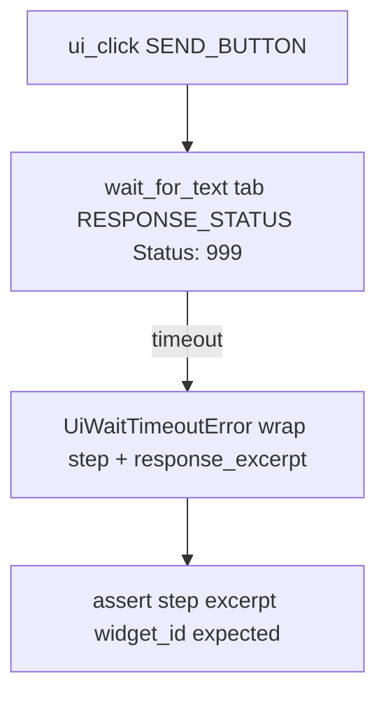

# PYPOST-950: Align timeout-diagnostics with text-wait settle

## Research

- **PYPOST-920** golden happy path:
  `_golden_fill_send_and_settle` uses tab-scoped `wait_for_text(tab,
  RESPONSE_STATUS, …)` then body; timeout companion kept snapshot miss
  (TD-3 deferral).
- **PYPOST-948** `wait_response_after_send` wraps `session.wait_for_text` with
  the same `step` + `response_excerpt` pattern — reference for diagnostics
  shape.
- **`wait_for_text` diagnostics** (`pypost/agent/ui_wait.py`): on timeout,
  `widget_id`, `expected`, `actual_text`; condition `text_match`.
- **`wait_for_snapshot` diagnostics**: `has_snapshot`, `node_count`, etc. —
  different fingerprint; current timeout test merges these into the wrap.

## Implementation Plan

1. In `test_agent_golden_settle_timeout_includes_step_and_excerpt`, mirror happy
   path: resolve `tab = session.current_request_tab()`, fill, Send with
   `stub_agent_e2e_http(CANNED_GOLDEN_OK)`.
2. Replace `session.wait_for_snapshot(lambda _snap: False, timeout=0.05)` with
   `wait_for_text(tab, RESPONSE_STATUS, "Status: 999", timeout=0.05)` (never
   matches canned 200).
3. Keep existing `except UiWaitTimeoutError` block: snapshot excerpt via
   `response_panel_excerpt`, re-raise with `step=wait_response_after_send` and
   `response_excerpt`.
4. Strengthen asserts: `widget_id == RESPONSE_STATUS`, `"expected" in
   diagnostics`, existing step/excerpt checks.
5. Step 8: update `doc/dev/agent_golden_e2e.md` — timeout companion uses
   text-wait miss, not snapshot.

**Failing Repro (Step 3):**

| Item | Detail |
| --- | --- |
| File | `tests/test_agent_golden_e2e.py` |
| Test | `test_agent_golden_settle_timeout_includes_step_and_excerpt` |
| Assert (desired) | After forced settle timeout, `diagnostics["widget_id"] == RESPONSE_STATUS` and `"expected" in diagnostics` |
| Red reason (pre-fix) | Snapshot forced timeout lacks `widget_id` / text-wait `expected` keys |
| Sequencing | Add assertions (red) → switch wait to `wait_for_text` miss (green) |

## Architecture

### Module changes

| Module | Change |
| --- | --- |
| `tests/test_agent_golden_e2e.py` | Text-wait forced miss + text diagnostics asserts |
| `doc/dev/agent_golden_e2e.md` | Document text-wait timeout companion |

### Dependency rules

- No `tests/` → production imports added.
- Reuse existing `response_panel_excerpt`, fixture constants, `SEND_SETTLE` stub.
- No changes to `pypost/agent/*`.

### Out of scope

- Production `ui_wait` changes.
- Golden happy-path settle refactor.
- Sibling e2e timeout companions (separate tickets).

## Q&A

- Q: Tab-scoped vs session `wait_for_text`?
  A: Match `_golden_fill_send_and_settle` (tab root) for consistency with happy
  golden path in the same module.
- Q: Why impossible status label vs short timeout on correct label?
  A: Response may arrive within 50ms; wrong label guarantees text mismatch even
  when status widget shows 200.
