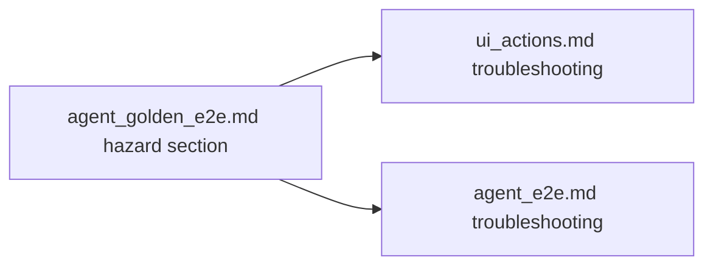

# PYPOST-951: Document removeTab orphan hazard for agents

## Research

### Parent context (PYPOST-921)

| Artifact | Relevant content |
| --- | --- |
| `tests/test_agent_golden_e2e.py::_strip_request_tabs` | Safe strip: reverse `removeTab`, `setParent(None)`, `deleteLater`, `processEvents` |
| `doc/dev/agent_golden_e2e.md` | Brief plus-tab / orphan mentions (lines 78–85, 129–133, 227–229) |
| PYPOST-921 `60-tech-debt.md` TD-2 | Follow-up: broader doc; could live in ui_actions tip |

### Qt / identity behavior

| Fact | Implication for agents |
| --- | --- |
| `QTabWidget.removeTab` detaches page, does not destroy | Orphan `RequestTab` widgets stay alive |
| Per-tab ids repeat on every tab (`URL_INPUT`, …) | Window-scoped `findChild` can match orphan first |
| Presenter `close_tab` auto-replaces last tab | Strip precondition must bypass presenter close |
| Session helpers default to window root | After strip, use `in_current_tab=True` or tab-rooted waits |

### Doc placement

| Location | Role |
| --- | --- |
| `doc/dev/agent_golden_e2e.md` | **Primary** — dedicated hazard section + reference helper |
| `doc/dev/ui_actions.md` | Troubleshooting bullet (PYPOST-921 TD-2 suggestion) |
| `doc/dev/agent_e2e.md` | Umbrella troubleshooting row for discoverability |

No new `doc/dev/*.md` file — extend existing agent stack docs.

## Implementation Plan

1. Add section **Tab-strip hazards: removeTab orphans** to
   `agent_golden_e2e.md` (symptoms, cause, safe pattern, post-strip scoping).
2. Link from plus-tab create subsection to the hazard section.
3. Add ui_actions troubleshooting entry with anchor link.
4. Add agent_e2e troubleshooting table row.
5. Record updates in `70-dev-docs.md`.

**Mandatory — Failing Repro (next Step 3):**

**N/A — no behavioral change.** Docs-only task; existing golden test already
exercises the strip pattern. Step 3 confirms N/A rationale only.

## Architecture

| Module | Change |
| --- | --- |
| `doc/dev/agent_golden_e2e.md` | New hazard section; tighten plus-tab cross-link |
| `doc/dev/ui_actions.md` | Troubleshooting cross-link |
| `doc/dev/agent_e2e.md` | Troubleshooting row |

No production code, tests, or Makefile changes.

## Q&A

| Q | A |
| --- | --- |
| New standalone doc file? | No — keep agent doc cluster cohesive; golden doc owns the pattern. |
| Duplicate full code block? | Yes — short reference snippet mirrors `_strip_request_tabs` for copy-paste. |
| Update ui_identity.md? | Optional one-line cross-link only if space allows; primary scope is golden + actions. |
