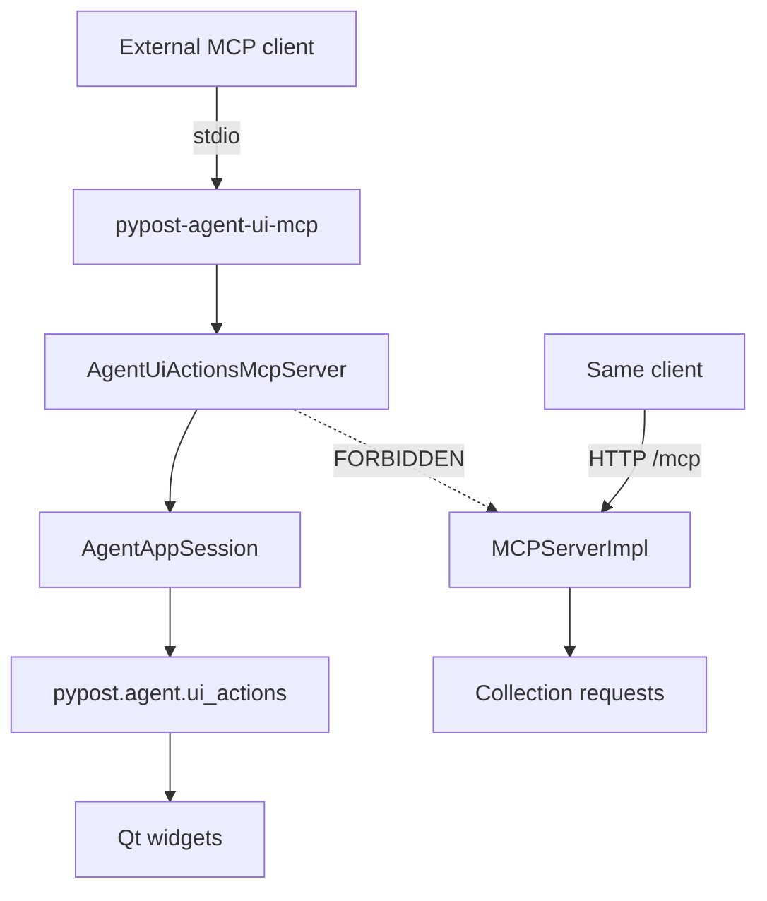

# PYPOST-952: Live out-of-process agent-UI MCP bridge

## Research

### Parent contract (PYPOST-918)

- Documented path: dedicated agent-UI MCP entry wrapping `ui_actions`; never
  `MCPServerImpl`.
- Industry pattern: compose multiple focused MCP servers (stdio local +
  product HTTP remote).

### Gap today

| Piece | Today | This story |
| --- | --- | --- |
| `ui_actions.py` | In-process primitives | Wrapped by MCP tools |
| Packaging docs | Path only (918) | Live stdio entry |
| `MCPServerImpl` | HTTP request tools | Unchanged |
| Runnable entry | Missing | `pypost-agent-ui-mcp` |

### Transport choice

| Option | Pros | Cons |
| --- | --- | --- |
| A. Stdio sidecar | MCP client default; process isolation | Sidecar owns Qt app |
| B. Separate loopback HTTP | Matches product MCP | Second uvicorn thread; deferred |
| C. Mount on MCPServerImpl | — | **Forbidden** |

**Decision: Option A — stdio sidecar** for v1.

### Qt threading

`MCPServerImpl` uses `run_in_threadpool` for sync HTTP. UI actions require the
**QApplication thread**. The stdio server runs `anyio.run` on that same thread
after `AgentAppSession.start()`; `call_tool` invokes ui_* synchronously with
`processEvents()` — no threadpool.

## Implementation Plan

1. **Step 3 (red):** `tests/test_agent_ui_actions_mcp.py` — module import,
   tool catalog constants, pyproject script, MCPServerImpl exclusion, stdio
   list_tools integration (fails until module exists).
2. **Step 4 (green):** `pypost/agent/ui_actions_mcp.py`, console script,
   Makefile `run-agent-ui-mcp`, green tests.
3. **Steps 5–8:** Cleanup, logging notes, tech-debt, `doc/dev/agent_ui_actions_mcp.md`.

## Architecture

### Modules

| Module | Responsibility |
| --- | --- |
| `pypost/agent/ui_actions_mcp.py` | MCP Server, tool schemas, stdio main |
| `pypost/agent/lifecycle.py` | Unchanged; session ui_* used by bridge |
| `pypost/core/mcp_server_impl.py` | Unchanged; no UI tools |
| `tests/test_agent_ui_actions_mcp.py` | Catalog, separation, stdio smoke |
| `doc/dev/agent_ui_actions_mcp.md` | Operator/dev guide |

### Tool catalog

| MCP tool | Maps to |
| --- | --- |
| `ui_click` | `session.ui_click` |
| `ui_fill` | `session.ui_fill` |
| `ui_select` | `session.ui_select` (option or option_index) |
| `ui_send_key` | `session.ui_send_key` |

Shared optional arg: `in_current_tab: bool`.

### Interfaces

- **Entry:** `pypost-agent-ui-mcp` → `pypost.agent.ui_actions_mcp:main`
- **Module:** `python -m pypost.agent.ui_actions_mcp`
- **Make:** `make run-agent-ui-mcp`

### Failing Repro (Step 3)

- **Asserts:** `pypost.agent.ui_actions_mcp` importable;
  `AGENT_UI_MCP_TOOL_NAMES` equals four ui_* names; pyproject declares script;
  `MCPServerImpl.list_tools()` never includes those names; stdio subprocess
  returns the four tools after initialize.
- **Location:** `tests/test_agent_ui_actions_mcp.py`
- **Force failure:** Module/script absent before Step 4.
- **Sequencing:** red tests → implement bridge → green.

## Q&A

- Q: Why sidecar owns AgentAppSession?
  A: Minimal v1; attach-to-running-GUI IPC is follow-up debt.

- Q: Streamable HTTP later?
  A: Non-blocker; stdio satisfies acceptance.
