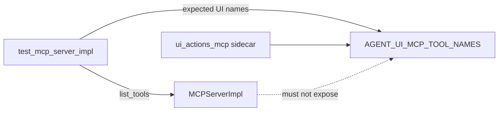

# PYPOST-953: Assert product MCP catalog excludes UI tools

## Research

### Context

- Parent [PYPOST-918](https://pypost.atlassian.net/browse/PYPOST-918): documented
  packaging path + doc-token locks; deferred runtime assert as item 2 → this ticket.
- [PYPOST-952](https://pypost.atlassian.net/browse/PYPOST-952): shipped
  `pypost.agent.ui_actions_mcp` with `AGENT_UI_MCP_TOOL_NAMES` and a sibling
  exclusion test in `tests/test_agent_ui_actions_mcp.py`.
- Gap: canonical product MCP test module (`tests/test_mcp_server_impl.py`) had no
  catalog exclusion assert — only collection schema/routing tests.

### Existing code

| Piece | Role |
| --- | --- |
| `MCPServerImpl.list_tools()` | Returns registered collection HTTP tools |
| `AGENT_UI_MCP_TOOL_NAMES` | `frozenset` of four ui_* names in sidecar module |
| `tests/test_mcp_server_impl.py` | Primary unit tests for product MCP impl |
| `tests/test_agent_ui_actions_mcp.py` | Sidecar packaging + sibling exclusion test |

**Verdict:** Add guard to `test_mcp_server_impl.py`; import shared name set from
sidecar module; no production edits.

### Architectural decision: test placement

| Option | Pros | Cons |
| --- | --- | --- |
| A. `test_mcp_server_impl.py` (chosen) | Canonical; matches 918 tech-debt file hint | Slight overlap with 952 test |
| B. Only in `test_agent_ui_actions_mcp.py` | Already exists | Product MCP maintainers miss it |
| C. New shared helper module | DRY | Over-engineering for two asserts |

**Decision: Option A** — add `test_list_tools_excludes_agent_ui_action_names` to
`TestMCPServerImpl`.

### Architectural decision: assertion strategy

| Option | Pros | Cons |
| --- | --- | --- |
| A. Intersect with `AGENT_UI_MCP_TOOL_NAMES` + `ui_*` prefix scan (chosen) | Single source of truth + catches new ui_* names | Prefix could false-positive unrelated future names (acceptable — product MCP should not use `ui_` prefix) |
| B. Doc tokens only | Already have | Not runtime |
| C. Live MCP HTTP list_tools | Strongest integration | Slow; unnecessary for unit guard |

**Decision: Option A.**

## Implementation Plan

1. **Step 3:** Add failing-repro test to `test_mcp_server_impl.py`. Production
   already satisfies invariant → test is **green on first run** (guard pattern;
   Step 4 production fix N/A).
2. **Step 4:** Confirm green; no `pypost/` changes.
3. **Steps 5–7:** Cleanup / observability N/A; tech-debt for any optional dedup.
4. **Step 8:** Cross-link guard in `doc/dev/agent_ui_actions_mcp.md` and
   `doc/dev/testing.md`.

**Mandatory — Failing Repro (Step 3):**

- **What it asserts:** After registering a normal exposed request,
  `list_tools()` names must not intersect `AGENT_UI_MCP_TOOL_NAMES` and must
  not include any name starting with `ui_`.
- **Where:** `tests/test_mcp_server_impl.py`,
  `TestMCPServerImpl.test_list_tools_excludes_agent_ui_action_names`.
- **How without live deps:** Instantiate `MCPServerImpl`, `register_tools` with
  one HTTP tool, `asyncio.run(impl.list_tools())`.
- **Sequencing:** Test passes immediately (invariant already true) — guard
  test, not defect repro.

## Architecture

### Modules

| Module | Change |
| --- | --- |
| `tests/test_mcp_server_impl.py` | New catalog exclusion test (PYPOST-953) |
| `pypost/core/mcp_server_impl.py` | **Unchanged** |
| `pypost/agent/ui_actions_mcp.py` | **Unchanged** — import names only |

## Q&A

- Q: Red or green on Step 3?
  A: Green — guard for existing correct behaviour; Step 4 N/A for production.

- Q: Remove 952 sibling test?
  A: Optional non-blocker; keep both for now (different test modules / audiences).
