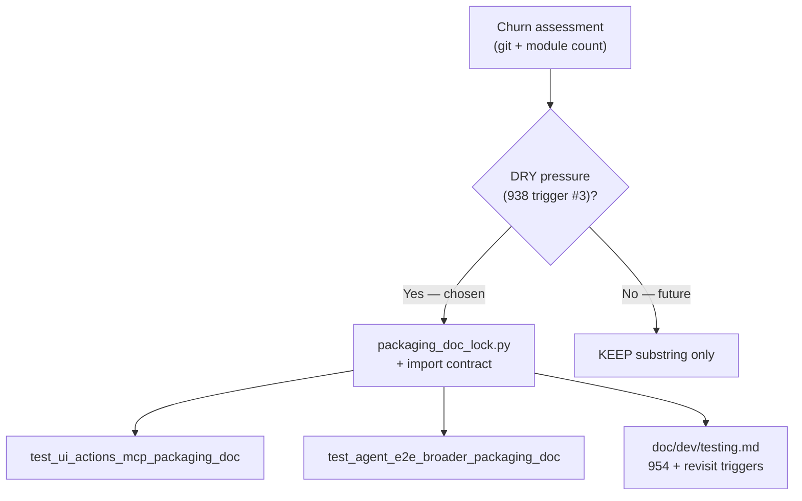

# PYPOST-954: Harden UI-action MCP packaging doc locks

## Research

### Parent / source

- [PYPOST-918](https://pypost.atlassian.net/browse/PYPOST-918) — UI-action MCP
  packaging path + doc-token locks.
- Lock module: `tests/test_ui_actions_mcp_packaging_doc.py` (4 tests).
- Sibling: `tests/test_agent_e2e_broader_packaging_doc.py` (922 / 938).
- Related: [PYPOST-938](https://pypost.atlassian.net/browse/PYPOST-938) KEEP +
  revisit triggers for broader locks.

### Churn assessment (2026-08-01)

| Surface | Since PYPOST-918 | Lock maintenance | False failures |
| --- | --- | --- | --- |
| `test_ui_actions_mcp_packaging_doc.py` | **1 commit** (918 landing) | **0** follow-up edits | **0** reported |
| Locked docs (`ui_actions`, `mcp_*`) | Multiple commits (952 sidecar, …) | Tokens preserved; **4/4** contract tests green | **0** |
| Sibling 922 lock module | 1 commit since 922 | **0** token churn on asserts | **0** |

**Verdict:** Token churn is **low** on UI-action MCP locks. However, **two**
packaging doc-lock modules now duplicate `_read` + assert patterns — 938
revisit trigger **#3** (DRY pressure) is satisfied.

### Hardening options considered

| Option | Pros | Cons |
| --- | --- | --- |
| A. **KEEP** substring locks + doc criteria only | Cheapest | Duplicated assert plumbing across two modules |
| B. **Shared helper** (`packaging_doc_lock.py`) + import contract | Matches PYPOST-928/937; DRY; clearer failures | Still substring-based |
| C. Structured doc front-matter / schema | Robust to prose edits | Over-engineered; no churn pain yet |
| D. Semantic / LLM assert | Flexible | Flaky, slow |

### Decision: **HARDEN via shared helper (Option B)**

**Rationale:** Churn on 918 tokens is not noisy, but acceptance allows
resilience without semantic hardening. Two doc-lock modules + documented 938
trigger #3 justify extracting shared helpers now — same pattern as
`ci_workflow_yaml.py` / Makefile parse helpers. Substring tokens unchanged;
false-failure risk unchanged.

**Future semantic HARDEN triggers** (documented in `testing.md`; any two
within one sprint):

1. ≥2 lock-test edits required **only** for prose rephrasing within 90 days.
2. ≥1 false failure from substring mismatch on an otherwise correct doc update.
3. A **third** packaging doc-lock module copies token blocks instead of using
   the shared helper.

## Implementation Plan

1. **Step 3** — N/A on doc tokens (no semantic change). Import contract in
   `test_packaging_doc_lock_helper.py` enforces helper adoption.
2. **Step 4** — Add `tests/helpers/packaging_doc_lock.py`; refactor 918 + 922
   lock modules; add helper unit tests.
3. **Step 8** — Extend `doc/dev/testing.md` § Packaging doc lock strategy.

**Mandatory — Failing Repro (Step 3):** **N/A for doc semantics.** Helper
extraction preserves locked tokens; import contract fails until modules import
shared helper.

## Architecture

## Q&A

| Q | A |
| --- | --- |
| Why HARDEN not KEEP like 938? | 938 had one lock module; 954 closes 918 follow-up when two modules exist — helper DRY is the proportionate hardening. |
| Does this change locked tokens? | No — same 918/922 tokens; shared assert functions only. |
| Semantic schema later? | Only if documented triggers fire. |
