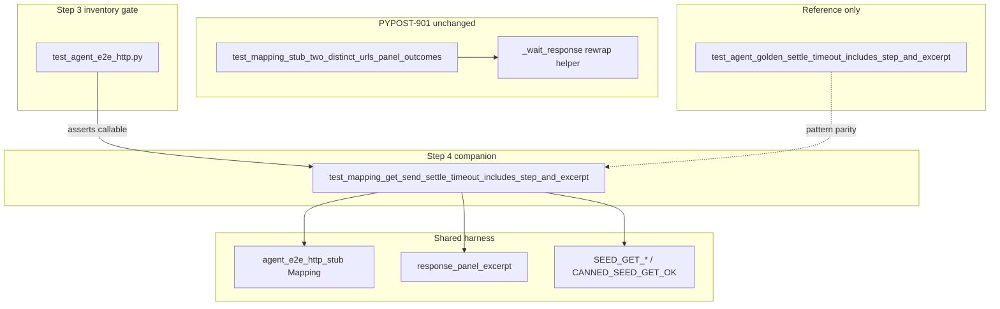

# PYPOST-955: Timeout companion for mapping settle diagnostics

## Research

### Parent debt and existing implementation

- Source: [PYPOST-901](https://pypost.atlassian.net/browse/PYPOST-901) TD-1 (Medium) in
  `ai-tasks/PYPOST-901/60-tech-debt.md`.
- Happy-path module: `tests/test_agent_e2e_http_mapping_multi_url.py` — two Sends under
  one Mapping stub; `_wait_response` rewraps `UiWaitTimeoutError` with:
  - `step`: `wait_response_after_mapping_get_send` or
    `wait_response_after_mapping_post_send`
  - `response_excerpt`: from `response_panel_excerpt(last)`
- Observability contract: `ai-tasks/PYPOST-901/50-observability.md` (timeout diagnostics
  are pytest failure fields, not log events).
- **Gap:** rewrap exists on the happy-path helper but no companion test forces timeout
  and asserts those diagnostics.

### Reference patterns (timeout companions)

| Precedent | Module | Forced timeout | Asserts |
| --- | --- | --- | --- |
| Golden Send (950) | `tests/test_agent_golden_e2e.py` | `wait_for_text(..., "Status: 999", timeout=0.05)` | `step`, `response_excerpt`, `widget_id`, `expected` |
| Dialog settle (934) | `tests/test_agent_dialog_settle_e2e.py` | `run_product_dialog_settle(..., wait_condition=lambda: False, timeout=0.05)` | `step`, modal scalars |
| Mapping happy path (901) | `tests/test_agent_e2e_http_mapping_multi_url.py` | N/A (uses `SEND_SETTLE_TIMEOUT_S` = 15s) | panel outcomes only |

Golden companion **does not** call the happy-path settle helper — it inlines a
near-zero-budget wait plus the same rewrap shape. Mapping companion should follow
that pattern: short timeout inline, not `_wait_response` (which hardcodes 15s).

### Settle mechanism delta (mapping vs golden)

- Golden (post-950): tab-scoped **text-wait** on `RESPONSE_STATUS`.
- Mapping (901): **snapshot** predicate via `session.wait_for_snapshot(ready, ...)`.
- Forced mapping timeout should use an **impossible snapshot predicate**
  (`lambda _: False`) with `timeout=0.05` (same wall-clock intent as dialog/golden
  companions). Response may arrive within 50ms; an impossible predicate guarantees
  timeout regardless of panel state.

### Step 3 red-test honesty (871 / 901 precedent)

A fully correct companion test would likely **pass immediately** — `_wait_response`
already implements the rewrap contract. PYPOST-901 Step 3 used an **inventory gate**
in `tests/test_agent_e2e_http.py` instead of a red GUI scenario. Same approach here.

### External guidance

No new libraries. Reuse existing `@pytest.mark.agent_e2e` + module `timeout(60)`,
Mapping catalog constants, `agent_e2e_http_stub`, and panel helpers. Per
`.cursor/lsr/do-testing.md`, per-test or module timeout markers remain mandatory.

## Implementation Plan

1. **Step 3 — failing repro (inventory gate)** — add to
   `tests/test_agent_e2e_http.py` (sibling to
   `test_mapping_multi_url_gui_send_scenario_module_exists`):

   ```python
   def test_mapping_multi_url_settle_timeout_companion_exists() -> None:
       """PYPOST-955: mapping Send settle timeout companion must exist."""
       import importlib

       mod = importlib.import_module(
           "tests.test_agent_e2e_http_mapping_multi_url"
       )
       assert callable(
           getattr(
               mod,
               "test_mapping_get_send_settle_timeout_includes_step_and_excerpt",
               None,
           )
       )
   ```

   Run:

   ```bash
   make test PYTEST_ARGS='tests/test_agent_e2e_http.py::test_mapping_multi_url_settle_timeout_companion_exists -q'
   ```

   Expected: **red** (`AssertionError` — companion callable missing).

2. **Step 4 — companion test** — add to
   `tests/test_agent_e2e_http_mapping_multi_url.py`:

   - Name: `test_mapping_get_send_settle_timeout_includes_step_and_excerpt`
   - Blank `agent_e2e_session`; same widget discovery as happy-path test.
   - Two-URL map (reuse catalog constants); **GET Send only** for minimal
     acceptance (FR3 allows GET or POST; one path locks
     `wait_response_after_mapping_get_send`).
   - Inside stub scope: fill GET URL/method → Send → forced settle:

     ```python
     FORCED_SETTLE_TIMEOUT_S = 0.05

     with pytest.raises(UiWaitTimeoutError) as exc_info:
         try:
             session.wait_for_snapshot(lambda _: False, timeout=FORCED_SETTLE_TIMEOUT_S)
         except UiWaitTimeoutError as exc:
             last = session.ui_snapshot()
             excerpt = response_panel_excerpt(last)
             raise UiWaitTimeoutError(
                 f"mapping multi-URL Send settle failed (wait_response_after_mapping_get_send): {exc}; "
                 f"response_excerpt={excerpt!r}",
                 timeout_s=exc.timeout_s,
                 condition=exc.condition,
                 diagnostics={
                     **exc.diagnostics,
                     "step": "wait_response_after_mapping_get_send",
                     "response_excerpt": excerpt,
                 },
             ) from exc
     ```

   - Assert: `diagnostics["step"] == "wait_response_after_mapping_get_send"`;
     `"response_excerpt" in diagnostics`; `isinstance(..., str)`.
   - Do **not** change happy-path test or golden companion.

3. **Steps 5–7** — flake8 on touched modules; no new log events (harness-only);
   unticketed follow-ups only in `60-tech-debt.md` (e.g. optional POST companion,
   shared rewrap helper deferred to PYPOST-956).

4. **Step 8 (optional minimal)** — one line in `doc/dev/agent_e2e_http.md` naming
   the timeout companion beside the happy-path GUI scenario (mirror
   `doc/dev/agent_dialog_settle.md` two-test table if touched).

**Mandatory — Failing Repro (next Step 3):**

| Item | Detail |
| --- | --- |
| File | `tests/test_agent_e2e_http.py` |
| Test | `test_mapping_multi_url_settle_timeout_companion_exists` |
| Assert (desired) | `test_mapping_get_send_settle_timeout_includes_step_and_excerpt` is callable in mapping module |
| Red reason (pre-fix) | Companion function not defined yet (`AssertionError`) |
| Sequencing | inventory gate (red) → add companion in mapping module (inventory green + companion green under `make test-agent-e2e`) |

Green paths after Step 4:

```bash
make test PYTEST_ARGS='tests/test_agent_e2e_http.py::test_mapping_multi_url_settle_timeout_companion_exists -q'
make test-agent-e2e PYTEST_ARGS='tests/test_agent_e2e_http_mapping_multi_url.py -q'
```

## Architecture



### Modules and responsibilities

| Module | Change | Responsibility |
| --- | --- | --- |
| `tests/test_agent_e2e_http_mapping_multi_url.py` | **Add** companion test | Force GET Send settle timeout; assert `step` + `response_excerpt` |
| `tests/test_agent_e2e_http.py` | **Add** inventory test | Step 3 red gate until companion exists |
| `tests/test_agent_golden_e2e.py` | None | Golden timeout precedent (reference) |
| `tests/helpers/agent_e2e_response_panel.py` | None | `response_panel_excerpt` |
| `tests/helpers/agent_e2e_send.py` | None | `SEND_SETTLE_TIMEOUT_S` (happy path only) |
| `pypost/fixtures/agent_e2e_http.py` | None | Mapping stub + catalog |
| `doc/dev/agent_e2e_http.md` | Step 8 optional | Mention timeout companion |

### Interfaces (companion-facing)

| Symbol | Use |
| --- | --- |
| `SEED_GET_RESOLVED_URL` / `CANNED_SEED_GET_OK` | GET Send under Mapping stub |
| `agent_e2e_http_stub(responses_map)` | Single stub scope for companion |
| `URL_INPUT`, `METHOD_COMBO`, `SEND_BUTTON` | UI fill + Send |
| `response_panel_excerpt` | Excerpt at timeout |
| `wait_response_after_mapping_get_send` | Stable `diagnostics["step"]` value |
| `FORCED_SETTLE_TIMEOUT_S = 0.05` | Near-zero budget (module-local constant) |

### Patterns

- **Sibling timeout companion** — same module as happy path; does not replace or
  weaken happy-path assertions (FR6).
- **Inventory red gate** — honest failure when companion missing (871/901); full
  companion would pass on first write because rewrap already exists.
- **Inline forced timeout + rewrap** — mirror golden/dialog; do not call
  `_wait_response` (15s budget).
- **Minimal path coverage** — one GET companion satisfies acceptance; POST step name
  is a desirable follow-up, not a blocker.
- **No production changes** — test-only; no `tests/` → production imports.

### Out of scope (unchanged)

- Production Send settle / wait APIs.
- Shared rewrap extraction ([PYPOST-956](https://pypost.atlassian.net/browse/PYPOST-956)).
- Caplog `name=url_router` proof ([PYPOST-957](https://pypost.atlassian.net/browse/PYPOST-957)).
- Golden Send flow changes.
- Full mapping failure matrix.

## Q&A

| Q | A |
| --- | --- |
| Why inventory gate, not a red GUI assertion? | Rewrap is already implemented in `_wait_response`; a correct companion passes immediately (901 precedent). Inventory proves the coverage gap until the test lands. |
| GET only, not POST? | Acceptance requires at least one mapping settle step + excerpt; GET is the simpler Send (no body fill). POST companion is optional follow-up. |
| Why `lambda _: False` instead of wrong status text? | Mapping happy path uses snapshot settle, not text-wait; impossible snapshot predicate matches the production wait type and avoids flakiness when 200 arrives quickly. |
| Why not reuse `_wait_response`? | It hardcodes `SEND_SETTLE_TIMEOUT_S` (15s); companions need ~0.05s forced timeout. |
| Must assertions match golden (`widget_id`, `expected`)? | No — those are text-wait diagnostics (950). Mapping contract is `step` + `response_excerpt` per PYPOST-901 observability. |
| Product code changes? | None — harness / test hygiene only. |
