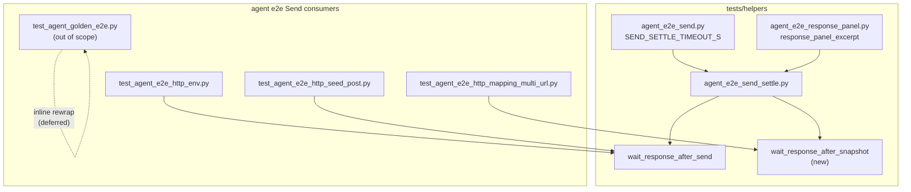

# PYPOST-956: Shared Send settle + timeout rewrap helper

## Research

### Parent debt and duplication map

- Source: [PYPOST-901](https://pypost.atlassian.net/browse/PYPOST-901) TD-2 in
  `ai-tasks/PYPOST-901/60-tech-debt.md`.
- PYPOST-955 noted duplicated rewrap between local `_wait_response` and the GET
  forced-timeout companion inline block (`ai-tasks/PYPOST-955/60-tech-debt.md`).

| Consumer | Settle mechanism | Timeout rewrap location | Shared today? |
| --- | --- | --- | --- |
| Golden Send | `wait_for_text` on tab | Inline in `_golden_fill_send_and_settle` | No (deferred 948) |
| Env GET / seed POST / siblings | `wait_for_text` on catalog ids | `wait_response_after_send` | Yes (`agent_e2e_send_settle.py`) |
| Mapping multi-URL (901) | `wait_for_snapshot(ready)` | Local `_wait_response` | **No** |
| Mapping GET companion (955) | `wait_for_snapshot(lambda _: False)` | Inline duplicate rewrap | **No** |

Local `_wait_response` today (`tests/test_agent_e2e_http_mapping_multi_url.py`):

```python
def _wait_response(session, ready, step):
    try:
        return session.wait_for_snapshot(ready, timeout=SEND_SETTLE_TIMEOUT_S)
    except UiWaitTimeoutError as exc:
        last = session.ui_snapshot()
        excerpt = response_panel_excerpt(last)
        raise UiWaitTimeoutError(
            f"mapping multi-URL Send settle failed ({step}): {exc}; "
            f"response_excerpt={excerpt!r}",
            ...
        ) from exc
```

`wait_response_after_send` (`tests/helpers/agent_e2e_send_settle.py`) already
implements the same diagnostic keys for the text-wait path. Mapping needs the
**snapshot** variant with the same diagnostic keys but a **different timeout
message shape** — step is embedded in the raised message string, not only in
`exc.diagnostics`.

| Helper | Timeout message shape | `step` in message? | `step` in diagnostics? |
| --- | --- | --- | --- |
| `wait_response_after_send` (text-wait) | `{message_prefix}: {exc}; response_excerpt={excerpt!r}` | No | Yes |
| `wait_response_after_snapshot` (mapping) | `{message_prefix} ({step}): {exc}; response_excerpt={excerpt!r}` | **Yes** | Yes |

Mapping today (and PYPOST-955 companion) use prefix
`mapping multi-URL Send settle failed` with step names such as
`wait_response_after_mapping_get_send`. Step 4 must **not** reuse the
text-wait `{message_prefix}: {exc}` template — that would drop `(step)` from CI
failure output and break FR2 / FR6.

### Precedent: dialog settle helper

`tests/helpers/agent_e2e_dialog_settle.py` exposes `run_product_dialog_settle`
with internal `_rewrap_dialog_settle_timeout` — pattern: shared runner + private
rewrap primitive. Send settle can mirror: public wait helper + optional rewrap
function for companions.

### Convention-test home

`tests/test_agent_e2e_response_panel.py` (PYPOST-869 / 948) already AST-scans
Send modules for local walk helpers and text-wait settle convention. Natural
home for a new lock: mapping module must not define `_wait_response` and must
import from `tests.helpers.agent_e2e_send_settle` (or sibling helper module).

### External guidance

No new libraries. Reuse `SEND_SETTLE_TIMEOUT_S`, `response_panel_excerpt`,
existing `@pytest.mark.agent_e2e` markers. Per `.cursor/lsr/do-testing.md`,
per-test or module timeout markers remain mandatory.

## Implementation Plan

1. **Step 3 — failing repro (convention lock)** — extend
   `tests/test_agent_e2e_response_panel.py`:

   - Add `test_agent_e2e_http_mapping_multi_url.py` to a new parametrize list
     (e.g. `_SNAPSHOT_SEND_SETTLE_MODULES`).
   - Assert module source does **not** define top-level `_wait_response`.
   - Assert module imports snapshot settle helper from shared path (e.g.
     `wait_response_after_snapshot` from `tests.helpers.agent_e2e_send_settle`).
   - Optionally assert shared helper module exports the new callable (import
     gate).

   Run:

   ```bash
   make test PYTEST_ARGS='tests/test_agent_e2e_response_panel.py -k mapping -q'
   ```

   Expected: **red** until Step 4 removes local `_wait_response` and adds
   shared helper import.

2. **Step 4 — shared helper** — extend `tests/helpers/agent_e2e_send_settle.py`
   (preferred single home for Send settle helpers):

   - Add `wait_response_after_snapshot(session, ready, *, step, message_prefix,
     timeout=SEND_SETTLE_TIMEOUT_S, diagnostics_extra=None) -> dict[str, Any]`.
   - Rewrap contract: `response_panel_excerpt`, preserve `exc.timeout_s`,
     `exc.condition`, merge `exc.diagnostics`, set `step` and
     `response_excerpt`.
   - **Message lock (snapshot path):**

     ```python
     f"{message_prefix} ({step}): {exc}; response_excerpt={excerpt!r}"
     ```

     Do **not** use the text-wait template `{message_prefix}: {exc}; …` — step
     must appear in parentheses in the raised message (mapping / PYPOST-955
     contract).
   - Export via `__all__`.

   Optional (companion DRY only): extract private
   `_rewrap_send_settle_timeout(exc, *, last_snap, step, message_prefix,
   include_step_in_message, …)` used by both helpers — **only if** text-wait
   callers keep `{message_prefix}: {exc}; …` and snapshot callers keep
   `{message_prefix} ({step}): {exc}; …` byte-identically.

3. **Step 4 — migrate mapping module**:

   - Remove local `_wait_response`.
   - Happy path: call `wait_response_after_snapshot` with existing step names
     and `message_prefix="mapping multi-URL Send settle failed"`.
   - Companion: replace inline rewrap with
     `wait_response_after_snapshot(session, lambda _: False, step=..., timeout=FORCED_SETTLE_TIMEOUT_S, ...)` inside `pytest.raises(UiWaitTimeoutError)`.

4. **Step 4 — verify**:

   ```bash
   make test-agent-e2e PYTEST_ARGS='tests/test_agent_e2e_http_mapping_multi_url.py -q'
   make test-agent-e2e
   make test PYTEST_ARGS='tests/test_agent_e2e_response_panel.py -q'
   ```

5. **Steps 5–8** — flake8 on touched modules; observability note (diagnostics
   unchanged); dev-doc touch in `doc/dev/agent_e2e_http.md` to reference shared
   helper name instead of `_wait_response`.

**Mandatory — Failing Repro (next Step 3):**

- **What it asserts (desired behavior):** Mapping Send consumer uses shared
  snapshot settle helper; no module-local `_wait_response`; shared helper is
  importable from `tests/helpers/`.
- **Where:** `tests/test_agent_e2e_response_panel.py` (extend existing
  convention module — same home as PYPOST-869 / 948 locks).
- **How to force failure without live deps:** AST / import structural test only
  (no Qt window). Fails today because `_wait_response` is still defined locally
  and `wait_response_after_snapshot` does not exist yet.
- **Sequencing:** research (this doc) → red convention test → add shared helper
  + migrate mapping → green convention + agent e2e suite.
- **Behavioral change:** N/A — refactor preserves diagnostics **and** timeout
  message shape (`(step)` in snapshot path message); red test proves structural
  migration, not new runtime behavior.

## Architecture

### Module diagram



### Module responsibilities

| Module | Responsibility |
| --- | --- |
| `tests/helpers/agent_e2e_send_settle.py` | Shared Send settle waits + timeout rewrap for text-wait and snapshot paths |
| `tests/helpers/agent_e2e_send.py` | Canonical `SEND_SETTLE_TIMEOUT_S` constant (PYPOST-895) |
| `tests/helpers/agent_e2e_response_panel.py` | Panel excerpt for timeout diagnostics |
| `tests/test_agent_e2e_http_mapping_multi_url.py` | Mapping happy-path + companion; **consumer** of snapshot helper |
| `tests/test_agent_e2e_response_panel.py` | Convention locks including new mapping snapshot helper gate |

### Selected patterns

| Pattern | Choice | Justification |
| --- | --- | --- |
| Helper location | Extend `agent_e2e_send_settle.py` | Already owns `wait_response_after_send`; keeps Send settle DRY in one package |
| Snapshot API | `wait_response_after_snapshot(ready, *, step, timeout, message_prefix)` | Same params as text-wait; **different** timeout message template (step in message) |
| Timeout message | Snapshot: `{prefix} ({step}): {exc}; …`; text-wait: `{prefix}: {exc}; …` | Mapping / PYPOST-955 lock `(step)` in message; env/seed lock text-wait shape |
| Rewrap primitive | Private `_rewrap_send_settle_timeout` (optional) | Dialog-settle precedent; shared only if both message templates stay byte-identical per path |
| Golden migration | Out of scope | Explicit PYPOST-948 deferral; avoid scope creep |
| Step 3 signal | AST convention test | No Qt; fails before helper exists (948 / 955 inventory precedent) |

### Interfaces

**New public helper (snapshot path):**

```python
def wait_response_after_snapshot(
    session: AgentAppSession,
    ready: Callable[[dict[str, Any]], bool],
    *,
    step: str,
    message_prefix: str = "Send settle failed",
    timeout: float = SEND_SETTLE_TIMEOUT_S,
    diagnostics_extra: dict[str, Any] | None = None,
) -> dict[str, Any]:
    """Wait for snapshot readiness after Send; rewrap timeout with step + excerpt."""
```

On `UiWaitTimeoutError`, raised **message** must use the mapping shape (step in
message):

```python
f"{message_prefix} ({step}): {exc}; response_excerpt={excerpt!r}"
```

Diagnostics match text-wait: merge `exc.diagnostics`, set `"step"` and
`"response_excerpt"`, preserve `timeout_s` and `condition`.

**Existing helper (unchanged contract for text-wait consumers):**

```python
def wait_response_after_send(
    session: AgentAppSession,
    *,
    status_label: str,
    body_text: str,
    step: str,
    timeout: float = SEND_SETTLE_TIMEOUT_S,
    message_prefix: str = "Send settle failed",
    ...
) -> None:
```

On timeout, raised **message** stays text-wait shape (**no** step in message
string — step only in diagnostics):

```python
f"{message_prefix}: {exc}; response_excerpt={excerpt!r}"
```

**Mapping happy-path call site (after migration):**

```python
get_snap = wait_response_after_snapshot(
    session,
    _get_response_ready,
    step="wait_response_after_mapping_get_send",
    message_prefix="mapping multi-URL Send settle failed",
)
```

**Mapping companion call site (after migration):**

```python
with pytest.raises(UiWaitTimeoutError) as exc_info:
    wait_response_after_snapshot(
        session,
        lambda _: False,
        step="wait_response_after_mapping_get_send",
        message_prefix="mapping multi-URL Send settle failed",
        timeout=FORCED_SETTLE_TIMEOUT_S,
    )
```

### Files touched (Step 4 preview)

| File | Change |
| --- | --- |
| `tests/helpers/agent_e2e_send_settle.py` | Add `wait_response_after_snapshot` (+ optional shared rewrap) |
| `tests/test_agent_e2e_http_mapping_multi_url.py` | Remove `_wait_response`; import shared helper |
| `tests/test_agent_e2e_response_panel.py` | Add convention lock (Step 3 red) |
| `doc/dev/agent_e2e_http.md` | Step 8: replace `_wait_response` references with shared helper name |

No production (`pypost/`) changes.

## Q&A

- Q: New file vs extend `agent_e2e_send_settle.py`?
  A: Extend existing module — both helpers are Send settle variants; avoids
  proliferating tiny helper files.

- Q: Why not migrate golden in this task?
  A: Golden uses tab-scoped `wait_for_text`, not session snapshot waits; PYPOST-948
  explicitly deferred golden adoption. Acceptance is mapping + shared helper.

- Q: Will the companion still avoid the 15 s budget?
  A: Yes — `timeout` parameter defaults to `SEND_SETTLE_TIMEOUT_S` but companion
  passes `FORCED_SETTLE_TIMEOUT_S` (0.05 s).

- Q: Step 3 red if helper already partially exists?
  A: Convention test checks both helper export and absence of local
  `_wait_response` — partial work stays red until migration completes.

- Q: Risk of changing text-wait diagnostics when deduplicating rewrap?
  A: If extracting `_rewrap_send_settle_timeout`, run existing env/seed/golden
  companion tests; any drift fails FR5/FR6. Safer default: add snapshot helper
  first with copied rewrap body; dedupe rewrap only if tests prove identity.

- Q: Why not one shared `{message_prefix}: {exc}` message for both helpers?
  A: Mapping and PYPOST-955 assert the `(step)`-in-message form for snapshot
  settle failures. Text-wait env/seed flows intentionally omit step from the
  message (step remains in `exc.diagnostics`). Merging templates would regress
  mapping CI output or text-wait callers.

## Worklog

role: fix, step: 2, step_name: Architecture, tokens_used: 8500
