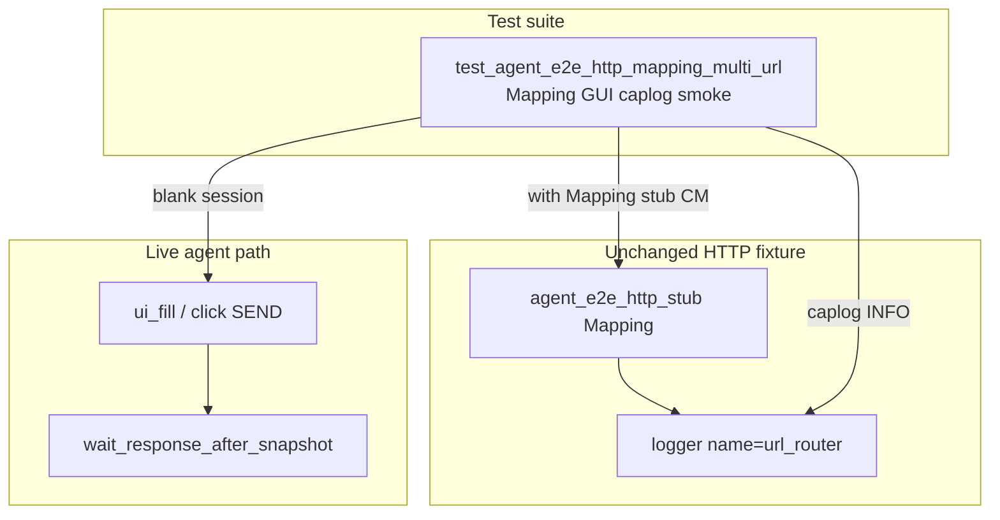

# PYPOST-957: Caplog proof for name=url_router in mapping GUI module

## Research

### Origin

- Jira: [PYPOST-957](https://pypost.atlassian.net/browse/PYPOST-957) — optional
  sibling to PYPOST-870 golden caplog.
- Parent: [PYPOST-901](https://pypost.atlassian.net/browse/PYPOST-901)
  `60-tech-debt.md` TD-3.
- Unit matrix: `tests/test_agent_e2e_http_stub_logs.py` — `url_router` row
  (PYPOST-870 / 903).
- GUI sibling: `tests/test_agent_e2e_http_env.py` —
  `test_seeded_env_send_logs_http_stub_installed` (PYPOST-904).

### Target module

`tests/test_agent_e2e_http_mapping_multi_url.py` — already marked `agent_e2e`,
blank session, Mapping stub, shared settle helpers (901 / 955 / 956).

**Missing:** caplog assert on `name=url_router` during live GUI Send.

### Caplog pattern

```text
caplog.at_level(INFO, logger="pypost.fixtures.agent_e2e_http")
with agent_e2e_http_stub(responses_map):
    session.ui_fill / ui_select / ui_click
    wait_response_after_snapshot(...)
assert "agent_e2e_http_stub_installed name=url_router" in caplog.text
```

Install log fires on stub CM enter. Mapping dict triggers auto-name
`url_router` in `stub_agent_e2e_http`.

### Decision

**Test-only change.** Add sibling smoke
`test_mapping_send_logs_http_stub_installed_url_router` in the existing mapping
module. No production change expected.

## Implementation Plan

1. Keep `pypost/fixtures/agent_e2e_http.py` unchanged unless tests expose a gap.
2. Extend `tests/test_agent_e2e_http_mapping_multi_url.py`:
   - Add `_HTTP_LOGGER`, `_STUB_INSTALLED_URL_ROUTER` constants.
   - Add thin GET Send smoke with caplog around Mapping stub + click + settle.
3. Run focused:
   `make test-agent-e2e PYTEST_ARGS="tests/test_agent_e2e_http_mapping_multi_url.py -v"`.
4. Step 8: note Mapping GUI caplog smoke in `doc/dev/agent_e2e_http.md`.

**Mandatory — Failing Repro (Step 3):**

- **What:** Red placeholder
  `pytest.fail("PYPOST-957: Mapping GUI url_router caplog not implemented")`.
- **Where:** new test in `tests/test_agent_e2e_http_mapping_multi_url.py`.
- **Sequencing:** Step 3 red → Step 4 real caplog assert until green. No product
  edit unless green tests expose a logging bug.

## Architecture



### Modules

| Module | Change | Responsibility |
| --- | --- | --- |
| `tests/test_agent_e2e_http_mapping_multi_url.py` | **Add** caplog smoke | GUI Mapping install log proof |
| `pypost/fixtures/agent_e2e_http.py` | None | Mapping router + install log (868) |
| `doc/dev/agent_e2e_http.md` | Step 8 touch | Document Mapping GUI caplog smoke |

## Q&A

| Q | A |
| --- | --- |
| New module vs extend mapping multi-URL? | Extend existing module — already marked and documented (901). |
| Which `name=` token? | `url_router` — default for Mapping installs. |
| One Send or two? | One GET Send — install log on CM enter; mirrors 904 thin smoke. |
