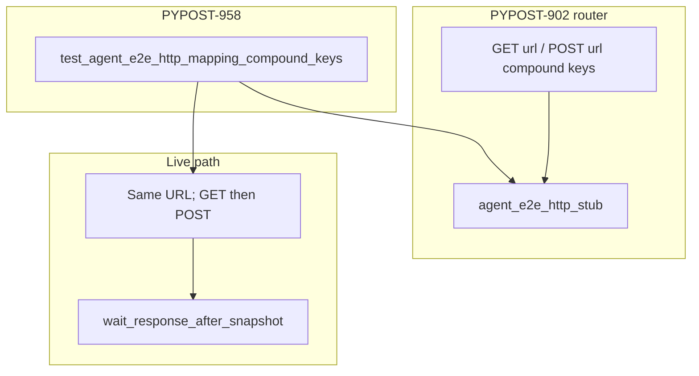

# PYPOST-958: GUI scenario same-URL GET+POST compound-key map

## Research

### Origin

- Jira: [PYPOST-958](https://pypost.atlassian.net/browse/PYPOST-958) — optional
  GUI smoke for compound-key same-URL multi-method Send.
- Parent: [PYPOST-902](https://pypost.atlassian.net/browse/PYPOST-902)
  `60-tech-debt.md` follow-up row.
- Unit proofs: `tests/test_agent_e2e_http.py` —
  `test_stub_agent_e2e_http_url_router_method_url_compound_keys` (green).
- GUI sibling (distinct URLs): `tests/test_agent_e2e_http_mapping_multi_url.py`
  (901).

### Existing infrastructure

| Layer | Location | Status |
| --- | --- | --- |
| Compound router | `pypost/fixtures/agent_e2e_http.py` | Shipped (902) |
| Unit same-URL proof | `tests/test_agent_e2e_http.py` | Green |
| GUI distinct-URL proof | `tests/test_agent_e2e_http_mapping_multi_url.py` | Green (901) |
| Panel / settle helpers | `tests/helpers/agent_e2e_*` | Shared |

**Missing:** GUI Send path with compound keys on one resolved URL.

### Session and map strategy

**Decision: blank session + explicit fill** (same as 901 / seed POST).

Shared URL: `SEED_GET_RESOLVED_URL`. Map:

```python
responses = {
    f"GET {shared}": CANNED_SEED_GET_OK,
    f"POST {shared}": make_canned_http_result(
        url=shared,
        body=SEED_POST_OK_BODY,
        resolved_body=SEED_POST_BODY,
    ),
}
```

Both Sends inside one stub scope. POST fill includes `SEED_POST_BODY`.

## Implementation Plan

1. **Failing repro (Step 3)** — inventory gate
   `test_mapping_compound_keys_gui_send_scenario_module_exists` in
   `tests/test_agent_e2e_http.py`. Red until Step 4 module exists.
2. **Scenario module (Step 4)** —
   `tests/test_agent_e2e_http_mapping_compound_keys.py`:
   - marks: `pytestmark = [timeout(60), agent_e2e]`
   - `test_mapping_compound_keys_same_url_get_post_panel_outcomes`
   - GET Send → settle → POST Send (same URL) → settle → panel asserts
3. **Docs (Step 8)** — `doc/dev/agent_e2e_http.md` compound GUI section;
   `doc/dev/agent_e2e.md` harness table row.
4. Run:
   `make test-agent-e2e PYTEST_ARGS="tests/test_agent_e2e_http_mapping_compound_keys.py -q"`.

**Mandatory — Failing Repro (Step 3):**

```python
def test_mapping_compound_keys_gui_send_scenario_module_exists() -> None:
    mod = importlib.import_module(
        "tests.test_agent_e2e_http_mapping_compound_keys"
    )
    assert callable(getattr(
        mod,
        "test_mapping_compound_keys_same_url_get_post_panel_outcomes",
        None,
    ))
```

Expected red: `ModuleNotFoundError` until Step 4.

## Architecture



### Modules

| Module | Change | Responsibility |
| --- | --- | --- |
| `tests/test_agent_e2e_http_mapping_compound_keys.py` | **Add** | GUI compound-key same-URL scenario |
| `tests/test_agent_e2e_http.py` | **Add** inventory gate | Step 3 red / green lock |
| `pypost/fixtures/agent_e2e_http.py` | None | Compound router (902) |
| `doc/dev/agent_e2e_http.md` | Step 8 | GUI proof + run command |
| `doc/dev/agent_e2e.md` | Step 8 | Harness table row |

## Q&A

| Q | A |
| --- | --- |
| Why inventory gate? | PYPOST-901 precedent — honest missing-scenario lock in unit module. |
| Timeout companion? | Out of scope — 955 covers mapping multi-URL family; optional follow-up only if needed. |
