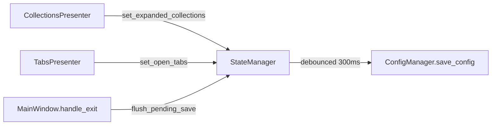

# PYPOST-96: Architecture — verify debounced settings saving

## Research

Prior work already addressed the I/O concern this debt item raised:

| Ticket | Role |
| --- | --- |
| [PYPOST-386](https://pypost.atlassian.net/browse/PYPOST-386) | Implemented 300 ms debounced saves in `StateManager` |
| [PYPOST-90](https://pypost.atlassian.net/browse/PYPOST-90) | Closed synchronous tree-state save debt from PYPOST-10 |
| [PYPOST-252](https://pypost.atlassian.net/browse/PYPOST-252) | Added persistence/debounce unit tests |

## Implementation Plan

Verification-only closure — no new modules:

1. Confirm `CollectionsPresenter` routes expand/collapse through `StateManager.set_expanded_collections`.
2. Confirm `StateManager._schedule_save()` uses single-shot `QTimer` at 300 ms.
3. Confirm `MainWindow.handle_exit()` calls `flush_pending_save()`.
4. Run `tests/test_settings_persistence.py` debounce and coalescing tests.
5. Update PYPOST-10 tech-debt and `doc/dev/state_manager.md` cross-references.

## Architecture

| Component | Responsibility |
| --- | --- |
| `StateManager` | Debounce timer, coalesce rapid `set_*` calls |
| `CollectionsPresenter` | Tree expand/collapse → `StateManager` |
| `ConfigManager` | Serialize full `AppSettings` to disk |
| `MainWindow` | Flush pending UI state on exit; Settings dialog immediate save |

## Q&A

- **Q:** Extend debounce to Settings dialog? **A:** No — explicit OK is a deliberate
  immediate save; out of scope.
- **Q:** When would extension be needed? **A:** Only if profiling shows settings save latency
  or file size warrants partial writes (see PYPOST-249 future work).
