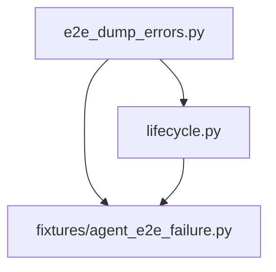

# PYPOST-960: Architecture

## Approach

Add `pypost/agent/e2e_dump_errors.py` — a leaf module with no imports from
lifecycle or fixtures — exporting `DUMP_BEST_EFFORT_ERRORS`.

Both consumers import from this module:

| Module | Before | After |
| --- | --- | --- |
| `pypost/agent/lifecycle.py` | `_DUMP_HOOK_BEST_EFFORT_ERRORS` local tuple | `from pypost.agent.e2e_dump_errors import DUMP_BEST_EFFORT_ERRORS` |
| `pypost/fixtures/agent_e2e_failure.py` | `_DUMP_BEST_EFFORT_ERRORS` local tuple | same import |

Use `DUMP_BEST_EFFORT_ERRORS` in all `except` clauses (public name; module is
internal to agent e2e dump paths).

## Import graph (after)

No cycle: `e2e_dump_errors` has no upstream agent imports.

## Failing repro plan (Step 3)

**N/A — no behavioral change.** Refactor only; existing hook and dump-helper
tests remain the behavioral contract.

Optional Step 4 guard: `test_dump_best_effort_errors_shared_module` asserts
lifecycle and fixtures `except` clauses reference the same tuple object via
import re-export check (module attribute identity).

## Files touched

- **New:** `pypost/agent/e2e_dump_errors.py`
- **Edit:** `pypost/agent/lifecycle.py`, `pypost/fixtures/agent_e2e_failure.py`
- **Test:** `tests/test_agent_e2e_failure_artifacts.py` (identity test)
- **Docs:** `doc/dev/agent_e2e_failure_artifacts.md`, `doc/dev/logging.md`

## Out of scope

- Changing tuple members (PYPOST-876 / PYPOST-915).
- Parametrized per-type hook tests (PYPOST-961).
