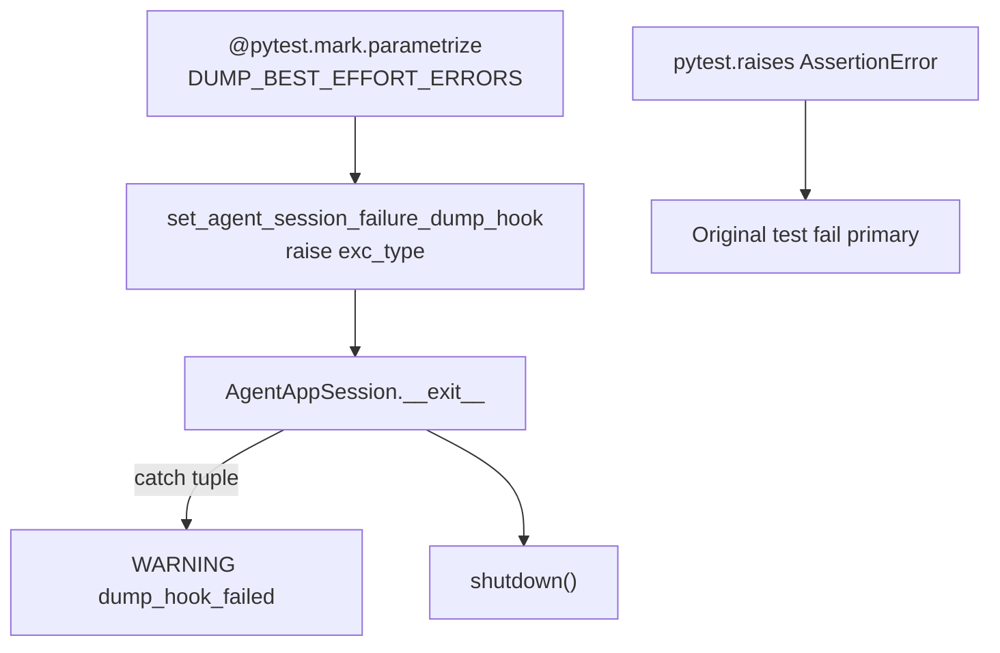

# PYPOST-961: Dedicated hook best-effort units per exception type

## Research

### Current coverage

| Hook scenario | Test | Status |
| --- | --- | --- |
| RuntimeError → WARNING | `test_dump_hook_failure_logs_warning` (PYPOST-912) | Covered |
| LookupError propagates | `test_dump_hook_propagates_unexpected_exception` (PYPOST-914) | Covered |
| OSError / TypeError / ValueError / AttributeError hook | — | Missing |

Lifecycle `__exit__` already catches `DUMP_BEST_EFFORT_ERRORS` from
`pypost/agent/e2e_dump_errors.py` (PYPOST-960). This task is test-only.

### Pattern

Mirror `test_dump_hook_failure_logs_warning`:

1. Install hook via `set_agent_session_failure_dump_hook`.
2. Enter `AgentAppSession`, assert fail inside body.
3. Caplog at WARNING on `pypost.agent.lifecycle`.
4. Assert original `AssertionError` propagates (not hook exception).
5. Assert `agent_session_failure_dump_hook_failed error=<ExcType>`.
6. Restore hook in `finally`.

## Implementation Plan

**Step 3 (Failing Repro):** Red gap = missing tests; production already
correct. No product edit in Step 3.

**Step 4:**

1. Add `test_dump_hook_best_effort_per_type` parametrized over
   `DUMP_BEST_EFFORT_ERRORS` with `ids=exc.__name__`.
2. Update `doc/dev/agent_e2e_failure_artifacts.md` Tests section.

## Architecture

### Modules

| Module | Change |
| --- | --- |
| `tests/test_agent_e2e_failure_artifacts.py` | Parametrized hook best-effort test |
| `doc/dev/agent_e2e_failure_artifacts.md` | Tests section |

### Patterns

- Reuse existing hook save/restore and caplog contract from PYPOST-912.
- Parametrize over shared tuple so new members auto-gain coverage.
