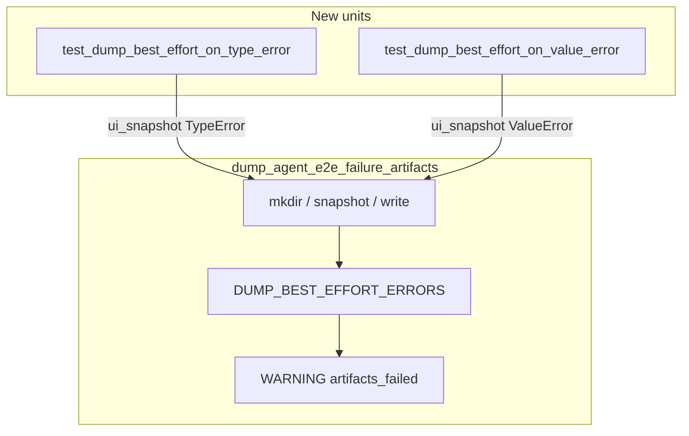

# PYPOST-962: Dedicated TypeError / ValueError dump best-effort units

## Research

### Origin

- Jira: [PYPOST-962](https://pypost.atlassian.net/browse/PYPOST-962), Lowest Debt,
  follow-up from [PYPOST-915](https://pypost.atlassian.net/browse/PYPOST-915).
- Requirements: `ai-tasks/PYPOST-962/10-requirements.md`.

### Current production contract (already landed — PYPOST-876 / PYPOST-960)

`pypost/agent/e2e_dump_errors.py`:

```python
DUMP_BEST_EFFORT_ERRORS = (
    OSError,
    RuntimeError,
    TypeError,
    ValueError,
    AttributeError,
)
```

`dump_agent_e2e_failure_artifacts` catches that tuple, logs WARNING
`agent_e2e_failure_artifacts_failed nodeid=… error=<ExcType>`, returns
`None`.

**Missing:** dedicated units for `TypeError` and `ValueError` (OSError /
AttributeError covered by PYPOST-915; RuntimeError has existing smoke).

### Existing test patterns

| Test | Proves |
| --- | --- |
| `test_dump_best_effort_on_capture_error` | RuntimeError → WARNING + None |
| `test_dump_best_effort_on_oserror` | OSError write path (PYPOST-915) |
| `test_dump_best_effort_on_attribute_error` | AttributeError capture (PYPOST-915) |
| `test_dump_propagates_unexpected_exception` | LookupError propagates |

Caplog pattern: `caplog.at_level(logging.WARNING,
logger="pypost.fixtures.agent_e2e_failure")`.

Mock pattern: `MagicMock(spec=AgentAppSession)` + `ui_snapshot.side_effect`.

### Decision

**Test-only change.** Extend `tests/test_agent_e2e_failure_artifacts.py`.
No production edit expected unless tests reveal a contract gap.

## Implementation Plan

1. Keep `pypost/fixtures/agent_e2e_failure.py` unchanged.
2. **Step 3:** Document red gap (missing TypeError / ValueError units).
3. **Step 4:** Add:
   - `test_dump_best_effort_on_type_error` — `ui_snapshot` → `TypeError`
   - `test_dump_best_effort_on_value_error` — `ui_snapshot` → `ValueError`
4. Caplog assert event + `error=TypeError` / `error=ValueError`.
5. Update `doc/dev/agent_e2e_failure_artifacts.md` Tests section (Step 8).

**Mandatory — Failing Repro (Step 3):**

- **What:** Red gap — no dedicated units for TypeError / ValueError on dump
  helper (tuple membership implicit only).
- **Where:** `tests/test_agent_e2e_failure_artifacts.py`.
- **Force without live deps:** `MagicMock` + `ui_snapshot.side_effect`.
- **Sequencing:** No product edit; tests green on first run once asserts
  land (prod already correct). Step 3 documents gap; Step 4 adds tests.

## Architecture



### Modules

| Module | Change |
| --- | --- |
| `pypost/fixtures/agent_e2e_failure.py` | None |
| `tests/test_agent_e2e_failure_artifacts.py` | Two new caplog units |
| `doc/dev/agent_e2e_failure_artifacts.md` | Tests section (Step 8) |

### Patterns

- Mirror PYPOST-915 AttributeError unit structure.
- Pure unit (mocked); module `pytestmark` timeout(60) retained.
- No subprocess / Qt for these two tests.

## Q&A

- Q: ValueError on write path instead?
  A: Capture path matches AttributeError / RuntimeError locks; sufficient for
  per-type tuple regression.
- Q: Step 3 N/A?
  A: No — coverage gap is the repro target; tests added Step 4.
- Q: Hook units?
  A: PYPOST-961 — out of scope.
