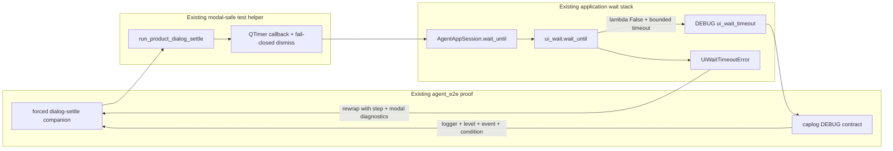

# PYPOST-968: Direct DEBUG coverage for forced dialog-settle timeout

## Research

### Decision

Adopt the direct `caplog` assertion in the existing forced dialog-settle
companion.

The check adds a distinct regression signal: the existing exception assertions
prove that timeout handling and diagnostic rewrapping work, but they can stay
green if the independent DEBUG call is removed, renamed, moved to the wrong
logger, or emitted at the wrong level. One narrowly scoped assertion therefore
closes the stated CI blind spot without changing application behavior or adding
a second live GUI scenario.

Deferral was considered because the golden Send companion still omits an
equivalent assertion and no recurring CI regression is recorded. The cost is
now proportionate, however: the forced dialog-settle companion already drives
the exact path deterministically, `caplog` can surround that existing helper
call, and only logger/event/condition identity needs to be locked. This is not a
request to retrofit other timeout companions.

### Repository evidence

- `pypost/agent/ui_wait.py::wait_until` emits DEBUG `ui_wait_timeout` through
  `logging.getLogger(__name__)` before raising `UiWaitTimeoutError`. The expected
  logger is exactly `pypost.agent.ui_wait`; no production event is missing.
- `pypost/agent/lifecycle.py::AgentAppSession.wait_until` delegates to the
  shared function and preserves `condition_name`. The live test therefore
  exercises the production logger without a test double.
- `tests/helpers/agent_e2e_dialog_settle.py::run_product_dialog_settle` calls
  the session wait inside a modal-safe `QTimer` callback, rewraps the timeout,
  records it, and dismisses the modal in `finally`. Capture must surround the
  helper call, including the nested Qt event loop.
- The forced companion in `tests/test_agent_dialog_settle_e2e.py` uses
  `lambda: False`, `timeout=0.05`, and stable condition
  `forced_dialog_settle_timeout`. It already asserts the primary step and modal
  diagnostics. Extend it instead of creating a duplicate live session.
- The golden companion in `tests/test_agent_golden_e2e.py` asserts exception
  diagnostics only. Its parity explains the original deferral but does not
  prevent this deliberately scoped proof.
- Existing DEBUG contracts in `tests/test_ui_actions.py` and
  `tests/test_ui_snapshot.py` filter `caplog.records` by exact logger/event and
  inspect `LogRecord.getMessage()`. Reuse that local pattern.
- `ai-tasks/PYPOST-934/60-tech-debt.md` records this exact omission as TD-3 and
  points to PYPOST-968. No new debt scope or log event is required.
- `.cursor/lsr/do-testing.md` requires explicit test timeouts and one caplog
  block per logger. Keep module `timeout(60)` and use one DEBUG block for
  `pypost.agent.ui_wait`.

Baseline runtime validation on 2026-08-02 ran the existing forced companion
unchanged with `--log-cli-level=DEBUG`: it passed in 0.49 seconds and displayed
logger `pypost.agent.ui_wait`, event `ui_wait_timeout`, condition
`forced_dialog_settle_timeout`, and `timeout_s=0.05`. This confirms the current
gap is direct automated verification, not missing production emission.

### External references

- The official [pytest logging guide](https://docs.pytest.org/en/stable/how-to/logging.html)
  documents `caplog.at_level(level, logger=...)`, automatic level restoration,
  and access to captured `LogRecord` objects. This supports limiting DEBUG
  enablement to the production wait logger and to the forced helper call.
- The official [Python logging reference](https://docs.python.org/3/library/logging.html)
  defines `LogRecord.name`, `levelno`, and `getMessage()`. Those are the stable
  interfaces used to verify logger identity, DEBUG severity, and the formatted
  event/condition while ignoring nondeterministic timing values.

No third-party package, network service, or new interface is needed.

## Implementation Plan

1. **Step 3 — land an honest red coverage-gap marker.** In the existing
   `test_agent_dialog_settle_timeout_includes_step_and_modal_diag`, after all
   current exception and modal-diagnostic assertions, add:

   ```python
   pytest.fail(
       "PYPOST-968: forced dialog-settle ui_wait_timeout DEBUG caplog "
       "assertion not implemented"
   )
   ```

   This placement first proves that the deterministic forced timeout and its
   primary diagnostics still work, then fails solely because direct DEBUG-event
   verification is absent. Do not add `caplog`, logging imports, logger
   constants, record filters, or the final event assertion in Step 3.
2. Capture the Step 3 red result with the focused command:

   ```text
   make test-agent-e2e \
     PYTEST_ARGS="tests/test_agent_dialog_settle_e2e.py -k timeout_includes -v"
   ```

   Expected result: one failure containing the explicit PYPOST-968 message;
   no hang and no earlier exception-diagnostic failure.
3. **Step 4 — replace the red marker with the real contract.** In the same
   test module:
   - import `logging` and define a private logger-name constant for
     `pypost.agent.ui_wait`;
   - inject typed `caplog: pytest.LogCaptureFixture` into the existing forced
     companion;
   - surround only `run_product_dialog_settle(...)` with one
     `caplog.at_level(logging.DEBUG, logger=...)` block;
   - keep every existing exception assertion unchanged;
   - filter `caplog.records` for the exact logger, `logging.DEBUG`, the
     `ui_wait_timeout` event prefix, and
     `condition=forced_dialog_settle_timeout`, then assert a matching record
     exists.
4. Do not assert an exact `waited_ms`, record timestamp, modal value, or global
   log ordering. The near-zero timeout forces the branch; stable event and
   condition identities prove the observability contract without timing
   sensitivity.
5. Keep `pypost/agent/ui_wait.py`, `pypost/agent/lifecycle.py`, the shared
   dialog helper, the golden Send companion, and user-visible behavior
   unchanged. A production edit is justified only if Step 4 unexpectedly
   reveals that the documented event is not emitted.
6. Validate the green implementation with the focused forced test, the full
   dialog-settle module, and the project test target:

   ```text
   make test-agent-e2e \
     PYTEST_ARGS="tests/test_agent_dialog_settle_e2e.py -k timeout_includes -v"
   make test-agent-e2e PYTEST_ARGS="tests/test_agent_dialog_settle_e2e.py -v"
   make test
   ```

7. In later workflow steps, update the dialog-settle/logging developer note
   only if documentation needs to point at the newly enforced contract; do not
   broaden the logging catalog or add a golden Send retrofit under this task.

### Mandatory — Failing Repro (next Step 3)

- **Desired behavior:** The forced dialog-settle timeout has a direct automated
  assertion that DEBUG `ui_wait_timeout` is emitted by `pypost.agent.ui_wait`
  and names `forced_dialog_settle_timeout`.
- **Red test location:** Append the explicit `pytest.fail` marker to
  `test_agent_dialog_settle_timeout_includes_step_and_modal_diag`, after its
  current exception assertions.
- **Why it is red:** Production already emits the event, so a runtime caplog
  assertion would be green immediately. The literal red marker accurately
  represents the missing test contract and follows repository precedent for
  coverage-only log stories (PYPOST-899, PYPOST-904, and PYPOST-957).
- **Isolation:** Reuse the impossible predicate and 0.05-second bounded wait;
  no live HTTP or external service. The existing offscreen session and
  fail-closed modal dismissal remain the only GUI boundary.
- **Step 3 boundary:** Do not implement the `caplog` fixture, capture block,
  record filter, or success assertion yet. Do not edit production code.
- **Sequence:** Research and architecture → red marker and focused failing run
  → independent Step 3 review → Step 4 real caplog proof → focused, module, and
  full validation.

## Architecture

### System/module diagram



### Components and responsibilities

- `tests/test_agent_dialog_settle_e2e.py`: Step 3 red marker and Step 4 caplog
  extension. Owns the forced scenario, primary exception assertions, and
  supplemental DEBUG-event assertion.
- `tests/helpers/agent_e2e_dialog_settle.py`: no change. Preserves modal
  orchestration, timeout rewrap, and fail-closed dismissal.
- `pypost/agent/lifecycle.py`: no change. Preserves the session facade and
  delegates `condition_name`.
- `pypost/agent/ui_wait.py`: no expected change. Preserves the bounded wait,
  DEBUG event, and timeout exception.
- `tests/test_agent_golden_e2e.py`: no change. Remains a sibling precedent;
  parity retrofit is out of scope.
- `doc/dev/agent_dialog_settle.md` and `doc/dev/logging.md`: optional later
  documentation sync to point maintainers at the proof.

### Main interfaces

```text
run_product_dialog_settle(
    session,
    *,
    click_widget_id=SETTINGS_BUTTON,
    wait_condition=lambda: False,
    timeout=FORCED_SETTLE_TIMEOUT_S,
    message="forced dialog settle timeout",
    condition_name="forced_dialog_settle_timeout",
    step=SETTLE_STEP,
) -> tuple[bool, list[BaseException]]

caplog.at_level(
    logging.DEBUG,
    logger="pypost.agent.ui_wait",
) -> scoped capture context

matching LogRecord contract:
    record.name == "pypost.agent.ui_wait"
    record.levelno == logging.DEBUG
    record.getMessage().startswith("ui_wait_timeout ")
    "condition=forced_dialog_settle_timeout" in record.getMessage()
```

No public API or exception schema changes.

### Interaction sequence

1. The test enables DEBUG capture only for `pypost.agent.ui_wait`.
2. The shared helper schedules the settle callback before clicking Settings.
3. The modal opens; the nested Qt loop runs the callback.
4. The impossible predicate exhausts the fixed 0.05-second budget.
5. `ui_wait.wait_until` emits `ui_wait_timeout` with the forced condition and
   raises `UiWaitTimeoutError`.
6. The helper rewraps the exception with step/modal scalars and rejects the
   modal in `finally`, allowing `ui_click` to return.
7. The existing assertions prove the primary exception contract; the new
   caplog assertion independently proves DEBUG event identity.

### Selected patterns and justification

- **Extend-in-place companion:** avoids a second GUI session and proves both
  exception and log outputs from one forced action.
- **Scoped observer:** `caplog.at_level` observes the exact module logger only
  during the operation under test, minimizing noise and avoiding reliance on
  live `log_cli` output.
- **Stable-token matching:** logger, numeric level, event prefix, and condition
  are contractual; elapsed time is deliberately not contractual.
- **Red placeholder for coverage-only work:** the production event already
  exists, so Step 3 represents the missing assertion explicitly and Step 4
  replaces it with the real proof.
- **Fail-closed existing orchestration:** retain the shared modal helper and
  module timeout so assertion failures cannot strand the nested event loop.

### Requirement traceability

- **FR1 / FR5 — preserve exception diagnostics:** Existing assertions remain in
  the same test and execute before the supplemental log assertion.
- **FR2 — DEBUG event observable:** Match exact logger and `logging.DEBUG` from
  `caplog.records`.
- **FR3 — identify forced condition:** Match stable
  `condition=forced_dialog_settle_timeout` without timing inference.
- **Reliability / boundedness:** Retain the impossible predicate, 0.05-second
  internal budget, modal `finally` dismissal, and module `timeout(60)`.
- **Maintainability:** Add one capture block and stable-token filter to the
  existing proof; do not duplicate the scenario or retrofit siblings.
- **Compatibility / privacy:** No production behavior, payload logging,
  external service, or user-data change.

### Risks and mitigations

- **DEBUG is normally filtered:** Set DEBUG only on the exact logger within
  `caplog.at_level`; pytest restores it automatically.
- **Other DEBUG records create a false positive:** Filter exact logger,
  severity, event prefix, and forced condition.
- **Timing makes assertions flaky:** Assert no exact `waited_ms` or scheduling
  order; keep the deterministic false predicate.
- **Modal remains open on failure:** Reuse helper `finally` dismissal unchanged.
- **Scope expands to golden or other waits:** Leave those modules untouched;
  this decision applies only to the PYPOST-934 forced path.

## Q&A

- **Why adopt now despite the original deferral?** The assertion detects a
  logging-only regression that exception checks cannot, and the existing forced
  companion makes the incremental cost small and deterministic.
- **Why not add a new unit test for `wait_until`?** Acceptance targets the
  forced dialog-settle path and its stable condition. Extending that companion
  proves integration through the session/helper/modal stack without duplication.
- **Why not assert `caplog.text` only?** Record filtering proves logger and
  DEBUG level in addition to message content and follows project precedent.
- **Why not require exactly one record?** Presence of the identified event is
  the contract; exact count adds brittleness without diagnostic value.
- **Why is Step 3 a placeholder instead of the final assertion?** Production
  already emits the event, so the final runtime assertion is expected to pass.
  The red marker isolates the missing artifact—direct test coverage—while
  reserving the completed capture/assert implementation for Step 4.
- **Does this change the golden Send companion?** No. Golden parity was evidence
  for deferral, not an acceptance requirement for this scoped debt item.
