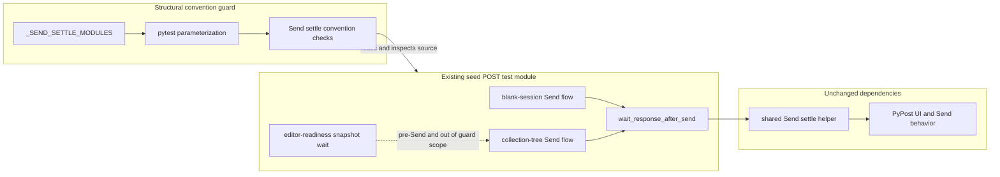

# PYPOST-969: Protect the seed POST Send settle convention

## Research

### Decision

Extend the existing Send settle convention inventory to cover the seed POST
module. No product, helper, or seed POST scenario change is expected.

The seed POST module already satisfies the convention in both of its Send
flows. The missing behavior is in the guard: its authoritative parameter
collection omits the seed POST module, so the structural checks never inspect
that source file. Adding the module to the existing collection gives it the
same checks as the three current peers and avoids a second guard implementation.

### Repository Evidence

- `tests/test_agent_e2e_response_panel.py` owns the convention guard.
  `_SEND_SETTLE_MODULES` is the authoritative collection passed to
  `test_send_modules_use_identity_scoped_text_wait_settle` through
  `pytest.mark.parametrize`.
- The current collection covers double-response-body, presentation-matrix, and
  HTTP environment scenarios, but not
  `test_agent_e2e_http_seed_post.py`.
- For every collected module, the guard checks that the module either calls the
  shared Send settle helper or performs both required text waits directly.
- For helper consumers, the guard also requires the established helper-module
  import. For every consumer, it rejects the legacy response-ready definition
  and snapshot-wait call.
- `tests/test_agent_e2e_http_seed_post.py` imports
  `wait_response_after_send` from the shared helper and calls it after Send in
  both the blank-session and collection-tree scenarios.
- The seed POST module keeps a snapshot wait only for editor readiness before
  Send. The guard's prohibited pattern is specifically the legacy
  response-ready Send settle, so adding the module does not incorrectly reject
  the valid editor-readiness wait.
- The convention module already has `pytest.mark.timeout(10)`, satisfying the
  mandatory per-test timeout rule. The seed POST module retains its existing
  `timeout(60)` and `agent_e2e` markers unchanged.
- PYPOST-948 recorded this exact omission as TD-3 and noted that seed POST was
  migrated but absent from `_SEND_SETTLE_MODULES`.

### External Reference

The official
[pytest parametrization guide](https://docs.pytest.org/en/stable/how-to/parametrize.html)
confirms that each value supplied to `pytest.mark.parametrize` creates a test
invocation. Extending the existing collection therefore adds a distinct seed
POST convention case while reusing the established assertion body.

No new package, public API, or external service is needed.

## Implementation Plan

1. **Step 3 — add an honest RED coverage-gap marker.** Add one temporary test
   next to the existing Send settle convention guard in
   `tests/test_agent_e2e_response_panel.py`:

   ```python
   def test_seed_post_send_settle_convention_lock_pending() -> None:
       """PYPOST-969: seed POST must join the Send settle convention lock."""
       pytest.fail(
           "PYPOST-969: seed POST is not yet covered by "
           "_SEND_SETTLE_MODULES"
       )
   ```

   The marker records the missing protection directly. Do not change
   `_SEND_SETTLE_MODULES`, the parameterized guard, or the seed POST module in
   Step 3.
2. Run only the marker in Step 3:

   ```text
   make test \
     PYTEST_ARGS="tests/test_agent_e2e_response_panel.py -k convention_lock_pending -q"
   ```

   Expected result: one failure with the explicit PYPOST-969 coverage-gap
   message. There are no live GUI, HTTP, or external dependencies.
3. **Step 4 — replace the marker with the real protection.** Delete the
   temporary marker test and append
   `"test_agent_e2e_http_seed_post.py"` to `_SEND_SETTLE_MODULES`.
4. Do not add a new assertion function. The existing parameterized convention
   guard becomes the single source of truth and collects one additional case.
5. Do not add seed POST to `_JSON_BODY_MODULES`. That special collection checks
   direct inline body waits, while seed POST already uses the shared helper.
   Its compact snapshot body remains a post-settle assertion and is outside the
   readiness convention.
6. Keep the seed POST scenario, shared helper, product code, and unrelated
   convention inventories unchanged.
7. Validate Step 4 with the focused seed parameter and then the convention
   module:

   ```text
   make test \
     PYTEST_ARGS="tests/test_agent_e2e_response_panel.py -k 'seed_post and identity_scoped' -q"
   make test PYTEST_ARGS="tests/test_agent_e2e_response_panel.py -q"
   ```

   A broader suite belongs to the later implementation validation, not this
   architecture step.

### Mandatory — Failing Repro (Next Step 3)

- **Desired behavior:** The existing convention guard evaluates the seed POST
  module using the same checks as every authoritative Send settle consumer.
- **Red location:** A temporary marker test adjacent to
  `test_send_modules_use_identity_scoped_text_wait_settle` in
  `tests/test_agent_e2e_response_panel.py`.
- **Why a marker is honest:** Both seed POST Send paths already use the shared
  helper, so adding the final parameter immediately would be green. The defect
  is missing guard coverage, not incorrect runtime behavior. The explicit
  failure isolates that missing protection without falsifying a product bug.
- **Isolation:** The marker is a pure unit failure under the module's existing
  ten-second timeout. It performs no GUI setup, network access, filesystem
  mutation, or external call.
- **Step 3 boundary:** Add only the temporary marker and capture its focused RED
  result. Do not edit the authoritative collection or any other source.
- **Step 4 replacement:** Remove the marker and add the seed POST filename to
  `_SEND_SETTLE_MODULES`; the existing parameterized guard then supplies the
  durable green proof.
- **Sequence:** Architecture → temporary RED marker → independent Step 3 review
  → inventory update → focused green checks.

## Architecture

### System Diagram



### Components and Responsibilities

| Component | Change | Responsibility |
| --- | --- | --- |
| `_SEND_SETTLE_MODULES` | Add one filename | Authoritative Send settle inventory |
| Parameterized convention guard | None | Applies shared checks to each member |
| Seed POST module | None | Exercises blank-session and tree-open POST Send journeys |
| Shared Send settle helper | None | Performs established response status/body settle behavior |
| Temporary Step 3 marker | Add, then remove | Makes missing coverage explicitly RED |
| Product code | None | Preserves current PyPost Send and response behavior |

### Main Interfaces

```text
_SEND_SETTLE_MODULES: tuple[str, ...]
    Each value is a Python test filename relative to tests/.

test_send_modules_use_identity_scoped_text_wait_settle(
    module_name: str,
) -> None
    Reads the named source module and enforces the established convention.

wait_response_after_send(...)
    Existing seed POST dependency; signature and behavior remain unchanged.
```

No public application API, helper signature, fixture, exception, or data shape
changes.

### Interaction Sequence

1. Pytest expands the convention test once for each filename in
   `_SEND_SETTLE_MODULES`.
2. The guard resolves the filename under `tests/` and reads its Python source.
3. The guard recognizes either the shared helper call or the established direct
   text-wait pair.
4. For a helper consumer, it verifies the shared helper import is present.
5. The guard rejects legacy response-ready definitions or snapshot-based Send
   settle calls.
6. Adding seed POST to the inventory runs all existing checks against that
   module on every convention-suite execution.

### Selected Patterns and Justification

- **Authoritative inventory:** One tuple defines guard membership. Extending it
  avoids parallel allowlists and keeps reviewer intent visible.
- **Parameterized contract test:** One assertion body enforces the same policy
  for all consumers and reports the failing filename as the test parameter.
- **Static source guard:** The existing AST and regular-expression checks are
  fast, deterministic, and do not need a GUI session for convention hygiene.
- **Temporary RED marker:** Production and scenario behavior already comply;
  the marker represents absent coverage honestly and is removed when the
  authoritative collection becomes complete.
- **Minimal extension:** Preserve the established guard semantics rather than
  broadening this low-priority debt task into a new source-analysis framework.

### Requirement Traceability

| Requirement | Architectural response |
| --- | --- |
| FR1 | Add seed POST filename to the collection consumed by the guard |
| FR2 | Reuse the existing parameterized convention checks without exceptions |
| FR3 | Every future convention run inspects seed POST and fails on recognized drift |
| FR4 | Leave both seed POST scenarios, assertions, fixtures, and helpers unchanged |
| FR5 | Validate the new parameter case and the complete convention module |
| Consistency | One inventory and one assertion body govern all covered peers |
| Regression safety | CI receives a distinct parameterized failure naming seed POST |
| Maintainability | One-line membership change; no duplicate guard implementation |
| Compatibility | No product, helper, public interface, or scenario behavior change |

### Risks and Mitigations

- **Valid editor snapshot is mistaken for legacy Send settle:** The existing
  prohibited pattern targets only `_response_ready`; seed POST's
  `_seed_post_editor_ready` remains valid and is not broadened by this task.
- **Helper call exists but a later path drifts:** Both current Send paths call
  the helper. The established guard is module-level rather than control-flow
  analysis; deeper per-path proof is outside PYPOST-969 scope and the live seed
  tests retain behavioral coverage.
- **Duplicate or divergent guard logic:** Add only the inventory member; do not
  create a seed-specific permanent assertion.
- **JSON post-settle assertion triggers a false failure:** Do not add seed POST
  to `_JSON_BODY_MODULES`; its compact JSON constant is used after settle, not
  as direct text-wait input.
- **Step 3 marker leaks into Step 4:** The Step 4 change explicitly removes the
  marker before focused green validation.
- **Scope expands into production behavior:** Product and helper files are
  declared unchanged; unexpected product edits should stop review.

## Q&A

- **Why not modify the seed POST module?** It already calls the shared settle
  helper after Send in both scenarios. Only guard membership is missing.
- **Why not add a permanent seed-specific test?** The parameterized guard is
  authoritative. A separate permanent assertion would duplicate membership or
  convention logic.
- **Why is the Step 3 RED a temporary marker?** The final inventory change
  would pass immediately because runtime behavior already complies. The marker
  gives the workflow a truthful failure for the missing coverage artifact.
- **Does the tree-open snapshot wait violate the convention?** No. It waits for
  request-editor readiness before Send; the convention applies to response
  settle after Send.
- **Why not add seed POST to `_JSON_BODY_MODULES`?** That collection protects
  modules using direct inline text waits from compact JSON mistakes. Seed POST
  delegates display-form handling to the shared helper and uses compact JSON
  only for a later snapshot assertion.
- **Are broader tests required in this step?** No. Step 2 changes documentation
  only. Focused test commands are defined for Steps 3 and 4.
