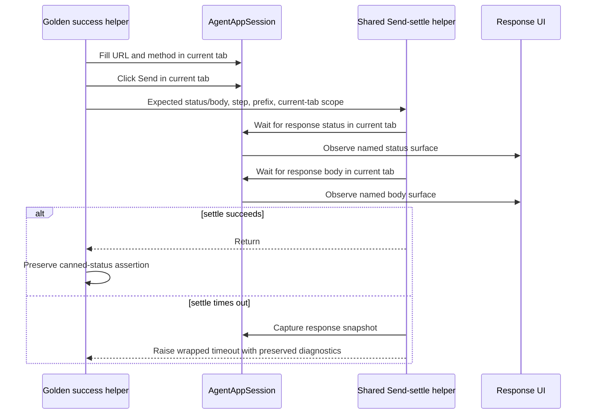
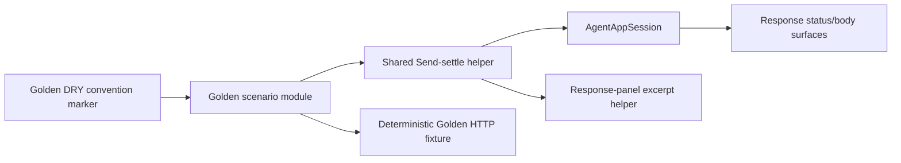

# PYPOST-970: Golden adopts shared Send-settle behavior

## Research

### Repository evidence

| Area | Current evidence | Implication |
| --- | --- | --- |
| Golden success | Inline status/body waits and timeout wrap | Replace this block only |
| Golden callers | Both success flows call one helper | One migration covers both |
| Timeout companion | Forces `Status: 999` and checks diagnostics | Keep unchanged |
| Shared helper | Waits status/body and wraps with an excerpt | Interface matches Golden |
| Tab scope | Inline waits use the current tab | Pass `in_current_tab=True` |
| Timeout | Both paths use `SEND_SETTLE_TIMEOUT_S` | Use shared default |
| Siblings | Four sibling areas use the helper | Golden becomes a consumer |
| Convention lock | Allows inline waits and omits Golden | Add a Golden DRY marker |

The current product behavior is already correct. The gap is ownership: Golden duplicates a
shared testing contract. A runtime assertion for status/body readiness would pass before this
task and therefore would not be an honest red test for the requested change.

Targeted baseline command:

```text
make test-agent-e2e \
  PYTEST_ARGS='tests/test_agent_golden_e2e.py tests/test_agent_e2e_response_panel.py -q'
```

Baseline result: **14 passed in 1.38s**. The first sandboxed attempt could not bind the local
metrics port; the same command passed with the required local socket permission. This is
environment evidence, not a product failure.

### Python research

The existing convention tests parse Python source. Python's standard `ast` module exposes
`ImportFrom`, `FunctionDef`, `Call`, and recursive traversal, so the Step 3 marker can inspect the
named success helper without brittle whole-file string counting. Reference:
[Python 3.14 `ast` documentation](https://docs.python.org/3/library/ast.html).

No new dependency, production interface, or external service is needed.

## Decision

Adopt `tests.helpers.agent_e2e_send_settle.wait_response_after_send` in
`_golden_fill_send_and_settle` for Golden's successful Send settle.

Use the existing helper unchanged. Preserve current-tab scoping and Golden's exact diagnostic
identity through call arguments. Keep the PYPOST-950 forced-timeout companion inline and
unchanged because it intentionally creates a failed status wait and validates the failure path.

### Options considered

| Option | Assessment | Decision |
| --- | --- | --- |
| Keep Golden inline | Runtime-correct, but leaves TD-4 duplication and drift risk | Rejected |
| Use helper for Golden success only | Removes duplication; preserves PYPOST-950 | **Selected** |
| Move both paths into helper | Obscures the companion's deliberate miss | Rejected |
| Add or redesign a helper | Existing interface already matches the contract | Rejected |

## Implementation Plan

### Step 3 — honest RED marker only

Add one bounded, source-level convention test in
`tests/test_agent_e2e_response_panel.py`:

`test_golden_success_send_uses_shared_settle_helper`

The marker will parse `tests/test_agent_golden_e2e.py` and assert both:

1. `wait_response_after_send` is imported from
   `tests.helpers.agent_e2e_send_settle`.
2. `_golden_fill_send_and_settle` calls `wait_response_after_send`.

The inspection must be scoped to the named success helper. A call elsewhere in the module must
not satisfy it. The test retains the module's existing `pytest.mark.timeout(10)` coverage and
uses no GUI, socket, or live external dependency.

**Expected RED:** the marker fails against today's source because Golden has neither the shared
import nor the shared-helper call. Existing runtime Golden tests remain green, as demonstrated by
the baseline. This deliberately proves the missing DRY convention rather than inventing a broken
user behavior.

Step 3 changes no Golden source and no production source.

### Step 4 — satisfy the marker with the migration

In `tests/test_agent_golden_e2e.py`, replace only the inline success settle `try`/`except` block
inside `_golden_fill_send_and_settle` with:

```python
wait_response_after_send(
    session,
    status_label=FIXTURE_STATUS_LABEL,
    body_text=FIXTURE_BODY_DISPLAY,
    step="wait_response_after_send",
    message_prefix="golden Send settle failed",
    in_current_tab=True,
)
```

Import `wait_response_after_send` from `tests.helpers.agent_e2e_send_settle`. Remove only imports
made unused by deleting the inline success block:

- `RESPONSE_BODY`
- `SEND_SETTLE_TIMEOUT_S`

Retain these imports because the forced-timeout companion still needs them:

- `UiWaitTimeoutError`
- free `wait_for_text`
- `RESPONSE_STATUS`
- `response_panel_excerpt`

Retain `json` and `FIXTURE_BODY_DISPLAY`; JSON display formatting is already correct and is not
part of this ticket's requested migration.

Do not change request fill/select/click behavior, fixture context, the post-settle canned-status
assertion, either success test, or the PYPOST-950 forced-timeout test.

### Verification sequence

1. Step 3: run only the new convention marker and observe the expected assertion failure.
2. Step 4: migrate the successful settle block and rerun the marker until green.
3. Run the targeted Golden and response-panel selection.
4. Run `make test-agent-e2e` for acceptance.

## Architecture

### Components and responsibilities

| Component | Responsibility | Change |
| --- | --- | --- |
| Golden module | Compose success flows and timeout companion | Consume shared settle |
| Golden success helper | Prepare, Send, wait, and assert fixture status | Replace settle block |
| Shared settle helper | Wait for response and normalize timeout evidence | None |
| `AgentAppSession` | Supply tab-aware actions, waits, and snapshots | None |
| Excerpt helper | Produce bounded response failure context | None |
| Timeout companion | Force a miss and lock PYPOST-950 diagnostics | None |
| Convention tests | Lock test-harness ownership without GUI | Add RED marker |
| HTTP fixture | Supply deterministic Golden response | None |

### Interaction diagram



The forced-timeout companion follows a separate path and does not route through `H`.

### Dependency direction



Dependencies remain test-only. Production modules do not import from `tests`.

## Interfaces

### Existing shared interface

```python
def wait_response_after_send(
    session: AgentAppSession,
    *,
    status_label: str,
    body_text: str,
    step: str,
    timeout: float = SEND_SETTLE_TIMEOUT_S,
    message_prefix: str = "Send settle failed",
    diagnostics_extra: dict[str, Any] | None = None,
    in_current_tab: bool = False,
) -> None: ...
```

No signature or behavior change is planned.

### Golden binding

| Parameter | Golden value | Preservation reason |
| --- | --- | --- |
| `session` | Active Golden `AgentAppSession` | Same lifecycle and snapshot source |
| `status_label` | `FIXTURE_STATUS_LABEL` | Same expected visible status |
| `body_text` | `FIXTURE_BODY_DISPLAY` | Same expected visible body |
| `step` | `wait_response_after_send` | Same triage fingerprint |
| `timeout` | Omitted; shared default | Same shared 15-second policy, one owner |
| `message_prefix` | `golden Send settle failed` | Same Golden failure prefix |
| `diagnostics_extra` | Omitted | Golden has no additional success-path fields today |
| `in_current_tab` | `True` | Same tab root as current inline waits |

### Preserved timeout contract

If status or body readiness times out, the raised `UiWaitTimeoutError` preserves:

- the original `timeout_s`;
- the original `condition`;
- all inner diagnostics, including `widget_id` and `expected`;
- `diagnostics["step"] == "wait_response_after_send"`;
- a string `diagnostics["response_excerpt"]`;
- exception chaining to the original wait error;
- the Golden-specific message prefix.

The forced-timeout companion continues to assert its existing PYPOST-950 subset directly.

## Risks and Mitigations

| Risk | Impact | Mitigation |
| --- | --- | --- |
| Window scope default | Wrong tab satisfies wait | Pass `in_current_tab=True` |
| Diagnostic drift | Harder CI triage | Bind existing step and prefix |
| Timeout drift | Slower or unstable Golden | Use existing shared default |
| Companion swept in | PYPOST-950 proof weakens | Exclude its body and imports |
| Unrelated call passes RED | False adoption proof | Inspect the named function AST |
| Marker checks formatting | False failures on refactor | Inspect syntax nodes only |
| Imports remain | Lint failure | Remove only two unused imports |
| Equivalence is wrong | Golden regression | Targeted tests, then full suite |

## Requirements Traceability

| Requirement | Architecture response | Verification |
| --- | --- | --- |
| FR1 shared contract | Golden success helper calls existing shared helper | Step 3 AST marker |
| FR2 status/body readiness | Pass unchanged status label and display body | Golden success tests |
| FR3 both flows | Both use one migrated function | Two Golden success tests |
| FR4 wrapper | Preserve step, prefix, and excerpt | Helper and timeout tests |
| FR5 inner evidence | Merge diagnostics and chain the error | Helper and companion tests |
| FR6 companion separate | Do not edit companion or dependencies | Scoped diff and test |
| FR7 suite green | No product behavior or fixture change | `make test-agent-e2e` |
| Consistency | Golden joins sibling helper consumers | Convention marker |
| Stability | Same current-tab root and timeout budget | Golden runtime tests |
| Minimal scope | One success block, one convention marker, import cleanup | Review of scoped diff |

## Q&A

- Q: Why not mark Step 3 as N/A?
  A: The task has no missing runtime product behavior, but it does have a testable structural
  acceptance criterion. An AST convention marker can honestly fail before the migration and pass
  after it without misrepresenting current Golden behavior.

- Q: Why not merely add Golden to the existing sibling convention list?
  A: That test accepts inline status/body waits, so Golden would pass before migration. The new
  marker must require the shared call specifically.

- Q: Why pass `in_current_tab=True`?
  A: The inline Golden code waits against the current tab object. The shared helper defaults to
  window scope, so the explicit flag is required for behavioral equivalence.

- Q: Why keep the timeout companion inline?
  A: It intentionally asks for an impossible status with a very short timeout and then inspects
  the failure. It is not the normal successful settle contract and PYPOST-950 permits separation.

- Q: Is a shared JSON-display migration included?
  A: No. Golden's display body is already correct; this ticket targets `wait_response_after_send`
  adoption only.

- Q: Are production observability or public interfaces changing?
  A: No. This is a test-harness ownership change using existing interfaces and diagnostics.
