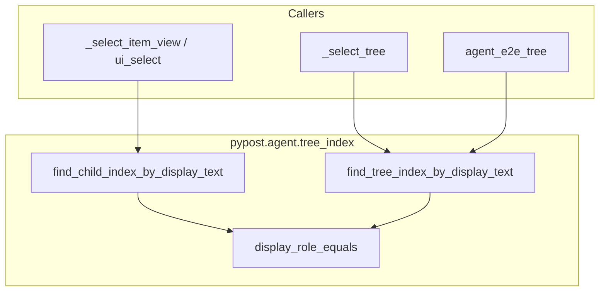
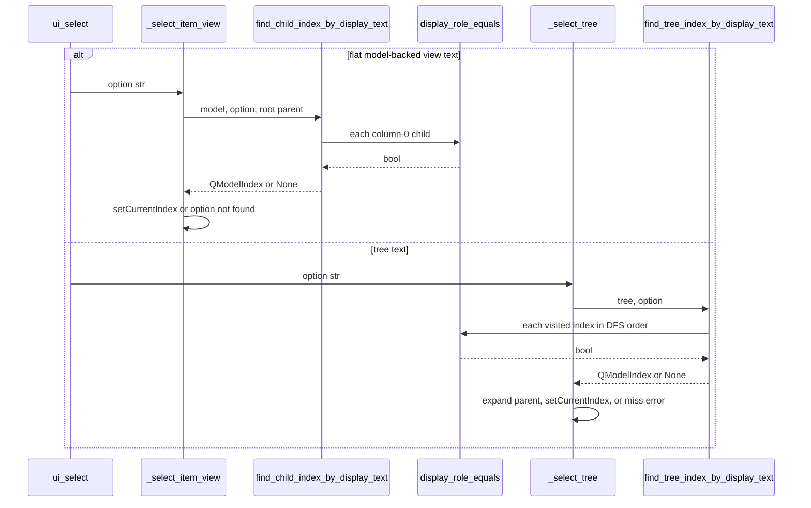

# PYPOST-971: Share flat DisplayRole scan ownership

## Research

### Repository evidence

- **Flat item-view path** — `_select_item_view` loops root rows, column 0, and
  compares `str(...DisplayRole) == option`. Owns a private copy of matching policy.
- **Tree lookup** — `tree_index.find_tree_index_by_display_text` DFS with the same
  comparison. Second ownership point for the same rule.
- **Tree callers** — `_select_tree` and `agent_e2e_tree` already delegate to
  `tree_index` (PYPOST-941). Recursion is shared; match predicate is not.
- **`QListWidget` path** — Uses `findItems(MatchExactly)`, not model DisplayRole
  scan. Must stay out of the shared helper.
- **Integer paths** — Root `rowCount` + `model.index(row, 0)` in both selectors.
  Out of scope; leave untouched.
- **Docs** — `doc/dev/ui_actions.md` documents flat scan vs recursive tree.
  Update ownership wording in Step 8.
- **Debt origin** — PYPOST-939 TD-1 → this ticket. Maintenance ownership, not new
  capability.

Exact duplicated predicate (two production sites):

```python
str(index.data(Qt.ItemDataRole.DisplayRole)) == <text>
```

Locations: `pypost/agent/ui_actions.py` (`_select_item_view`) and
`pypost/agent/tree_index.py` (`_walk` inside `find_tree_index_by_display_text`).

Existing runtime suites already lock behavior:

- `tests/test_ui_actions.py` — list view text/index, tree text/index, misses,
  combo/list widget
- `tests/test_tree_index_walk.py` — deep DFS, miss/`None`, e2e `AssertionError`
  vs agent error

A runtime assertion that selection still works would stay green before this task
and would not prove shared ownership. Prefer a structural convention lock (same
pattern as PYPOST-970).

### Qt / model-view research

Qt Model/View treats `Qt::DisplayRole` as the standard human-visible label role
for item views
([Qt Model/View Programming](https://doc.qt.io/qt-6/model-view-programming.html);
[QAbstractItemModel::data](https://doc.qt.io/qt-6/qabstractitemmodel.html)).
Flat views (`QListView`) expose root rows; trees expose hierarchical indexes
under a parent. That matches the project baseline: flat selection scans only
root children; tree selection walks depth-first without flattening the model.

Community "flatten tree into list" proxies are irrelevant here — requirements
forbid flattening tree semantics into flat views and forbid adding recursion to
flat item views.

### Python research

Ownership can be locked with the standard library `ast` module (`ImportFrom`,
`Call`, `FunctionDef`, `ast.walk`) without GUI or network deps
([Python `ast` docs](https://docs.python.org/3/library/ast.html)). The repo
already uses AST convention tests for harness DRY (for example suite/`qapp`
alignment and Golden settle markers).

No new third-party dependency is required.

## Decision

Consolidate **column-0 DisplayRole exact-match policy** and the **flat sibling
scan** into `pypost/agent/tree_index.py` (existing DisplayRole lookup owner from
PYPOST-941). Keep recursive DFS ownership in the same module. Keep all public
error mapping and selection side effects in `ui_actions.py` / e2e helpers.

### Options considered

| Option | Assessment | Decision |
| --- | --- | --- |
| Leave duplicate predicates | Correct behavior; TD-1 drift remains | Rejected |
| Match + flat scan in `tree_index.py` | Reuses lookup home; one import surface | **Selected** |
| New `model_index.py` module | Cleaner name; extra file for small helpers | Rejected |
| Flat views call recursive tree walk | Violates FR-2 (would recurse) | Rejected |
| Siblings-first then recurse for trees | Changes nested duplicate first-match | Rejected |
| Docs-only, no code change | Does not satisfy AC-1 | Rejected |

### Selected interfaces (planned)

```python
def display_role_equals(index: QModelIndex, text: str) -> bool:
    """Exact DisplayRole string match (shared matching policy)."""

def find_child_index_by_display_text(
    model: QAbstractItemModel,
    text: str,
    parent: QModelIndex | None = None,
) -> QModelIndex | None:
    """First column-0 DisplayRole match among direct children of ``parent``."""
```

- `_select_item_view` (text branch): call
  `find_child_index_by_display_text(model, option)`; on hit `setCurrentIndex`;
  on miss keep `UiTargetNotInteractableError` / `option not found`.
- `find_tree_index_by_display_text`: keep current DFS order; compare via
  `display_role_equals` only (do **not** replace DFS with a
  siblings-first-then-recurse scheme).
- `find_child_index_by_display_text` implements the flat loop using
  `display_role_equals`.
- Integer selection, missing-model checks, expansion, logging, combo /
  `QListWidget` paths: unchanged.

## Implementation Plan

### Step 3 — failing repro (honest RED ownership marker)

Add a bounded, source-level convention test (no Qt widget required for the
marker itself):

- **File:** `tests/test_display_role_scan_ownership.py`
- **Test:** `test_flat_and_tree_share_display_role_match_helper`
- **Timeout:** module `pytestmark = pytest.mark.timeout(10)` (or tighter if
  file stays AST-only)

The marker must assert all of the following against current sources:

1. `pypost/agent/tree_index.py` defines a public match helper named
   `display_role_equals` (and exports it via `__all__` once Step 4 lands —
   Step 3 may assert definition/call sites first).
2. `pypost/agent/ui_actions.py` function `_select_item_view` calls
   `find_child_index_by_display_text` (imported from
   `pypost.agent.tree_index`).
3. `find_tree_index_by_display_text` (or its nested walk) calls
   `display_role_equals` rather than comparing `ItemDataRole.DisplayRole`
   inline.
4. `_select_item_view` body does not contain an inline `DisplayRole`
   attribute access used for text matching (integer path may still use
   `model.index`; only the text-match predicate must move).

**How to force RED without live deps:** parse the two production modules with
`ast.parse` / `ast.walk`. Today neither `display_role_equals` nor
`find_child_index_by_display_text` exists, and `_select_item_view` still
inlines `DisplayRole` — the marker fails immediately.

**Sequencing:**

1. Research (this document) — done.
2. Step 3: add the AST marker only; observe RED; do not change production code.
3. Step 4: add helpers, wire callers, keep runtime suites green, turn marker
   GREEN.
4. Re-run focused suites:

```text
make test PYTEST_ARGS='tests/test_display_role_scan_ownership.py \
  tests/test_ui_actions.py tests/test_tree_index_walk.py -q'
```

Runtime behavioral tests remain the regression net for FR-2–FR-9; the new
marker proves AC-1 / NFR-2 ownership.

### Step 4 — production consolidation (after red)

1. Add `display_role_equals` and `find_child_index_by_display_text` to
   `pypost/agent/tree_index.py`; update module docstring/`__all__`.
2. Rewrite `_select_item_view` text branch to use the flat finder; preserve
   miss/model/index contracts.
3. Rewrite tree DFS comparisons to call `display_role_equals`; preserve
   depth-first order and first-match semantics.
4. Leave e2e wrapper and `_select_tree` error/expansion logic unchanged.
5. Do not touch combo/`QListWidget`/integer paths or logging.

### Step 8 — docs

Update `doc/dev/ui_actions.md` so flat item-view text selection names the
shared helper module and still contrasts flat root scan vs recursive tree walk.

## Architecture

### Components and responsibilities

| Component | Responsibility | Change |
| --- | --- | --- |
| `display_role_equals` | Single DisplayRole exact-match policy | **Add** |
| `find_child_index_by_display_text` | Flat sibling column-0 scan | **Add** |
| `find_tree_index_by_display_text` | Recursive DFS using shared match | **Wire match** |
| `_select_item_view` | Flat view select + public errors | **Delegate scan** |
| `_select_tree` | Tree select, expand, agent errors | None |
| `agent_e2e_tree` | Viewport click + `AssertionError` on miss | None |
| `ui_select` dispatch | Widget routing and `ui_action_applied` log | None |
| Ownership AST marker | Prove shared policy/scan wiring | **Add (Step 3)** |
| Existing ui_select / tree tests | Lock runtime contracts | Unchanged |

### Module interaction





### Dependency direction

- `ui_actions` → `tree_index` (already true for trees; extend for flat text
  scan).
- `tests.helpers.agent_e2e_tree` → `tree_index` (unchanged).
- `tree_index` must not import `ui_actions` or test helpers.
- Tests may import production helpers; production must not import `tests`.

### Architectural patterns

| Pattern | Application |
| --- | --- |
| Extract Method / Shared Policy | One DisplayRole equality owner |
| Separation of lookup vs boundary | Lookup returns index/`None`; callers map errors |
| Preserve traversal strategy | Flat = root siblings only; tree = DFS |
| Convention test as design lock | AST marker encodes AC-1 before runtime changes |

### Preserved public contracts

| Boundary | Must remain |
| --- | --- |
| Flat miss | `UiTargetNotInteractableError` + `option not found` |
| Tree miss via `ui_select` | Same agent error |
| Tree miss via e2e helper | `AssertionError` / `tree row not found` |
| Missing model | Distinct item-view vs tree no-model reasons |
| Success log | Scalar-only `ui_action_applied` (no option payload) |
| Dispatch order | Combo → `QListWidget` → `QTreeView` → item view |

## Requirements Traceability

| Requirement | Architecture response | Verification |
| --- | --- | --- |
| FR-1 / AC-1 shared ownership | Match + flat scan in `tree_index` | Step 3 AST marker |
| FR-2 flat root-only | Flat finder uses root parent only | List-view text tests |
| FR-3 tree DFS | DFS retained; match helper only | `test_tree_index_walk` |
| FR-4 selection / expand | Side effects stay in selectors | Existing tree text test |
| FR-5–FR-8 errors / dispatch | Boundaries unchanged | ui_actions negative tests |
| FR-9 suites green | No intentional behavior change | Focused make test |
| FR-10 docs | Step 8 ownership wording | `doc/dev/ui_actions.md` |
| NFR-2 maintainability | One predicate implementation | AST + code review |
| NFR-3 performance | Same O(n) / DFS shape | No extra traversal |
| NFR-5/6 observability/privacy | No new logging of options | Caplog contracts unchanged |

## Risks and Mitigations

| Risk | Impact | Mitigation |
| --- | --- | --- |
| Siblings-first API misuse | Wrong first match on duplicates | Tree uses match helper; keep DFS |
| Flat path gains recursion | Nested rows selected in lists | Flat helper never walks children |
| Error mapping moves into lookup | Public message drift | Lookup returns `None` only |
| Integer path refactored | Out-of-range regressions | Leave int branches untouched |
| `tree_index` name for flat users | Discoverability | Docstring + Step 8 docs |
| AST marker too brittle | False fails on renames | Assert planned symbols only |
| Runtime-only red test | Passes before fix | Prefer structural marker |

## Q&A

- **Q: Why not mark Step 3 as N/A?**
  **A:** Runtime behavior is already correct, but AC-1 is an ownership change.
  An AST convention test can honestly fail before the helper exists and pass
  after wiring, without inventing a broken selection outcome.

- **Q: Why keep helpers in `tree_index.py` instead of a new module?**
  **A:** PYPOST-941 already made that module the shared DisplayRole lookup
  home. Adding the flat scan there avoids a third parallel owner for a
  two-function extraction.

- **Q: Why not call `find_child_index_by_display_text` at each tree level then
  recurse?**
  **A:** That becomes "all siblings before any descendants," which changes
  first-match order when a descendant label also exists as a later sibling.
  Requirements freeze duplicate-label order.

- **Q: Does sharing change `QListWidget` selection?**
  **A:** No. It stays on the widget-item API and remains outside the model
  scan.

- **Q: Are public agent APIs or logs changing?**
  **A:** No. This is an internal ownership consolidation for existing
  selection behavior.
