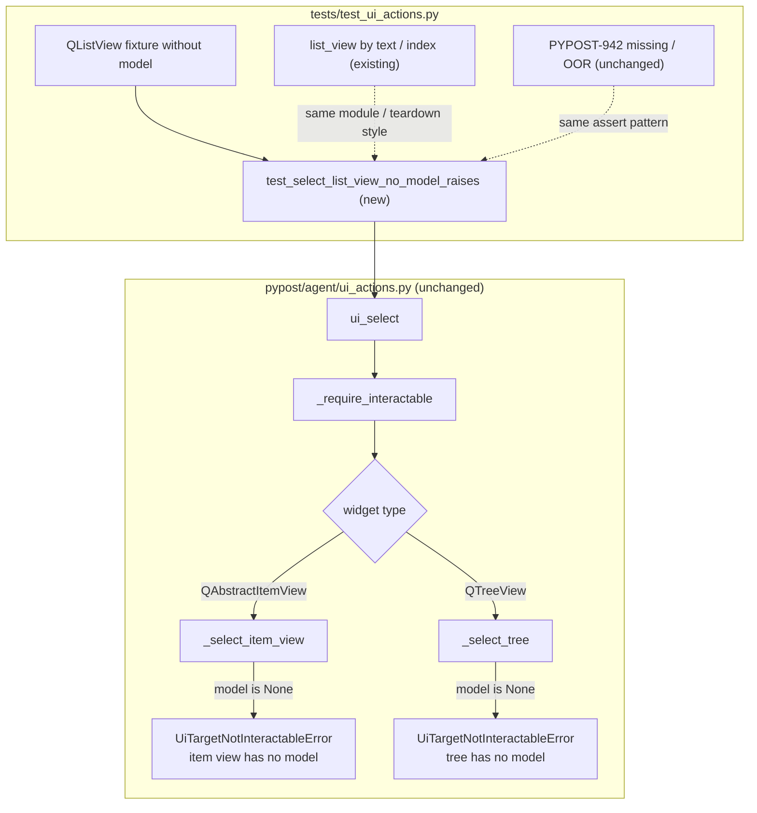

# PYPOST-972: Dedicated item view has no model test

## Research

### Jira / parent debt

- Issue: [PYPOST-972](https://pypost.atlassian.net/browse/PYPOST-972) —
  Dedicated test: `QListView` with no model raises
  `UiTargetNotInteractableError` with `"item view has no model"`.
  Acceptance: Error-path test green.
- Source: [PYPOST-939](https://pypost.atlassian.net/browse/PYPOST-939) TD-2 —
  “Dedicated `item view has no model` test; Mirror tree no-model coverage.”
- Labels: `agent`, `tech-debt`, `testing`. Priority: Low. Type: Debt.
- Requirements: [10-requirements.md](10-requirements.md) (FR-1–FR-6, AC-1–AC-6).

### Qt model/view baseline

Qt’s model/view docs state a view may be constructed without a model, but a
model must be provided before the view can present selectable data
([Model/View Programming](https://doc.qt.io/qtforpython-6/overviews/qtwidgets-model-view-programming.html)).
`QListView` is a flat `QAbstractItemView` over an external model
([QListView](https://doc.qt.io/qtforpython-6/PySide6/QtWidgets/QListView.html)).
`QAbstractItemView::model()` returns `nullptr` / `None` when no functional
model is attached (internally the static empty model is mapped to null)
([Qt source](https://github.com/qt/qtbase/blob/dev/src/widgets/itemviews/qabstractitemview.cpp);
`setModel(None)` is the established teardown detach in this repo).

### Current production behavior (no change expected)

| Piece | Behavior |
| --- | --- |
| `ui_select` dispatch | Combo → `QListWidget` → `QTreeView` → `QAbstractItemView` |
| `_select_item_view` | `model = widget.model()`; if `None`, raise |
| Item-view reason | `UiTargetNotInteractableError(widget_id, "item view has no model")` |
| `_select_tree` | Parallel check with distinct `"tree has no model"` |
| Docs | `doc/dev/ui_actions.md` troubleshooting lists both reasons |

Gate order in `_select_item_view`: missing model → index/text handling. Any
`option` (str or int) exercises the no-model branch before option validation.

### Existing test coverage

| Module / case | What it proves |
| --- | --- |
| `test_ui_select_list_view_by_text` | Happy-path `QListView` text select (PYPOST-939) |
| `test_ui_select_list_view_by_index` | Happy-path `QListView` index select (PYPOST-939) |
| PYPOST-942 negatives | List/tree missing option and OOR index |
| Suite search | **No** assertion matches `has no model` / `item view has no model` |

Gap: the documented missing-model contract for item views is implemented and
documented, but not locked by a dedicated automated proof (TD-2).

### Precedent for test-only select debt

[PYPOST-942/20-architecture.md](../PYPOST-942/20-architecture.md) added
negative-path contract tests in `tests/test_ui_actions.py` with
`pytest.raises` + substring assert, module `timeout(60)`, and
`close_item_view_fixture` for model-backed views — without changing
production unless a test revealed a bug.

### Decision: tests-only, no production modules

| Option | Verdict |
| --- | --- |
| Add one dedicated error-path test in `test_ui_actions.py` | **Chosen** — matches TD-2, NFR-3, PYPOST-942 precedent |
| New test module | Rejected — unnecessary split for one case |
| Change `ui_actions.py` / error wording | Out of scope unless Step 3 reveals a defect |
| Add tree no-model test | Out of scope — separate follow-up if desired (requirements Issues) |
| Live product `QListView` e2e | Out of scope — no product list-view id |

## Implementation Plan

1. **Step 3 — contract / coverage proof** — add a dedicated offscreen Qt test
   in `tests/test_ui_actions.py` next to existing list-view select tests.
2. **Step 4 — development** — run the new test and sibling select suite; fix
   production only if a real defect appears (unexpected).
3. **Steps 5–8** — minimal cleanup/observability; confirm
   `doc/dev/ui_actions.md` still matches the locked reason (no wording change).

**Mandatory — Failing Repro (next Step 3):**

**N/A — no behavioral change** for a classic red-before-green production fix.
`_select_item_view` already raises `UiTargetNotInteractableError` with
`"item view has no model"` when `widget.model() is None`.

For this **test-only debt**, the Step 3 “red” signal today is the **absence**
of any dedicated suite assertion covering that contract (suite search finds
no `has no model` match). Step 3 closes the gap by adding the missing
contract test. Expected sequencing:

1. Research confirms production gate and docs (done in Steps 1–2).
2. Step 3 adds the dedicated test (see below).
3. First run is expected **green** if production still matches the contract.
4. If the new test fails, treat it as an implementation bug for Step 4 — not
   as intentional red-before-green API redesign.

Do **not** introduce a permanent “missing-test marker” test that fails until
coverage exists; the dedicated contract test *is* the repro artifact and
becomes the lasting green guard.

### Proposed Step 3 test

| Field | Choice |
| --- | --- |
| Name | `test_select_list_view_no_model_raises` |
| File | `tests/test_ui_actions.py` |
| Fixture | Isolated `QListView` with `set_widget_id(..., _LIST_VIEW)` and **no**
  `setModel` (or explicit `setModel(None)` after construction) |
| Call | `ui_select(root, _LIST_VIEW, "Alpha")` (str option; int also fine) |
| Assert | `pytest.raises(UiTargetNotInteractableError)`; `"item view has no model"`
  in `str(exc_info.value)`; optionally assert `"tree has no model"` **not**
  in the message (FR-4 distinctness without adding a tree test) |
| Teardown | `close_item_view_fixture(..., view_type=QListView)` (detach is a
  no-op when model is already `None`) |
| Timeout | Module `pytestmark` already includes `timeout(60)` |

Fixture sketch (inline or small helper; prefer clarity over sharing the
happy-path model-backed helper):

```python
def test_select_list_view_no_model_raises(qapp: QApplication) -> None:
    """PYPOST-972: QListView with no model raises item view has no model."""
    root = QWidget()
    layout = QHBoxLayout(root)
    view = QListView()
    set_widget_id(view, _LIST_VIEW)
    layout.addWidget(view)
    root.show()
    qapp.processEvents()
    try:
        with pytest.raises(UiTargetNotInteractableError) as exc_info:
            ui_select(root, _LIST_VIEW, "Alpha")
        message = str(exc_info.value)
        assert "item view has no model" in message
        assert "tree has no model" not in message
    finally:
        close_item_view_fixture(root, qapp, _LIST_VIEW, view_type=QListView)
```

**Red test run (after Step 3 adds the test):**

```bash
make test PYTEST_ARGS='tests/test_ui_actions.py::test_select_list_view_no_model_raises -v'
make test PYTEST_ARGS='tests/test_ui_actions.py -v'
```

Sequencing: add contract test → green (or fix bug in Step 4) → full module green.

## Architecture

Test-only change; production module graph unchanged from PYPOST-939.



| Module | Responsibility |
| --- | --- |
| `tests/test_ui_actions.py` | Add dedicated no-model error-path proof; reuse ids / teardown |
| `pypost/agent/ui_actions.py` | Existing `_select_item_view` gate (read-only unless bug) |
| `tests/helpers/qt_item_view.py` | Existing `close_item_view_fixture` (reuse) |
| `doc/dev/ui_actions.md` | Canonical troubleshooting text (verify in Step 8; no edit unless drift) |

### Interfaces under test

No API changes. The test locks the existing public contract:

```python
UiTargetNotInteractableError(widget_id, reason="item view has no model")
# str(exc) includes widget_id and reason; assert substring "item view has no model"
```

Distinct sibling (not asserted by a new tree test here, only kept distinct):

```python
UiTargetNotInteractableError(widget_id, reason="tree has no model")
```

### Patterns

| Pattern | Justification |
| --- | --- |
| Mirror PYPOST-942 `pytest.raises` + substring | Consistent CI failure messages; AC-2 |
| Dedicated no-model fixture (no `setModel`) | Forces `model() is None` without coupling to happy-path model setup |
| `close_item_view_fixture` teardown | Matches list-view/tree convention; safe when model absent |
| Assert reason distinct from tree string | FR-4 without expanding scope to a tree no-model test |
| Module `timeout(60)` | NFR-2; no new per-test marker required |
| No production change | NFR-1 / NFR-5 / AC-5 |

### Dependencies

```
test_select_list_view_no_model_raises
  → ui_select / UiTargetNotInteractableError (pypost.agent.ui_actions)
  → set_widget_id / find_widget
  → QListView (PySide6), qapp fixture
  → close_item_view_fixture (tests.helpers.qt_item_view)
```

No new package, MCP, network, or public API dependencies.

## Q&A

| Q | A |
| --- | --- |
| Why not classic red-before-green? | Production already raises the documented error; this is coverage debt (TD-2), same posture as PYPOST-942. |
| What fails before Step 3? | CI has no dedicated assertion for the contract — the gap itself is the missing guard, not a failing production call. |
| Should Step 3 ship a failing “coverage marker”? | No. Add the real contract test; expect green if production is intact. |
| Reuse `_make_list_view_fixture` then `setModel(None)`? | Acceptable, but a no-model-from-start fixture is clearer and avoids implying a prior model was required. |
| Include tree no-model test? | No — out of scope; “mirror tree” means same failure family + distinct reason string. |
| Change the error message? | No — lock established public reason unless a defect is proven. |
| Live product e2e? | No — fixture coverage is sufficient (requirements exclusions). |

## Worklog

```
tokens_used: 14000
role: execution
step: 2
step_name: Architecture
```
