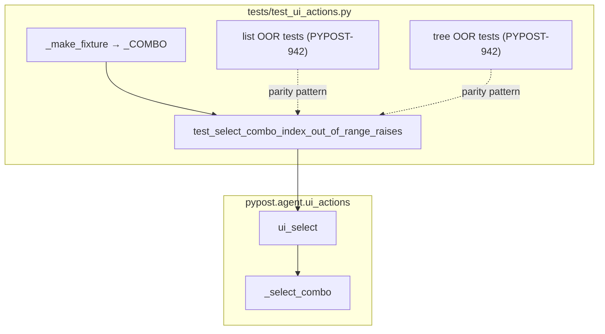

# PYPOST-974: Combo out-of-range index contract test

## Research

### Parent debt and scope

- Closes [PYPOST-942/60-tech-debt.md](../PYPOST-942/60-tech-debt.md) TD-1:
  list/tree out-of-range index tests exist; combo index path is unimplemented
  in the fixture suite.
- Production: `_select_combo` already raises
  `UiTargetNotInteractableError` with `option index out of range: {option!r}`
  when `option < 0` or `option >= widget.count()` (`pypost/agent/ui_actions.py`).

### Current production behavior (no change expected)

| Helper | Missing text | Out-of-range index |
| --- | --- | --- |
| `_select_combo` | `option not found: {option!r}` | `option index out of range: {option!r}` |
| `_select_list` | same | same |
| `_select_tree` | same | same (top-level rows) |

### Existing test coverage

| Test | Covers |
| --- | --- |
| `test_ui_select_combo_by_index` | Happy-path combo index |
| `test_select_missing_option_raises` | Combo missing display text |
| `test_select_list_index_out_of_range_raises` | List `-1` / `3` (PYPOST-942) |
| `test_select_tree_index_out_of_range_raises` | Tree `-1` / `2` (PYPOST-942) |

Gap: no parametrized combo out-of-range index contract test.

### Reference pattern (list)

```python
@pytest.mark.parametrize("index", [-1, 3])
def test_select_list_index_out_of_range_raises(
    qapp: QApplication,
    index: int,
) -> None:
    root, _ = _make_fixture(qapp)
    try:
        with pytest.raises(UiTargetNotInteractableError) as exc_info:
            ui_select(root, _LIST, index)
        assert "option index out of range" in str(exc_info.value)
    finally:
        root.close()
```

Combo fixture (`_make_fixture` → `_COMBO`) has three items (indices 0–2);
invalid boundaries are `-1` and `3`.

### Decision: tests-only

| Option | Verdict |
| --- | --- |
| Add parametrized test in `test_ui_actions.py` | **Chosen** |
| Change `ui_actions.py` | Out of scope unless Step 3 reveals a bug |
| New test module | Rejected — unnecessary for one small case |

## Implementation Plan

1. **Step 3** — N/A (see below); Step 4 adds the green contract test.
2. **Step 4** — Add `test_select_combo_index_out_of_range_raises` next to
   `test_select_missing_option_raises`, parametrized `[-1, 3]`.
3. **Steps 5–8** — Minimal cleanup/observability; update `doc/dev/ui_actions.md`
   to cite the new combo index contract test alongside list/tree.

**Mandatory — Failing Repro (next Step 3):**

**N/A — no behavioral change.** `_select_combo` already raises the out-of-range
error. Step 4 adds a **regression/contract test** expected **green on first
run**. If it fails, treat as a production bug to fix in Step 4.

Suggested test:

| Test name | Call | Assert |
| --- | --- | --- |
| `test_select_combo_index_out_of_range_raises` | `ui_select(root, _COMBO, -1)` and `…, 3` | `UiTargetNotInteractableError`, `"option index out of range"` |

```bash
make test PYTEST_ARGS='tests/test_ui_actions.py::test_select_combo_index_out_of_range_raises -v'
make test PYTEST_ARGS='tests/test_ui_actions.py -v'
```

## Architecture

Test-only change; production module graph unchanged.



### Modules

| Module | Role |
| --- | --- |
| `tests/test_ui_actions.py` | New parametrized combo OOR contract test |
| `pypost/agent/ui_actions.py` | Unchanged; `_select_combo` already raises |
| `doc/dev/ui_actions.md` | Cite combo index contract test in Step 8 |

### Patterns

- Mirror list/tree parametrized boundary tests.
- Substring assert on `"option index out of range"`.
- Inherit module `pytestmark` (`timeout(60)`, `agent_e2e`).
- `try`/`finally` with `root.close()`.

## Q&A

- **Q: Why N/A for Step 3?**
  **A:** Production already implements the error; the missing piece is CI
  coverage, not a red-before-green defect cycle.
- **Q: Why indices `-1` and `3`?**
  **A:** One below zero and one equal to combo item count (three items).
- **Q: Production changes?**
  **A:** None unless the new test fails unexpectedly.
