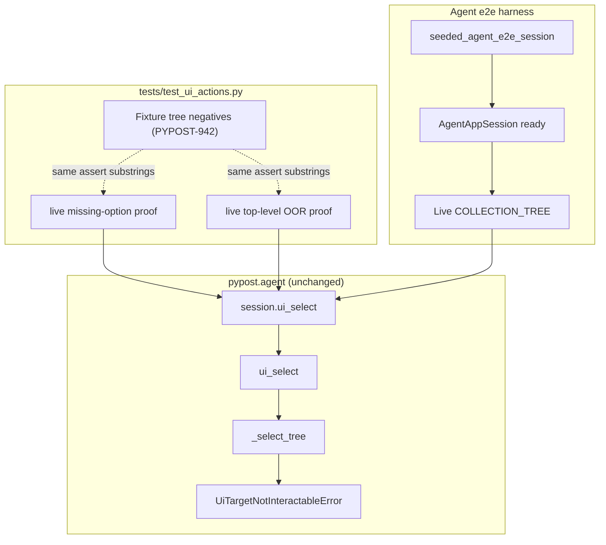

# PYPOST-975: Live COLLECTION_TREE negative select via agent_e2e_session

## Research

### Parent debt and acceptance

- Closes [PYPOST-942/60-tech-debt.md](../PYPOST-942/60-tech-debt.md) TD-2:
  optional live collection-tree negative select under
  `agent_e2e_session` / seeded session beyond the fixture suite.
- Jira acceptance allows **Path A** (live agent e2e proof) or **Path B**
  (documented harness deferral). Requirements prefer Path A when the harness
  can host the proof.
- Fixture contract already locked by PYPOST-942 in `tests/test_ui_actions.py`
  (`test_select_tree_missing_option_raises`,
  `test_select_tree_index_out_of_range_raises`).

### Current production behavior (no change expected)

| Helper | Missing text | Out-of-range index |
| --- | --- | --- |
| `_select_tree` | `option not found: {option!r}` | `option index out of range: {option!r}` (top-level `model.rowCount()` only) |

Raises `UiTargetNotInteractableError(widget_id, reason)`. Session path:
`AgentAppSession.ui_select` → `ui_select(root, …)` → `_select_tree` for
`QTreeView` (`pypost/agent/ui_actions.py`, `pypost/agent/lifecycle.py`).

### Harness inventory (Path A feasibility)

| Piece | Observation | Path impact |
| --- | --- | --- |
| `COLLECTION_TREE` identity | Present after ready on blank and seeded sessions (`test_ui_identity_spotcheck`, `test_agent_e2e_seed`) | Live widget exists |
| `agent_e2e_session` | Blank workspace; tree present, seed collection absent | Can host negatives on empty/non-seed tree |
| `seeded_agent_e2e_session` | One top-level `SEED_COLLECTION_NAME` + nested GET/POST rows | Preferred non-empty live tree |
| `session.ui_select` | Documented for `COLLECTION_TREE` by text/index (`doc/dev/ui_actions.md`, `agent_e2e_seed.md`) | No new API |
| Happy-path live tree select | Seed drive still uses `click_tree_row_by_text` for open; docs already recommend `ui_select` for selection-only | Negatives do not need open/activate |
| Network | Negative select is synchronous; no HTTP stub required | NFR-2 satisfied |
| Marker / timeout | `pytest.mark.agent_e2e` + module `timeout(60)` pattern | AC-3 satisfied |

No harness gap blocks missing-label or top-level out-of-range select on the
live product tree. **Path B is not required.**

### Existing coverage vs gap

| Layer | What it proves | Gap for TD-2 |
| --- | --- | --- |
| Fixture `_TREE` | Synthetic tree missing / OOR (PYPOST-942) | Not the product `COLLECTION_TREE` |
| `test_tree_index_walk.py` | Deep-tree miss via `objectName` | Different fixture contract |
| Agent e2e seed / identity | Tree present; drive opens via click helper | No negative `ui_select` on live tree |
| Live `METHOD_COMBO` select | Session happy-path in `test_ui_actions.py` | Precedent for session proofs; tree negatives absent |

### External note (exception capture)

Negative proofs call `session.ui_select` synchronously from the test thread.
`pytest.raises(UiTargetNotInteractableError)` matches the fixture-suite
pattern. Qt event-loop exception capture (pytest-qt / PySide6) is irrelevant
here — failures are raised at the call site, not inside a virtual method
triggered only by the event loop
([pytest-qt virtual methods](https://pytest-qt.readthedocs.io/en/latest/virtual_methods.html)).

### Decision: Path A — live agent e2e proofs

| Option | Verdict |
| --- | --- |
| **Path A — seeded-session live negatives** | **Chosen** — harness hosts ready `COLLECTION_TREE`; production errors exist |
| Path A — blank session only | Acceptable fallback; weaker “live inventory” signal |
| Path B — documented deferral | Rejected — no blocking harness gap found |

**Session choice:** prefer `seeded_agent_e2e_session` so the live tree has the
known seed top-level row. Invalid display text is a sentinel that cannot match
seed labels (e.g. `__no_such_collection_tree_option__`). Out-of-range indices
are `-1` and `model.rowCount()` (seed: typically `1`).

**Test home:** add focused cases in `tests/test_ui_actions.py` next to fixture
tree negatives and existing `agent_e2e_session` happy-path selects — same
module already carries `pytestmark = [timeout(60), agent_e2e]`. Avoid a new
module unless Step 4 finds the file unwieldy.

**Production:** unchanged unless a live proof fails unexpectedly (then fix in
Step 4).

## Implementation Plan

1. **Step 3** — N/A for deliberate red-before-green (see below). Record the
   planned live contract tests as the Step 3 artifact outline; implement in
   Step 4 (or Step 3 if the runner treats “failing repro” as adding the
   expected-green proofs — either way, no production change first).
2. **Step 4** — Add two live proofs (missing label + parametrized OOR) using
   `seeded_agent_e2e_session` and `session.ui_select(COLLECTION_TREE, …)`.
3. **Steps 5–8** — Minimal cleanup/observability; Step 8 may note live
   negative proofs in `doc/dev/ui_actions.md` / `agent_e2e.md` if docs still
   imply fixture-only coverage.

**Mandatory — Failing Repro (next Step 3):**

**N/A — no behavioral change.** `_select_tree` already raises
`option not found` / `option index out of range` on the live product tree via
`session.ui_select`. This task adds **agent e2e regression/contract coverage**
expected **green on first run**. If a proof fails, treat it as a production or
harness defect to fix in Step 4 (not a deliberate red-before-green cycle).

Suggested Step 3/4 tests and assertions:

| Test name (proposed) | Call | Assert |
| --- | --- | --- |
| `test_live_collection_tree_missing_option_raises` | `session.ui_select(COLLECTION_TREE, "__no_such_collection_tree_option__")` | `UiTargetNotInteractableError`, `"option not found"` |
| `test_live_collection_tree_index_out_of_range_raises` | `session.ui_select(COLLECTION_TREE, -1)` and `…, row_count` | `UiTargetNotInteractableError`, `"option index out of range"` |

Outline:

```python
def test_live_collection_tree_missing_option_raises(
    seeded_agent_e2e_session: AgentAppSession,
) -> None:
    session = seeded_agent_e2e_session
    assert session.window.is_ui_ready
    with pytest.raises(UiTargetNotInteractableError) as exc_info:
        session.ui_select(
            COLLECTION_TREE, "__no_such_collection_tree_option__"
        )
    assert "option not found" in str(exc_info.value)


@pytest.mark.parametrize("index_factory", ["neg", "count"])
def test_live_collection_tree_index_out_of_range_raises(
    seeded_agent_e2e_session: AgentAppSession,
    index_factory: str,
) -> None:
    session = seeded_agent_e2e_session
    assert session.window.is_ui_ready
    tree = find_widget(session.window, COLLECTION_TREE)
    assert isinstance(tree, QTreeView)
    model = tree.model()
    assert model is not None
    index = -1 if index_factory == "neg" else model.rowCount()
    with pytest.raises(UiTargetNotInteractableError) as exc_info:
        session.ui_select(COLLECTION_TREE, index)
    assert "option index out of range" in str(exc_info.value)
```

Run after adding proofs:

```bash
make test-agent-e2e PYTEST_ARGS='tests/test_ui_actions.py::test_live_collection_tree_missing_option_raises tests/test_ui_actions.py::test_live_collection_tree_index_out_of_range_raises -v'
make test PYTEST_ARGS='tests/test_ui_actions.py -v'
```

Sequencing: research → add live contract tests → green (or fix defect in
Step 4) → fixture negatives remain green → docs if needed.

## Architecture

Test-only change under Path A; production select graph unchanged from
PYPOST-916 / PYPOST-942.



### Modules and responsibilities

| Module | Responsibility |
| --- | --- |
| `tests/test_ui_actions.py` | Add live `COLLECTION_TREE` missing / OOR proofs; keep fixture negatives |
| `tests/_pytest_plugins/agent_e2e.py` | Unchanged; supply `seeded_agent_e2e_session` |
| `pypost/agent/lifecycle.py` | Unchanged `AgentAppSession.ui_select` wrapper |
| `pypost/agent/ui_actions.py` | Unchanged `_select_tree` error contract (read-only unless bug) |
| `pypost/ui/widget_ids.py` | Existing `COLLECTION_TREE` identity |
| `doc/dev/ui_actions.md` / `agent_e2e.md` | Optional Step 8 cite of live negative proofs |

### Interfaces under test

No API changes. Live proofs lock the same contract as fixture tree negatives,
on the product widget id:

```python
# str path — no DisplayRole match in live tree
UiTargetNotInteractableError(..., reason="option not found: '…'")

# int path — index < 0 or >= top-level rowCount()
UiTargetNotInteractableError(..., reason="option index out of range: …")
```

### Patterns

| Pattern | Justification |
| --- | --- |
| Path A over Path B | Harness already exposes ready live `COLLECTION_TREE` |
| `seeded_agent_e2e_session` | Non-empty product inventory; deterministic seed |
| Mirror fixture substring asserts | Same actionable pattern (FR-4); avoids brittle full strings |
| Dynamic `rowCount()` for OOR upper bound | Survives seed inventory growth without hard-coding `1` |
| Selection-only (no click helper) | Negatives do not need open/activate; matches TD-2 scope |
| Inherit module `timeout(60)` + `agent_e2e` | AC-3 / NFR-2 |
| No production change by default | NFR-1 / AC-5 |

### Interaction scheme (Path A)

1. Packaging fixture yields ready seeded `AgentAppSession`.
2. Test resolves live `COLLECTION_TREE` (implicitly via `ui_select` / find).
3. Invalid select raises `UiTargetNotInteractableError` with fixture-parity
   reason substrings.
4. Fixture tree negatives remain the synthetic API baseline.

## Q&A

| Q | A |
| --- | --- |
| Why not Path B? | Investigation found no harness gap: identity, session, and select API already support live negatives. |
| Why seeded over blank? | Seeded tree is a non-empty live product inventory; blank still works but is a weaker proof. |
| Why N/A for Step 3 red? | Errors already implemented; task is live coverage debt (same stance as PYPOST-942 / PYPOST-974). |
| Must both cases be proven? | Yes under Path A (FR-1–FR-3); harness supports both. |
| Replace fixture negatives? | No — they remain the API contract baseline (FR-6, AC-4). |
| Replace seed click open with `ui_select`? | Out of scope — selection ≠ open (PYPOST-916). |
| Combo / list-view live negatives? | Out of scope — PYPOST-974 and related item-view tickets. |
| Nested tree index OOR? | Out of scope — top-level index contract only. |
