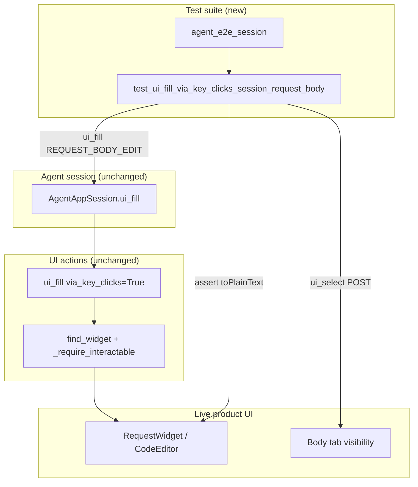

# PYPOST-976: Session body-editor keyClicks smoke

## Research

### Origin and acceptance

- Jira: [PYPOST-976](https://pypost.atlassian.net/browse/PYPOST-976) — closes
  [PYPOST-945/60-tech-debt.md](../PYPOST-945/60-tech-debt.md) UT-1 (Lowest).
- Parent feature: opt-in keystroke fill on `ui_fill` ([PYPOST-917](https://pypost.atlassian.net/browse/PYPOST-917)).
- Fixture plain/rich proofs delivered in
  [PYPOST-945](https://pypost.atlassian.net/browse/PYPOST-945); URL-field
  session smoke in `test_ui_fill_via_key_clicks_session` (PYPOST-917).
- Requirements: `ai-tasks/PYPOST-976/10-requirements.md`.

### Current production contract (unchanged)

`pypost/agent/ui_actions.py` — opt-in `ui_fill` keyClicks path:

```text
find_widget → visible + enabled → type guard (QLineEdit | QPlainTextEdit | QTextEdit)
  → clear → setFocus → _pump → QTest.keyClicks(widget, text) → _pump
```

- `AgentAppSession.ui_fill` mirrors `via_key_clicks` and `delay`
  (`pypost/agent/lifecycle.py`).
- Request body editor: `CodeEditor` extends `VariableAwarePlainTextEdit` →
  `QPlainTextEdit` (`pypost/ui/widgets/code_editor.py`); identity
  `REQUEST_BODY_EDIT` (`pypost/ui/widget_ids.py`).

### Existing coverage vs gap

| Layer | What it proves | Gap for UT-1 |
| --- | --- | --- |
| Fixture `QPlainTextEdit` | Opt-in keyClicks final text (PYPOST-945) | Not live product `CodeEditor` |
| Fixture `QTextEdit` | Same (PYPOST-945) | N/A for body editor |
| Session URL `QLineEdit` | `test_ui_fill_via_key_clicks_session` | Single-line field only |
| Agent e2e body fill (setter) | Many flows use `session.ui_fill(REQUEST_BODY_EDIT, …)` default path | No session keyClicks on body |
| **Missing** | Live session + `via_key_clicks=True` on `REQUEST_BODY_EDIT` | **This task** |

### Harness constraint: Body tab visibility

`_require_interactable` rejects widgets with `not widget.isVisible()`
(`pypost/agent/ui_actions.py`). On a blank session the default method is GET;
detail tabs start on **Params**, so `REQUEST_BODY_EDIT` exists but is **not
visible** until the Body tab is shown.

Established patterns in-repo:

| Pattern | Where | Effect |
| --- | --- | --- |
| `session.ui_select(METHOD_COMBO, "POST")` or `"PUT"` | `test_agent_e2e_double_response_body.py` | `_on_method_changed` auto-switches to Body tab |
| `_ensure_body_tab_visible(session)` | `test_agent_e2e_presentation_matrix.py` | Walks `REQUEST_DETAIL_TABS` to select Body page |

**Decision:** use **POST method select** for minimal arrange — one call, no
helper duplication, matches double-response-body comment (“PUT auto-switches to
Body tab”). No HTTP Send; no stub required (FR4 / NFR3).

### External / Qt note

`QTest.keyClicks` delivers Qt-internal key events to the focused widget
([Qt QTest::keyClicks](https://doc.qt.io/qt-6/qtest.html#keyClicks)). Same
mechanism as fixture and URL session proofs; no live network.

### Decision: test-only, single sibling smoke

| Option | Verdict |
| --- | --- |
| **One new test in `tests/test_ui_actions.py`** | **Chosen** — mirrors URL session keyClicks; module already has `pytestmark = [timeout(60), agent_e2e]` |
| New dedicated module | Rejected — unnecessary for one smoke |
| Caplog / per-keystroke asserts | Out of scope — PYPOST-977 / PYPOST-946 |
| Production change preemptively | Rejected — NFR1; fix only if smoke fails |

## Implementation Plan

1. Keep `pypost/agent/ui_actions.py` and `pypost/agent/lifecycle.py`
   unchanged unless Step 3/4 smoke reveals a real defect.
2. **Step 3** — add failing-repro artifact (see below); expect green on first
   run unless live `CodeEditor` diverges from fixture plain edit.
3. **Step 4** — implement the test body if Step 3 only records the contract:
   - `agent_e2e_session` ready.
   - `session.ui_select(METHOD_COMBO, "POST")` so Body tab is visible.
   - `session.ui_fill(REQUEST_BODY_EDIT, fill_text, via_key_clicks=True)`.
   - Resolve widget; assert `toPlainText() == fill_text`.
   - Use a short deterministic ASCII string (e.g. `body-via-keys`), mirroring
     plain fixture naming.
4. Run focused:

```bash
make test PYTEST_ARGS='tests/test_ui_actions.py::test_ui_fill_via_key_clicks_session_request_body -v'
```

5. **Step 8 (optional):** cross-link in `doc/dev/ui_actions.md` /
   `doc/dev/testing.md` next to URL session keyClicks mention.

**Mandatory — Failing Repro (next Step 3):**

**N/A — no deliberate red-before-green.** PYPOST-917 already implements
keyClicks fill for `QPlainTextEdit`; PYPOST-945 locks the type in isolation.
The gap is **session-level coverage** on the live `CodeEditor`, not a missing
API or branch.

**Step 3 artifact (expected-green contract test):**

| Field | Value |
| --- | --- |
| **Where** | `tests/test_ui_actions.py` |
| **Name** | `test_ui_fill_via_key_clicks_session_request_body` |
| **Asserts** | After opt-in fill, `REQUEST_BODY_EDIT.toPlainText()` equals intended string |
| **Arrange** | `agent_e2e_session`; `METHOD_COMBO` → `"POST"`; no HTTP / no stub |
| **Force failure without network** | N/A for missing feature — test should pass immediately. If it **fails**, likely causes: Body tab not shown (`not visible`), `CodeEditor` keyClicks quirk, or focus/validation side effect → fix in Step 4 |
| **Sequencing** | research → add contract test (Step 3) → green verify → optional doc note (Step 8) |

## Architecture

### Module diagram



### Responsibilities

| Component | Responsibility |
| --- | --- |
| `agent_e2e_session` | Offscreen ready blank main window (existing fixture) |
| `AgentAppSession.ui_fill` | Pass `via_key_clicks` to module `ui_fill` |
| `ui_fill` (existing) | keyClicks fill on `QPlainTextEdit` / `CodeEditor` |
| `REQUEST_BODY_EDIT` | Stable identity for request body editor |
| `METHOD_COMBO` POST select | Ensures Body tab visible before fill |
| New test | Session smoke: keyClicks fill + plain-text assert |
| Existing URL session test | Unchanged sibling proof |

### Patterns

- Mirror `test_ui_fill_via_key_clicks_session` structure (session arrange →
  `ui_fill` → widget readback).
- Mirror PYPOST-945 plain fixture assert (`toPlainText()`), not caplog or
  signal counting.
- Reuse module `pytestmark` (timeout + `agent_e2e`); no new marker module.
- Import `REQUEST_BODY_EDIT` from `pypost.ui.widget_ids` alongside existing
  `URL_INPUT` / `METHOD_COMBO`.

### Interfaces exercised

```text
session.ui_select(METHOD_COMBO, "POST")
  → detail_tabs shows Body tab → REQUEST_BODY_EDIT visible

session.ui_fill(REQUEST_BODY_EDIT, text, via_key_clicks=True)
  → find_widget(window, REQUEST_BODY_EDIT)
  → clear + focus + QTest.keyClicks
  → CodeEditor.toPlainText() == text
```

No changes to MCP tool schema, golden flows, or default fill behaviour.

## Q&A

| Q | A |
| --- | --- |
| Change production? | Not expected — coverage debt unless smoke fails. |
| Why POST before fill? | Body editor is hidden on default GET/Params tab; POST auto-shows Body (same as other agent e2e body fills). |
| Why not `_ensure_body_tab_visible`? | POST select is fewer lines and already used for body fill elsewhere; import duplication avoided. |
| `in_current_tab=True`? | Not required for single-tab blank session; existing body fills use window root (e.g. PYPOST-889). |
| Is Step 3 red required? | **No** — behaviour exists; Step 3 adds expected-green contract test. |
| Live network? | **No** — fill + assert only (FR4). |
