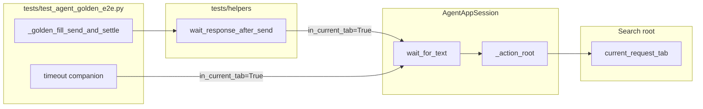
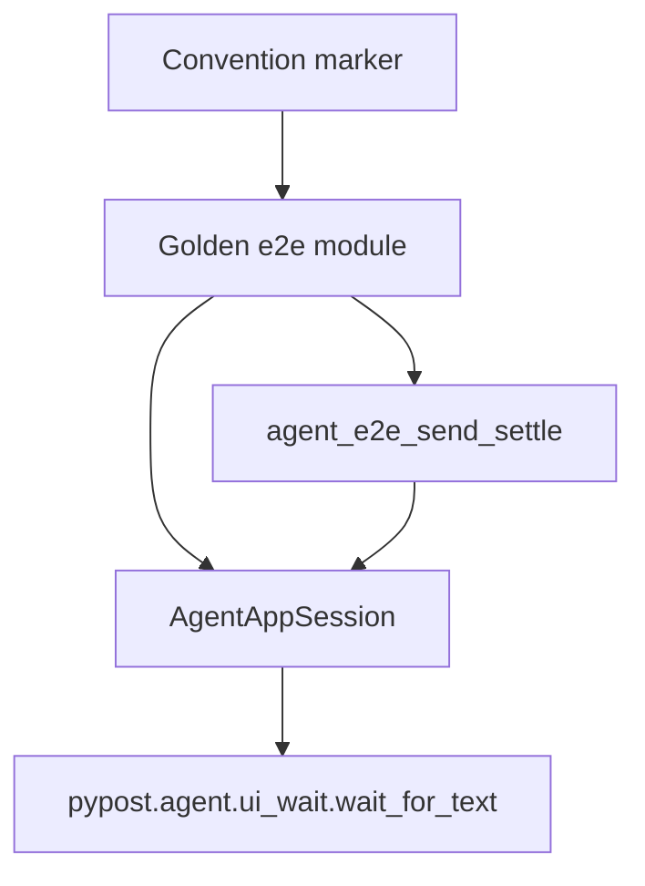

# PYPOST-978: Migrate golden e2e to tab-scoped session wait

## Research

### Repository evidence

| Area | Current evidence | Implication |
| --- | --- | --- |
| Jira PYPOST-978 | Session tab-scoped wait; fewer free imports | Structural DRY migration |
| PYPOST-949 TD-1 | Optional golden migration after session API | This ticket closes that debt |
| Session API | `wait_for_text` via `_action_root` | Adopt existing contract |
| Shared settle | Helper already calls session wait | Success settle already migrated |
| Golden success | Uses `wait_response_after_send` (PYPOST-970) | Do not re-migrate success |
| Timeout companion | Free `wait_for_text(tab, …)` | Remaining free-function debt |
| Golden imports | Free `wait_for_text` from `pypost.agent` | Import only for companion miss |
| Convention locks | Helper adoption locked; not free-import | Need new free-function marker |
| Docs | `ui_wait.md` cites free wait as golden | Accuracy update if still wrong |
| Runtime baseline | Golden already green under agent e2e | Honest RED must be structural |

Targeted baseline (expected green today):

```text
make test-agent-e2e \
  PYTEST_ARGS='tests/test_agent_golden_e2e.py \
  tests/test_agent_e2e_response_panel.py -q'
```

### External research

- **pytest-timeout**
  ([pytest-timeout](https://github.com/pytest-dev/pytest-timeout)): keep
  explicit per-test / module timeouts on the new convention test and on
  existing golden / agent e2e proofs (NFR-2, AC-4).
- **Python `ast`**
  ([docs.python.org/library/ast](https://docs.python.org/3/library/ast.html)):
  `ImportFrom` + `Call` / `Attribute` inspection matches the repo pattern
  (PYPOST-970) for DRY migrations where runtime behaviour is already correct.
  Prefer syntax-node checks over brittle whole-file string counts.
- E2E wait guidance elsewhere prefers scoped waits over window-wide or fixed
  sleeps; this task adopts the repo’s existing tab-scoped session wait rather
  than inventing a new primitive.

No new dependency, production interface, or live external service is required.

### Decision

Close PYPOST-949 TD-1 by finishing the golden free-function text-wait migration:

1. Keep successful Send settle on
   `wait_response_after_send(..., in_current_tab=True)` (already
   session-backed).
2. Migrate the PYPOST-950 forced-timeout companion from free
   `wait_for_text(tab, …)` to
   `session.wait_for_text(..., in_current_tab=True)`.
3. Drop the free-function `wait_for_text` import from
   `tests/test_agent_golden_e2e.py`.
4. Correct developer docs that still describe free-function tab-root waits as
   the golden pattern (FR-5).

### Options considered

| Option | Assessment | Decision |
| --- | --- | --- |
| No-op (success uses helper) | Leaves free import; TD-1 open | Rejected |
| Inline success `session.wait_for_text` | Undoes PYPOST-970 DRY | Rejected |
| Migrate companion; keep success helper | Matches Jira; fewer free imports | **Selected** |
| Fold companion into shared helper | Obscures deliberate miss | Rejected |
| New wait API / default tab scope | Out of scope | Rejected |

## Implementation Plan

### Step 3 — honest RED convention marker

Add one bounded, source-level convention test in
`tests/test_agent_e2e_response_panel.py` (same home as other golden DRY locks):

`test_golden_text_waits_use_session_api_not_free_function`

The marker parses `tests/test_agent_golden_e2e.py` and asserts all of:

1. No `ImportFrom` of free-function `wait_for_text` from `pypost.agent` (or
   `pypost.agent.ui_wait`).
2. Every `wait_for_text` call in the module is `session.wait_for_text` (AST
   `Attribute`, not bare `Name`).
3. Each such call passes keyword `in_current_tab=True`.

Inspection uses `ast` only (no GUI, sockets, or live HTTP). Retain the
module’s existing `pytest.mark.timeout(10)`.

**Expected RED (pre-fix):** fails because golden still imports and calls free
`wait_for_text(tab, …)` in the timeout companion. Existing runtime golden
tests remain green — this proves the missing session-API convention, not
inventing broken settle behaviour.

Step 3 changes no golden source and no production source.

### Step 4 — satisfy the marker

In `test_agent_golden_settle_timeout_includes_step_and_excerpt`:

- Replace `wait_for_text(tab, RESPONSE_STATUS, "Status: 999", timeout=0.05)`
  with:

```python
session.wait_for_text(
    RESPONSE_STATUS,
    "Status: 999",
    timeout=0.05,
    in_current_tab=True,
)
```

- Remove unused `tab = session.current_request_tab()` if it becomes unused.
- Remove `wait_for_text` from the `pypost.agent` import list.
- Do **not** change `_golden_fill_send_and_settle`, success tests, stubbing,
  diagnostic wrap fields (`step`, `response_excerpt`, `widget_id`,
  `expected`), fill/click behaviour, or production wait implementations.

### Step 8 (docs, deferred to workflow Step 8)

Update wording only where inaccurate after migration:

- `doc/dev/ui_wait.md` — drop “golden e2e pattern” for free-function tab
  roots; point golden authors at session
  `wait_for_text(..., in_current_tab=True)` / `wait_response_after_send`.
- `doc/dev/agent_golden_e2e.md` — timeout companion description should say
  `session.wait_for_text(..., in_current_tab=True)` if it still mentions free
  `wait_for_text`.

### Verification sequence

1. Step 3: run only the new convention marker → expected assertion failure.
2. Step 4: migrate companion + drop free import → marker green.
3. Re-run golden + response-panel selection.
4. `make test-agent-e2e` for acceptance (AC-4).

**Mandatory — Failing Repro (next Step 3):**

| Item | Detail |
| --- | --- |
| File | `tests/test_agent_e2e_response_panel.py` |
| Test | `test_golden_text_waits_use_session_api_not_free_function` |
| Assert | No free import; only session tab-scoped waits |
| Force RED | AST parse of current golden source (no Qt / HTTP) |
| Red reason | Free import + `wait_for_text(tab, …)` Name call |
| Sequencing | research → red convention test → migrate → green |

Not N/A: this is a code migration with a structural acceptance criterion
(fewer free-function imports / session wait style). Runtime settle outcomes
are already green; the red test must lock the convention, not fabricate
product failure.

## Architecture

### Components and responsibilities

| Component | Responsibility | Change |
| --- | --- | --- |
| Golden success helper | Fill / Send / settle via shared helper | None |
| Shared settle helper | Session status+body wait + wrap | None |
| Timeout companion | Force miss; lock diagnostics | Session tab-scoped wait |
| `AgentAppSession.wait_for_text` | Preferred wait surface | Consume only |
| Free-function `wait_for_text` | Low-level root-based wait | Not used by golden |
| Convention marker | Lock no free golden wait import | Add RED then green |
| Dev docs | Accurate golden / wait guidance | Accuracy edits (Step 8) |

### Interaction diagram



### Dependency direction



- Production never imports from `tests/`.
- Golden may keep free `find_widget` (identity pre-flight / strip); only free
  **text-wait** imports are in scope for removal.
- Default session wait remains window-scoped; golden must pass
  `in_current_tab=True` for equivalence.

### Selected patterns

| Pattern | Justification |
| --- | --- |
| Session API preference | Authors use session wait; free fn is detail |
| Convention lock via AST | Honest red for behaviour-preserving DRY |
| Focused companion migration | Minimal diff; keeps PYPOST-950 asserts |
| Explicit tab scope flag | Matches actions and shared settle helper |

### Interfaces (no new public product API)

Existing session interface (unchanged):

```python
def wait_for_text(
    self,
    widget_id: str,
    expected: str | Callable[[str], bool],
    *,
    timeout: float = DEFAULT_UI_WAIT_TIMEOUT_S,
    in_current_tab: bool = False,
) -> QWidget: ...
```

Companion binding after migration:

| Argument | Value | Why |
| --- | --- | --- |
| `widget_id` | `RESPONSE_STATUS` | Same surface as today |
| `expected` | `"Status: 999"` | Guaranteed miss vs canned 200 |
| `timeout` | `0.05` | Same short budget |
| `in_current_tab` | `True` | Same root as free `wait_for_text(tab, …)` |

Diagnostic wrap after miss stays identical (prefix, `step`,
`response_excerpt`, chained `UiWaitTimeoutError`).

### Module change map

| Module | Change |
| --- | --- |
| `tests/test_agent_e2e_response_panel.py` | Add free-function / session marker |
| `tests/test_agent_golden_e2e.py` | Companion → session wait; drop free import |
| `doc/dev/ui_wait.md` | Golden prefers session tab-scoped waits |
| `doc/dev/agent_golden_e2e.md` | Companion uses session wait |
| `pypost/agent/*` | None |

### Out of scope

- Redesigning waits or changing default `in_current_tab=False`.
- Tab-scoped `wait_for_widget` / `wait_for_enabled` proofs (PYPOST-979).
- Changing PYPOST-950 diagnostic field contract beyond call-site style.
- Broad golden rewrite or production UI changes.
- New logs/metrics (NFR-4).

### Risks and mitigations

| Risk | Mitigation |
| --- | --- |
| Silent settle meaning change | Keep labels, budgets, wrap fields |
| Window-scoped companion miss | Require `in_current_tab=True` |
| Marker too loose | Require Attribute `session.wait_for_text` |
| Marker too strict | Scope only `wait_for_text` imports/calls |
| Scope creep into wait redesign | Consume existing session API only |

### Requirements traceability

| Req / AC | Architecture response | Verification |
| --- | --- | --- |
| FR-1 / AC-1 | Helper + companion session tab wait | Marker + golden tests |
| FR-2 / AC-2 | Same labels, budgets, wrap | Unchanged asserts |
| FR-3 / AC-3 | Remove free `wait_for_text` import | Marker + import list |
| FR-4 / AC-4 | No unrelated e2e edits | Scoped diff + agent e2e |
| FR-5 | Doc accuracy updates | Step 8 |
| AC-5 | No product / API / obs changes | No `pypost/` wait edits |
| AC-6 | Closes PYPOST-949 TD-1 | Ticket close after green |

## Q&A

- **Q: Why is Step 3 not N/A?**
  **A:** Runtime golden behaviour already passes. Acceptance still requires
  fewer free-function imports / session wait style. An AST convention marker
  can fail honestly before migration and pass after, without inventing broken
  settle behaviour.

- **Q: Why not migrate success settle again?**
  **A:** PYPOST-970 already routes success through
  `wait_response_after_send`, which uses
  `session.wait_for_text(..., in_current_tab=…)`. Re-inlining would undo
  shared-helper DRY.

- **Q: Why touch the PYPOST-950 companion?**
  **A:** It is the only remaining golden free-function `wait_for_text` call
  site and the sole reason for that import. Migrating it closes TD-1’s
  “fewer free-function imports” acceptance.

- **Q: Does `in_current_tab=True` change companion semantics?**
  **A:** No. Free `wait_for_text(tab, …)` already rooted at
  `current_request_tab()`. The session flag selects the same root via
  `_action_root`.

- **Q: Are widget/enabled tab-scoped proofs in scope?**
  **A:** No — PYPOST-979.

- **Q: New production API?**
  **A:** No. Adopt existing session text-wait contract only.
