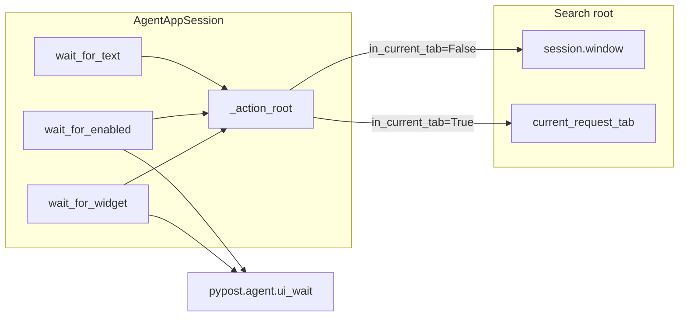
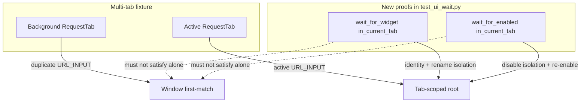

# PYPOST-979: Tab-scoped wait_for_widget / wait_for_enabled tests

## Research

### Parent debt and acceptance

- Closes [PYPOST-949/60-tech-debt.md](../PYPOST-949/60-tech-debt.md) TD-2:
  explicit multi-tab proofs for tab-scoped session `wait_for_widget` /
  `wait_for_enabled`.
- Jira: [PYPOST-979](https://pypost.atlassian.net/browse/PYPOST-979) —
  acceptance is a multi-tab fixture proving widget/enabled scoped to the
  active tab.
- Requirements: [10-requirements.md](10-requirements.md) (FR-1–FR-5,
  AC-1–AC-6). Labels: `agent`, `tech-debt`, `testing`. Priority: Low.
  Type: Debt. Estimate: 2 SP.

### Production contract (already shipped — no change expected)

| Piece | Observation |
| --- | --- |
| `AgentAppSession.wait_for_widget` / `wait_for_enabled` | Accept `in_current_tab: bool = False`; root via `_action_root` (`pypost/agent/lifecycle.py`) |
| Free functions | `wait_for_widget(root, …)` / `wait_for_enabled(root, …)` unchanged (`pypost/agent/ui_wait.py`) |
| Root routing | Same as UI actions (PYPOST-851) and text wait (PYPOST-949): window vs `current_request_tab()` |
| Docs | `doc/dev/ui_wait.md` already documents optional current-tab scoping for widget/enabled |



### Existing coverage vs gap

| Layer | What it proves | Gap for TD-2 |
| --- | --- | --- |
| Unit fixtures in `test_ui_wait.py` | Delayed create / enable on synthetic roots | Not multi-tab; not session `in_current_tab` |
| `test_session_wait_for_enabled_send_path` | Single-tab session enabled settle (window root) | No current-tab flag; no background duplicate |
| `test_session_wait_for_text_in_current_tab_after_multi_tab_send` | Multi-tab text wait: window times out, tab succeeds | Text only — widget/enabled unproven |
| `test_current_tab_scoped_fill` (`test_ui_actions.py`) | Action scoping under active tab | Actions, not waits |
| Session APIs for widget/enabled | Same `_action_root` as text | No explicit multi-tab regression lock |

### Multi-tab failure mode (why proofs differ from text)

Each `RequestTab` stamps the same role ids (`URL_INPUT`, `SEND_BUTTON`,
`RESPONSE_STATUS`, …). Window `findChild` returns the **first** match.

- **Text wait** (already covered): inactive tab keeps `"Status: -"` while
  active shows `"Status: 200"` after Send — window-scoped wait never sees
  200; tab-scoped succeeds.
- **Widget / enabled waits**: presence and enabled state are often true on
  **both** tabs, so a naive “wait succeeds” does not prove isolation.
  Proofs must show:
  1. Returned widget identity is under the **active** tab, and
  2. When the active tab alone fails the condition while a background
     duplicate satisfies it, tab-scoped waits **timeout** (background alone
     must not satisfy — AC-3).

### Fixture / harness inventory

| Piece | Role for this task |
| --- | --- |
| `agent_e2e_session` | Offscreen started session; host for multi-tab proofs |
| `session.window.tabs.add_new_tab(save_state=False)` | Second request tab (same pattern as text multi-tab test) |
| `session.current_request_tab()` | Active-tab root; identity for assertions |
| `find_widget(tab, URL_INPUT)` / `find_in_current_tab` | Resolve per-tab duplicates for compare / mutate |
| Module `pytestmark` | Already `[timeout(60), agent_e2e]` in `tests/test_ui_wait.py` |
| HTTP stub | **Not required** — widget/enabled proofs mutate local widgets |
| `make test` / `make test-agent-e2e` | Established agent / UI wait path |

### External note (Qt wait scoping)

Project waits use in-process poll + `processEvents`
(`pypost.agent.ui_wait`), not pytest-qt `qtbot.waitUntil`. Industry Qt test
guidance still applies: prefer widget methods over simulated clicks for
setup, keep waits bounded, and avoid relying on window-wide first-match for
per-tab role ids
([pytest-qt tutorial](https://github.com/pytest-dev/pytest-qt/blob/master/docs/tutorial.rst)).
This task locks that contract for widget/enabled session helpers.

### Decision

| Option | Verdict |
| --- | --- |
| Add focused multi-tab proofs in `tests/test_ui_wait.py` next to the text multi-tab test | **Chosen** — same gate, markers, session fixture |
| New test module | Rejected — NFR-3; file already owns session wait integration |
| Change production wait APIs | Rejected unless Step 3 unexpectedly fails (API gap) |
| Re-prove text waits | Rejected — owned by PYPOST-949 |
| Synthetic QWidget dual-root only | Rejected — acceptance wants request-tab multi-tab fixture |

## Implementation Plan

1. **Step 3** — Author multi-tab characterizing proofs in
   `tests/test_ui_wait.py` (see failing-repro section). Expected **green**
   against current production; no deliberate production break.
2. **Step 4** — Keep proofs green. Production changes only if an API gap
   surfaces. Touch `doc/dev/ui_wait.md` only if wording would be inaccurate
   after proofs exist (FR-5).
3. **Steps 5–8** — Minimal cleanup; observability N/A (NFR-4); tech-debt
   close-out for PYPOST-949 TD-2; doc accuracy if Step 4 deferred it.

**Mandatory — Failing Repro (next Step 3):**

**N/A — no behavioral change** for a classic red-before-green production fix:
session `wait_for_widget` / `wait_for_enabled` already route through
`_action_root(in_current_tab=…)`. This task adds **regression / contract
coverage** expected **green on first run**.

Step 3 still **writes** the automated proofs below (characterizing locks).
If a proof fails, treat it as a production or harness defect and fix in
Step 4 — not as an intentional missing-API red.

| Item | Detail |
| --- | --- |
| File | `tests/test_ui_wait.py` |
| Markers | Inherit module `pytestmark` (`timeout(60)`, `agent_e2e`) |
| Fixture | `agent_e2e_session` + `qapp` (match text multi-tab test) |
| Setup | Capture `first_tab`; `add_new_tab`; assert `second_tab is not first_tab` |
| Test A — widget | `test_session_wait_for_widget_in_current_tab_multi_tab` |
| Test B — enabled | `test_session_wait_for_enabled_in_current_tab_multi_tab` |

**Test A — `wait_for_widget` (FR-1, FR-3, AC-1, AC-3):**

1. Two request tabs; active = second.
2. Resolve `url_first = find_widget(first_tab, URL_INPUT)` and
   `url_active = find_widget(second_tab, URL_INPUT)`; assert distinct
   instances.
3. **Identity:** `w = session.wait_for_widget(URL_INPUT, in_current_tab=True,
   timeout=5.0)` → `w is url_active` (not `url_first`).
4. **Isolation:** Temporarily clear / rename `objectName` on active
   `URL_INPUT` only; `processEvents`.
   - `session.wait_for_widget(URL_INPUT, in_current_tab=True, timeout=0.5)`
     raises `UiWaitTimeoutError`.
   - Window-scoped `session.wait_for_widget(URL_INPUT, timeout=0.5)` still
     finds the background duplicate (proves background alone would satisfy
     unscoped wait).
5. Restore active `objectName` in `finally`.

**Test B — `wait_for_enabled` (FR-2, FR-3, AC-2, AC-3):**

1. Same two-tab setup; active = second.
2. `url_active.setEnabled(False)`; `processEvents`. Background URL stays
   enabled.
3. **Isolation:** `session.wait_for_enabled(URL_INPUT, in_current_tab=True,
   timeout=0.5)` raises `UiWaitTimeoutError` (must not latch onto background
   enabled duplicate).
4. **Success:** Re-enable active URL; `w = session.wait_for_enabled(URL_INPUT,
   in_current_tab=True, timeout=5.0)` → `w is url_active` and `w.isEnabled()`.
5. Restore enabled state in `finally`.

**Force failure without live external deps:** Local widget mutation only — no
HTTP stub, no network. Optional author-time sanity check (not left in suite):
monkeypatch `_action_root` to always return `session.window` — isolation
asserts must fail; confirms the proofs catch the TD-2 regression class.

**Sequencing:** research (done) → Step 3 write proofs → run focused
`tests/test_ui_wait.py` → if red unexpectedly, Step 4 fix production → else
Step 4 is proof retention / doc accuracy only.

## Architecture

### Test strategy (primary deliverable)



### Module responsibilities

| Module | Responsibility | Change expected |
| --- | --- | --- |
| `tests/test_ui_wait.py` | Host multi-tab widget/enabled proofs | **Yes** — add Test A / Test B |
| `pypost/agent/lifecycle.py` | Session waits + `_action_root` | **No** unless gap found |
| `pypost/agent/ui_wait.py` | Free-function poll helpers | **No** |
| `doc/dev/ui_wait.md` | Document tab-scoped waits | Only if wording inaccurate after proofs |
| Unrelated e2e / wait tests | Existing meaning | Unchanged (FR-4, AC-4) |

### Interfaces under test (unchanged)

```python
def wait_for_widget(
    self,
    widget_id: str,
    *,
    timeout: float = DEFAULT_UI_WAIT_TIMEOUT_S,
    in_current_tab: bool = False,
) -> QWidget: ...

def wait_for_enabled(
    self,
    widget_id: str,
    *,
    timeout: float = DEFAULT_UI_WAIT_TIMEOUT_S,
    in_current_tab: bool = False,
) -> QWidget: ...
```

Call sites under proof use `in_current_tab=True` and short timeouts for
negative isolation cases.

### Architectural patterns

- **Characterizing / regression lock** — prove existing contract; do not invent
  APIs.
- **Mirror sibling proof** — same multi-tab harness shape as
  `test_session_wait_for_text_in_current_tab_after_multi_tab_send`, adapted
  for presence/enabled (identity + active-tab-fails / background-satisfies).
- **Bounded waits** — short timeout for expected `UiWaitTimeoutError`; modest
  timeout for success; module `pytest.mark.timeout(60)`.
- **Local mutation over network** — disable / rename widgets instead of Send
  + HTTP stub (text wait needed stub; widget/enabled do not).

### Dependency rules

- No imports from `tests/` into production.
- Prefer session API with `in_current_tab=True` over free-function tab roots
  in the new proofs (matches harness-author surface).
- Do not weaken or rewrite existing text multi-tab or unit wait tests.

### Out of scope

- Wait redesign, new wait APIs, default `in_current_tab=False` changes.
- Expanding text-wait multi-tab coverage.
- Golden e2e migration (PYPOST-978) / timeout-diagnostics (PYPOST-950).
- Making `wait_for_snapshot` tab-scoped.
- New logs or metrics (NFR-4).

## Q&A

- **Q: Why N/A for classic failing repro?**
  **A:** Production already implements tab-scoped widget/enabled via
  `_action_root`. Step 3 adds expected-green characterizing proofs; a
  deliberate red-before-green production gap does not exist.
- **Q: Why not only assert returned widget parent = active tab?**
  **A:** Identity is necessary but insufficient for AC-3. Isolation (active
  fails, background would satisfy window scope) proves background duplicates
  alone do not satisfy tab-scoped waits.
- **Q: Why `URL_INPUT` instead of `RESPONSE_STATUS`?**
  **A:** Presence and enabled state are controllable without Send/HTTP;
  response labels always exist on both tabs, so presence isolation needs
  rename/clear of `objectName` anyway — URL input is the simplest mutable
  per-tab control.
- **Q: Why keep tests in `test_ui_wait.py`?**
  **A:** Same home as the PYPOST-949 text multi-tab proof and session wait
  integration cases; shared markers and fixtures.
- **Q: Must `doc/dev/ui_wait.md` change?**
  **A:** Only if current wording would be wrong after proofs land (FR-5).
  Docs already claim optional current-tab scoping for widget/enabled.
- **Q: Jira / commit in this step?**
  **A:** No — orchestrator owns later phases.
