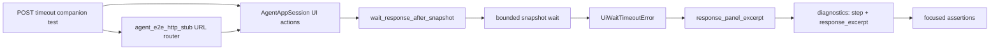

# PYPOST-982: Optional POST-path mapping settle timeout companion

## Research

The repository already contains the runtime and test-harness contracts needed
for this companion:

- `tests/test_agent_e2e_http_mapping_multi_url.py` owns the two-URL Mapping
  GUI flow. Its happy-path test already performs a POST Send and settles the
  response with `wait_response_after_snapshot`.
- `tests/helpers/agent_e2e_send_settle.py` owns snapshot-settle timeout
  wrapping. It preserves the original timeout details and adds the stable
  `step` plus a bounded `response_excerpt` produced from the response panel.
- `tests/helpers/agent_e2e_timeouts.py` owns the shared near-zero
  `FORCED_SETTLE_TIMEOUT_S` policy used by existing forced-timeout companions.
- `tests/test_agent_e2e_http.py` contains inventory checks that make important
  agent-e2e scenarios discoverable without launching the GUI.
- `doc/dev/agent_e2e_http.md` documents the Mapping multi-URL scenario and the
  existing GET diagnostic companion; its companion table and command examples
  are the developer-facing documentation surface updated in Step 8.

The test module has a module-level `pytest.mark.timeout(60)` and the helper
accepts an explicit bounded timeout. This follows the repository's per-test
timeout and bounded-wait policy. Pytest's marker API is also documented in the
[official pytest reference](https://docs.pytest.org/en/stable/reference/reference.html).

The existing GET companion demonstrates that the diagnostic wrapper is already
implemented. The requested change adds coverage for the existing POST contract;
it does not change application, request, mapping, or timeout behavior.

## Implementation Plan

1. Add one focused test to
   `tests/test_agent_e2e_http_mapping_multi_url.py`, adjacent to the existing
   GET companion. Use the existing POST resolved URL, canned POST response,
   `agent_e2e_http_stub`, UI controls, and `wait_response_after_snapshot`.
2. After the POST Send, pass an always-false readiness predicate and
   `FORCED_SETTLE_TIMEOUT_S` so the helper enters its intentional bounded
   timeout path. Do not alter the normal two-URL happy-path test.
3. Assert the raised `UiWaitTimeoutError.diagnostics` contains the exact
   `step` value `wait_response_after_mapping_post_send` and a non-empty string
   `response_excerpt`. Keep the existing happy-path POST status/body assertions
   as the independent compatibility proof.
4. Extend the existing inventory check in
   `tests/test_agent_e2e_http.py` so the POST companion remains discoverable.
   No helper API or production module should change.
5. Step 8 updates the Mapping multi-URL section of
   `doc/dev/agent_e2e_http.md` with the POST companion's role, exact step name,
   and Make-target invocation. This is developer documentation only and was not
   part of the Step 2 write.

### Mandatory — Failing Repro (next Step 3)

**N/A — no behavioral change.** The task is test-harness coverage for an
existing diagnostic path. The POST settle helper already wraps
`UiWaitTimeoutError` with `step` and `response_excerpt`, and the shared timeout
policy already exists. A Step 3 red test would not expose a missing production
behavior or guide a production fix; the new regression assertion can be added
and validated green in Step 4.

Step 4 should nevertheless preserve the red-test intent in the permanent
companion: an always-false predicate must raise the expected timeout, and the
test must fail if the POST step name or response excerpt is removed or changed.

## Architecture

### Module diagram



### Components and responsibilities

| Component | Responsibility | Change planned |
| --- | --- | --- |
| Mapping multi-URL test module | Drives POST Send and asserts diagnostics | Add one test |
| `agent_e2e_http_stub` fixture | Routes POST to a canned response without live I/O | Reuse |
| `AgentAppSession` | Performs bounded UI setup and Send interaction | Reuse |
| `wait_response_after_snapshot` | Owns settle, timeout rewrap, and diagnostic merge | Reuse |
| `FORCED_SETTLE_TIMEOUT_S` | Provides the shared near-zero forced-timeout budget | Reuse |
| `response_panel_excerpt` | Converts panel state into concise context | Reuse indirectly |
| HTTP test inventory | Verifies the companion is importable and callable | Extend one assertion |
| `doc/dev/agent_e2e_http.md` | Explains the scenario and its Make commands | Updated in Step 8 |
| Production request/mapping code | Application behavior and public workflow | No change |

### Interaction and ownership

1. The test creates the existing URL-router mapping with the resolved POST URL
   and canned successful POST result.
2. It fills the POST URL/body and clicks `SEND_BUTTON`, preserving the same
   user journey as the happy-path mapping test.
3. It calls `wait_response_after_snapshot` with `lambda _: False`, the exact
   `wait_response_after_mapping_post_send` step name, the mapping message
   prefix, and `FORCED_SETTLE_TIMEOUT_S`.
4. The settle helper delegates waiting to `AgentAppSession`, which owns the
   event-loop polling and deadline. The always-false predicate makes the
   timeout intentional and independent of response timing.
5. On timeout, the helper obtains a bounded excerpt from `RESPONSE_PANEL` and
   re-raises `UiWaitTimeoutError` with the stable diagnostic fields.
6. The test catches that exception and checks the exact step identifier and a
   string response excerpt. The separate happy-path test continues to assert
   the successful POST status and body.

Timeout ownership is deliberately layered:

- The test chooses the scenario budget through the shared
  `FORCED_SETTLE_TIMEOUT_S` constant.
- `wait_response_after_snapshot` owns propagation of `timeout_s` and
  `condition`, plus addition of `step` and `response_excerpt`.
- `AgentAppSession` owns the actual bounded wait and event processing.
- The module-level pytest timeout remains the final finite job boundary.
- No production timeout, network retry, or global timeout is changed.

### Interfaces and observable contract

The implementation uses these existing interfaces:

```python
wait_response_after_snapshot(
    session,
    ready,
    *,
    step,
    message_prefix,
    timeout=SEND_SETTLE_TIMEOUT_S,
)
```

The companion supplies:

- `ready=lambda _: False` to force the intended failure path;
- `step="wait_response_after_mapping_post_send"` as the stable lifecycle
  identifier;
- `timeout=FORCED_SETTLE_TIMEOUT_S` for a near-zero bounded budget; and
- the existing Mapping settle message prefix.

The observable assertion contract is:

```python
diagnostics = exc_info.value.diagnostics
assert diagnostics.get("step") == "wait_response_after_mapping_post_send"
assert isinstance(diagnostics.get("response_excerpt"), str)
assert diagnostics["response_excerpt"]
```

The excerpt assertion checks useful context is present without coupling the
failure proof to a particular intermediate panel rendering. The successful
POST test remains responsible for exact status/body compatibility assertions.

### Determinism and boundaries

- The URL router and canned POST result isolate the test from live network
  behavior.
- The forced predicate is deterministic; it cannot become true because a
  response happens to arrive quickly.
- The shared 0.05-second budget exercises the timeout wrapper while remaining
  finite and consistent with sibling companions.
- The response excerpt is capped by the existing helper, so diagnostic output
  cannot grow without bound.
- The test uses one POST Send in the companion. GET coverage and the normal
  two-Send GET/POST scenario retain independent value.
- The test module's explicit 60-second pytest timeout protects the full GUI
  fixture lifecycle in headless CI.
- No sleeps, live services, unbounded polling, production patches, or changes
  to the existing helper contract are introduced.

### Validation architecture

Step 4 validation should use Make targets only:

```text
make test-agent-e2e PYTEST_ARGS="tests/test_agent_e2e_http_mapping_multi_url.py -q"
make test-agent-e2e PYTEST_ARGS="tests/test_agent_e2e_http_mapping_multi_url.py::\
test_mapping_post_send_settle_timeout_includes_step_and_excerpt -q"
make test PYTEST_ARGS="tests/test_agent_e2e_http.py::\
test_mapping_multi_url_settle_timeout_companion_exists -q"
make lint
make typecheck
make verify-ai-tasks
make check WORKERS=4
```

The focused run must cover both the existing successful POST flow and the new
forced timeout assertions. The final quality gate must record any unrelated
pre-existing failures separately from this task's result.

## Q&A

- **Why add the test to the existing Mapping module?** It preserves the
  established business context, fixtures, UI setup, and GET/POST naming while
  keeping the change localized.
- **Why not change the settle helper?** The helper already exposes the required
  timeout parameter and diagnostic fields; changing it would expand scope and
  risk sibling golden/dialog coverage.
- **Who owns the forced timeout?** The test selects the shared scenario budget;
  the session enforces the deadline; the helper owns diagnostic rewrapping.
- **Why is Step 3 N/A?** This task adds regression coverage for existing
  behavior and changes no production/runtime behavior, so there is no missing
  implementation for a red repro to demonstrate.
- **What documentation changes were needed?** The existing developer E2E
  reference received the small Step 8 update; no user-facing documentation is
  required.
- **What remains independent?** The happy-path POST response, GET timeout
  companion, and golden Send diagnostic companion keep their existing tests and
  acceptance meaning.
