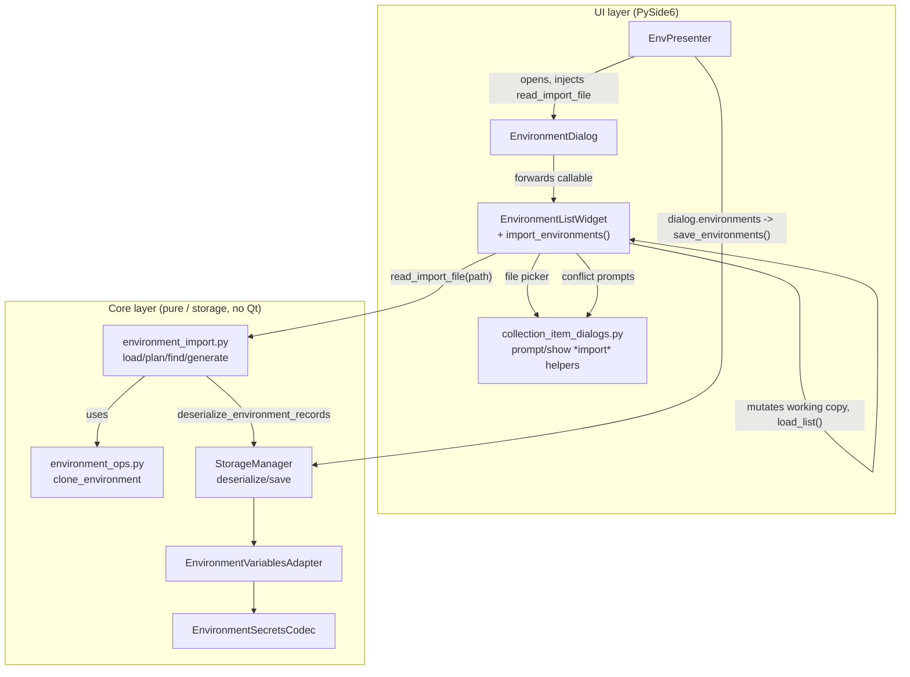

# PYPOST-986: Import environments

## Research

### Environment model (`pypost/models/models.py:57-62`)

`Environment` is a Pydantic `BaseModel` (not a dataclass):

```python
class Environment(BaseModel):
    id: str = Field(default_factory=lambda: str(uuid.uuid4()))
    name: str = "New Environment"
    variables: Dict[str, str] = Field(default_factory=dict)
    hidden_keys: Set[str] = Field(default_factory=set)
    enable_mcp: bool = False
```

- `id` is a UUID4 identity, distinct from `name`. It is used to key encryption-envelope
  reuse (`environment_variables_adapter.py`) and `settings.last_environment_id`
  (`env_presenter.py:213,321,336`) — the "currently selected environment" link.
- `variables` holds decrypted plaintext strings once in memory; only the on-disk JSON may
  contain an encrypted-envelope dict per hidden key.
- `hidden_keys` is a companion set of variable *names* — there is no per-variable wrapper
  object.
- No timestamps exist on the model.
- Pure helpers live in `pypost/core/environment_ops.py`, not on the model:
  `clone_environments` (deep copy for dialog editing, lines 41-43) and `clone_environment`
  (build a copy with a new name + new id, lines 46-56) — the latter is the exact template
  already used by the "Copy" action and directly reusable for the "keep both" import
  conflict outcome.

### Storage layer (`pypost/core/storage.py`, `pypost/core/storage_interface.py`)

- On disk: a **single JSON file**, `<data_dir>/environments.json`, holding a JSON **list**
  of environment records (`storage.py:53-54`). There is no per-environment file (unlike
  collections, which are one file per id under `collections/`).
- `StorageManager` has **no** `add_environment`/`update`/`delete`/`rename`/`copy` method.
  All list mutation (add, rename, copy, delete — and, per this design, import) happens
  **in memory** on `list[Environment]` in the UI layer; the *entire* list is re-serialized
  and written via `save_environments()` on every change.
- Atomicity is already solved and reusable as-is (`pypost/core/storage.py:181-195`):

```python
        tmp_file = self.environments_file.with_suffix(".json.tmp")
        with open(tmp_file, "w") as f:
            json.dump(data, f, indent=2)
        try:
            os.replace(tmp_file, self.environments_file)
        except OSError as e:
            logger.error(...)
            if tmp_file.exists():
                tmp_file.unlink(missing_ok=True)
            raise
```

  Write-to-temp then `os.replace()` (atomic on POSIX/Windows); failure leaves
  `environments.json` untouched. Because import — like Add/Rename/Copy/Delete — only
  mutates the `EnvironmentDialog`'s in-memory working copy, and a single
  `save_environments()` call happens once when the dialog closes
  (`env_presenter.py:452-453`), **the "all-or-nothing on disk" non-functional requirement
  is inherited for free**: nothing on disk changes until the whole edited list is written
  atomically in one shot.
- `deserialize_environment_records(records: list[dict]) -> (list[Environment],
  tuple[EnvironmentLoadFailure, ...])` (`storage.py:243-294`) is the reusable, per-record
  fault-isolating parser: each dict is decoded independently; a decrypt or validation
  failure on one record produces an `EnvironmentLoadFailure(name, environment_id, reason)`
  and the loop continues — it does not abort the batch. This is **exactly** the semantics
  the DoD requires for import ("a single undecryptable entry must not block the rest of
  the file") and will be reused unchanged to parse an imported file's JSON list.
- `load_environments_with_errors()` (`storage.py:316-...`) is the load-time analogue;
  confirms this "continue past failures" pattern is an established idiom, not a one-off.
- `StorageInterface` (`storage_interface.py:16-56`) is the `Protocol` the presenter/tests
  depend on; `environments_file: Path` and `deserialize_environment_records(...)` are
  already part of its public surface, so no interface change is required to reuse them for
  import.

### Environment dialog / UI

- `pypost/ui/dialogs/env_dialog.py` — `EnvironmentDialog(QDialog)`: on construction it
  **deep-clones** the caller's environments via `clone_environments` (line 27) into
  `self._environments`, and exposes them back via the `environments` property. There is
  **no `QDialogButtonBox` / OK / Cancel** — every edit (Add, Rename, Copy, Delete) commits
  directly into the clone as it happens; whatever the clone looks like when the dialog is
  closed (by any means) is what the presenter applies. Import must follow this same
  "always-commit-to-the-clone" convention — no separate Cancel semantics to invent.
- `EnvPresenter._open_env_manager()` (`env_presenter.py:438-458`) is the integration point:
  opens `EnvironmentDialog`, and after `exec()` returns, unconditionally takes
  `dialog.environments`, calls `_save_environments()` (which dispatches to
  `StorageManager.save_environments()`, sync or async depending on
  `resolve_encryption_enabled`), then reloads. Triggered from the top-bar **Manage** button
  (`ENV_MANAGE_BUTTON`, lines 101-103) and the `Ctrl+E` shortcut
  (`handle_open_environments`, lines 302-304).
- `pypost/ui/widgets/environments/environment_list_widget.py` — `EnvironmentListWidget`:
  - **Add** (`add_environment`, lines 106-120): `QInputDialog.getText`, appends a bare
    `Environment(name=name)`.
  - **Copy** (`_duplicate_environment_at_row`, lines 213-246): prompts with
    `format_copy_of_name(source.name)` = `"Copy of {name}"`
    (`pypost/core/environment_messages.py:32,43-44`) pre-filled in a
    `QInputDialog.getText` loop, re-prompting on empty/duplicate name via
    `show_copy_environment_empty_name_error` / `show_copy_environment_duplicate_name_error`,
    then `clone_environment(source, stripped)` and `self.environments.insert(row + 1, ...)`.
    This is the literal precedent the requirements Q&A points to for "keep both" naming.
  - **Delete** (`delete_environment`, lines 122-134): `confirm_delete_environment(self,
    name)` (`QMessageBox.question` Yes/No, `collection_item_dialogs.py:94-102`) before
    removing.
  - **Wiring**: Add is a `QPushButton` next to the list (lines 82-86); Rename/Copy/Delete
    are also exposed via a right-click `QMenu` (`_on_env_list_context_menu`, lines
    136-151). This is the "environment list actions" area the DoD requires the Import
    action to sit alongside.
  - **Dependency injection precedent**: the widget already takes plain callables in its
    constructor for behavior it does not own directly —
    `get_current_env_name`/`set_current_env_name` (lines 52-53) let the widget read/write
    the presenter's notion of "current environment" without holding a presenter reference.
    This is the pattern import will reuse to reach storage-backed file parsing without
    giving the widget a `StorageInterface` dependency.
  - All confirm/warn/info dialogs for environments are centralized as thin `QMessageBox`
    wrapper functions in `pypost/ui/collection_item_dialogs.py` (`confirm_*` returns
    `bool`, `show_*` returns `None`), e.g. `confirm_delete_environment`,
    `show_copy_environment_duplicate_name_error`, `show_env_save_failed`,
    `confirm_re_encrypt_environments`, `show_migration_result`. New import dialogs must be
    added here, following the same naming and signature conventions.

### Encryption codec (`pypost/core/environment_secrets_codec.py`, `encryption_config.py`)

- `EnvironmentSecretsCodec(key_provider: KeyProvider)` — `encrypt`/`encrypt_v2` produce
  `EncryptedValueEnvelope` / `EncryptedValueEnvelopeV2`; `decrypt(payload: dict) -> str`
  dispatches on envelope version via `EncryptedValueEnvelope.from_payload` (lines 118-133).
- **Encrypted-value marker convention**: a dict with `"enc": True` (plus `"v"`, `"alg"`,
  `"kid"`, `"ct"`, optionally `"iv"`/`"tag"`/`"meta"`). The check used everywhere is
  `isinstance(value, dict) and value.get("enc") is True`
  (`environment_variables_adapter.py:202`, `encryption_migration.py:143`) — the same test
  an import parser implicitly relies on via `deserialize_environment_records`, since that
  is where the check already happens per-variable.
- **Current encryption setting of the installation** is not on the codec; it is resolved
  from `AppSettings` via `resolve_encryption_enabled(settings)`
  (`encryption_config.py:27-30`) and applied to storage via
  `StorageManager.apply_encryption_settings(settings)` →
  `EnvironmentVariablesAdapter.apply_encryption_settings`
  (`environment_variables_adapter.py:44-63`), which rebuilds the codec's `KeyProvider`
  chain. This is already invoked once at startup
  (`pypost/main.py:108`, `pypost/ui/main_window.py:87,381`) and again whenever encryption
  settings change — so by the time a user opens "Manage Environments" and imports a file,
  `storage`'s adapter is already configured with the *current* local encryption policy; no
  extra wiring is needed for import to "respect the local installation's current
  encryption setting."
- **Decrypt failure**: `EnvironmentEncryptionError` (from `pypost/core/key_provider.py`).
  `EnvironmentVariablesAdapter._decode_variable_value`
  (`environment_variables_adapter.py:199-221`) wraps it with
  `f"Failed to decrypt environment variable '{key}': {exc}"`; caught per-record inside
  `deserialize_environment_records`, producing an `EnvironmentLoadFailure` instead of
  aborting the batch — this already implements the Q&A's "encrypted by a different
  installation" behavior (specific, named failure; other environments still import).
- **Re-encryption on save is automatic and value-driven, not import-driven**:
  `serialize_environment` (`environment_variables_adapter.py:78-145`) re-encrypts every
  variable whose name is in `hidden_keys` according to the *current* encryption setting,
  regardless of whether the plaintext came from manual entry or from an import. So once an
  imported `Environment` (plaintext in memory, `hidden_keys` preserved) is added to the
  working list and the dialog closes, the existing `_save_environments()` →
  `save_environments()` path already guarantees "Hidden stays Hidden, encrypted exactly per
  current local setting" — **no new encryption logic is needed for this task**, only
  correct propagation of `hidden_keys` from the imported record through to the final
  `Environment` object.

### Existing import patterns

**There is no existing import/export or file-picker code anywhere in the codebase.**
`QFileDialog`, `getOpenFileName`, `getSaveFileName`, `import_*`, `from_file`,
`load_from_file` — zero hits in `pypost/`. This will be the first file-picker feature in
the app; there is no in-house Qt file-dialog helper to extend.

The closest architectural precedent for the *processing* shape (bulk operation over
`environments.json`, backup, per-item fault isolation, human-readable report, `QMessageBox`
result dialog) is the **encryption migration subsystem**:

- `pypost/core/encryption_migration.py` — `EncryptionMigrationService`, `MigrationReport`
  (dataclass: `inventory`, `dry_run`, `backup_path`, `errors: tuple[str, ...]`, `success`,
  `reencrypt_stats`), `format_migration_report(report) -> str`, `backup_environments_file`
  (lines 133-139, timestamped copy before a bulk rewrite).
- UI trigger pattern: `pypost/ui/widgets/settings/encryption_migration_section.py` — button
  → confirm dialog (`confirm_re_encrypt_environments` /
  `confirm_encrypt_plaintext_hidden`) → `QThread` worker → `show_migration_result(parent,
  title, body, success=...)` (`collection_item_dialogs.py:185-189`).

This `Report`-dataclass-plus-`format_*`-function-plus-`show_*_result` triad is the direct
template for the import feature's summary dialog (counts added / updated / skipped /
renamed / errors).

No existing "3-way conflict" dialog exists; the closest building blocks are the Copy
action's inline disambiguation loop (`_duplicate_environment_at_row`) and
`validate_environment_rename`'s duplicate-name rejection
(`pypost/core/environment_ops.py:17-38`). The actual overwrite/keep-both/skip prompt (with
an "apply to all remaining conflicts" convenience, per the requirements Q&A) is new UI, but
it can be built as a `QMessageBox` with custom buttons and `setCheckBox(...)` — the same
"custom `QMessageBox` with `addButton(..., role)`" style already used in
`prompt_dirty_sibling_tab_reload` (`collection_item_dialogs.py:60-74`) — no new `QDialog`
subclass is required.

### Related infra

- GUI framework: **PySide6** (`pyproject.toml`). No PyQt5/6, no Tkinter.
- User feedback: no toast/status-bar helper; all feedback goes through `QMessageBox`
  wrapper functions in `pypost/ui/collection_item_dialogs.py`.
- Logging: `logger = logging.getLogger(__name__)` per module; structured `key=value`
  strings with `*_started` / `*_completed` (with counts) / `*_failed` naming, e.g.
  `save_environments_completed count=%d encrypted_count=%d reused_count=%d file=%s`
  (`storage.py:196-202`), `environment_copied source_name=%s new_name=%s`
  (`environment_list_widget.py:238-242`). Import should mirror this:
  `environment_import_started`, `environment_import_completed
  added_count=... updated_count=... skipped_count=... error_count=...`,
  `environment_import_file_invalid reason=...`.
- Widget identity constants for automated UI tests live in `pypost/ui/widget_ids.py`
  (`ENV_MANAGE_BUTTON`, etc.) — a new `ENV_IMPORT_BUTTON` id should be added there
  following the same convention if a dedicated button is introduced.
- Tests: `tests/test_env_dialog.py` (Qt-level `EnvironmentDialog` tests, `qapp` fixture,
  `pytestmark = pytest.mark.timeout(60)`, `@patch(...)` on dialog-helper call sites,
  `try/finally: dlg.close()`); `tests/test_environment_ops.py`,
  `tests/test_environment_messages.py`, `tests/test_environment_secrets_codec.py`,
  `tests/test_environment_variables_adapter.py` (pure-logic, no Qt);
  `tests/helpers/__init__.py::FakeStorageManager` (hand-written fake implementing the full
  `StorageInterface`, tracks `saved_environments`) is the fixture to extend for
  import-flow tests. No `test_environment_import*.py` exists yet.

### External library reference (PySide6 `QFileDialog` / `QMessageBox`)

This is the app's first file-picker feature, so the two Qt APIs it introduces new usage of
were looked up against the official Qt for Python 6 docs rather than assumed:

- `QFileDialog.getOpenFileName(parent=None, caption="", dir="", filter="", selectedFilter="",
  options=QFileDialog.Options())`
  (<https://doc.qt.io/qtforpython-6/PySide6/QtWidgets/QFileDialog.html>) — the PySide6
  binding returns a **2-tuple** `(fileName, selectedFilter)`, unlike the C++ signature's
  single `QString` return. `prompt_import_environments_file` must unwrap
  `path_str, _ = QFileDialog.getOpenFileName(...)` and treat an empty `path_str` (Cancel
  pressed) as the `None` case in its `Path | None` return type.
- `QMessageBox.setCheckBox(cb: QCheckBox) -> None` / `checkBox() -> QCheckBox | None`
  (<https://doc.qt.io/qtforpython-6/PySide6/QtWidgets/QMessageBox.html>) — confirms the
  "apply to all remaining conflicts" checkbox needs no `QDialog` subclass: `setCheckBox`
  takes ownership of a plain `QCheckBox` instance, and `checkBox().isChecked()` after
  `exec()` returns is enough to read it back, exactly as assumed in the Q&A below.

Both APIs are already available via the existing `PySide6` dependency (no new package), so
this lookup is scoped to confirming exact call shape and the PySide6-specific tuple-return
quirk above, not to evaluating alternative libraries.

## Implementation Plan

1. **Pure core module** `pypost/core/environment_import.py` (no Qt, fully unit-testable):
   - `EnvironmentImportFileError(Exception)` — raised for file-level problems (unreadable
     file, invalid JSON, JSON root is neither a list nor an object).
   - `ImportConflictDecision(str, Enum)` — `OVERWRITE`, `KEEP_BOTH`, `SKIP`.
   - `ImportPlanResult` (frozen dataclass) — `environments: list[Environment]` (the full
     target list to hand to the dialog's working copy), `added: list[str]`,
     `updated: list[str]`, `skipped: list[str]`, `renamed: dict[str, str]` (original
     imported name → disambiguated new name), `parse_errors: list[str]` (formatted
     `EnvironmentLoadFailure` messages, name-prefixed).
   - `load_import_candidates(path, storage) -> tuple[list[Environment], list[str]]`
     — reads and JSON-decodes `path`; normalizes a single top-level object into a
     one-item list (a hand-shared single environment is a realistic input per the
     requirements); raises `EnvironmentImportFileError` on read/parse/shape errors;
     delegates to `storage.deserialize_environment_records(records)` and converts
     `EnvironmentLoadFailure` entries into formatted strings.
   - `find_conflicts(existing: list[Environment], incoming: list[Environment]) -> list[str]`
     — names present in both, incoming order, de-duplicated.
   - `generate_import_copy_name(name: str, existing_names: set[str]) -> str` — `"Copy of
     {name}"` via `format_copy_of_name`, then `"Copy of {name} (2)"`, `"(3)"`, ... until
     unique (extends the existing Copy-action naming convention to the no-prompt,
     auto-disambiguation case import needs).
   - `plan_import(existing, incoming, decisions) -> ImportPlanResult`
     — pure function: for each incoming environment, if its name has no conflict it is
     appended as-is (new id already assigned by its own parsing); if conflicted, apply
     `decisions[name]`:
     - `OVERWRITE`: replace the existing environment **in place** (same list position,
       **same existing `id`**) with the incoming `variables`/`hidden_keys`/`enable_mcp`,
       preserving identity so `settings.last_environment_id` / current selection continuity
       is not silently broken.
     - `KEEP_BOTH`: rebuild via `clone_environment(incoming_env,
       generate_import_copy_name(name, existing_names))` (fresh id), appended.
     - `SKIP`: dropped; existing environment untouched.
     - **Duplicate names within `incoming` itself** (the file contains two entries sharing
       a name, unrelated to any existing environment): processed strictly in file order.
       The first occurrence of a name is the one checked against `existing`/`decisions` as
       above; every later occurrence of that same name is unconditionally treated like a
       Keep-Both outcome — renamed via `generate_import_copy_name` against the growing
       result list's current names — with no prompt and no `decisions` entry, since
       neither duplicate is an environment the user already had a reason to protect.
   - `format_import_result(result: ImportPlanResult) -> str` — pure formatter, mirroring
     `format_migration_report`: renders counts (added/updated/skipped/renamed) plus one line
     per `parse_errors` entry into the human-readable summary text `show_import_result`
     displays; the single place that turns a plan into user-facing text.
2. **UI dialogs** — new functions added to `pypost/ui/collection_item_dialogs.py`
   (following existing `confirm_*`/`show_*` conventions), backed by new strings in
   `pypost/core/environment_messages.py`:
   - `prompt_import_environments_file(parent) -> Path | None` — wraps
     `QFileDialog.getOpenFileName(parent, ..., filter="JSON Files (*.json);;All Files
     (*)")`.
   - `show_import_invalid_file_error(parent, message: str) -> None`.
   - `prompt_import_conflict(parent, name, *, remaining_count)`
     `-> tuple[ImportConflictDecision, bool]`
     — a `QMessageBox` with three custom buttons (Overwrite / Keep Both / Skip) plus a
     `setCheckBox(...)` "Apply to all remaining conflicts" checkbox; returns the chosen
     decision and whether it should apply to all further conflicts in this import.
   - `show_import_result(parent, summary_text: str, *, success: bool) -> None` — mirrors
     `show_migration_result`.
3. **Wiring into `EnvironmentListWidget`** (`environment_list_widget.py`):
   - New constructor parameter `read_import_file: Callable[[Path],
     tuple[list[Environment], list[str]]] | None = None` (same style as the existing
     `get_current_env_name`/`set_current_env_name` callables) so the widget never depends
     on `StorageInterface` directly.
   - New `BUTTON_IMPORT = "Import…"` button placed beside `Add` (discoverable without
     requiring a row selection, unlike Rename/Copy/Delete).
   - New `import_environments()` method: file dialog → `read_import_file(path)` (catches
     `EnvironmentImportFileError` → `show_import_invalid_file_error` and returns, no
     mutation) → **zero-candidates check**: if the returned `candidates` list is empty
     (every entry failed to parse, or the file decoded to an empty list), call
     `show_import_invalid_file_error` with a "No valid environments found in this file"
     message that also lists any `parse_errors`, and return without touching
     `self.environments` or calling `load_list()` — a hard decode failure and a batch that
     decoded but yielded nothing usable get the identical "nothing changed" treatment →
     otherwise → `find_conflicts` → loop prompting `prompt_import_conflict` per conflicting
     name (skipping the prompt once "apply to all" was chosen) → `plan_import` → replace
     `self.environments` contents in place → `self.load_list()` → log
     `environment_import_completed ...` → `format_import_result(plan_result)` →
     `show_import_result(parent, summary_text, success=...)`.
   - **Partial-parse UI flow** (both `candidates` and `parse_errors` are non-empty): the
     valid candidates still go through the normal conflict/plan/apply path above and are
     imported; `format_import_result` renders one combined summary that lists what was
     added/updated/renamed/skipped *and* which named entries failed to parse and why, so
     the user sees a single result dialog covering both outcomes instead of two separate
     prompts. `success` is `True` whenever at least one environment was added, updated, or
     kept via a conflict decision, even if `parse_errors` is non-empty (a partial success
     is still a success); it is only `False` when nothing changed at all, which the
     zero-candidates path above already routes to the invalid-file dialog instead.
4. **Wiring into `EnvironmentDialog`** (`env_dialog.py`): accept and forward
   `read_import_file` to `EnvironmentListWidget`, same pattern as existing
   pass-throughs.
5. **Wiring into `EnvPresenter._open_env_manager`** (`env_presenter.py`): build
   `read_import_file = lambda path: load_import_candidates(path, self._storage)` and pass
   it into `EnvironmentDialog(...)`. No presenter-level save-path changes: the existing
   post-`exec()` `self._environments = dialog.environments; self._save_environments()`
   already persists whatever the dialog (now including import) produced, atomically, via
   the unchanged `save_environments()`.
6. **`pypost/ui/widget_ids.py`**: add `ENV_IMPORT_BUTTON` alongside `ENV_MANAGE_BUTTON` for
   automated UI test/agent addressability (this widget is nested inside the dialog, not the
   top bar, but the same stable-id convention applies).
7. **Docs** (Step 8, not this step): `doc/user/environments.md` gets a new "Import
   environments" section describing the action, expected file shape, and the
   overwrite/keep-both/skip conflict choice.

**Mandatory — Failing Repro (next Step 3):** The behavioral surface introduced by this task
is entirely new code (no existing behavior regresses), so Step 3's red test targets the
**new pure-logic module described above, before it exists**, which is the standard
"write the test against the not-yet-created module" form of TDD red state for a new
feature:

- **Where**: new file `tests/test_environment_import.py` (pure-logic, no Qt — follows the
  convention of `tests/test_environment_ops.py`), importing from
  `pypost.core.environment_import` (module does not exist yet ⇒ collection fails with
  `ModuleNotFoundError` ⇒ red, without needing any live external dependency).
- **What it asserts** (desired behavior, written against the interfaces above):
  - `load_import_candidates` on a valid JSON file containing a list of two environment
    dicts returns both as `Environment` instances with `parse_errors == []` (happy path).
  - `load_import_candidates` on a single top-level JSON object (not a list) normalizes it
    to a one-item result (single-environment file convenience).
  - `load_import_candidates` on a non-JSON / malformed file raises
    `EnvironmentImportFileError` and touches nothing else.
  - `load_import_candidates` on a file with one entry holding an encrypted-envelope hidden
    value that cannot be decrypted with a test `StorageManager`'s current key (built via
    `tests/helpers` fakes / a real `StorageManager` pointed at a temp dir with a mismatched
    key) returns the *other* valid entries plus one formatted `parse_errors` line naming
    the failed environment — the rest of the file must not be blocked.
  - `find_conflicts` returns the intersection of names between an existing list and an
    incoming list, in incoming order, without duplicates.
  - `generate_import_copy_name` returns `"Copy of X"` when free, and `"Copy of X (2)"` when
    `"Copy of X"` itself is already taken.
  - `plan_import` with `OVERWRITE` for a conflicting name preserves the **existing
    environment's `id`** and list position while adopting the incoming variables/
    hidden_keys/enable_mcp.
  - `plan_import` with `KEEP_BOTH` appends a renamed copy (fresh id) and leaves the
    existing conflicting environment fully untouched; `renamed` maps the original imported
    name to the new disambiguated name.
  - `plan_import` with `SKIP` leaves `environments` identical to `existing` for that name
    and records it in `skipped`.
  - A non-conflicting incoming name is always added, regardless of any `decisions` entry
    for other names.
- **Forcing the failure without live external deps**: all fixtures are in-memory /
  temp-directory JSON files and a `StorageManager` instantiated with `data_dir=tmp_path`
  (existing pattern in other storage tests) — no network, no real app data directory, no
  running Qt event loop required for this red test.
- **Sequencing**: Research (this document, done) → write the failing
  `tests/test_environment_import.py` against the interfaces specified above (red, since
  `pypost/core/environment_import.py` does not exist) → Step 4 implements
  `pypost/core/environment_import.py` (and, iteratively, the dialog/widget/presenter wiring
  with its own Qt-level tests in `tests/test_env_dialog.py` /
  a new `tests/test_environment_list_widget.py`) until green.

## Architecture

### Component diagram



### Components and responsibilities

| Component | Responsibility | Status |
|---|---|---|
| `environment_import.py` | Parse, detect conflicts, name, plan, `format_import_result`. | New |
| `collection_item_dialogs.py` (additions) | File picker + conflict + result boxes. | Extended |
| `environment_messages.py` (additions) | User-visible strings/titles for the above. | Extended |
| `EnvironmentListWidget` | Orchestrates: pick → parse → prompts → apply → refresh. | Extended |
| `EnvironmentDialog` | Forwards `read_import_file`; owns working-copy edits. | Extended |
| `EnvPresenter` | Supplies `read_import_file` bound to storage; save path unchanged. | Extended |
| `StorageManager.deserialize_environment_records` | Per-record decrypt/validate. | Reused |
| `StorageManager.save_environments` | Atomic temp-then-rename write of whole list. | Reused |
| `EnvironmentVariablesAdapter` / `Codec` | Decrypt on parse, re-encrypt on next save. | Reused |

### Dependencies

- `environment_import.py` depends on `pypost.models.models.Environment`,
  `pypost.core.storage_interface.StorageInterface` (for the `deserialize_environment_records`
  call signature — accepts the real `StorageManager` or `FakeStorageManager` in tests),
  `pypost.core.environment_ops.clone_environment`, and
  `pypost.core.environment_messages.format_copy_of_name`. It has **no** dependency on Qt,
  keeping it directly unit-testable per `.cursor/lsr/do-python.md`'s emphasis on plain,
  explicit modules.
- `EnvironmentListWidget` depends on `environment_import.py` only through the injected
  `read_import_file` callable (dependency inversion — the widget's existing
  `get_current_env_name`/`set_current_env_name` callables already establish this pattern
  in the same class) and on the new `collection_item_dialogs.py` functions directly (same
  as its existing direct imports of `confirm_delete_environment` etc.).
- `EnvPresenter` is the only component that wires `environment_import.py` to a concrete
  `StorageInterface` instance, keeping the storage dependency at the same layer where
  `_save_environments()` already lives.
- No new third-party dependency is introduced; `QFileDialog` is part of the already-used
  `PySide6.QtWidgets`.

### Patterns

- **Pure core / impure shell**: mirrors the existing split between
  `environment_ops.py` (pure) and `environment_list_widget.py` (Qt shell) — the new
  `environment_import.py` keeps all decision logic (conflict detection, naming, plan
  building) testable without a `QApplication`, while Qt-only concerns (file dialog,
  conflict prompt, result box) stay in `collection_item_dialogs.py` /
  `environment_list_widget.py`.
- **Constructor-injected callables (dependency inversion)**: reuses the exact style already
  present in `EnvironmentListWidget.__init__` (`get_current_env_name`,
  `set_current_env_name`) instead of introducing a new interface/protocol type, for
  `read_import_file`.
- **Fault-isolated batch processing**: reuses `deserialize_environment_records`'s
  "continue past per-item failure, collect structured failures" idiom, already established
  by `load_environments_with_errors` and the encryption migration service — no new failure
  isolation mechanism is invented.
- **Atomic whole-list rewrite**: reuses `save_environments()`'s write-temp-then-`os.replace`
  idiom unchanged; import never writes to disk directly.
- **Report dataclass + `format_*` + `show_*_result`**: mirrors `MigrationReport` /
  `format_migration_report` / `show_migration_result` from
  `encryption_migration.py` / `collection_item_dialogs.py`, applied to
  `ImportPlanResult` for the import summary dialog.
- **Identity-preserving overwrite**: extends the identity-stability principle already
  implicit in Rename (`apply_environment_rename` mutates `env.name` in place, keeping
  `id`) to the new Overwrite conflict outcome, so `settings.last_environment_id` /
  selection continuity is not broken by an import.
- **Copy-name disambiguation, generalized to no-prompt use**: extends
  `format_copy_of_name` (used interactively by Copy) into a pure, auto-incrementing
  `generate_import_copy_name` for the Keep Both outcome, which cannot prompt per name
  during a possibly-multi-entry import without becoming tedious for the user.

### Interfaces

```python
# pypost/core/environment_import.py

class EnvironmentImportFileError(Exception):
    """Raised for unreadable, malformed, or wrong-shaped import files."""

class ImportConflictDecision(str, Enum):
    OVERWRITE = "overwrite"
    KEEP_BOTH = "keep_both"
    SKIP = "skip"

@dataclass(frozen=True)
class ImportPlanResult:
    environments: list[Environment]
    added: list[str]
    updated: list[str]
    skipped: list[str]
    renamed: dict[str, str]
    parse_errors: list[str]

def load_import_candidates(
    path: Path, storage: StorageInterface
) -> tuple[list[Environment], list[str]]: ...

def find_conflicts(
    existing: list[Environment], incoming: list[Environment]
) -> list[str]: ...

def generate_import_copy_name(name: str, existing_names: set[str]) -> str: ...

def plan_import(
    existing: list[Environment],
    incoming: list[Environment],
    decisions: dict[str, ImportConflictDecision],
) -> ImportPlanResult: ...

def format_import_result(result: ImportPlanResult) -> str: ...
```

```python
# pypost/ui/collection_item_dialogs.py (additions)

def prompt_import_environments_file(parent: QWidget) -> Path | None: ...

def show_import_invalid_file_error(parent: QWidget, message: str) -> None: ...

def prompt_import_conflict(
    parent: QWidget, name: str, *, remaining_count: int
) -> tuple[ImportConflictDecision, bool]: ...

def show_import_result(parent: QWidget, summary_text: str, *, success: bool) -> None: ...
```

```python
# pypost/ui/widgets/environments/environment_list_widget.py (additions)

def __init__(
    self,
    environments: List[Environment],
    parent: QWidget | None = None,
    *,
    current_env_name: str | None = None,
    get_current_env_name: Callable[[], str | None] | None = None,
    set_current_env_name: Callable[[str | None], None] | None = None,
    read_import_file: Callable[[Path], tuple[list[Environment], list[str]]] | None = None,
) -> None: ...

def import_environments(self) -> None: ...
```

## Q&A

**Q:** Should Overwrite replace the existing environment's `id`, or preserve it?

**A:** Preserve the existing environment's `id` (and list position) and adopt the
incoming record's `variables`/`hidden_keys`/`enable_mcp`. Rationale: `id` — not `name` — is
the identity used by `settings.last_environment_id`
(`pypost/ui/presenters/env_presenter.py:213,321,336`) and by the encryption-envelope reuse
cache (`EnvironmentVariablesAdapter._persisted_variables`, keyed by `env.id`). Assigning a
new id on overwrite would silently drop the "currently selected environment" link and
discard reuse-cache locality for no benefit; the existing Rename action already preserves
`id` across a name change, so preserving it across a content overwrite is the consistent
choice.

**Q:** Does import need any new encryption/decryption code?

**A:** No. `deserialize_environment_records` (reused as-is) already decrypts hidden values
per the *current* local encryption settings (applied once at startup,
`pypost/main.py:108`) and reports an undecryptable value as a structured
`EnvironmentLoadFailure` instead of raising — satisfying the Q&A in the requirements
verbatim. On the next `save_environments()` (also reused as-is, triggered by the existing
post-dialog `_save_environments()` call), every hidden value — imported or hand-entered —
is re-serialized per the current encryption policy. Import only needs to carry
`hidden_keys` through correctly; it does not need to reason about ciphertext at all.

**Q:** Where does file-level parsing belong — in the Qt widget or in core?

**A:** Core (`environment_import.py::load_import_candidates`), injected into the widget as
a callable built by the presenter. This keeps `EnvironmentListWidget` free of a
`StorageInterface` dependency (it already avoids depending on the presenter directly,
via the `get_current_env_name`/`set_current_env_name` callables) and keeps the new parsing
logic directly unit-testable without a `QApplication`.

**Q:** Should a single top-level JSON object (one environment, not wrapped in a list) be
accepted, in addition to a list?

**A:** Yes. Requirements note the import format must be realistic given there is no export
feature yet: a user is as likely to hand-copy or hand-write one environment's JSON object as
to share a full multi-entry `environments.json`. Accepting both shapes costs one `isinstance`
check in `load_import_candidates` and materially improves the "teammate shares one config"
user story without inventing a new file format.

**Q:** Does the "apply to all remaining conflicts" checkbox need a new `QDialog` subclass?

**A:** No. `QMessageBox` supports both custom buttons (`addButton(text, role)` — already
used in `prompt_dirty_sibling_tab_reload`,
`pypost/ui/collection_item_dialogs.py:60-74`) and an embedded checkbox
(`QMessageBox.setCheckBox(QCheckBox)`), so `prompt_import_conflict` can be implemented as
one more function in `collection_item_dialogs.py` in the existing house style, avoiding a
new dialog class.

**Q:** Does this task change `StorageInterface` or the on-disk `environments.json` shape?

**A:** No. Import produces the same in-memory `list[Environment]` that Add/Rename/Copy/
Delete already produce, saved through the unchanged `save_environments()` writing the
unchanged JSON-list-of-records shape. No new persisted format, setting, or `StorageInterface`
method is introduced, consistent with the requirements' "no new persistent settings beyond
the import action itself."

**Q:** What happens if the imported file itself contains two environments with the same
name (a duplicate *within* the incoming file, not a conflict with an existing environment)?

**A:** Processed in file order inside `plan_import`. The first occurrence of a name is the
one checked against `existing`/`decisions`, exactly as any other incoming name. Every later
occurrence of that same name is unconditionally renamed via `generate_import_copy_name`
against the result list's current names — the same mechanism as a Keep-Both conflict
outcome — with no prompt and no `decisions` lookup, because neither duplicate is an
environment the user already had locally; there is nothing to protect by asking, only a
uniqueness constraint on the final list to satisfy.

**Q:** What happens if a picked file parses without a hard error but yields zero usable
environments (e.g. an empty JSON list `[]`, or every entry failed per-record validation)?

**A:** Treated the same as an invalid file: `import_environments()` shows
`show_import_invalid_file_error` with a message such as "No valid environments found in
this file" (including any `parse_errors` naming why specific entries failed), and returns
without mutating `self.environments`, calling `load_list()`, or logging a `_completed`
event — only `environment_import_file_invalid reason=no_valid_environments`. This keeps a
single "nothing changed" code path for both "file could not be read at all" and "file was
read but had nothing importable in it," matching the DoD's requirement that an invalid
outcome always leaves existing environments untouched.

## Worklog
tokens_used: 55000
role: fix
step: 2
step_name: Architecture
