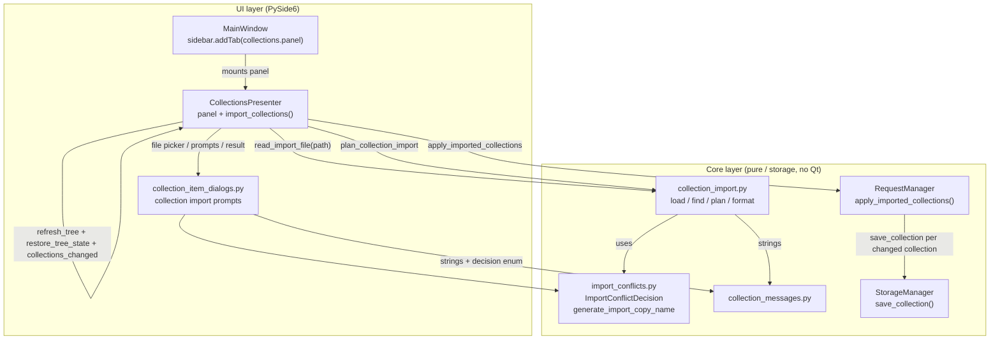

# PYPOST-987: Import collection

## Research

### Collection model (`pypost/models/models.py:25-54`)

```python
class RequestData(BaseModel):
    id: str = Field(default_factory=lambda: str(uuid.uuid4()))
    name: str = "New Request"
    method: str = "GET"
    url: str = ""
    headers: Dict[str, str] = Field(default_factory=dict)
    params: Dict[str, str] = Field(default_factory=dict)
    body: str = ""
    body_type: str = "json"
    yaml_as_json: bool = False
    post_script: str = ""
    expose_as_mcp: bool = False
    mcp_description: str = ""
    mcp_params: Dict[str, McpToolParam] = Field(default_factory=dict)
    retry_policy: Optional[RetryPolicy] = None


class Collection(BaseModel):
    id: str = Field(default_factory=lambda: str(uuid.uuid4()))
    name: str = "New Collection"
    requests: List[RequestData] = Field(default_factory=list)
```

Key consequences for import:

- **Every field the DoD calls for is already on `RequestData`** — method, URL, headers, params,
  body/body_type, `post_script`, and the MCP triple (`expose_as_mcp`, `mcp_description`,
  `mcp_params`). Deserializing a stored record with `Collection(**record)` preserves all of them
  for free; no field-by-field copy code is needed and no field can silently be dropped.
- **Every field has a default, including `name` and `id`.** `Collection(**{})` succeeds and yields
  `Collection(name="New Collection", requests=[])`. This is the single most important research
  finding: naive Pydantic validation is *not* enough shape validation for an import file. A
  Postman/Insomnia/arbitrary JSON object would parse "successfully" into an empty collection named
  "New Collection", violating the DoD's "invalid input handled without corrupting existing data".
  The parser must therefore add an explicit shape check (`name` present and a non-empty string;
  `requests`, when present, a list) before handing the record to Pydantic.
- `McpToolParam.model_post_init` (`models.py:20-22`) raises `ValueError` for an unsupported `type`,
  so a malformed MCP param surfaces as a Pydantic `ValidationError` on the whole collection record —
  usable as a per-record failure reason.
- No timestamps, no ordering field, no "source" metadata on either model.

### Storage layer (`pypost/core/storage.py:90-159`)

- On disk collections are **one JSON file per collection**, `<data_dir>/collections/<id>.json`
  (`_collection_path_by_id`, line 90-91), written with `collection.model_dump_json(indent=2)`.
  This is the exact shape an import file is expected to contain — a user can copy such a file
  straight out of the data directory and share it, which is what makes import useful before export
  exists.
- `save_collection` (line 98-113) is a plain `open(..., "w")` + write. It is **not** atomic
  (no temp-file + `os.replace`, unlike `save_environments`, `storage.py:181-195`). It also unlinks
  a legacy `<name>.json` file when one exists.
- **The file name is derived from `collection.id`.** Therefore an imported collection whose `id`
  matches an existing local collection's `id` would silently overwrite that collection's file —
  the single largest data-integrity hazard in this task, and the reason the requirements demand an
  id-collision rule.
- `load_collections` (line 138-159) iterates `os.listdir`, is order-nondeterministic, and skips
  per-file `OSError`/`JSONDecodeError`/`ValidationError` with a warning — the "continue past a bad
  entry" idiom the import parser mirrors at the record level.
- `delete_collection`, `_migrate_legacy_collection_file` — untouched by this task.
- `StorageInterface` (`storage_interface.py:24-30`) already exposes `save_collection`,
  `delete_collection`, `load_collections`. **No interface change is required.**

### In-memory ownership (`pypost/core/request_manager.py`)

- `RequestManager.collections: List[Collection]` (line 30) is the single owner of the live list.
  `get_collections()` (line 71-72) returns it **by reference** — mutating the returned list mutates
  app state, and `CollectionsPresenter.refresh_tree` reads through the same reference.
- `_request_index: Dict[str, Tuple[RequestData, Collection]]` (line 31) is a derived request-id →
  (request, collection) map, rebuilt by `_rebuild_index()` (line 55-60). **A duplicate request id
  across two collections would collapse to one index entry**, silently breaking `find_request`,
  tab-open, rename, and delete for the shadowed request. This is the second id-collision hazard.
- `create_collection` (line 119-130) **raises** `ValueError` on a duplicate name
  (`_find_collection_by_name`, line 112-117, exact + `.strip()`-normalized + case-sensitive) and on
  an empty name. `rename_collection` (line 213-243) **returns `False`** on a duplicate name.
  Import therefore **must not** route through `create_collection` — a Keep-Both or Overwrite import
  would raise. A new, purpose-built manager method is required.
- Storage, however, happily persists two collections sharing a display name — there is an explicit
  test for it (`tests/test_storage_collections.py:67-77`). So a name conflict is a *UX* problem, not
  a storage constraint, which is why prompting (rather than hard-rejecting) is viable.
- Request names inside a collection have **no** uniqueness rule (`save_request`, line 96-104,
  matches on `req.id` only; `rename_request` only rejects empty). Import needs no per-request name
  policy — the unit of conflict is the collection.

### Collections UI (`pypost/ui/presenters/collections_presenter.py`)

- The presenter **is** the tree: it owns a `QStandardItemModel` and a `QTreeView` created inline
  (lines 63-72), exposed as `widget` (line 99-101). `MainWindow._build_layout` mounts it with
  `sidebar.addTab(self.collections.widget, "Collections")` (`main_window.py:192`) — the **only**
  production consumer of `.widget`.
- **There is no button row, toolbar, or "Actions" menu around the tree**, and no "New collection"
  action anywhere: collections are only born via the Save Request dialog's
  "Create New Collection..." entry (`save_dialog.py:44`) →
  `RequestSaveOrchestrator._resolve_target_collection` (`request_save_orchestrator.py:193-198`) →
  `RequestManager.create_collection`. So there is no existing "add collection" UI chain to copy;
  the import entry point is genuinely new UI.
- The only tree-local menu is `CollectionTreeActions.show_context_menu`
  (`collection_tree_actions.py:65-129`), which **returns early on an invalid index**
  (`if not index.isValid(): return`, line 67-69) — there is no background/empty-space menu to hang
  an import action on without changing that guard and its tests.
- `refresh_tree()` (line 131-146) tries `try_incremental_tree_refresh` first
  (`collection_tree_incremental.py:24-49`), which **bails to a full rebuild whenever the set of
  collection ids or any request count changes** — exactly what an import does. The full rebuild
  clears expansion state, which is why the codebase's established pairing is
  `refresh_tree()` immediately followed by `restore_tree_state()`
  (`main_window_signals.py:29-30`). Import must follow the same pairing.
- `_collection_items_by_id` (line 64) is an O(1) id → node index that `refresh_tree` rebuilds; no
  extra bookkeeping is needed if import goes through `refresh_tree`.
- `collections_changed` (line 31) fans out to `window.env.load_environments` and
  `window.env.refresh_mcp_tools` (`main_window_signals.py:17-18`). **Import must emit it**, or
  requests imported with `expose_as_mcp=True` would not be registered as MCP tools until restart —
  a DoD requirement from the requirements Q&A.
- `presenter.widget` is used pervasively by tests as a `QTreeView`
  (`presenter.widget.model()`, `.isExpanded()`, `.viewport()`,
  `tests/test_collections_presenter.py:84-91`, `tests/test_presenter_font_inheritance.py:27`) and
  is resolved by agent-e2e/spotcheck tests via `findChild(QTreeView, COLLECTION_TREE)`
  (`tests/test_ui_identity_spotcheck.py:59-61`, `tests/test_agent_e2e_seed.py:100`). Changing
  `widget`'s return type would break a large, unrelated test surface — so a **second** accessor is
  the low-risk option (see Architecture).

### PYPOST-986 (Import environments) — the precedent to mirror

Shipped last sprint and directly reusable as a template:

- `pypost/core/environment_import.py` — pure, no Qt: `EnvironmentImportFileError`,
  `ImportConflictDecision(str, Enum)` (`OVERWRITE`/`KEEP_BOTH`/`SKIP`), frozen `ImportPlanResult`
  dataclass, `load_import_candidates`, `find_conflicts`, `generate_import_copy_name`,
  `plan_import`, `format_import_result`. File-level problems **raise**; per-record problems
  accumulate into `parse_errors` so one bad entry never blocks the file (lines 55-61). Duplicates
  *within* the incoming file are auto-renamed with no prompt (lines 126-131). Overwrite preserves
  the **existing** record's identity and list position (lines 161-169).
- `pypost/ui/collection_item_dialogs.py:230-286` — `prompt_import_environments_file`
  (`QFileDialog.getOpenFileName`, PySide6 returns a 2-tuple), `show_import_invalid_file_error`,
  `prompt_import_conflict` (a `QMessageBox` with three `addButton(...)` custom buttons plus a
  `setCheckBox(QCheckBox)` "apply to all remaining conflicts"), `show_import_result`.
- `EnvironmentListWidget.import_environments()` / `_resolve_import_conflicts()`
  (`environment_list_widget.py:274-335`) — the orchestration shape: picker → injected
  `read_import_file` callable → invalid-file guard → zero-candidates guard (same "nothing changed"
  dialog) → per-conflict prompt loop with an apply-to-all shortcut → `plan_import` → apply →
  refresh → structured log → formatted summary dialog.
- `pypost/core/environment_messages.py` — all user-visible strings as module constants plus
  `format_*` helpers; the dialogs module imports from it rather than inlining text.
- `pypost/ui/widget_ids.py:31` — `ENV_IMPORT_BUTTON` was added but **deliberately left out of
  `KEY_WIDGET_IDS`** (that tuple is asserted against a live window in
  `tests/test_ui_identity_spotcheck.py:193`, so membership requires the widget to always exist).
- `tests/test_environment_list_widget.py` — nine Qt-level cases (happy path, cancelled picker,
  invalid file, zero candidates, single conflict, apply-to-all, partial parse failure, no-callable
  no-op, `caplog` on the completion event), patching dialog helpers at their import site via a
  `_MODULE = "..."` constant.

**What does not transfer.** Environments are a single `environments.json` written **once** when the
management dialog closes, so PYPOST-986 inherited atomicity for free and never had to touch disk
during the import itself. Collections are **one file per collection, written eagerly**, so
PYPOST-987 must persist as part of the action, and must handle a per-collection write failure. It
also has no encryption/secrets dimension at all (no `deserialize_*_records`, no codec, no
`StorageInterface` dependency in the parser) — the collection parser is a pure function of a path.

### Sharable pieces between the two features

`ImportConflictDecision` and `generate_import_copy_name` are domain-neutral. Rather than duplicate
them, this task extracts both into a new `pypost/core/import_conflicts.py` and re-imports them into
`pypost/core/environment_import.py`, which keeps
`from pypost.core.environment_import import ImportConflictDecision` working unchanged for the two
existing consumers (`collection_item_dialogs.py:9`, `environment_list_widget.py:21-27`) and for
`tests/test_environment_import.py`. No behavior change, no test churn.

The Overwrite/Keep Both/Skip `QMessageBox` body is also identical apart from its message text, so
the shipped `prompt_import_conflict` is refactored to delegate to a private
`_prompt_import_conflict_box(parent, title, message, remaining_count)`, which the new collection
variant reuses. The public environment function keeps its exact signature and behavior.

### External library reference

No new Qt API beyond what PYPOST-986 already introduced:
`QFileDialog.getOpenFileName(parent, caption, dir, filter)` returns a **2-tuple** in PySide6
(<https://doc.qt.io/qtforpython-6/PySide6/QtWidgets/QFileDialog.html>) and
`QMessageBox.setCheckBox(QCheckBox)` / `checkBox()`
(<https://doc.qt.io/qtforpython-6/PySide6/QtWidgets/QMessageBox.html>) are already used and proven
in `collection_item_dialogs.py`. No new third-party dependency is introduced; `QPushButton`,
`QVBoxLayout`, `QHBoxLayout`, `QWidget` all come from the existing `PySide6.QtWidgets`.

### Test and tooling infra

- `make test` (fast suite, `QT_QPA_PLATFORM=offscreen`, `-m "not slow"`), `make lint`
  (`flake8 pypost/`), `make typecheck` (mypy baseline gate), `make check`. Subsets via
  `make test PYTEST_ARGS="tests/test_collection_import.py"`.
- `tests/conftest.py:37-43` **fails any test lacking a `pytest.mark.timeout` marker** — module-level
  `pytestmark` is the house style. `qapp` is module-scoped (`conftest.py:16-22`).
- `tests/helpers/__init__.py::FakeStorageManager` records `saved_collections` (append-only log of
  `save_collection` calls) and `deleted_collection_ids`, and `seed_collections()` changes what a
  later `load_collections()` returns.
- `tests/helpers/collections_tree.py` — `make_collection`, `make_request`, `FakeRequestManager`
  (records `collections`, `deleted`, `renamed`; **no** `create_collection`/`save_request`),
  `FakeStateManager`, `FakeMetrics`, and `build_isolated_tree_actions`.
- Line length is capped at 100 characters (`.cursor/rules/files.mdc`, `scripts/check-line-length.sh`).

## Implementation Plan

1. **`pypost/core/import_conflicts.py`** (new, pure, ~30 lines): move `ImportConflictDecision` and
   `generate_import_copy_name(name, existing_names)` here verbatim from `environment_import.py`;
   `environment_import.py` imports both from the new module so its public names are unchanged.

2. **`pypost/core/collection_messages.py`** (new): user-visible strings for the import flow —
   `DIALOG_TITLE_IMPORT_COLLECTION`, `BUTTON_IMPORT_COLLECTION`,
   `IMPORT_COLLECTION_FILE_DIALOG_CAPTION`, `IMPORT_COLLECTION_FILE_DIALOG_FILTER`,
   `MSG_IMPORT_COLLECTION_CONFLICT`, `MSG_IMPORT_NO_VALID_COLLECTIONS`, the parser's shape-error
   templates, the summary labels, and `format_collection_import_conflict_message(name)` /
   `format_collection_entry_error(label, reason)`. Mirrors `environment_messages.py`.

3. **`pypost/core/collection_import.py`** (new, pure, no Qt — the heart of the task):

   - `CollectionImportFileError(Exception)` — file-level problems only (unreadable, invalid JSON,
     root neither a list nor an object, a list element that is not an object).
   - `@dataclass(frozen=True) CollectionImportPlanResult` — `collections: list[Collection]` (the
     full target list), `persisted: list[Collection]` (the subset that must be written to disk),
     `added: list[str]`, `updated: list[str]`, `skipped: list[str]`, `renamed: dict[str, str]`,
     `request_count: int`, `parse_errors: list[str]`.
   - `load_collection_import_candidates(path: Path) -> tuple[list[Collection], list[str]]` — read →
     `json.loads` → normalize a single top-level object into a one-item list → per record:
     **shape-check first** (`name` present and a non-empty string; `requests`, if present, a list),
     then `Collection(**record)`; a failure of either produces a `parse_errors` line naming the
     entry and continues. Takes **no storage argument** — collections have no encryption dimension.
   - `find_collection_conflicts(existing, incoming) -> list[str]` — names in both, incoming order,
     de-duplicated.
   - `plan_collection_import(existing, incoming, decisions) -> CollectionImportPlanResult` — pure.
     Per incoming collection, in file order:
     - a name already seen earlier in `incoming` → unconditional Keep-Both rename, no prompt, no
       `decisions` lookup (matches `plan_import`'s rule);
     - name not in `existing` → **added**;
     - otherwise apply `decisions[name]` (default `SKIP` when absent):
       - `OVERWRITE` — replace the existing collection **in place**, keeping its list position,
         its `id`, and its `name`, adopting the incoming requests. Identity preservation matches
         PYPOST-986's Overwrite and keeps the on-disk file, tree node id, and expansion state
         stable.
       - `KEEP_BOTH` — append under `generate_import_copy_name(name, current_names())`.
       - `SKIP` — dropped; the existing collection is untouched.
     - **Id-collision rule (silent, data-integrity only).** The planner threads a running set of
       taken collection ids and taken request ids (seeded from `existing`, grown as the plan is
       built). Any incoming collection or request whose id is already taken is re-materialized with
       a fresh `uuid4`; an id that is free is preserved, so a clean-machine restore keeps its
       identifiers. For `OVERWRITE` the replaced collection's own request ids are released back
       into the free pool first, since those requests are being discarded.
   - `format_collection_import_result(result) -> str` — counts (added / updated / skipped /
     renamed / requests imported), the rename map, and the failed-entry lines.

4. **`pypost/core/request_manager.py`**: add
   `apply_imported_collections(collections, persisted) -> list[str]` — replace the in-memory list
   **in place** (`self.collections[:] = collections`, preserving the identity of the list handed
   out by `get_collections()`), `_rebuild_index()`, then `storage.save_collection(col)` for each
   entry in `persisted`, catching `OSError` per collection and returning formatted failure lines.
   Deliberately separate from `create_collection`, which must keep rejecting duplicate names.

5. **`pypost/ui/collection_item_dialogs.py`**: extract the shipped conflict `QMessageBox` body into
   a private `_prompt_import_conflict_box(parent, title, message, *, remaining_count)`; keep
   `prompt_import_conflict` as a thin environment-specific wrapper; add
   `prompt_import_collection_file(parent) -> Path | None`,
   `show_collection_import_invalid_file_error(parent, message)`,
   `prompt_collection_import_conflict(parent, name, *, remaining_count)`, and
   `show_collection_import_result(parent, summary_text, *, success)`.

6. **`pypost/ui/widget_ids.py`**: add
   `COLLECTION_IMPORT_BUTTON = "pypost_collection_import_button"`, **not** added to
   `KEY_WIDGET_IDS` (same call as `ENV_IMPORT_BUTTON`).

7. **`pypost/ui/presenters/collections_presenter.py`** — the UI entry point and orchestration:

   - Build a container `QWidget` (`self._panel`) with a zero-margin `QVBoxLayout` holding the
     existing `QTreeView` plus a bottom `QHBoxLayout` with an **Import Collection…** `QPushButton`
     (id `COLLECTION_IMPORT_BUTTON`, followed by a stretch). Expose it as a new `panel` property;
     **`widget` keeps returning the `QTreeView` unchanged** so the existing test and automation
     surface is untouched.
   - New constructor keyword `read_import_file: Callable[[Path], tuple[list[Collection],
     list[str]]] | None = None`, defaulting to `load_collection_import_candidates`. The parser needs
     no dependencies, so defaulting to the real function keeps the button live everywhere while
     still leaving a clean injection seam for tests.
   - `import_collections()` — picker → `read_import_file` → `CollectionImportFileError` guard →
     zero-candidates guard (same "nothing changed" dialog, listing any `parse_errors`) →
     `_resolve_import_conflicts()` prompt loop with apply-to-all → `plan_collection_import` →
     `RequestManager.apply_imported_collections` (append save failures to `parse_errors`) →
     `refresh_tree()` + `restore_tree_state()` → `collections_changed.emit()` → structured
     `collection_import_completed` log → `format_collection_import_result` →
     `show_collection_import_result`.
   - `_resolve_import_conflicts(existing, candidates)` — mirrors
     `EnvironmentListWidget._resolve_import_conflicts`.

8. **`pypost/ui/main_window.py`**: `sidebar.addTab(self.collections.panel, "Collections")`.

9. **Tests**: `tests/test_collection_import.py` (pure logic, `pytestmark = timeout(30)`) and
   `tests/test_collections_import_ui.py` (Qt-level presenter orchestration,
   `pytestmark = timeout(60)`), plus a `RequestManager.apply_imported_collections` case in
   `tests/test_request_manager.py`.

10. **Docs (Step 8)**: an "Import a collection" section in `doc/user/collections.md`; a new
    `doc/dev/collection_import.md`; the widget-id table row in `doc/dev/ui_identity.md`.

**Mandatory — Failing Repro (next Step 3):** The behavioral surface is entirely new code, so the
red test targets the **pure core module before it exists** — the standard TDD red state for a new
feature, and the exact form PYPOST-986 used.

- **Where**: new file `tests/test_collection_import.py` (pure logic, no Qt, mirroring
  `tests/test_environment_import.py`), importing from `pypost.core.collection_import`, which does
  not exist yet ⇒ collection fails with `ModuleNotFoundError` ⇒ red, with no live external
  dependency of any kind.
- **What it asserts** (desired behavior, written against the interfaces above):
  - `load_collection_import_candidates` on a JSON **list** of two valid collection records returns
    two `Collection` objects with `parse_errors == []`, and a request inside one of them keeps its
    method, URL, headers, params, body, `post_script`, `expose_as_mcp`, `mcp_description`, and
    `mcp_params` (the DoD's field-fidelity requirement, asserted field by field).
  - A single top-level JSON **object** normalizes to a one-item result.
  - A malformed / non-JSON file raises `CollectionImportFileError`.
  - A JSON root that is neither a list nor an object raises `CollectionImportFileError`.
  - A record **missing `name`** (e.g. a foreign-tool file) is reported in `parse_errors` and is
    **not** silently imported as "New Collection" — the guard against Pydantic's all-defaults
    behavior.
  - A record whose `requests` value is not a list, and a record with an invalid MCP param type, are
    each reported in `parse_errors` while a sibling valid record still imports.
  - `find_collection_conflicts` returns the name intersection, in incoming order, de-duplicated.
  - `plan_collection_import` with `OVERWRITE` keeps the existing collection's `id`, `name`, and
    list position while adopting the incoming requests, and lists it in `persisted`.
  - `plan_collection_import` with `KEEP_BOTH` appends a `Copy of <name>` collection with a **fresh
    id**, leaves the existing one byte-identical, and records the rename map.
  - `plan_collection_import` with `SKIP` leaves the target list equal to `existing` and records the
    name in `skipped`, with nothing in `persisted`.
  - A non-conflicting name is always added regardless of unrelated `decisions` entries.
  - **Id-collision**: an incoming collection whose `id` equals an existing collection's `id` is
    assigned a new id (so `save_collection` cannot clobber the existing file), and an incoming
    request whose `id` equals an existing request's id is assigned a new id (so `_request_index`
    cannot collapse) — while non-colliding ids are preserved verbatim.
  - Two collections sharing a name **within** the incoming file both import, the second renamed,
    with no `decisions` entry consulted.
  - `format_collection_import_result` renders the counts, the rename map, and the parse errors.
- **Forcing the failure without live external deps**: every fixture is a `tmp_path` JSON file or an
  in-memory `Collection` list. No Qt, no `QApplication`, no network, no real data directory.
- **Sequencing**: research (this document, done) → write red `tests/test_collection_import.py`
  (fails at import: `ModuleNotFoundError: pypost.core.collection_import`) → Step 4 implements
  `pypost/core/collection_import.py` until green, then adds the manager method, dialogs, presenter
  wiring, and the Qt-level tests in `tests/test_collections_import_ui.py`.

## Architecture

### Component diagram



### Components and responsibilities

| Component | Responsibility | Status |
|---|---|---|
| `pypost/core/import_conflicts.py` | Domain-neutral conflict enum + copy-name generator. | New |
| `pypost/core/collection_import.py` | Parse, shape-validate, detect conflicts, resolve id collisions, plan, format. | New |
| `pypost/core/collection_messages.py` | All user-visible import strings for collections. | New |
| `collection_item_dialogs.py` (additions) | File picker, conflict prompt, invalid-file and result boxes. | Extended |
| `RequestManager.apply_imported_collections` | Swap in the planned list, reindex, persist the changed subset, report write failures. | New method |
| `CollectionsPresenter` | Owns the `panel` entry point and orchestrates picker → plan → apply → refresh. | Extended |
| `MainWindow._build_layout` | Mounts `panel` instead of `widget` in the sidebar tab. | Extended |
| `StorageManager.save_collection` | Per-collection JSON write. | Reused |
| `environment_import.py` | Re-imports the two shared symbols; behavior unchanged. | Touched |

### Dependencies

- `collection_import.py` depends only on `pypost.models.models.{Collection, RequestData}`,
  `pypost.core.import_conflicts`, `pypost.core.collection_messages`, and the standard library
  (`json`, `uuid`, `pathlib`, `dataclasses`). **No Qt, no storage, no `StorageInterface`** — unlike
  `environment_import.py`, which needs storage for decryption. This makes the whole decision layer
  unit-testable without a `QApplication` or a data directory.
- `CollectionsPresenter` depends on `collection_import` through the injected `read_import_file`
  callable (defaulted to the real parser) and directly on the new dialog helpers — the same mix
  `EnvironmentListWidget` uses.
- `RequestManager` gains no new dependency; it already holds a `StorageInterface`.
- No new third-party package.

### Patterns

- **Pure core / impure shell** — all decision logic (shape validation, conflict detection, id
  reservation, planning, formatting) is Qt-free and directly unit-testable; Qt-only concerns (file
  dialog, prompts, tree refresh) stay in the presenter and the dialogs module. Mirrors
  `environment_import.py` vs `environment_list_widget.py`.
- **Plan-then-apply** — `plan_collection_import` computes the complete target list plus the subset
  that needs persisting, without touching disk or app state. The presenter applies it in one step.
  This is what makes "conflicts and invalid input never corrupt existing data" testable in
  isolation: nothing is written until a full, valid plan exists.
- **Fault-isolated batch parsing** — file-level errors raise; per-record errors accumulate. Reuses
  the idiom from `deserialize_environment_records` and `StorageManager.load_collections`.
- **Identity-preserving overwrite** — Overwrite keeps the existing collection's `id`, `name`, and
  position, so its on-disk file, its tree node, and its saved expansion state survive. Extends the
  same principle PYPOST-986 applied to `settings.last_environment_id`.
- **Silent id reservation** — collection/request id collisions are a correctness concern the user
  cannot reason about, so they are resolved without a prompt, while name conflicts (which the user
  *can* see) always prompt. This split keeps the dialog burden proportional to what the user
  actually understands.
- **Constructor-injected callable (dependency inversion)** — `read_import_file`, exactly as
  `EnvironmentListWidget` takes it, defaulted here because the collection parser is dependency-free.
- **Additive widget accessor** — `panel` is added rather than changing `widget`'s type, keeping the
  `COLLECTION_TREE` automation identity and every existing `presenter.widget.<QTreeView API>` call
  site working. `findChild` recursion means agent-e2e lookups are unaffected by the extra nesting.
- **Report dataclass + `format_*` + `show_*_result`** — the `MigrationReport` /
  `format_migration_report` / `show_migration_result` triad, already reused by PYPOST-986.

### Interfaces

```python
# pypost/core/import_conflicts.py

class ImportConflictDecision(str, Enum):
    OVERWRITE = "overwrite"
    KEEP_BOTH = "keep_both"
    SKIP = "skip"

def generate_import_copy_name(name: str, existing_names: set[str]) -> str: ...
```

```python
# pypost/core/collection_import.py

class CollectionImportFileError(Exception):
    """Raised for unreadable, malformed, or wrong-shaped import files."""

@dataclass(frozen=True)
class CollectionImportPlanResult:
    collections: list[Collection]
    persisted: list[Collection]
    added: list[str]
    updated: list[str]
    skipped: list[str]
    renamed: dict[str, str]
    request_count: int
    parse_errors: list[str]

def load_collection_import_candidates(
    path: Path,
) -> tuple[list[Collection], list[str]]: ...

def find_collection_conflicts(
    existing: list[Collection], incoming: list[Collection]
) -> list[str]: ...

def plan_collection_import(
    existing: list[Collection],
    incoming: list[Collection],
    decisions: dict[str, ImportConflictDecision],
) -> CollectionImportPlanResult: ...

def format_collection_import_result(result: CollectionImportPlanResult) -> str: ...
```

```python
# pypost/core/request_manager.py (addition)

def apply_imported_collections(
    self, collections: List[Collection], persisted: List[Collection]
) -> list[str]:
    """Swap in the imported list, reindex, persist `persisted`; return write failures."""
```

```python
# pypost/ui/collection_item_dialogs.py (additions)

def prompt_import_collection_file(parent: QWidget) -> Path | None: ...

def show_collection_import_invalid_file_error(parent: QWidget, message: str) -> None: ...

def prompt_collection_import_conflict(
    parent: QWidget, name: str, *, remaining_count: int
) -> tuple[ImportConflictDecision, bool]: ...

def show_collection_import_result(
    parent: QWidget, summary_text: str, *, success: bool
) -> None: ...
```

```python
# pypost/ui/presenters/collections_presenter.py (additions)

def __init__(
    self,
    request_manager: RequestManager,
    state_manager: StateManager,
    metrics: MetricsTrackerProtocol,
    icons: dict,
    storage=None,
    parent: QObject | None = None,
    *,
    read_import_file: Callable[[Path], tuple[list[Collection], list[str]]] | None = None,
) -> None: ...

@property
def panel(self) -> QWidget:
    """Sidebar container: the collections tree plus the Import Collection… button."""

def import_collections(self) -> None: ...
```

## Q&A

**Q:** Why add a `panel` property instead of changing `widget` to return the container, the way
`EnvironmentListWidget` wraps its list?

**A:** `EnvironmentListWidget` was already a `QWidget` container, so PYPOST-986 only added a button
row inside it. `CollectionsPresenter.widget`, by contrast, *is* the `QTreeView`, and roughly a dozen
existing tests call `QTreeView` methods straight on it (`presenter.widget.model()`,
`.isExpanded(...)`, `.viewport()`, plus `test_widget_is_tree_view` and the font-inheritance test).
Changing its type would force unrelated churn across the collections test suite for no product
benefit. Adding `panel` costs one line in `MainWindow` and leaves `COLLECTION_TREE` — the automation
identity that agent-e2e tests resolve via `findChild` — exactly where it is.

**Q:** Why not hang "Import collection…" off the tree's right-click menu instead of a button?

**A:** `show_context_menu` returns early on an invalid index (`collection_tree_actions.py:67-69`),
so a background menu would require relaxing that guard and reworking its tests, and an
empty-space right-click is undiscoverable and unreachable once the tree is full. A button in a row
under the tree matches the Import environments precedent, is always visible (including when the
user has zero collections — the exact moment import is most useful), and is addressable by a stable
widget id.

**Q:** Why must imported ids sometimes be regenerated, given the user never sees them?

**A:** Two concrete corruption paths. First, `StorageManager.save_collection` names the file after
`collection.id` (`storage.py:90-91`), so importing a file that still carries a local collection's id
would overwrite that collection's file — destroying data the user never chose to overwrite. Second,
`RequestManager._request_index` is keyed by request id (`request_manager.py:55-60`), so a duplicate
request id would shadow an existing request, silently breaking open-in-tab, rename, and delete for
it. Regenerating only on collision keeps a clean-machine restore byte-faithful while making both
failure modes impossible.

**Q:** Why is the id rule silent while the name rule prompts?

**A:** The user can see and reason about names; a prompt there is meaningful and protects data they
recognize. Ids are internal, and there is no answer a user could usefully give — every alternative
to "give the newcomer a fresh id" corrupts something. Prompting would add friction without adding a
real choice.

**Q:** Overwrite discards the existing collection's requests. Should the imported requests keep
their own ids?

**A:** Yes, where they do not collide. The replaced collection's own request ids are released back
into the free pool before the incoming requests are reserved, so a file re-imported over the
collection it came from keeps its request ids stable. Ids colliding with requests in *other*
collections are still regenerated.

**Q:** How is data integrity guaranteed when collections are written one file at a time and
`save_collection` is not atomic?

**A:** Two layers. First, plan-then-apply: nothing is written until a complete, valid plan exists,
so an invalid file, a parse failure, or a cancelled prompt never reaches disk — the DoD's
"invalid input handled without corrupting existing data" is satisfied structurally. Second, the
writes themselves are per collection, each one either the creation of a brand-new file (Add /
Keep Both, no existing data at risk) or the deliberate rewrite of a collection the user explicitly
chose to overwrite. `apply_imported_collections` catches `OSError` per collection and surfaces the
failure in the result summary rather than aborting mid-loop. The residual gap — a crash *during* a
single non-atomic `save_collection` write, which predates this task and affects every save path —
is recorded in `60-tech-debt.md` rather than fixed here, since making `save_collection` atomic is a
storage-wide change well beyond this ticket.

**Q:** Why does the parser add its own shape check instead of trusting Pydantic?

**A:** Because every field of `Collection` has a default, `Collection(**{"anything": 1})` validates
successfully into an empty collection named "New Collection". Without an explicit `name`/`requests`
shape check, picking a Postman export, a `package.json`, or any other JSON object would report
"imported 1 collection" and add an empty node to the tree. Requiring a non-empty string `name` and
a list `requests` turns those into named, actionable parse errors and, when no record survives,
into the "No valid collections found in this file" invalid-file dialog.

**Q:** Does this task change `StorageInterface` or the on-disk collection format?

**A:** No. Import produces ordinary `Collection` objects saved through the unchanged
`save_collection`, writing the unchanged per-id JSON files. No new persisted format, setting, or
interface method.

**Q:** Why does `plan_collection_import` return `persisted` separately from `collections`?

**A:** So the presenter writes exactly the collections that changed, instead of rewriting every
file on every import. A `SKIP` decision must leave the existing file untouched on disk — including
its mtime — and an untouched collection has no reason to be rewritten. Returning the subset keeps
that decision in the pure, tested layer instead of re-deriving it in the Qt shell.

**Q:** Does import need to notify the MCP subsystem?

**A:** Yes, and it does so through the existing `collections_changed` signal, which
`main_window_signals.py:17-18` already routes to `env.load_environments` and `env.refresh_mcp_tools`.
Requests imported with `expose_as_mcp=True` are therefore registered without a restart, and no new
signal or wiring is introduced.

## Worklog
tokens_used: 90000
role: execution
step: 2
step_name: Architecture
