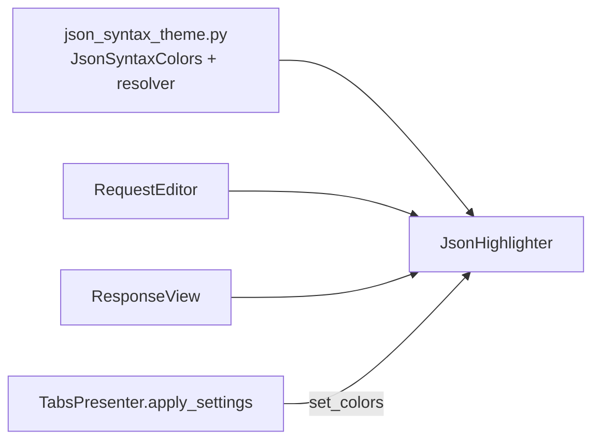

# PYPOST-99: Architecture — JsonHighlighter theme colors

## Research

- Debt originated in PYPOST-11: colors hardcoded in `JsonHighlighter.__init__`.
- Implementation landed in PYPOST-398 (`JsonSyntaxColors`, defaults) and PYPOST-395 (dark
  palette, `resolve_json_syntax_colors`, `set_colors` rebinding via `TabsPresenter`).
- `StyleManager` handles QSS; `QSyntaxHighlighter` token colors use `JsonSyntaxColors`.

## Architecture



| Module | Responsibility |
| ------ | -------------- |
| `pypost/ui/theme/json_syntax_theme.py` | Light/dark palettes, palette resolver |
| `pypost/ui/widgets/json_highlighter.py` | Regex rules + formats from `JsonSyntaxColors` |
| `pypost/ui/widgets/request_editor.py` | Default resolver at construction |
| `pypost/ui/widgets/response_view.py` | Default resolver at construction |

### JsonSyntaxColors fields

| Field | Light default | Token |
| ----- | ------------- | ----- |
| `keyword` | darkblue | `true`, `false`, `null` |
| `number` | blue | numeric literals |
| `string` | green | quoted strings |
| `key` | purple | object keys |
| `placeholder` | darkorange | `{{...}}` templates |

## Verification

```bash
QT_QPA_PLATFORM=offscreen .venv/bin/python -m pytest tests/test_json_highlighter.py -q
```
