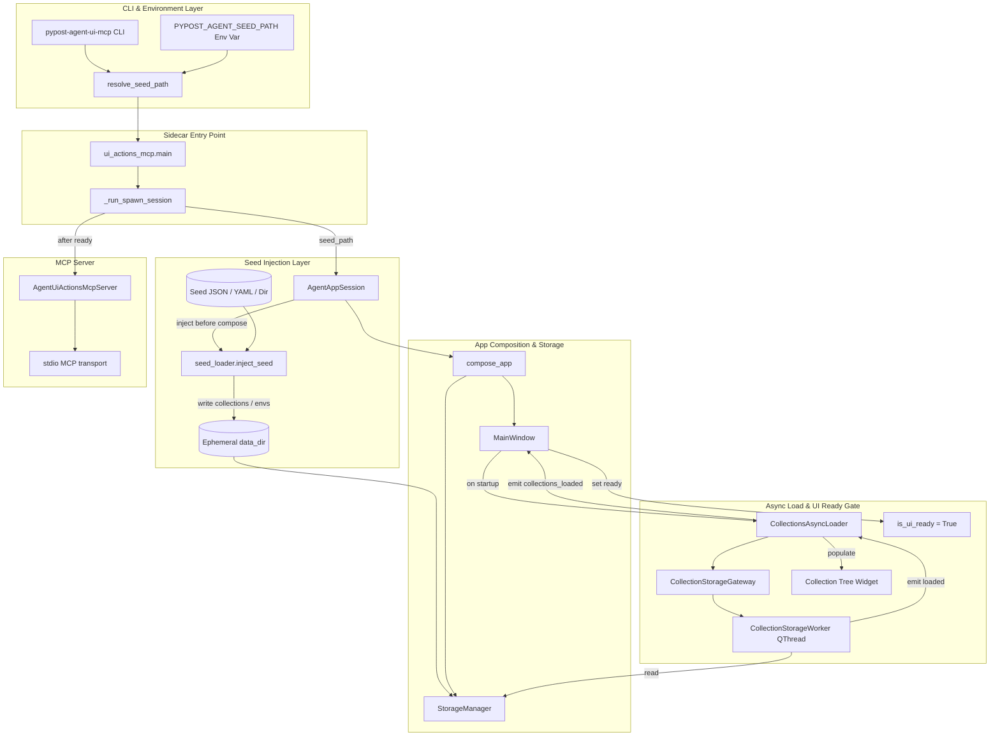
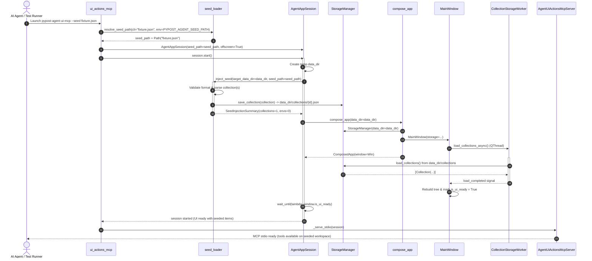

# PYPOST-993: Seed/collection injection for sidecar session

## Research

### Existing Storage & Lifecycle Architecture

1. **Storage Subsystem (`pypost.core.storage.StorageManager`)**:
   - Operates on two primary locations under `data_dir`:
     - Collections directory: `data_dir / "collections" / "{collection_id}.json"`.
     - Environments file: `data_dir / "environments.json"`.
   - Methods:
     - `save_collection(collection: Collection)` writes individual collection files formatted as JSON.
     - `load_collections() -> list[Collection]` scans `data_dir / "collections"` for `*.json` files, deserializes each with Pydantic, and performs legacy file migration when necessary.
     - `save_environments(environments: list[Environment])` writes an atomic temporary file and replaces `environments.json`.
     - `load_environments() -> list[Environment]` reads and decrypts environments.

2. **Async Collections Loading in UI (`pypost.ui.presenters.collections_async_loader`)**:
   - `MainWindow` delegates collection loading to `CollectionsPresenter.load_collections_async()`.
   - `CollectionsAsyncLoader` uses `CollectionStorageGateway`, which offloads `storage.load_collections()` to a dedicated background `QThread` (`CollectionStorageWorker`).
   - On worker completion, `load_finished` signal emits on the GUI thread, invoking `_finish_load(collections)`:
     - Updates `RequestManager.apply_loaded_collections(collections)`.
     - Rebuilds tree items via `_refresh_tree()`.
     - Emits `collections_loaded` signal.
   - `MainWindow._on_startup_collections_loaded` captures the signal, marks `_startup_collections_ready = True`, and calls `_maybe_complete_startup_restore()`.
   - Once both collections and environments are ready, `_maybe_complete_startup_restore()` runs tab/tree restoration and sets `MainWindow.is_ui_ready = True`.

3. **In-Process Agent Session (`pypost.agent.lifecycle.AgentAppSession`)**:
   - Manages an isolated in-process `QApplication` and `MainWindow` instance for test runners and agents.
   - Allocates ephemeral temp directories (`pypost-agent-config-*`, `pypost-agent-data-*`) if `config_dir` or `data_dir` are not explicitly supplied.
   - Calls `compose_app(config_dir=..., data_dir=...)` which wires all services, storage, and `MainWindow`.
   - Pumps Qt events in a bounded loop until `window.is_ui_ready` evaluates to `True`.

4. **Out-of-Process Sidecar Bridge (`pypost.agent.ui_actions_mcp`)**:
   - Entry point: `pypost-agent-ui-mcp` console script (`pypost.agent.ui_actions_mcp:main`).
   - Supports two modes:
     - Attach mode (`--attach`, `--attach-endpoint`): connects to a running desktop instance via AF_UNIX IPC socket (`AttachClientSession`).
     - Spawn mode (default): instantiates and starts `AgentAppSession`, then runs an async stdio MCP server exposing `ui_click`, `ui_fill`, `ui_select`, and `ui_send_key`.
   - Current limitation: spawn mode launches with blank ephemeral `data_dir`, resulting in an empty collection tree.

5. **Existing Seed Helpers & Import Logic**:
   - `pypost.fixtures.agent_e2e_seed`: Provides `build_agent_e2e_seed_collection()`, `build_agent_e2e_seed_environments()`, and `write_agent_e2e_seed(data_dir)`.
   - `pypost.core.collection_import`: Provides `load_collection_import_candidates(path: Path) -> tuple[list[Collection], list[str]]`, which parses JSON/YAML into collection models and validates shape.
   - `pypost.core.environment_import`: Provides `load_import_candidates(path: Path, storage)` for parsing environment files.

---

## Implementation Plan

### High-Level Implementation Steps

1. **Create Seed Loader Module (`pypost/agent/seed_loader.py`)**:
   - Define custom exceptions: `SeedLoadError(Exception)` and `SeedFormatError(SeedLoadError)`.
   - Implement `resolve_seed_path(cli_path: str | Path | None, env_var: str = "PYPOST_AGENT_SEED_PATH") -> Path | None` with CLI > Env var precedence.
   - Implement `inject_seed(target_data_dir: Path, seed_path: Path) -> SeedInjectionSummary`:
     - Validates seed path existence and readability.
     - Supports directory seeds (pre-populated data directories containing `collections/` and/or `environments.json`, or collections folders).
     - Supports file seeds (single collection JSON/YAML, list of collections JSON, or environment JSON).
     - Persists loaded objects into `target_data_dir` using standard `StorageManager` layouts.

2. **Integrate Seed Parameter into `AgentAppSession` (`pypost/agent/lifecycle.py`)**:
   - Add optional `seed_path: Path | str | None = None` parameter to `AgentAppSession.__init__`.
   - In `AgentAppSession.start()`:
     - Prior to calling `compose_app()`, if `self._seed_path` is set:
       - Call `inject_seed(target_data_dir=data_dir, seed_path=self._seed_path)`.
       - Log diagnostic metrics (`agent_session_seed_injected collections=N envs=M`).
     - On any seed loading error, ensure cleanup runs and re-raise or exit cleanly.
     - Ensure existing unseeded initialization remains unmodified when `seed_path is None`.

3. **Expose CLI Flags and Environment Variable in Sidecar (`pypost/agent/ui_actions_mcp.py`)**:
   - Add CLI arguments `--seed` and `--seed-file` (aliases, storing to `seed_path`).
   - Use `resolve_seed_path` to resolve the configured path against `PYPOST_AGENT_SEED_PATH`.
   - Enforce constraint: if `--attach` is active while a seed path is specified, report an error and terminate (seeding is applicable to spawned sessions).
   - Pass resolved `seed_path` into `_run_spawn_session()`, which forwards it to `AgentAppSession`.
   - Wrap startup in exception handling to log structured errors and terminate with status code 1 on `SeedLoadError`.

4. **Integration & End-to-End Tests**:
   - Add unit tests verifying `resolve_seed_path` precedence (CLI argument vs environment variable vs None).
   - Add unit tests verifying `inject_seed` error scenarios (missing file, corrupted JSON, unsupported content) and success scenarios (single collection JSON, collection list, directory).
   - Add integration test in `tests/test_agent_ui_actions_mcp.py` asserting that `pypost-agent-ui-mcp` launched with `--seed` starts with populated UI widgets (collections in tree).

5. **Update Developer Documentation (`doc/dev/`)**:
   - Document `--seed` / `--seed-file` flags and `PYPOST_AGENT_SEED_PATH` environment variable in agent sidecar documentation.

---

### Mandatory — Failing Repro (next Step 3)

The failing repro test in Step 3 will verify the primary requirement: launching an `AgentAppSession` and `pypost-agent-ui-mcp` with a seed file must populate the UI with seeded collections and requests upon reaching `is_ui_ready`.

- **Test Location**: `tests/test_agent_ui_actions_mcp.py` (or dedicated `tests/test_agent_ui_actions_mcp_seed.py`).
- **Assertion**:
  - `test_agent_app_session_with_seed_loads_collection_into_ui`:
    1. Write a temporary collection JSON file containing collection `"Repro Seed Collection"` with request `"Repro GET"`.
    2. Instantiate and start `AgentAppSession(seed_path=seed_file, offscreen=True)`.
    3. Assert `session.window.is_ui_ready` is `True`.
    4. Assert `session.ui_snapshot()` or collection tree model contains `"Repro Seed Collection"`.
  - `test_ui_actions_mcp_cli_seed_argument_parsing`:
    1. Parse args `["--seed", "/path/to/seed.json"]` and assert `resolve_seed_path` returns `Path("/path/to/seed.json")`.
    2. Set `PYPOST_AGENT_SEED_PATH` in env and assert resolution without CLI flag returns env path.
    3. Assert CLI flag overrides env var when both are present.
- **How to Force Failure**:
  - In Step 3, before implementing `seed_path` in `AgentAppSession` and `ui_actions_mcp`, running these tests will fail because `AgentAppSession.__init__() got an unexpected keyword argument 'seed_path'`, and `ui_actions_mcp` does not recognize `--seed`.
- **Sequencing**:
  - Step 2 (Architecture) → Step 3 (Failing Repro automated test) → Step 4 (Production implementation until green).

---

## Architecture

### Component Diagram



### Module Responsibilities

| Module | Location | Responsibility |
| --- | --- | --- |
| `seed_loader` | `pypost/agent/seed_loader.py` | Standalone pure logic for parsing, validating, and injecting seed data (collections/environments) from files or directories into a target storage directory. Also handles CLI/Env path resolution. |
| `ui_actions_mcp` | `pypost/agent/ui_actions_mcp.py` | CLI argument parsing (`--seed`, `--seed-file`), environment configuration integration, error diagnostics, and sidecar session bootstrap. |
| `lifecycle` | `pypost/agent/lifecycle.py` | Accepts `seed_path` in `AgentAppSession`, coordinates pre-compose workspace seeding into ephemeral `data_dir`, and validates UI readiness before returning. |
| `storage` | `pypost/core/storage.py` | Standard repository data store for collections and environments; remains unmodified, maintaining single source of truth for disk persistence format. |
| `collections_async_loader` | `pypost/ui/presenters/collections_async_loader.py` | Existing background QThread disk reader; reads seeded collections off the UI thread without changes. |

---

### Sequence Diagram



---

### Selected Architectural Patterns and Justification

1. **Pre-Compose Injection Pattern (Filesystem Staging)**:
   - *Justification*: By staging seed collections into `data_dir / "collections"` *before* `compose_app()` and `MainWindow` initialization, the application naturally boots through its standard startup sequence.
   - *Benefits*:
     - Zero disruption or monkeypatching of `MainWindow`, `CollectionsPresenter`, or `CollectionStorageGateway`.
     - Completely eliminates race conditions: no Qt background threads or event loops are running while the seed is written to disk.
     - Preserves the guarantee that `MainWindow.is_ui_ready` is evaluated against the fully loaded and restored seeded workspace.

2. **Dedicated Pure-Logic Seed Loader (`pypost.agent.seed_loader`)**:
   - *Justification*: Decouples file format parsing, schema validation, and storage serialization from the Qt application and MCP server.
   - *Benefits*:
     - Directly unit-testable without spinning up Qt or MCP stdio servers.
     - Reusable by other agent tooling, CLI scripts, or test fixtures.

3. **Graceful Fail-Fast Error Strategy**:
   - *Justification*: Silently launching an empty session when a seed is corrupted or missing wastes agent compute cycles and produces confusing test failures.
   - *Benefits*:
     - Validates seed existence and syntax immediately.
     - Logs clear diagnostics (`agent_ui_mcp_seed_failed error=...`) and exits with status code 1.

---

### Interfaces and API Definitions

#### 1. `pypost/agent/seed_loader.py`

```python
from dataclasses import dataclass
from pathlib import Path
from typing import Final

DEFAULT_SEED_ENV_VAR: Final[str] = "PYPOST_AGENT_SEED_PATH"

class SeedLoadError(Exception):
    """Raised when a seed path cannot be resolved, read, or parsed."""

@dataclass(frozen=True)
class SeedInjectionSummary:
    """Summary of items successfully injected into workspace storage."""
    collections_count: int
    environments_count: int
    collection_ids: list[str]
    environment_ids: list[str]

def resolve_seed_path(
    cli_path: str | Path | None,
    env_var: str = DEFAULT_SEED_ENV_VAR,
) -> Path | None:
    """Resolve seed path giving precedence to CLI argument over environment variable.

    Returns:
        Path if specified in CLI or environment variable, or None if omitted.
    """

def inject_seed(
    target_data_dir: Path,
    seed_path: Path,
) -> SeedInjectionSummary:
    """Parse seed data from seed_path and write into target_data_dir.

    Args:
        target_data_dir: Target PyPost data directory (where collections/ and environments.json live).
        seed_path: Path to seed JSON/YAML file or directory.

    Returns:
        SeedInjectionSummary with counts of injected collections and environments.

    Raises:
        SeedLoadError: If seed_path does not exist, cannot be read, contains malformed
            JSON/YAML, or lacks recognizable Collection/Environment schemas.
    """
```

#### 2. `pypost/agent/lifecycle.py`

```python
class AgentAppSession:
    def __init__(
        self,
        *,
        offscreen: bool = True,
        config_dir: Path | None = None,
        data_dir: Path | None = None,
        ready_timeout: float = 30.0,
        seed_path: Path | str | None = None,  # NEW
    ) -> None:
        ...
        self._seed_path = Path(seed_path) if seed_path is not None else None
```

#### 3. `pypost/agent/ui_actions_mcp.py`

```python
def main(argv: list[str] | None = None) -> None:
    parser = argparse.ArgumentParser(...)
    ...
    parser.add_argument(
        "--seed",
        "--seed-file",
        dest="seed",
        default=None,
        help=(
            "Path to seed collection JSON/YAML file or seed data directory "
            f"(overrides {DEFAULT_SEED_ENV_VAR})."
        ),
    )
    ...
```

---

### Concurrency & Thread Safety Analysis

- **Storage Initialization**: Seeding occurs in `AgentAppSession.start()` on the main execution thread *before* `compose_app()` is called. No background threads exist yet, guaranteeing atomic file preparation without locks.
- **Worker Execution**: Once `compose_app()` initializes `MainWindow`, `CollectionsAsyncLoader` launches `CollectionStorageWorker` on a separate `QThread`. The worker performs read-only operations on `data_dir / "collections"`.
- **UI Event Loop Dispatch**: `CollectionStorageWorker` communicates back to the GUI thread via Qt signals (`load_completed`). All widget mutations (populating the tree model) occur exclusively on the Qt GUI thread.
- **Ready Gate Synchronization**: `AgentAppSession.start()` pumps events via `QCoreApplication.processEvents()` inside `wait_until(lambda: window.is_ui_ready)`. The session only signals ready once the background worker finishes and the UI tree is completely rendered.

---

### Backward Compatibility

- Default value of `seed_path` is `None` in `AgentAppSession`.
- Omitting `--seed` and leaving `PYPOST_AGENT_SEED_PATH` unset results in `seed_path = None`.
- When `seed_path is None`, `inject_seed` is bypassed completely. The session boots into an empty workspace identical to current behavior.
- All existing tests in `tests/test_agent_ui_actions_mcp.py` and across the test suite continue to run without changes.

---

## Q&A

- **Q**: What formats of seed files will be supported?
  - **A**:
    1. Single collection file in JSON or YAML (`{"name": "...", "requests": [...]}`).
    2. Multi-collection file in JSON or YAML (`[{"name": "Col 1", ...}, {"name": "Col 2", ...}]`).
    3. Directory containing a `collections/` folder and/or `environments.json`.
    4. Directory containing `*.json` collection files directly.

- **Q**: How does CLI vs environment variable precedence work?
  - **A**: If `--seed` or `--seed-file` is passed on the command line, it takes precedence. If omitted, `PYPOST_AGENT_SEED_PATH` from the environment is used. If neither is provided, the session starts unseeded.

- **Q**: What happens if `--attach` and `--seed` are used together?
  - **A**: Seeding modifies the storage of a freshly spawned session. Because `--attach` connects to an already-running desktop process, combining `--attach` with `--seed` is invalid; `ui_actions_mcp` will log an error and exit with status 1.

- **Q**: What happens if the seed file is corrupted or missing?
  - **A**: `inject_seed` raises `SeedLoadError`. `pypost-agent-ui-mcp` logs `agent_ui_mcp_seed_failed` and exits with status 1 rather than silently starting an empty session.
