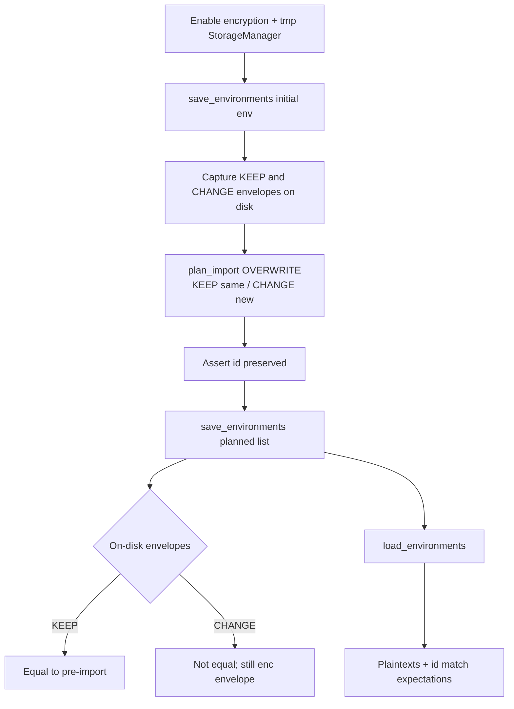

# PYPOST-999: Architecture — import Overwrite × ciphertext reuse round-trip test

## Research

### Source debt framing

[PYPOST-986](https://pypost.atlassian.net/browse/PYPOST-986) follow-up 1
([PYPOST-999](https://pypost.atlassian.net/browse/PYPOST-999)) asks for a
locking test of the interaction between:

1. `plan_import` **OVERWRITE** — replaces variables/`hidden_keys`/`enable_mcp`
   but **preserves** the existing environment `id` and list position
   (`pypost/core/environment_import.py`).
2. Ciphertext-envelope **reuse cache** in
   `EnvironmentVariablesAdapter.serialize_environment` — keyed by `env.id`,
   reuse only when plaintext is byte-identical and the prior envelope is still
   valid for the active key id (`_can_reuse_encrypted_envelope`).

Because Overwrite keeps `id`, the next `save_environments()` looks up the same
`_persisted_variables` / `_persisted_plaintext` entry that the prior save (or
deserialize) remembered. Unchanged Hidden values should reuse the prior
envelope; changed values must encrypt fresh. This is believed correct by
inspection; CI does not yet prove the combination.

### Current coverage (confirmed)

| Area | What exists | Gap |
| --- | --- | --- |
| Adapter reuse | `tests/test_environment_variables_adapter.py` — `test_second_save_reuses_unchanged_hidden_envelopes`, `test_changed_hidden_key_reencrypts_only_that_value` | No `plan_import` |
| Storage reuse | `tests/test_environment_save_selective_reencrypt_benchmark.py` — `test_storage_manager_large_env_second_save_reuses_envelopes` | No import / Overwrite |
| Import Overwrite | `tests/test_environment_import.py` — `TestPlanImportOverwrite.test_preserves_existing_id_and_position` | No save / ciphertext / reload |
| Import UI | `tests/test_environment_list_widget.py` Overwrite path | No encryption round-trip |

### How the reuse cache is populated

- `StorageManager.save_environments` serializes each env, then calls
  `remember_environment_state(env.id, serialized_variables, plaintext)`.
- `deserialize_environment_records` also remembers state after a successful
  decrypt, so a load→mutate→save path still has a warm cache for that `id`.
- Cache is cleared when encryption settings are reapplied
  (`apply_encryption_settings`).

### Industry notes (ciphertext reuse)

External systems that encrypt secrets on every serialize face the same
“unchanged plaintext → avoid new ciphertext churn” problem:

- Pulumi’s secrets managers cache ciphertext **per secret instance** and reuse
  it only when that instance’s plaintext is unchanged
  ([pulumi#3183](https://github.com/pulumi/pulumi/pull/3183),
  [pulumi#18743](https://github.com/pulumi/pulumi/pull/18743)).
- Vault/GitOps workflows often compare plaintext (or a hash) before encrypt
  and restore the prior ciphertext when content is identical, to avoid
  spurious diffs ([Waylon Walker — vaulted secrets without git
  churn](https://waylonwalker.com/vaulted-secrets-without-git-churn/)).

PyPost’s guard is stricter than “same ciphertext for same plaintext globally”:
reuse is scoped to `(env.id, key)` with plaintext equality and active `kid`
checks — appropriate for per-environment identity after Overwrite.

### Language / test rules

- Python per `.cursor/lsr/do-python.md`.
- New/edited tests must declare `pytestmark = pytest.mark.timeout(...)` (or
  equivalent) per `.cursor/lsr/do-testing.md`.
- Prefer `make test` for the suite; targeted pytest while iterating.

## Implementation Plan

**Primary deliverable: test-only.** No production API or behavior change unless
Step 3’s assertions fail against current code.

1. Add one integration-style pytest in
   `tests/test_environment_import.py` (keep import planning and this round-trip
   co-located; file already covers `plan_import` OVERWRITE). If mixing
   unittest classes and a pytest function is awkward, add a sibling module
   `tests/test_environment_import_overwrite_reuse.py` instead — same assertions.
2. Enable encryption via env fixtures (`PYPOST_ENV_ENCRYPTION_ENABLED` +
   Fernet key), same pattern as
   `test_storage_manager_large_env_second_save_reuses_envelopes`.
3. Point `StorageManager` at `tmp_path` (monkeypatch `user_data_dir`).
4. Scenario (single test, both branches):
   - Build env `id="existing-dev-id"`, name `Dev`, Hidden keys `KEEP` /
     `CHANGE` with distinct plaintexts; save once; read on-disk envelopes.
   - `plan_import(existing, incoming, {"Dev": OVERWRITE})` where incoming keeps
     `KEEP` plaintext identical and sets `CHANGE` to a new plaintext (and
     both remain Hidden).
   - Assert planned env still has `id == "existing-dev-id"`.
   - `save_environments(result.environments)`; optionally assert
     `reused_count` / `encrypted_count` from the return stats.
   - Read `environments_file` JSON: `KEEP` envelope **equal** to pre-import;
     `CHANGE` envelope **not equal** to pre-import (and still an encrypted
     dict).
   - `load_environments()`: plaintexts match post-overwrite values; `id`
     unchanged.
5. Declare module timeout (reuse `60` already used by
   `test_environment_import.py`, or `30` if a new thin module).
6. Run targeted pytest, then `make test`.
7. Touch production only if assertions fail.
8. Step 8: brief note in `doc/dev` import/encryption testing tables if present
   (e.g. environments import / encryption docs).

### Mandatory — Failing Repro (next Step 3)

| Item | Plan |
| --- | --- |
| **What it asserts** | After Overwrite `plan_import` + `save_environments` with encryption on: unchanged Hidden key’s on-disk ciphertext envelope is identical to pre-import; changed Hidden key’s envelope differs; reload yields new plaintext for the changed key and same plaintext for the unchanged key; environment `id` preserved. |
| **Where** | Preferred: `tests/test_environment_import.py` (new pytest function, e.g. `test_overwrite_import_reuses_unchanged_and_reencrypts_changed_hidden`). Alternative: `tests/test_environment_import_overwrite_reuse.py`. |
| **How to force without live deps** | Local Fernet key via monkeypatch; `tmp_path` storage root; pure `plan_import` + real `StorageManager` — no UI, network, or key service. |
| **Initial red vs green** | Verification debt: against current production, the test is **expected to pass (green)** once written. Step 3 still adds the locking test as the missing repro of the coverage gap. If it fails, that is a real defect → Step 4 fixes production (not “weaken the assertion”). Do **not** mark Step 3 N/A: there is a new automated behavioral lock even though product behavior is not intended to change. |
| **Sequencing** | Research (this doc) → Step 3 write the test and run it → Step 4 only if red (or no-op green confirmation) → cleanup / observability / review / docs. |



## Architecture

No new modules, interfaces, or on-disk format changes. The test composes
existing pure-core and storage shell pieces.


| Module | Responsibility in this task |
| --- | --- |
| `pypost.core.environment_import.plan_import` | Pure Overwrite plan; preserve `id` |
| `pypost.core.import_conflicts.ImportConflictDecision` | `OVERWRITE` decision value |
| `pypost.core.storage.StorageManager` | Real save/load + remember-after-serialize |
| `pypost.core.environment_variables_adapter.EnvironmentVariablesAdapter` | Encrypt / reuse / decrypt (unchanged production) |
| New test | Orchestrates fixture → plan → save → assert envelopes → reload |

**Patterns:** pure core / impure shell (plan is pure; persistence is shell);
reuse over invention (no new cache API); test-as-contract for a cross-module
interaction that unit tests of each side miss.

**Interfaces used (existing, unchanged):**

```text
plan_import(existing, incoming, decisions) -> ImportPlanResult
StorageManager.save_environments(envs) -> EnvironmentSerializeStats
StorageManager.load_environments() -> list[Environment]
EnvironmentVariablesAdapter._can_reuse_encrypted_envelope(...)  # indirect via save
```

## Q&A

| Question | Answer |
| --- | --- |
| Why not only extend the adapter unit tests? | Requirements demand the Overwrite import path; adapter tests never call `plan_import`. |
| Why StorageManager instead of adapter-only after a manual id-preserving mutate? | Debt text asks for real `StorageManager` + adapter through `plan_import` → save → reload so remember-on-save and on-disk JSON are in the loop. |
| Why one test with both KEEP and CHANGE? | Single scenario proves selective reuse on the same preserved `id` (mirrors `test_changed_hidden_key_reencrypts_only_that_value` but via import). |
| Is Step 3 N/A? | No — new automated lock is required. “No intended production change” ≠ “no failing-repro artifact.” |
| UI / presenter in scope? | No — sibling tickets PYPOST-1000 / PYPOST-1001. |
