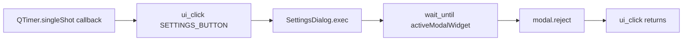

# Agent E2E Product Dialog Settle (PYPOST-919)

## Overview

One `agent_e2e` module (`tests/test_agent_dialog_settle_e2e.py`) includes a
**happy-path** proof and a **forced-timeout companion** (PYPOST-934) that
asserts `step` plus modal scalar keys on `UiWaitTimeoutError.diagnostics`.

The happy-path scenario proves that the shared settle/wait stack can wait for
a **real product dialog** after a UI action — not only synthetic delayed
widgets (`tests/test_ui_wait.py`) or the response panel after Send
([Agent Golden E2E](agent_golden_e2e.md)).

The proof opens Settings via `SETTINGS_BUTTON`, settles with
`wait_until` on `QApplication.activeModalWidget()`, then dismisses the modal
so `SettingsDialog.exec()` returns. It is a **composition** proof only: no
Settings save/apply assertions, no new wait subsystem, and no change to the
Send → response golden.

Source debt: [PYPOST-852](https://pypost.atlassian.net/browse/PYPOST-852) TD-1
(missing product-dialog settle under PYPOST-837 / PYPOST-838).

## Architecture

| Piece | Role |
| --- | --- |
| `tests/test_agent_dialog_settle_e2e.py` | Two tests: happy path + timeout companion |
| `tests/helpers/agent_e2e_dialog_settle.py` | Shared `run_product_dialog_settle` helper (PYPOST-936) |
| `tests/test_agent_dialog_settle_convention.py` | Convention lock on helper adoption |
| `test_agent_dialog_settle_after_settings_open` | Happy-path modal settle + dismiss |
| `…timeout_includes_step_and_modal_diag` | Forced settle timeout companion (934) |
| `SETTINGS_BUTTON` | Stable open control ([ui_identity](ui_identity.md)) |
| `session.ui_click` | Drives `MainWindow.open_settings` → `exec()` |
| `session.wait_until` | Bounded poll ([ui_wait](ui_wait.md)) |
| `QApplication.activeModalWidget()` | Presence signal (`objectName == SETTINGS_DIALOG`) |
| `QTimer.singleShot` | Runs wait + `reject()` inside nested `exec()` |
| `UiWaitTimeoutError` | Rewrap with `step=wait_dialog_after_settings_open` |



### Why timer-before-click

`SettingsDialog` opens with application-modal `exec()`. `ui_click` (via
`QTest.mouseClick`) does **not** return until the dialog closes. A naïve
“click then `wait_until`” never reaches the wait under a live modal.

Schedule the settle + dismiss with `QTimer.singleShot` **before**
`ui_click`, so the nested event loop runs the callback while `exec()` is
active. Always `reject()`/`close()` in `finally` so offscreen CI cannot hang
on an undismissed modal ([gui_testing](gui_testing.md)).

### Why not `wait_for_snapshot` / `wait_for_widget`

- Snapshot walks the **main window** tree; the modal is not a reliable child
  for that root.
- `SettingsDialog` exposes `SETTINGS_DIALOG` (`pypost_settings_dialog`) via
  `set_widget_id` — presence uses `activeModalWidget().objectName()`, not
  `wait_for_widget`.
- Prefer typed / simple waits over full-tree snapshot polls on hot paths
  ([ui_wait](ui_wait.md), PYPOST-852).

### Placement

Sibling module under `@pytest.mark.agent_e2e`, not inside
`tests/test_agent_golden_e2e.py`, so the Send golden stays single-purpose.
Harness table row: [agent_e2e.md](agent_e2e.md).

## API / Usage

### How to run

```bash
make test-agent-e2e
make test-agent-e2e PYTEST_ARGS="tests/test_agent_dialog_settle_e2e.py -v"
```

### Scenario steps

1. Ready session via `agent_e2e_session`; pre-flight `find_widget(SETTINGS_BUTTON)`.
2. Call `run_product_dialog_settle(session, click_widget_id=SETTINGS_BUTTON, …)` —
   the helper schedules `QTimer.singleShot(0, _on_settle)` where `_on_settle`:
   - `session.wait_until(wait_condition, …)`
   - on `UiWaitTimeoutError`, rewrap with `diagnostics["step"]` + `modal_diag()`
   - `finally`: `activeModalWidget().reject()` if still open
3. `session.ui_click(SETTINGS_BUTTON)` runs inside the helper (blocks in `exec`
   until reject).
4. Re-raise any callback error; assert settle succeeded.

### Timeout companion (PYPOST-934)

`test_agent_dialog_settle_timeout_includes_step_and_modal_diag` mirrors the
golden Send timeout companion
(`test_agent_golden_settle_timeout_includes_step_and_excerpt`):

1. Same `run_product_dialog_settle` skeleton; use a `settle_error` list from the
   helper return tuple because the callback runs async while `ui_click` blocks in
   `exec()`.
2. Pass `wait_condition=lambda: False` with `FORCED_SETTLE_TIMEOUT_S` and
   `condition_name="forced_dialog_settle_timeout"`.
3. On `UiWaitTimeoutError`, the helper rewraps with the same `step` +
   `modal_diag()` as the happy path.
4. After `ui_click` returns, assert `len(settle_error) == 1`, type is
   `UiWaitTimeoutError`, `diagnostics["step"] == SETTLE_STEP`, and keys
   `dialog_title` / `dialog_object_name` / `active_modal_type` are present
   (values may be `None`).

### Pattern sketch (shared helper)

```python
from pypost.agent import UiWaitTimeoutError, find_widget
from pypost.ui.widget_ids import SETTINGS_BUTTON
from tests.helpers.agent_e2e_dialog_settle import run_product_dialog_settle

# inside agent_e2e_session test:
find_widget(session.window, SETTINGS_BUTTON)

settle_ok, settle_error = run_product_dialog_settle(
    session,
    click_widget_id=SETTINGS_BUTTON,
    wait_condition=_settings_dialog_present,
    timeout=DIALOG_SETTLE_TIMEOUT_S,
    message="settings dialog did not appear after SETTINGS_BUTTON click",
    condition_name="settings_dialog_present",
    step=SETTLE_STEP,
)
if settle_error:
    raise settle_error[0]
assert settle_ok
```

Public surfaces consumed: `AgentAppSession` / `ui_click` / `wait_until`,
`find_widget`, `SETTINGS_BUTTON`, `UiWaitTimeoutError`. Settings predicate
(`_settings_dialog_present`) and `SETTLE_STEP` stay **test-local** in
`tests/test_agent_dialog_settle_e2e.py`. Timer orchestration and timeout rewrap
live in `tests/helpers/agent_e2e_dialog_settle.py` (`run_product_dialog_settle`,
`modal_diag`).

### Presence predicate

`_settings_dialog_present()` requires:

1. `QApplication.activeModalWidget()` is not `None`
2. `modal.objectName() == SETTINGS_DIALOG` (see [ui_identity](ui_identity.md))

## Configuration

| Setting | Value |
| --- | --- |
| Module `pytest.mark.timeout` | 60 s |
| `DIALOG_SETTLE_TIMEOUT_S` | 10.0 (happy-path `wait_until` budget) |
| `FORCED_SETTLE_TIMEOUT_S` | 0.05 (companion near-zero budget) |
| Timer delay | `QTimer.singleShot(0, …)` |
| Happy-path `condition_name` | `settings_dialog_present` |
| Companion `condition_name` | `forced_dialog_settle_timeout` |
| `SETTLE_STEP` | `wait_dialog_after_settings_open` |

No extra environment variables. Prefer `make test-agent-e2e` for
`QT_QPA_PLATFORM=offscreen`.

## Troubleshooting

| Failure | What to do |
| --- | --- |
| Hang / module timeout on Settings click | You waited **after** `ui_click` with a |
| | live `exec()` modal. Schedule settle + dismiss |
| | **before** the click. |
| Dialog settle `UiWaitTimeoutError` | Look for |
| | `step=wait_dialog_after_settings_open`. Check |
| | `dialog_title` / `dialog_object_name` / `active_modal_type` on |
| | `err.diagnostics`; confirm `dialog_object_name` is |
| | `pypost_settings_dialog`. |
| `UiTargetNotFoundError` on Settings | Confirm `SETTINGS_BUTTON` and `is_ui_ready` |
| | ([ui_identity](ui_identity.md)). |
| Undismissed modal hangs teardown | Ensure `reject()`/`close()` in `finally` |
| | inside the timer callback. |
| Confused with Settings unit e2e | Those often **patch** `SettingsDialog.exec`. |
| | This scenario keeps a real modal to prove settle. |
| Companion diag assertion failure | Confirm rewrap still sets `step` and |
| | `_modal_diag()` keys. Near-zero budget may leave |
| | `dialog_title` / `active_modal_type` as `None`; asserts |
| | check key **presence**, not values. |

Observability reuses DEBUG `ui_wait_settled` / `ui_wait_timeout` with
`condition=settings_dialog_present`. Failure context is primarily the
exception path (`step` + modal scalars), not new production metrics. Catalog:
[logging.md](logging.md).

## Related

- [Agent UI E2E](agent_e2e.md) — umbrella, harness table, `make test-agent-e2e`
- [Agent Golden E2E](agent_golden_e2e.md) — Send → response (sibling proof)
- [UI Settle / Wait Helpers](ui_wait.md) — `wait_until` / `UiWaitTimeoutError`
- [UI Widget Identity](ui_identity.md) — `SETTINGS_BUTTON`
- [UI Action Tools](ui_actions.md) — `ui_click`
- [Settings Dialog](settings_dialog.md) — product Settings surface
- [GUI Testing](gui_testing.md) — offscreen Qt, modal hang pitfalls
- [Logging Event Naming Convention](logging.md) — `ui_wait_*` events
