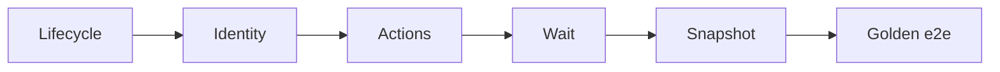

# Agent UI E2E (PYPOST-839)

## Overview

PyPost’s **agent UI e2e** stack lets an in-process harness (or agent) launch
the desktop app offscreen, address controls by stable ids, drive actions,
wait for settle, capture UI snapshots, and prove one golden product flow.

This page is the **umbrella entry** for that stack. Capability contracts live
in sibling docs; the golden Send → response proof lives in
[agent_golden_e2e.md](agent_golden_e2e.md). The reusable **environment pack**
model (seed, isolation, fixtures inventory) is
[agent_e2e_env.md](agent_e2e_env.md).

Prefer `make test-agent-e2e` over ad-hoc pytest one-liners.

This is **not** live MCP verification against a running PyPost. For MCP tools
and Prometheus checks, see [testing.md](testing.md) and
[mcp_integration.md](mcp_integration.md).

## Architecture

| Layer | Doc / module | Role |
| --- | --- | --- |
| Lifecycle | [agent_lifecycle.md](agent_lifecycle.md) | Launch → ready → shutdown |
| Identity | [ui_identity.md](ui_identity.md) | Stable `objectName` / `widget_ids` |
| Actions | [ui_actions.md](ui_actions.md) | click / fill / select / key |
| Snapshot | [ui_snapshot.md](ui_snapshot.md) | Structured visible-UI tree |
| Wait | [ui_wait.md](ui_wait.md) | Settle predicates after actions |
| Golden | [agent_golden_e2e.md](agent_golden_e2e.md) | Composed Send → response proof |
| Env pack | [agent_e2e_env.md](agent_e2e_env.md) | Seed, isolation, HTTP, markers (855) |
| Seed inventory | [agent_e2e_seed.md](agent_e2e_seed.md) | Known collections/envs/requests (857) |
| GUI notes | [gui_testing.md](gui_testing.md) | Offscreen Qt, fixtures, pitfalls |



Public APIs are re-exported from `pypost.agent` (session mirrors included).
Do not reinvent helpers inside tests when the package API already covers the
step.

## API / Usage

### How to run

Install once, then use the dedicated target (offscreen Qt via Makefile):

```bash
make install
make test-agent-e2e
```

Default modules:

| Module | Covers |
| --- | --- |
| `tests/test_agent_lifecycle_smoke.py` | Lifecycle smoke |
| `tests/test_ui_identity_spotcheck.py` | Identity spot-check |
| `tests/test_ui_actions.py` | Action primitives |
| `tests/test_ui_snapshot.py` | Snapshot capture |
| `tests/test_ui_wait.py` | Settle / wait |
| `tests/test_agent_golden_e2e.py` | Golden product flow |
| `tests/test_agent_e2e_seed.py` | Seeded workspace (857) |

Override the file list like other test targets (`PYTEST_ARGS` **replaces**
defaults):

```bash
make test-agent-e2e PYTEST_ARGS="tests/test_agent_golden_e2e.py -v"
```

The same modules still run under the full fast suite:

```bash
make test
```

### Setup checklist

1. `make install` (venv + `.[dev,otel]`).
2. Prefer Makefile targets — they set `QT_QPA_PLATFORM=offscreen`.
3. Read identity convention before adding controls:
   [ui_identity.md](ui_identity.md).
4. Compose with `AgentAppSession` + session UI helpers; see lifecycle and
   actions docs.
5. For product proof, start from the golden scenario rather than a new
   one-off flow.

### Tools map (what agents call)

| Need | Entry |
| --- | --- |
| Session | `AgentAppSession(offscreen=True)` |
| Find / ids | `pypost.ui.widget_ids` + `find_widget` |
| Drive UI | `session.ui_fill` / `ui_select` / `ui_click` / … |
| Observe | `session.ui_snapshot()` |
| Settle | `session.wait_for_snapshot` / `wait_until` / … |

### Identity convention

Stable ids live in `pypost/ui/widget_ids.py` and are applied on widgets as
`objectName`. Agents must target those constants — not brittle labels or
geometry. Details and catalog: [ui_identity.md](ui_identity.md).

### Golden scenario

One intentional flow: blank request → set URL/method → Send (mocked HTTP
200) → assert response panel status and body. Full steps and fixtures:
[agent_golden_e2e.md](agent_golden_e2e.md).

## Configuration

| Setting | Source |
| --- | --- |
| Offscreen Qt | `make test-agent-e2e` / `make test` (`QT_QPA_PLATFORM=offscreen`) |
| Session offscreen | `AgentAppSession(offscreen=True)` also setdefaults the env var |
| Scoped args | `PYTEST_ARGS` on make test targets (replaces defaults when set) |
| Module timeouts | Per-test / module `pytest.mark.timeout` (see sibling docs) |

No extra env vars beyond the project’s standard GUI test path.

When adding another agent e2e module, append it to the default file list in
the `test-agent-e2e` Makefile target (and link it from this page).

## Troubleshooting

| Issue | What to do |
| --- | --- |
| Qt / display errors | Run via `make test-agent-e2e` (not bare pytest without offscreen) |
| Golden wait timeout | See [agent_golden_e2e.md](agent_golden_e2e.md) failure table |
| Missing control | Confirm id in `widget_ids` and `is_ui_ready` |
| Confused with MCP | MCP needs a running app + MCP enabled; agent e2e is in-process pytest |
| Want one file only | `make test-agent-e2e PYTEST_ARGS="tests/test_….py -v"` |

More GUI pitfalls: [gui_testing.md](gui_testing.md). Suite-wide pytest /
timeouts: [testing.md](testing.md).

## Related

- [Agent App Lifecycle](agent_lifecycle.md)
- [UI Widget Identity](ui_identity.md)
- [UI Action Tools](ui_actions.md)
- [UI State Snapshot](ui_snapshot.md)
- [UI Settle / Wait Helpers](ui_wait.md)
- [Agent Golden E2E](agent_golden_e2e.md)
- [Agent E2E Environment Contract](agent_e2e_env.md)
- [Agent E2E Seed Inventory](agent_e2e_seed.md)
- [GUI Testing](gui_testing.md)
- [Testing via MCP and Prometheus](testing.md)
- [MCP Integration](mcp_integration.md)
