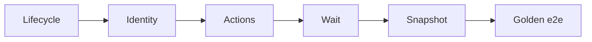

# Agent UI E2E (PYPOST-839)

## Overview

PyPost’s **agent UI e2e** stack lets an in-process harness (or agent) launch
the desktop app offscreen, address controls by stable ids, drive actions,
wait for settle, capture UI snapshots, and prove one golden product flow.

This page is the **umbrella entry** for that stack. Capability contracts live
in sibling docs; the golden Send → response proof lives in
[agent_golden_e2e.md](agent_golden_e2e.md). The PYPOST-887 double-body
regression lock (exactly-once panel body) is
[agent_e2e_double_response_body.md](agent_e2e_double_response_body.md).
The method × body **presentation matrix** (PYPOST-890) is
[agent_e2e_presentation_matrix.md](agent_e2e_presentation_matrix.md).
The reusable **environment pack** model (seed, isolation, fixtures inventory)
is [agent_e2e_env.md](agent_e2e_env.md).

Prefer `make test-agent-e2e` over ad-hoc pytest one-liners. CI gates the same
target via the `agent-e2e` job in `.github/workflows/test.yml` (PYPOST-861);
the main fast suite also includes these tests via `-m "not slow"` (intentional
3.11 double-run; DEFER trim — PYPOST-873 / [testing.md](testing.md)).

This is **not** live MCP verification against a running PyPost. For MCP tools
and Prometheus checks, see [testing.md](testing.md) and
[mcp_integration.md](mcp_integration.md).

## Architecture

| Layer | Doc / module | Role |
| --- | --- | --- |
| Lifecycle | [agent_lifecycle.md](agent_lifecycle.md) | Launch → ready → shutdown |
| Identity | [ui_identity.md](ui_identity.md) | Stable `objectName` / `widget_ids` |
| Actions | [ui_actions.md](ui_actions.md) | click / fill / select / key |
| Snapshot | [ui_snapshot.md](ui_snapshot.md) | Structured visible-UI tree |
| Wait | [ui_wait.md](ui_wait.md) | Settle predicates after actions |
| Golden | [agent_golden_e2e.md](agent_golden_e2e.md) | Composed Send → response proof |
| Body lock | [lock doc](agent_e2e_double_response_body.md) | Exactly-once body (889) |
| Presentation matrix | [matrix](agent_e2e_presentation_matrix.md) | Method × body (890) |
| Env pack | [agent_e2e_env.md](agent_e2e_env.md) | Seed, isolation, HTTP, markers (855) |
| Seed inventory | [agent_e2e_seed.md](agent_e2e_seed.md) | Known collections/envs/requests (857) |
| HTTP stubs | [agent_e2e_http.md](agent_e2e_http.md) | Canned responses at send boundary (859) |
| GUI notes | [gui_testing.md](gui_testing.md) | Offscreen Qt, fixtures, pitfalls |



Public APIs are re-exported from `pypost.agent` (session mirrors included).
Do not reinvent helpers inside tests when the package API already covers the
step.

## API / Usage

### How to run

Install once, then use the dedicated target (offscreen Qt via Makefile):

```bash
make install
make test-agent-e2e
```

Default selection is the registered `agent_e2e` marker, composed with
`not slow` (CLI `-m` overrides `addopts`, so the recipe uses
`-m "agent_e2e and not slow"`):

```bash
make test-agent-e2e
# equivalent: pytest -m "agent_e2e and not slow"
```

Harness modules under the marker (also the documented file-list override):

| Module | Covers |
| --- | --- |
| `tests/test_agent_lifecycle_smoke.py` | Lifecycle smoke |
| `tests/test_ui_identity_spotcheck.py` | Identity spot-check |
| `tests/test_ui_actions.py` | Action primitives |
| `tests/test_ui_snapshot.py` | Snapshot capture |
| `tests/test_ui_wait.py` | Settle / wait |
| `tests/test_agent_golden_e2e.py` | Golden product flow |
| `tests/test_agent_e2e_double_response_body.py` | Double-body lock (889) |
| `tests/test_agent_e2e_presentation_matrix.py` | Presentation matrix (890) |
| `tests/test_agent_e2e_seed.py` | Seeded workspace (857) + failure caplog (862) |
| `tests/test_agent_e2e_http_env.py` | Env Send + shared HTTP (859) |
| `tests/test_agent_e2e_http_seed_post.py` | Seed POST Send + body (871) |
| `tests/test_agent_e2e_failure_artifacts.py` | Failure snapshot dumps (860) |

**Keep this table synced with markers:** when you add or remove
`@pytest.mark.agent_e2e` on a module, update the Module column above in the
same change. Pure unit drift guards (for example seed inventory
`tests/test_agent_e2e_seed_inventory_doc.py`, or this table’s own guard
`tests/test_agent_e2e_harness_table_doc.py`) must **not** carry `agent_e2e`
and must **not** appear in this table — see [agent_e2e_seed.md](agent_e2e_seed.md)
for the seed inventory check. `make test` runs
`tests/test_agent_e2e_harness_table_doc.py`, which fails if the marked set
and this table diverge.

Narrow to an explicit file list via `PYTEST_ARGS` (replaces the default
`-m` expression):

```bash
make test-agent-e2e PYTEST_ARGS="tests/test_agent_golden_e2e.py -v"
```

The same modules still run under the full fast suite:

```bash
make test
```

### CI (PYPOST-861)

| Entry | What runs |
| --- | --- |
| Job `agent-e2e` | `make install` then `make test-agent-e2e` (Python 3.11) |
| Job `test` (matrix) | `pytest tests/ -m "not slow"` — includes `agent_e2e` |

Prefer the make target locally and when debugging pack failures. The dedicated
job proves the Makefile recipe; the matrix keeps multi-version coverage.

On Python 3.11 that means an **intentional double-run** of the pack (main
matrix + `agent-e2e`). [PYPOST-873](https://pypost.atlassian.net/browse/PYPOST-873)
**DEFER**s a CI cost trim that would exclude `agent_e2e` from the main job —
**revisit when** minutes or double-failure pain justify ENABLE (see
[testing.md](testing.md) § Agent e2e CI double-run).

See [testing.md](testing.md) for suite-wide CI layout.

### Marker: `agent_e2e`

Registered in `pyproject.toml` (`[tool.pytest.ini_options] markers`).

Apply it (usually at module scope next to `timeout`) on agent UI e2e /
env-pack scenarios:

```python
pytestmark = [
    pytest.mark.timeout(60),
    pytest.mark.agent_e2e,
]
```

Select with `-m agent_e2e` (or the make target above). List markers via
`pytest --markers`.

### Shared session fixtures

Defined in `tests/_pytest_plugins/agent_e2e.py` (loaded via
`tests/conftest.py`). Both are **function-scoped** and yield a ready
`AgentAppSession` (`offscreen=True`, `ready_timeout=30.0`).

| Fixture | Workspace | Use when |
| --- | --- | --- |
| `agent_e2e_session` | Blank (session-owned temps) | Lifecycle, identity, actions, golden |
| `seeded_agent_e2e_session` | PYPOST-857 seed via `seeded_agent_dirs()` | Seeded inventory / env Send |
| `agent_e2e_http_stub` | Yields `stub_agent_e2e_http` | Deterministic Send (PYPOST-859) |

```python
def test_ready(agent_e2e_session):
    assert agent_e2e_session.window.is_ui_ready


def test_seeded(seeded_agent_e2e_session):
    assert seeded_agent_e2e_session.window.is_ui_ready
```

Multi-session isolation tests keep constructing `AgentAppSession` directly
(fixtures yield one instance per request). Prefer fixtures for single-session
scenarios.

After the session is ready, each packaging fixture logs INFO
`agent_e2e_fixture_ready mode=blank` or `mode=seeded` (logger
`tests._pytest_plugins.agent_e2e`). Caplog proof (PYPOST-867):
`tests/test_agent_e2e_packaging_logs.py` — pure unit (mocked session
boundary); must **not** carry `agent_e2e` and must **not** appear in the
harness table above. Catalog: [logging.md](logging.md).

### Setup checklist

1. `make install` (venv + `.[dev,otel]`).
2. Prefer Makefile targets — they set `QT_QPA_PLATFORM=offscreen`.
3. Read identity convention before adding controls:
   [ui_identity.md](ui_identity.md).
4. Prefer `agent_e2e_session` / `seeded_agent_e2e_session`; mark new modules
   `agent_e2e`. Direct `AgentAppSession` remains valid for multi-session proofs.
5. For product proof, start from the golden scenario rather than a new
   one-off flow.

### Tools map (what agents call)

| Need | Entry |
| --- | --- |
| Session (shared) | fixtures `agent_e2e_session` / `seeded_agent_e2e_session` |
| Session (direct) | `AgentAppSession(offscreen=True)` |
| HTTP stub (shared) | `stub_agent_e2e_http` / fixture `agent_e2e_http_stub` |
| Find / ids | `pypost.ui.widget_ids` + `find_widget` |
| Drive UI | `session.ui_fill` / `ui_select` / `ui_click` / … |
| Observe | `session.ui_snapshot()` |
| Settle | `session.wait_for_snapshot` / `wait_until` / … |
| Failure dump | Auto on fixture assert fail — [failure artifacts](agent_e2e_failure_artifacts.md) |
| Response-panel snapshot helpers | `tests.helpers.agent_e2e_response_panel` — [helpers doc](agent_e2e_response_panel.md) |

### Identity convention

Stable ids live in `pypost/ui/widget_ids.py` and are applied on widgets as
`objectName`. Agents must target those constants — not brittle labels or
geometry. Details and catalog: [ui_identity.md](ui_identity.md).

### Golden scenario

One intentional flow: blank request → set URL/method → Send (shared HTTP
stub 200) → assert response panel status and body. Full steps:
[agent_golden_e2e.md](agent_golden_e2e.md). Shared HTTP catalog:
[agent_e2e_http.md](agent_e2e_http.md).

### Double-body regression lock

PUT + malformed nested JSON-like body → stubbed Send with one streamed chunk
→ assert the response body token appears **exactly once** under
`RESPONSE_PANEL`. See
[agent_e2e_double_response_body.md](agent_e2e_double_response_body.md)
(product discard: [response-streaming-display.md](response-streaming-display.md)).

### Presentation matrix (PYPOST-890)

Parametrized method × body-shape cells assert once-only body token and
once-only status under `RESPONSE_PANEL`. Smoke slice runs under default
`make test-agent-e2e`; full 25-cell cartesian needs `-m agent_e2e` (includes
`slow`). Findings handoff: `ai-tasks/PYPOST-890/findings.md`. Triage
(PYPOST-891, empty findings → won’t file):
`ai-tasks/PYPOST-891/triage-summary.md`. See
[agent_e2e_presentation_matrix.md](agent_e2e_presentation_matrix.md).

## Configuration

| Setting | Source |
| --- | --- |
| Offscreen Qt | `make test-agent-e2e` / `make test` (`QT_QPA_PLATFORM=offscreen`) |
| Session offscreen | Fixtures / `AgentAppSession(offscreen=True)` setdefault the env var |
| Marker selection | `make test-agent-e2e` → `-m "agent_e2e and not slow"` |
| File-list override | `PYTEST_ARGS` replaces the default `-m` expression |
| CI make gate | `.github/workflows/test.yml` job `agent-e2e` (PYPOST-861) |
| Failure artifacts | `artifacts/agent_e2e/` or `PYPOST_AGENT_E2E_ARTIFACTS` (860) |
| Module timeouts | Per-test / module `pytest.mark.timeout` (see sibling docs) |

Failure dumps: [agent_e2e_failure_artifacts.md](agent_e2e_failure_artifacts.md).
Otherwise no extra env vars beyond the project’s standard GUI test path.

When adding another agent e2e module, mark it `@pytest.mark.agent_e2e`
and add a row to the harness table above (same PR). When removing the
mark, drop the row. File-list `PYTEST_ARGS` overrides remain supported
for narrow runs.

## Troubleshooting

| Issue | What to do |
| --- | --- |
| Qt / display errors | Run via `make test-agent-e2e` (not bare pytest without offscreen) |
| Golden wait timeout | See [agent_golden_e2e.md](agent_golden_e2e.md) failure table |
| Missing control | Confirm id in `widget_ids` and `is_ui_ready` |
| Confused with MCP | MCP needs a running app + MCP enabled; agent e2e is in-process pytest |
| Want one file only | `make test-agent-e2e PYTEST_ARGS="tests/test_….py -v"` |
| Marker not listed | Confirm registration in `pyproject.toml`; run `pytest --markers` |
| CI make gate red | Reproduce with `make install && make test-agent-e2e`; see job |
| | `agent-e2e` in `.github/workflows/test.yml` |
| Assert fail, need UI state | Open `artifacts/agent_e2e/` — see |
| | [agent_e2e_failure_artifacts.md](agent_e2e_failure_artifacts.md) |
| Harness table ≠ marks | Align Module rows with `@pytest.mark.agent_e2e`; |
| | run `make test PYTEST_ARGS=` |
| | `"tests/test_agent_e2e_harness_table_doc.py -v"` |
| | (PYPOST-866) |
| Ready log missing / renamed | Assert under |
| | `caplog.at_level(INFO, logger="tests._pytest_plugins.agent_e2e")`; |
| | run `make test PYTEST_ARGS=` |
| | `"tests/test_agent_e2e_packaging_logs.py -v"` (PYPOST-867) |

More GUI pitfalls: [gui_testing.md](gui_testing.md). Suite-wide pytest /
timeouts: [testing.md](testing.md).

## Related

- [Agent App Lifecycle](agent_lifecycle.md)
- [UI Widget Identity](ui_identity.md)
- [UI Action Tools](ui_actions.md)
- [UI State Snapshot](ui_snapshot.md)
- [UI Settle / Wait Helpers](ui_wait.md)
- [Agent Golden E2E](agent_golden_e2e.md)
- [Agent E2E Double Response-Body Lock](agent_e2e_double_response_body.md)
- [Agent E2E Presentation Matrix](agent_e2e_presentation_matrix.md)
- [Agent E2E Environment Contract](agent_e2e_env.md)
- [Agent E2E Seed Inventory](agent_e2e_seed.md)
- [Agent E2E HTTP Fixture Layer](agent_e2e_http.md)
- [Agent E2E Failure Artifacts](agent_e2e_failure_artifacts.md)
- [GUI Testing](gui_testing.md)
- [Testing via MCP and Prometheus](testing.md)
- [MCP Integration](mcp_integration.md)
