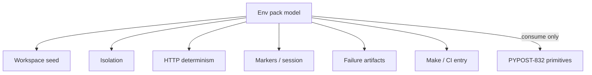

# Agent E2E Environment Contract (PYPOST-856)

## Overview

The **agent e2e environment pack** (epic
[PYPOST-855](https://pypost.atlassian.net/browse/PYPOST-855)) sits on top of
the PYPOST-832 drive/observe stack. It defines a reusable seeded workspace,
shared fixtures and markers, deterministic HTTP, failure artifacts, and a
make/CI entry so scenarios do not invent private bootstrap paths.

This page is the **environment contract**: what is seeded, how isolation and
offscreen/CI work at a business level, how scenarios consume a ready env, and
which fixture areas siblings implement. It does **not** implement those
fixtures (PYPOST-857–861).

Drive/observe primitives and broader-pack packaging (`make test-agent-e2e`
beyond golden; PYPOST-922) remain under [Agent UI E2E](agent_e2e.md).
Golden’s blank-tab + shared HTTP stub
([agent_golden_e2e.md](agent_golden_e2e.md),
[agent_e2e_http.md](agent_e2e_http.md)) proves composition; the env pack
is the **primary** path when scenarios need seeded workspace state.

## Architecture

### Environment model

Fixture areas (later code), not product features. Sibling stories own concrete
pytest names and module paths; this contract names areas and ownership only.
Browse links: [857](https://pypost.atlassian.net/browse/PYPOST-857),
[858](https://pypost.atlassian.net/browse/PYPOST-858),
[859](https://pypost.atlassian.net/browse/PYPOST-859),
[860](https://pypost.atlassian.net/browse/PYPOST-860),
[861](https://pypost.atlassian.net/browse/PYPOST-861).

| Module | Implements |
| --- | --- |
| Seeded workspace | PYPOST-857 |
| Isolation | Cross-cutting (session / seed) |
| HTTP determinism | PYPOST-859 |
| Markers / session fixture | PYPOST-858 |
| Failure artifacts | PYPOST-860 |
| Make / CI entry | PYPOST-861 |

- **Seeded workspace** — After bootstrap: known collections, environments, and
  sample requests so scenarios do not hand-build that UI state.
- **Isolation** — One scenario’s mutable data/session does not bleed into
  another.
- **HTTP determinism** — Canned responses at the HTTP boundary; UI → worker
  path stays real; no live external HTTP as the primary path.
- **Markers / session fixture** — Shared bootstrap: ready session (+ seed when
  available) via one documented consumption entry.
- **Failure artifacts** — On assert fail, dump snapshot / concise diagnostics
  without exposing secrets contrary to snapshot masking.
- **Make / CI entry** — Env pack runnable via project-standard make (and CI)
  under offscreen Qt — not undocumented shell-only recipes.



### Boundaries versus PYPOST-832

| Concern | Env pack (855) | Primitives (832) |
| --- | --- | --- |
| Launch / ready / shutdown | Consumes | Owns (`AgentAppSession`) |
| Stable widget ids | Consumes | Owns (`widget_ids`) |
| click / fill / select / key | Consumes | Owns (ui actions) |
| Snapshot / wait / golden composition | Consumes (artifacts reuse snapshot) | Owns |
| Workspace seed inventory | Owns (model); 857 implements | Does not own |
| Shared marker / session fixture packaging | Owns (model); 858 implements | Does not own |
| Shared HTTP determinism | Owns (model); 859 delivers | Uses shared layer (859) |
| Failure artifact dumps | Owns (model); 860 implements | Snapshot API only |
| Make/CI for **env pack** | Owns (model); 861 | `test-agent-e2e` packs 832 harness |

**Rule:** the env pack builds **on** primitives; it must not replace or fork
their public APIs.

### Seeded workspace (expectations)

After env bootstrap, a scenario can assume:

- Known **collections** are present and selectable in the UI.
- Known **environments** are available for variable resolution.
- Known **sample requests** exist so authors need not assemble URL/method/body
  solely to reach a meaningful product state.

Exact seed inventory (ids, display names, sample requests, `base_url`) lives
in [agent_e2e_seed.md](agent_e2e_seed.md) and
`pypost/fixtures/agent_e2e_seed.py` (PYPOST-857). This contract requires that
seed be **shared and documented**, not ad-hoc per test.

### Isolation

- Scenarios use **scoped temporary** config and data dirs (same mental model as
  agent lifecycle isolation).
- Do not rely on developer home directories or leftover collections from a
  prior test.
- One scenario’s mutable session/workspace state must not bleed into another’s.

### Offscreen and CI assumptions

- **Offscreen Qt:** `QT_QPA_PLATFORM=offscreen` via Makefile / established GUI
  path ([gui_testing.md](gui_testing.md), [agent_e2e.md](agent_e2e.md)).
- **Determinism:** no live network as the default agent-flow path; HTTP
  boundary stubbed through the shared layer (PYPOST-859).
- **Run entry:** `make test-agent-e2e` (and CI job `agent-e2e`) are the
  first-class **broader** pack make/CI path beyond golden (PYPOST-922
  discoverability; PYPOST-861 smoke). Do not treat undocumented shell-only
  recipes as the contract.
- **Secrets:** failure dumps must not weaken snapshot / masking policy
  ([ui_snapshot.md](ui_snapshot.md)); dump format and enforcement are owned by
  PYPOST-860.

### Scenario consumption lifecycle

Business-level path (no concrete fixture APIs required here):

```mermaid
sequenceDiagram
  participant S as Scenario
  participant E as Env pack
  participant P as PYPOST-832 primitives

  S->>E: Obtain ready env
  Note over E: session + seed + HTTP determinism<br/>as applicable; markers select pack
  S->>P: Drive / observe (actions wait snapshot)
  S->>E: Assert / release
  Note over E: tear down; on fail dump artifacts
```

1. **Bootstrap** — obtain a ready environment (session + seed + HTTP
   determinism as applicable) through the shared env pack path, not by
   hand-building UI state or one-off HTTP patches as the primary path.
2. **Act / observe** — use existing PYPOST-832 capabilities (actions, wait,
   snapshot, identity); do not redefine those APIs.
3. **Tear down** — release scoped resources; on failure, artifact expectations
   apply (PYPOST-860).

Golden remains a valid **composition proof**. Env scenarios that need seeded
workspace state should prefer seed + the shared HTTP layer
([agent_e2e_http.md](agent_e2e_http.md)).

## Implementation status

Contract story (PYPOST-856) delivered the model below. Sibling fixture areas
land incrementally:

| Area | Story | Status |
| --- | --- | --- |
| Workspace seed | PYPOST-857 | Delivered — [agent_e2e_seed.md](agent_e2e_seed.md) |
| Session + `agent_e2e` marker | PYPOST-858 | Delivered — fixtures + marker in [agent_e2e.md](agent_e2e.md) |
| Deterministic HTTP layer | PYPOST-859 | Delivered — [agent_e2e_http.md](agent_e2e_http.md) |
| Failure artifacts | PYPOST-860 | Delivered — [agent_e2e_failure_artifacts.md](agent_e2e_failure_artifacts.md) |
| Make / CI for env pack | PYPOST-861 | Delivered — see [agent_e2e.md](agent_e2e.md) |

## Related

- [Agent UI E2E](agent_e2e.md) — umbrella + broader primary packaging
  (`make test-agent-e2e`, PYPOST-922)
- [Agent E2E Seed Inventory](agent_e2e_seed.md) — PYPOST-857 workspace seed
- [Agent E2E HTTP Fixture Layer](agent_e2e_http.md) — PYPOST-859 canned HTTP
- [Agent E2E Failure Artifacts](agent_e2e_failure_artifacts.md) — PYPOST-860 dumps
- [Agent Golden E2E](agent_golden_e2e.md) — composition proof
- [Agent App Lifecycle](agent_lifecycle.md)
- [UI Widget Identity](ui_identity.md)
- [UI Action Tools](ui_actions.md)
- [UI State Snapshot](ui_snapshot.md)
- [UI Settle / Wait Helpers](ui_wait.md)
- [GUI Testing](gui_testing.md)
- [Testing via MCP and Prometheus](testing.md)
