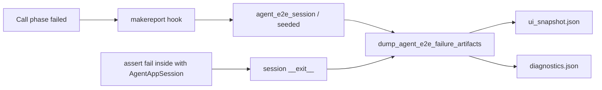

# Agent E2E Failure Artifacts (PYPOST-860)

## Overview

When an agent e2e scenario fails during the pytest **call** phase — whether
it used a shared session fixture **or** constructed `AgentAppSession`
directly — the harness dumps a **masked UI snapshot** and **concise
diagnostics** to disk. Authors and CI can inspect the UI state without
re-running the failure locally.

Env contract area: [agent_e2e_env.md](agent_e2e_env.md). Snapshot API and
masking: [ui_snapshot.md](ui_snapshot.md). Session fixtures:
[agent_e2e.md](agent_e2e.md).

## Architecture

| Component | Role |
| --- | --- |
| `pypost/fixtures/agent_e2e_failure.py` | Path helpers + `dump_agent_e2e_failure_artifacts` |
| `pytest_runtest_makereport` in `tests/_pytest_plugins/agent_e2e.py` | Auto-dump on fixture call failure |
| `AgentAppSession.__exit__` + plugin dump hook | Auto-dump for direct constructions (PYPOST-875) |
| `session.ui_snapshot()` | Masked tree (PYPOST-835) written to JSON |
| `artifacts/agent_e2e/` | Default on-disk root (gitignored) |



Wiring is automatic for tests that request `agent_e2e_session` or
`seeded_agent_e2e_session` (golden and env-pack Send included), **and** for
tests that construct `AgentAppSession` directly with
`with AgentAppSession(...):` while the agent e2e pytest plugin is loaded
(PYPOST-875). Manual helper calls remain available for ad-hoc probes.

## Where artifacts land

| Setting | Location |
| --- | --- |
| Default | `{pytest rootpath}/artifacts/agent_e2e/` |
| Override | `PYPOST_AGENT_E2E_ARTIFACTS` (absolute, or relative to cwd) |

Per failure:

```text
artifacts/agent_e2e/
  <safe_nodeid>/
    ui_snapshot.json
    diagnostics.json
```

`<safe_nodeid>` is the pytest nodeid with non-filesystem characters
replaced (e.g. `tests_test_agent_golden_e2e_py__test_agent_golden_…`).

The `artifacts/` directory is gitignored.

## How to read dumps

### `ui_snapshot.json`

Same shape as [ui_snapshot.md](ui_snapshot.md): nested
`role` / `name` / `value` / `children`. String values are already masked
via `sanitize_text` (hidden env values + heuristics). Prefer locating
`pypost_*` names (e.g. `pypost_response_panel`) and reading `value`
fields.

### `diagnostics.json`

Scalars / short strings only:

| Field | Meaning |
| --- | --- |
| `nodeid` | Pytest node id |
| `exc_type` | Exception type name |
| `exc_message` | Truncated message (max 500 chars) |
| `session_fixture` | `agent_e2e_session`, `seeded_agent_e2e_session`, or `direct` |
| `ui_ready` | `MainWindow.is_ui_ready` at dump time (or null) |

Does **not** include env vars, hidden keys, or the snapshot tree.

### Log line

On success the helper logs INFO:

```text
agent_e2e_failure_artifacts_written path=… nodeid=…
```

On dump failure (capture/I/O), WARNING
`agent_e2e_failure_artifacts_failed` with `error=<ExcType>` — the original
test failure remains the primary result.

Best-effort catch set (`_DUMP_BEST_EFFORT_ERRORS`, PYPOST-876):
`OSError`, `RuntimeError`, `TypeError`, `ValueError`, `AttributeError`.
Other exception types from the dump body propagate (they are not converted
into a dump-failed WARNING).

## API / Usage

### Automatic (preferred)

No per-test code for packaging fixtures; on assert fail the makereport hook
dumps:

```python
def test_flow(agent_e2e_session):
    assert agent_e2e_session.window.is_ui_ready
    # …
```

Direct constructions also auto-dump when the agent e2e plugin is loaded
(normal `make test` / `make test-agent-e2e`). Dump runs in
`AgentAppSession.__exit__` while the session is still alive:

```python
from pypost.agent import AgentAppSession

def test_isolation():
    with AgentAppSession(offscreen=True) as session:
        assert session.window.is_ui_ready
        # assert fail here → dump with session_fixture=direct
```

### Manual helper

```python
from pathlib import Path
from pypost.fixtures.agent_e2e_failure import (
    dump_agent_e2e_failure_artifacts,
)

dump_agent_e2e_failure_artifacts(
    session,
    nodeid="manual_probe",
    exc_type="AssertionError",
    exc_message="expected panel text",
    session_fixture="agent_e2e_session",
    artifact_root=Path("/tmp/agent_e2e_dumps"),
)
```

## Configuration

| Variable | Effect |
| --- | --- |
| `PYPOST_AGENT_E2E_ARTIFACTS` | Override artifact root |
| `QT_QPA_PLATFORM=offscreen` | Required for GUI session (via make) |

## Secrets

Dumps reuse `session.ui_snapshot()` / `capture_ui_snapshot` — the same
masking as PYPOST-835. Do not log the tree or values. Avoid putting
secrets in assert messages (they appear truncated in `diagnostics.json`).

## CI upload (PYPOST-874) — ENABLE

Job `agent-e2e` in `.github/workflows/test.yml` **ENABLE**s failure-only
upload of `artifacts/agent_e2e/` via pinned `actions/upload-artifact`
(`if: failure()`). Artifact name: `agent-e2e-failure-artifacts`.

After a red `agent-e2e` run, download that artifact from the Actions run
summary (Artifacts). Contents match the on-disk layout above (masked
`ui_snapshot.json` + `diagnostics.json`). If the job failed before dumps
existed (e.g. `make install`), the upload step ignores a missing path.

Local diagnosis still uses files on disk under the documented root.
Contract lock: `tests/test_agent_e2e_ci_failure_upload_doc.py`.

## Tests

`tests/test_agent_e2e_failure_artifacts.py` covers helper write/masking,
best-effort errors (`RuntimeError`), propagation of unexpected dump errors
(`LookupError`, PYPOST-876), a subprocess proof that the makereport hook
dumps on fixture assert fail, and a subprocess proof that direct
`AgentAppSession` constructions dump on assert fail (`make test-agent-e2e`).

## Troubleshooting

| Issue | What to do |
| --- | --- |
| No dump after failure | Confirm packaging fixture **or** `with AgentAppSession` under the agent e2e plugin; assert must fail inside the live session |
| Empty / wrong root | Check `PYPOST_AGENT_E2E_ARTIFACTS` and pytest `rootpath` |
| Cleartext secret in JSON | Key must be in `hidden_keys` for the active env; see [ui_snapshot.md](ui_snapshot.md) |
| Dump WARNING only | Capture failed with a best-effort type; fix session ready / window; original fail still reported |
| Unexpected dump exception in traceback | Helper bug outside the best-effort catch set; fix dump path (PYPOST-876) |
| `session_fixture=direct` | Expected for bare `AgentAppSession` constructions (PYPOST-875) |

## Related

- [Agent UI E2E](agent_e2e.md)
- [Agent E2E Environment Contract](agent_e2e_env.md)
- [UI State Snapshot](ui_snapshot.md)
- [Agent Golden E2E](agent_golden_e2e.md)
- [Agent E2E HTTP Fixture Layer](agent_e2e_http.md)
- [Logging](logging.md)
