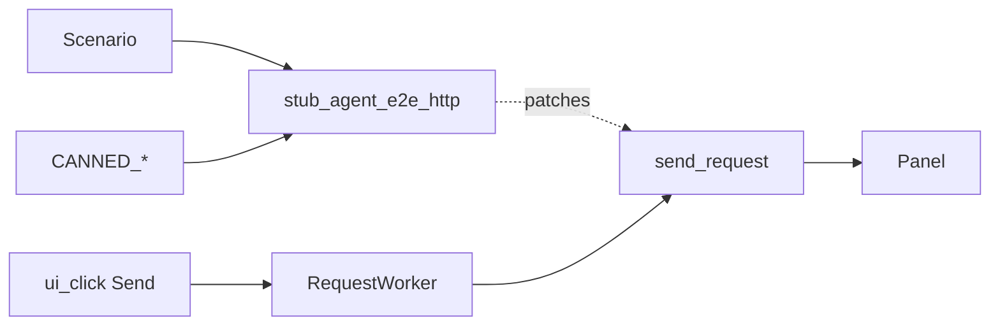

# Agent E2E HTTP Fixture Layer (PYPOST-859)

## Overview

Shared **deterministic HTTP** helpers for agent UI e2e: a canned-response
catalog and a context manager that stubs
`HTTPClient.send_request` at the RequestService import site.

Scenarios keep the real UI → `RequestWorker` → response panel path. Live
external HTTP is not the primary agent-flow path under offscreen CI.

Env contract area: [agent_e2e_env.md](agent_e2e_env.md). Session packaging:
[agent_e2e.md](agent_e2e.md). Golden composition:
[agent_golden_e2e.md](agent_golden_e2e.md). Double-body lock (streaming stub):
[agent_e2e_double_response_body.md](agent_e2e_double_response_body.md).
Method × body presentation matrix (streaming stubs, once-only asserts):
[agent_e2e_presentation_matrix.md](agent_e2e_presentation_matrix.md).

## Architecture

| Component | Role |
| --- | --- |
| `pypost/fixtures/agent_e2e_http.py` | Catalog, builder, `stub_agent_e2e_http`, |
| | `url_router_side_effect` (PYPOST-868) |
| `agent_e2e_http_stub` fixture | Yields the same CM from the agent_e2e plugin |
| Patch target | `pypost.core.request_service.HTTPClient.send_request` |
| Product path | UI actions → RequestWorker → stubbed send → panel |



## API / Usage

### Canned catalog

| Name | Constant | Typical URL |
| --- | --- | --- |
| `golden_ok` | `CANNED_GOLDEN_OK` | `https://example.test/agent-golden` |
| `seed_get_ok` | `CANNED_SEED_GET_OK` | `https://example.test/get` |
| `seed_post_ok` | `CANNED_SEED_POST_OK` | `https://example.test/post` |
| `double_body_lock_ok` | `CANNED_DOUBLE_BODY_LOCK_OK` | `…/pypost-887-double-body` |

Also: `CANNED_HTTP_CATALOG` (`dict` name → result),
`make_canned_http_result(...)`, URL/body constants (`GOLDEN_*`,
`SEED_GET_RESOLVED_URL`, `LOCK_DOUBLE_BODY_*`, …).

### Streaming side effect (double-body lock)

Plain `return_value` stubs never call `stream_callback`, so the chunk-flush
vs `display_response` race cannot appear. For once-only presentation locks,
pass a side effect from `canned_send_with_one_chunk(result)`:

```python
from pypost.fixtures.agent_e2e_http import (
    CANNED_DOUBLE_BODY_LOCK_OK,
    canned_send_with_one_chunk,
    stub_agent_e2e_http,
)

with stub_agent_e2e_http(canned_send_with_one_chunk(CANNED_DOUBLE_BODY_LOCK_OK)):
    session.ui_click(SEND_BUTTON)
```

See [agent_e2e_double_response_body.md](agent_e2e_double_response_body.md).
The presentation matrix uses the same side effect per cell —
[agent_e2e_presentation_matrix.md](agent_e2e_presentation_matrix.md).

### Stub install

```python
from pypost.fixtures.agent_e2e_http import (
    CANNED_GOLDEN_OK,
    stub_agent_e2e_http,
)

with stub_agent_e2e_http(CANNED_GOLDEN_OK):
    session.ui_click(SEND_BUTTON)
    snap = session.wait_for_snapshot(predicate, timeout=15.0)
```

On enter, the CM logs INFO
`agent_e2e_http_stub_installed name=<catalog_or_custom>` (logger
`pypost.fixtures.agent_e2e_http`). Caplog proof (PYPOST-870):
`tests/test_agent_e2e_http_stub_logs.py` — pure unit; must **not** carry
`agent_e2e`. Catalog: [logging.md](logging.md).

Or via the pytest fixture (same callable):

```python
def test_send(agent_e2e_session, agent_e2e_http_stub):
    with agent_e2e_http_stub(CANNED_GOLDEN_OK):
        ...
```

### URL→canned response router (PYPOST-868)

For multi-URL Sends in one scenario, pass a `Mapping[str, HTTPRequestResult]`
keyed by exact `request_data.url` (the URL string on the request object at
the stub boundary — typically the resolved URL filled in the UI):

```python
from pypost.fixtures.agent_e2e_http import (
    CANNED_SEED_GET_OK,
    CANNED_SEED_POST_OK,
    SEED_GET_RESOLVED_URL,
    SEED_POST_RESOLVED_URL,
    stub_agent_e2e_http,
)

responses = {
    SEED_GET_RESOLVED_URL: CANNED_SEED_GET_OK,
    SEED_POST_RESOLVED_URL: CANNED_SEED_POST_OK,
}
with stub_agent_e2e_http(responses):
    # each Send routes by request URL; unknown URL → AssertionError
    ...
```

Match rules (v1):

1. Exact string equality on `request_data.url` vs map keys.
2. `request_data` is taken from `request_data=` kwarg or the first positional
   arg whose `.url` is a `str` (avoids MagicMock `self` in unit tests).
3. Unknown URL raises `AssertionError` listing `url=` and sorted known keys.
4. Not in v1: glob/prefix match, method+URL compound keys, ordered queues —
   use a callable `side_effect` for those (including streaming via
   `canned_send_with_one_chunk`).

Install log uses `name=url_router` when `name=` is left at default `custom`.
Unit proofs: `tests/test_agent_e2e_http.py`
(`test_stub_agent_e2e_http_url_router_map`,
`test_stub_agent_e2e_http_url_router_miss_raises`).

### Seed POST Send (body path)

Catalog entry `seed_post_ok` / `CANNED_SEED_POST_OK` is exercised by
`tests/test_agent_e2e_http_seed_post.py` (PYPOST-871): blank session,
fill URL + POST + `REQUEST_BODY_EDIT` with `SEED_POST_BODY`, stub with
`CANNED_SEED_POST_OK`, assert status/body. Mirrors env GET Send
(`tests/test_agent_e2e_http_env.py`) with the POST body path.

```bash
make test-agent-e2e PYTEST_ARGS="tests/test_agent_e2e_http_seed_post.py -q"
```

Pass a callable as `result` to use `side_effect` (multi-call sequences /
streaming). Optional `name=` labels custom installs in logs (catalog
identities auto-name; Mapping defaults to `url_router`).

### How to add a new canned response

1. Add constants (URL/body/status) in
   `pypost/fixtures/agent_e2e_http.py` if they are shared inventory.
2. Build with `make_canned_http_result(...)` and assign a module-level
   `CANNED_*` name.
3. Register it in `CANNED_HTTP_CATALOG` under a stable string key.
4. If it should auto-log a friendly `name=`, extend the identity checks
   inside `stub_agent_e2e_http` (or always pass `name=`).
5. Document the row in this page’s catalog table and, if seed-related,
   keep URLs aligned with [agent_e2e_seed.md](agent_e2e_seed.md).
6. Prefer consuming the new entry from golden/env scenarios via
   `stub_agent_e2e_http` / `agent_e2e_http_stub` — do not add private
   `patch("…HTTPClient.send_request")` as the primary path.
7. For response-panel waits/asserts after Send, import
   [shared snapshot helpers](agent_e2e_response_panel.md)
   (`tests.helpers.agent_e2e_response_panel`) instead of copying walk /
   subtree helpers.

## Configuration

| Setting | Value |
| --- | --- |
| Patch target | `SEND_REQUEST_PATCH_TARGET` in the fixture module |
| Offscreen Qt | `make test-agent-e2e` / fixtures `offscreen=True` |
| Timeouts | Module `pytest.mark.timeout(60)` for GUI Send; unit `timeout(10)` |

No extra env vars.

## Troubleshooting

| Failure | What to do |
| --- | --- |
| Wait timeout after Send | Confirm stub context wraps the click; grep |
| | `agent_e2e_http_stub_installed` (seed POST → `name=seed_post_ok`). |
| | Check catalog body vs snapshot compact JSON form (see golden docs). |
| Install log missing / renamed | Assert under |
| | `caplog.at_level(INFO, logger="pypost.fixtures.agent_e2e_http")`; |
| | run `make test PYTEST_ARGS=` |
| | `"tests/test_agent_e2e_http_stub_logs.py -v"` (PYPOST-870). |
| URL router AssertionError | Confirm map keys equal `request_data.url` exactly |
| | (resolved UI URL). Message lists `known=` keys. |
| POST body not applied | Confirm `REQUEST_BODY_EDIT` fill after selecting POST; |
| | see seed POST scenario and [ui_identity.md](ui_identity.md). |
| Live network / flaky CI | Do not remove the stub; do not mock RequestWorker |
| | wholesale. |
| Stub “not restoring” | Ensure `with stub_agent_e2e_http(...):` covers the |
| | Send; exceptions still exit the context manager. |
| Wrong patch target | Always use this helper (RequestService use site), not |
| | `pypost.core.http_client.HTTPClient.send_request` alone. |

## Related

- [Agent E2E Environment Contract](agent_e2e_env.md)
- [Agent UI E2E](agent_e2e.md)
- [Agent Golden E2E](agent_golden_e2e.md)
- [Agent E2E Double Response-Body Lock](agent_e2e_double_response_body.md)
- [Agent E2E Presentation Matrix](agent_e2e_presentation_matrix.md)
- [Agent E2E Seed Inventory](agent_e2e_seed.md)
- [Agent E2E Response-Panel Helpers](agent_e2e_response_panel.md)
- [Logging Event Naming Convention](logging.md)
