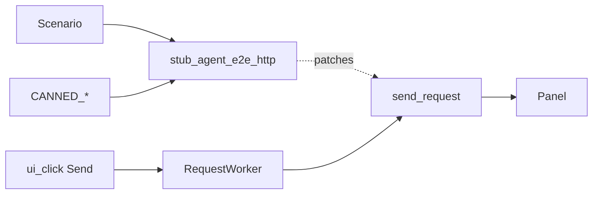

# Agent E2E HTTP Fixture Layer (PYPOST-859)

## Overview

Shared **deterministic HTTP** helpers for agent UI e2e: a canned-response
catalog and a context manager that stubs
`HTTPClient.send_request` at the RequestService import site.

Scenarios keep the real UI → `RequestWorker` → response panel path. Live
external HTTP is not the primary agent-flow path under offscreen CI.

Env contract area: [agent_e2e_env.md](agent_e2e_env.md). Session packaging:
[agent_e2e.md](agent_e2e.md). Golden composition:
[agent_golden_e2e.md](agent_golden_e2e.md). Double-body lock (streaming stub):
[agent_e2e_double_response_body.md](agent_e2e_double_response_body.md).
Method × body presentation matrix (streaming stubs, once-only asserts):
[agent_e2e_presentation_matrix.md](agent_e2e_presentation_matrix.md).

## Architecture

| Component | Role |
| --- | --- |
| `pypost/fixtures/agent_e2e_http.py` | Catalog, builder, `stub_agent_e2e_http`, |
| | `url_router_side_effect` (PYPOST-868) |
| `agent_e2e_http_stub` fixture | Yields the same CM from the agent_e2e plugin |
| Patch target | `pypost.core.request_service.HTTPClient.send_request` |
| Product path | UI actions → RequestWorker → stubbed send → panel |



## API / Usage

### Canned catalog

| Name | Constant | Typical URL |
| --- | --- | --- |
| `golden_ok` | `CANNED_GOLDEN_OK` | `https://example.test/agent-golden` |
| `seed_get_ok` | `CANNED_SEED_GET_OK` | `https://example.test/get` |
| `seed_post_ok` | `CANNED_SEED_POST_OK` | `https://example.test/post` |
| `double_body_lock_ok` | `CANNED_DOUBLE_BODY_LOCK_OK` | `…/pypost-887-double-body` |

Also: `CANNED_HTTP_CATALOG` (`dict` name → result),
`make_canned_http_result(...)`, URL/body constants (`GOLDEN_*`,
`SEED_GET_RESOLVED_URL`, `LOCK_DOUBLE_BODY_*`, …).

### Streaming side effect (`canned_send_with_one_chunk`)

Catalog naming (PYPOST-893): use **`canned_send_with_one_chunk`** whenever an
agent e2e scenario must exercise the chunk-flush vs `display_response` race.
The name means: canned `HTTPRequestResult` + exactly one `stream_callback`
invocation with `resp.body` (arms the flush timer before `finished`).

Plain `return_value` stubs never call `stream_callback`, so that race cannot
appear. For once-only presentation locks and the presentation matrix, pass a
side effect from `canned_send_with_one_chunk(result)`:

```python
from pypost.fixtures.agent_e2e_http import (
    CANNED_DOUBLE_BODY_LOCK_OK,
    canned_send_with_one_chunk,
    stub_agent_e2e_http,
)

with stub_agent_e2e_http(canned_send_with_one_chunk(CANNED_DOUBLE_BODY_LOCK_OK)):
    session.ui_click(SEND_BUTTON)
```

See [agent_e2e_double_response_body.md](agent_e2e_double_response_body.md).
The presentation matrix uses the same side effect per cell —
[agent_e2e_presentation_matrix.md](agent_e2e_presentation_matrix.md).

### Stub install

```python
from pypost.fixtures.agent_e2e_http import (
    CANNED_GOLDEN_OK,
    stub_agent_e2e_http,
)
from tests.helpers.agent_e2e_send_settle import (
    json_response_body_display,
    wait_response_after_send,
)

with stub_agent_e2e_http(CANNED_GOLDEN_OK):
    session.ui_click(SEND_BUTTON)
    wait_response_after_send(
        session,
        status_label="Status: 200",
        body_text=json_response_body_display(CANNED_GOLDEN_OK.body),
        step="wait_response_after_send",
    )
```

Prefer [send settle helper](agent_e2e_send_settle.md) for sibling scenarios;
golden may use inline `session.wait_for_text`. Legacy panel predicate example:

```python
with stub_agent_e2e_http(CANNED_GOLDEN_OK):
    session.ui_click(SEND_BUTTON)
    snap = session.wait_for_snapshot(predicate, timeout=15.0)
```

On enter, the CM logs INFO
`agent_e2e_http_stub_installed name=<catalog_or_custom>` (logger
`pypost.fixtures.agent_e2e_http`). Caplog matrix (PYPOST-870 / PYPOST-903):
`tests/test_agent_e2e_http_stub_logs.py` — parametrized pure-unit proofs for
`golden_ok`, `seed_get_ok`, `seed_post_ok`, `double_body_lock_ok`, `url_router`,
and explicit custom `name=`; must **not** carry `agent_e2e`. GUI-path install
smoke (PYPOST-904): `tests/test_agent_e2e_http_env.py` —
`test_seeded_env_send_logs_http_stub_installed` re-asserts
`name=seed_get_ok` under caplog during live offscreen Send (stub CM + click +
settle, not unit-only CM enter). Mapping GUI-path smoke (PYPOST-957):
`tests/test_agent_e2e_http_mapping_multi_url.py` —
`test_mapping_send_logs_http_stub_installed_url_router` re-asserts
`name=url_router` under caplog during Mapping stub + GET Send + settle.
Catalog: [logging.md](logging.md).

Or via the pytest fixture (same callable):

```python
def test_send(agent_e2e_session, agent_e2e_http_stub):
    with agent_e2e_http_stub(CANNED_GOLDEN_OK):
        ...
```

### URL→canned response router (PYPOST-868)

For multi-URL Sends in one scenario, pass a `Mapping[str, HTTPRequestResult]`
keyed by exact `request_data.url` (the URL string on the request object at
the stub boundary — typically the resolved URL filled in the UI):

```python
from pypost.fixtures.agent_e2e_http import (
    CANNED_SEED_GET_OK,
    CANNED_SEED_POST_OK,
    SEED_GET_RESOLVED_URL,
    SEED_POST_RESOLVED_URL,
    stub_agent_e2e_http,
)

responses = {
    SEED_GET_RESOLVED_URL: CANNED_SEED_GET_OK,
    SEED_POST_RESOLVED_URL: CANNED_SEED_POST_OK,
}
with stub_agent_e2e_http(responses):
    # each Send routes by request URL; unknown URL → AssertionError
    ...
```

Match rules:

1. **Compound key (PYPOST-902):** `"{METHOD} {url}"` — e.g.
   `GET https://example.test/shared` — when that key is in the map. Use when
   two methods share one resolved URL. Map keys should use uppercase HTTP
   methods; the router uppercases `request_data.method` before compound lookup
   (PYPOST-959), so mixed-case requests still match.
2. **Bare URL (PYPOST-868):** exact string equality on `request_data.url` vs
   map keys when no compound key matches.
3. **Precedence:** compound key is tried first; bare URL is the fallback. If
   both `GET https://host/path` and `https://host/path` exist, GET matches
   the compound entry; POST to the same URL matches the bare entry unless a
   `POST …` compound key is also present.
4. `request_data` is taken from `request_data=` kwarg or the first positional
   arg whose `.url` is a `str` (avoids MagicMock `self` in unit tests).
5. Unknown URL raises `AssertionError` listing `url=` and sorted known keys.
6. Not supported: glob/prefix match, ordered queues — use a callable
   `side_effect` for those (including streaming via
   `canned_send_with_one_chunk`).

Example — same URL, different methods:

```python
shared = "https://example.test/shared"
responses = {
    f"GET {shared}": CANNED_SEED_GET_OK,
    f"POST {shared}": CANNED_SEED_POST_OK,
}
with stub_agent_e2e_http(responses):
    ...
```

Install log uses `name=url_router` when `name=` is left at default `custom`.
Unit proofs: `tests/test_agent_e2e_http.py`
(`test_stub_agent_e2e_http_url_router_map`,
`test_stub_agent_e2e_http_url_router_miss_raises`,
`test_stub_agent_e2e_http_url_router_method_url_compound_keys`,
`test_stub_agent_e2e_http_url_router_compound_key_mixed_case_method`).

GUI proof (PYPOST-958): `tests/test_agent_e2e_http_mapping_compound_keys.py` —
`test_mapping_compound_keys_same_url_get_post_panel_outcomes` drives GET then
POST to one resolved URL under compound keys (`GET {url}` / `POST {url}`) and
asserts distinct panel bodies. Inventory gate:
`test_mapping_compound_keys_gui_send_scenario_module_exists`.

```bash
make test-agent-e2e PYTEST_ARGS="tests/test_agent_e2e_http_mapping_compound_keys.py -q"
make test PYTEST_ARGS="tests/test_agent_e2e_http.py::test_mapping_compound_keys_gui_send_scenario_module_exists -q"
```

### Mapping multi-URL GUI module (PYPOST-901 / PYPOST-955 / PYPOST-982)

| Test | Role |
| --- | --- |
| `test_mapping_stub_two_distinct_urls_panel_outcomes` | Happy path — two Sends, panel asserts (901) |
| `test_mapping_send_logs_http_stub_installed_url_router` | Mapping GUI install-log caplog smoke (957) |
| `test_mapping_get_send_settle_timeout_includes_step_and_excerpt` | Forced GET Send settle timeout companion (955) |
| `test_mapping_post_send_settle_timeout_includes_step_and_excerpt` | POST timeout (982) |

Inventory gates in `tests/test_agent_e2e_http.py`:

- `test_mapping_multi_url_gui_send_scenario_module_exists` — happy-path callable
- `test_mapping_multi_url_settle_timeout_companion_exists` — GET/POST companion callables

Happy path: blank session, one Mapping stub (`SEED_GET_RESOLVED_URL` /
`SEED_POST_RESOLVED_URL` → canned GET/POST), two Sends with panel asserts via
`wait_response_after_snapshot` from
[send settle helpers](agent_e2e_send_settle.md) (15 s
`SEND_SETTLE_TIMEOUT_S` default, step names
`wait_response_after_mapping_get_send` /
`wait_response_after_mapping_post_send`).

#### Timeout companions (PYPOST-955 / PYPOST-982)

`test_mapping_get_send_settle_timeout_includes_step_and_excerpt` and
`test_mapping_post_send_settle_timeout_includes_step_and_excerpt` mirror the
golden Send and [dialog-settle](agent_dialog_settle.md) timeout companions:
each forces near-zero settle failure and asserts
`UiWaitTimeoutError.diagnostics` carries the method-specific step and a
bounded response excerpt.

1. Same module as the happy path; each companion performs one method-specific
   Send under a minimal Mapping stub (GET for PYPOST-955, POST for PYPOST-982).
2. Call `wait_response_after_snapshot` with an always-false predicate and
   `timeout=FORCED_SETTLE_TIMEOUT_S` — the same helper as the happy path with a
   short budget (not 15 s).
3. Timeout message shape includes the method-specific step in parentheses:
   `mapping multi-URL Send settle failed (wait_response_after_mapping_get_send): …`
   or
   `mapping multi-URL Send settle failed (wait_response_after_mapping_post_send): …`.
4. Assert `diagnostics["step"]` and that `diagnostics["response_excerpt"]` is
   a string; the POST companion additionally requires it to be non-empty.

| Constant | Value |
| --- | --- |
| `FORCED_SETTLE_TIMEOUT_S` | 0.05; provided by `tests.helpers.agent_e2e_timeouts` |
| `SEND_SETTLE_TIMEOUT_S` | 15.0 (happy path only; from `tests.helpers.agent_e2e_send`) |
| GET companion `step` | `wait_response_after_mapping_get_send` |
| POST companion `step` | `wait_response_after_mapping_post_send` |

```bash
mapping_module=tests/test_agent_e2e_http_mapping_multi_url.py
get_timeout=test_mapping_get_send_settle_timeout_includes_step_and_excerpt
post_timeout=test_mapping_post_send_settle_timeout_includes_step_and_excerpt
inventory_module=tests/test_agent_e2e_http.py
inventory_test=test_mapping_multi_url_settle_timeout_companion_exists

make test-agent-e2e PYTEST_ARGS="${mapping_module} -q"
make test-agent-e2e \
  PYTEST_ARGS="${mapping_module}::${get_timeout} -q"
make test-agent-e2e \
  PYTEST_ARGS="${mapping_module}::${post_timeout} -q"
make test \
  PYTEST_ARGS="${inventory_module}::${inventory_test} -q"
```

### Seed POST Send (body path)

Catalog entry `seed_post_ok` / `CANNED_SEED_POST_OK` is exercised by
`tests/test_agent_e2e_http_seed_post.py`:

- **Blank fill** (PYPOST-871): URL + POST + `REQUEST_BODY_EDIT` with
  `SEED_POST_BODY`, then stub Send.
- **Collection-tree open** (PYPOST-898): seeded session +
  `click_tree_row_by_text(..., "POST Seed POST")`, wait for editor, then stub
  Send (templated `SEED_POST_URL` / body from seed — no manual fill).

Shared settle budget: `SEND_SETTLE_TIMEOUT_S` from
`tests.helpers.agent_e2e_send` (PYPOST-895). Timeout re-raises attach
`response_panel_excerpt` (PYPOST-896 / PYPOST-897).

```bash
make test-agent-e2e PYTEST_ARGS="tests/test_agent_e2e_http_seed_post.py -q"
```

Pass a callable as `result` to use `side_effect` (multi-call sequences /
streaming). Optional `name=` labels custom installs in logs (catalog
identities auto-name; Mapping defaults to `url_router`).

### How to add a new canned response

1. Add constants (URL/body/status) in
   `pypost/fixtures/agent_e2e_http.py` if they are shared inventory.
2. Build with `make_canned_http_result(...)` and assign a module-level
   `CANNED_*` name.
3. Register it in `CANNED_HTTP_CATALOG` under a stable string key.
4. If it should auto-log a friendly `name=`, extend the identity checks
   inside `stub_agent_e2e_http` (or always pass `name=`).
5. Document the row in this page’s catalog table and, if seed-related,
   keep URLs aligned with [agent_e2e_seed.md](agent_e2e_seed.md).
6. Prefer consuming the new entry from golden/env scenarios via
   `stub_agent_e2e_http` / `agent_e2e_http_stub` — do not add private
   `patch("…HTTPClient.send_request")` as the primary path.
7. For response-panel waits/asserts after Send, import
   [shared snapshot helpers](agent_e2e_response_panel.md)
   (`tests.helpers.agent_e2e_response_panel`) instead of copying walk /
   subtree helpers.

## Configuration

| Setting | Value |
| --- | --- |
| Patch target | `SEND_REQUEST_PATCH_TARGET` in the fixture module |
| Offscreen Qt | `make test-agent-e2e` / fixtures `offscreen=True` |
| Timeouts | Module `pytest.mark.timeout(60)` for GUI Send; unit `timeout(10)` |
| Mapping happy-path settle | `SEND_SETTLE_TIMEOUT_S` (15 s) via `wait_response_after_snapshot` |
| Mapping timeout companion | `FORCED_SETTLE_TIMEOUT_S` (0.05 s) passed to same helper |

No extra env vars.

## Troubleshooting

| Failure | What to do |
| --- | --- |
| Wait timeout after Send | Confirm stub context wraps the click; grep |
| | `agent_e2e_http_stub_installed` (seed POST → `name=seed_post_ok`). |
| | Check catalog body vs snapshot compact JSON form (see golden docs). |
| Install log missing / renamed | Assert under |
| | `caplog.at_level(INFO, logger="pypost.fixtures.agent_e2e_http")`; |
| | run `make test PYTEST_ARGS=` |
| | `"tests/test_agent_e2e_http_stub_logs.py -v"` (PYPOST-870 / 903 matrix). |
| | GUI path: `make test-agent-e2e PYTEST_ARGS=` |
| | `"tests/test_agent_e2e_http_env.py::test_seeded_env_send_logs_http_stub_installed -v"` |
| | (PYPOST-904). Mapping GUI: `make test-agent-e2e PYTEST_ARGS=` |
| | `"tests/test_agent_e2e_http_mapping_multi_url.py::` |
| | `test_mapping_send_logs_http_stub_installed_url_router -v"` (PYPOST-957). |
| URL router AssertionError | Confirm map keys equal ``request_data.url`` exactly |
| | or use compound ``"{method} {url}"`` keys (902). Message lists |
| | ``known=`` keys. Compound keys take precedence over bare URL. |
| POST body not applied | Confirm `REQUEST_BODY_EDIT` fill after selecting POST; |
| | see seed POST scenario and [ui_identity.md](ui_identity.md). |
| Live network / flaky CI | Do not remove the stub; do not mock RequestWorker |
| | wholesale. |
| Stub “not restoring” | Ensure `with stub_agent_e2e_http(...):` covers the |
| | Send; exceptions still exit the context manager. |
| Wrong patch target | Always use this helper (RequestService use site), not |
| | `pypost.core.http_client.HTTPClient.send_request` alone. |
| Mapping settle timeout missing `step` / excerpt | Run companion: |
| | `make test-agent-e2e PYTEST_ARGS=` |
| | `"tests/test_agent_e2e_http_mapping_multi_url.py::` |
| | `test_mapping_get_send_settle_timeout_includes_step_and_excerpt -v"` or |
| | `test_mapping_post_send_settle_timeout_includes_step_and_excerpt -v"`. |
| | Confirm `wait_response_after_snapshot` with impossible snapshot |
| | predicate; see [agent_e2e_send_settle.md](agent_e2e_send_settle.md). |

## Related

- [Agent E2E Environment Contract](agent_e2e_env.md)
- [Agent UI E2E](agent_e2e.md)
- [Agent Golden E2E](agent_golden_e2e.md)
- [Agent E2E Double Response-Body Lock](agent_e2e_double_response_body.md)
- [Agent E2E Presentation Matrix](agent_e2e_presentation_matrix.md)
- [Agent E2E Seed Inventory](agent_e2e_seed.md)
- [Agent E2E Response-Panel Helpers](agent_e2e_response_panel.md)
- [Logging Event Naming Convention](logging.md)
