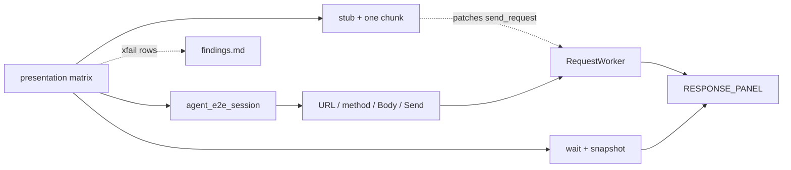

# Agent E2E Presentation Matrix (PYPOST-890)

## Overview

Parametrized agent UI e2e matrix that probes **HTTP method × request body
shape** combinations against Send → response presentation invariants:

- stub response body token appears **exactly once** under `RESPONSE_PANEL`
- `Status: {code}` appears **exactly once** and matches the stub

This broadens coverage beyond the single reported-case lock
([agent_e2e_double_response_body.md](agent_e2e_double_response_body.md) /
PYPOST-889). Product presentation fixes discovered by the matrix are **out
of scope** here — record them for
[PYPOST-891](https://pypost.atlassian.net/browse/PYPOST-891) triage via
`ai-tasks/PYPOST-890/findings.md`.

Epic: [PYPOST-888](https://pypost.atlassian.net/browse/PYPOST-888).

### Triage outcome (PYPOST-891)

[PYPOST-891](https://pypost.atlassian.net/browse/PYPOST-891) reviewed the
findings table on 2026-07-21: **empty** (HEAD matrix **25/25** green).
Verdict: **no product defects found / won’t file** — zero Bugs created.
Canonical record: `ai-tasks/PYPOST-891/triage-summary.md`. Future HEAD
defects still take the xfail + findings-row path, then re-triage under
the epic.

## Architecture

| Piece | Role |
| --- | --- |
| `tests/test_agent_e2e_presentation_matrix.py` | Parametrized cells + asserts |
| `agent_e2e_session` | Blank ready window |
| `stub_agent_e2e_http` + `canned_send_with_one_chunk` | Streaming stub at send boundary |
| `make_canned_http_result` | Per-cell unique plain-text body + status |
| `REQUEST_DETAIL_TABS` | Select Body tab for GET/PATCH/DELETE + fill |
| `RESPONSE_PANEL` snapshot walk | Count body token and status label |
| `ai-tasks/PYPOST-890/findings.md` | Durable failing-cell list for PYPOST-891 |
| `ai-tasks/PYPOST-891/triage-summary.md` | Triage decision (Bugs filed or won’t-file) |



Harness stack matches [Agent UI E2E](agent_e2e.md). HTTP helpers:
[agent_e2e_http.md](agent_e2e_http.md). Sibling lock stays untouched (FR10).

### Matrix dimensions

**Methods:** `GET`, `POST`, `PUT`, `PATCH`, `DELETE`.

**Body shapes:**

| Shape | Request body |
| --- | --- |
| `empty` | leave editor empty |
| `json_ok` | `{"probe": true}` |
| `json_malformed` | `{ { "data": { } } }` |
| `text` | `not-json-probe` |
| `large` | ~8 KiB repeating ASCII |

**Cartesian:** 5 × 5 = **25 cells** (including GET × non-empty shapes).

**Smoke** (default `make test-agent-e2e`, `agent_e2e` and not `slow`):

| Cell id | Notes |
| --- | --- |
| `GET-empty` | baseline |
| `POST-json_ok` | stub status **201** (non-200 status probe) |
| `PUT-json_malformed` | overlaps 889 family; matrix-owned URL/token |
| `PATCH-text` | needs Body tab select |
| `DELETE-empty` | baseline |

Remaining cells carry `@pytest.mark.slow`.

### Stub policy

- Unique body token per cell: `pypost-890-{method}-{shape}-once`
  (`text/plain`) — not an echo of the request body.
- Default stub status `200`; smoke `POST×json_ok` uses `201`.
- URL: `https://example.test/pypost-890/{method}/{shape}` (never live).
- Always `canned_send_with_one_chunk` so the chunk-flush race can appear.

### Body tab select

`RequestEditor` auto-switches to Body only for `POST` / `PUT`. For
`GET` / `PATCH` / `DELETE` with a non-empty shape, the matrix selects the
Body page via `REQUEST_DETAIL_TABS` before `ui_fill(REQUEST_BODY_EDIT, …)`.
See [ui_identity.md](ui_identity.md).

## API / Usage

### How to run

Smoke slice (default agent e2e recipe):

```bash
make test-agent-e2e
# smoke cells only (default recipe already excludes slow):
make test-agent-e2e \
  PYTEST_ARGS='tests/test_agent_e2e_presentation_matrix.py -m "agent_e2e and not slow" -v'
```

Full cartesian (25 cells; includes `slow`):

```bash
make test-agent-e2e \
  PYTEST_ARGS='tests/test_agent_e2e_presentation_matrix.py -m agent_e2e -v'
```

### One cell (summary)

1. Fill URL; select method; if shape ≠ `empty`, ensure Body tab visible and
   fill request body.
2. Build canned result (unique token, status per policy); install
   `canned_send_with_one_chunk` under `stub_agent_e2e_http(..., name=…)`.
3. Click Send; `wait_for_snapshot` until status label + token appear;
   settle ~100 ms past chunk flush.
4. Assert `joined.count(token) == 1` and
   `joined.count("Status: N") == 1` (failure message includes cell id).

### Findings / xfail

Known product defects on HEAD: mark that param with
`pytest.mark.xfail(strict=False, reason=…)` **and** add a row to
`ai-tasks/PYPOST-890/findings.md` in the same change. Unexpected smoke
failures fail the suite — do not skip silently. After findings change,
re-run triage (see `ai-tasks/PYPOST-891/triage-summary.md`); empty
findings → won’t file Bugs.

### Red protocol (local only)

Default HEAD (discard present) is **green**. To prove red-on-bug locally,
temporarily no-op `_discard_chunk_buffer` in `_on_request_finished`, run a
streaming cell (e.g. `POST-json_ok`), expect body token `count >= 2`, then
**restore** discard — do not commit the no-op. That is not a findings row.

## Configuration

| Setting | Value |
| --- | --- |
| Module markers | `timeout(60)`, `agent_e2e` |
| Send settle / flush wait | 15 s / 100 ms |
| Smoke vs full | `not slow` vs `-m agent_e2e` |
| Stub name prefix | `presentation_matrix_{method}_{shape}` |

No extra env vars. Prefer `make test-agent-e2e` for offscreen Qt.

## Troubleshooting

| Failure | What to do |
| --- | --- |
| `count != 1` (body or status) | Check discard before `display_response`; see |
| | [response-streaming-display.md](response-streaming-display.md) |
| Wait timeout | Confirm `canned_send_with_one_chunk` (plain |
| | `return_value` never arms the flush timer) |
| Body fill ignored (GET/PATCH/DELETE) | Ensure Body tab via `REQUEST_DETAIL_TABS` |
| Smoke green, full red | Run full matrix recipe; check `slow` cell |
| | and `findings.md` / xfail |
| Confused with 889 lock | Sibling lock is unchanged; matrix has its own |
| | URL/token even for PUT×malformed |

## Related

- [Agent UI E2E](agent_e2e.md)
- [Agent E2E Double Response-Body Lock](agent_e2e_double_response_body.md)
- [Agent E2E HTTP Fixture Layer](agent_e2e_http.md)
- [Agent Golden E2E](agent_golden_e2e.md)
- [Response Streaming Display (PYPOST-887)](response-streaming-display.md)
- [UI Widget Identity](ui_identity.md)
