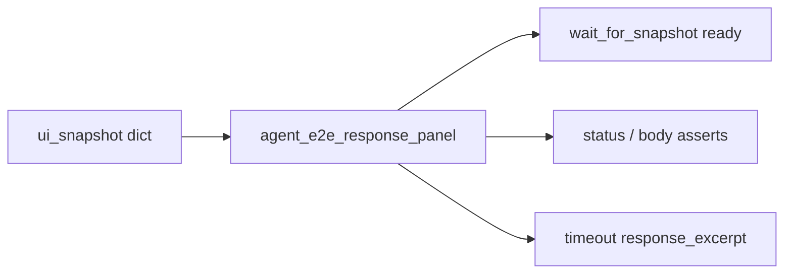

# Agent E2E Response-Panel Snapshot Helpers (PYPOST-869)

## Overview

Shared helpers for inspecting the **response panel** subtree of an agent
UI snapshot after Send. Golden, env-pack Send, double-body lock, and
presentation-matrix scenarios import these instead of copying walk /
subtree / excerpt logic.

## Architecture

| Piece | Role |
| --- | --- |
| `tests/helpers/agent_e2e_response_panel.py` | Pure helpers on snapshot dict trees |
| `tests/test_agent_e2e_response_panel.py` | Unit proof + no-local-duplicate guard |
| Send scenario modules | Local ready predicates; import helpers |



Scenario-specific expected tokens (status label, body string) stay in each
test module. Only tree walk / panel extract / join / excerpt are shared.

## API / Usage

```python
from tests.helpers.agent_e2e_response_panel import (
    joined_panel_values,
    response_panel_excerpt,
    subtree_by_name,
    walk_values,
)
from pypost.ui.widget_ids import RESPONSE_PANEL

def _response_ready(snap: dict) -> bool:
    joined = joined_panel_values(snap)
    return "Status: 200" in joined and '{"ok": true}' in joined

panel = subtree_by_name(snap, RESPONSE_PANEL)
excerpt = response_panel_excerpt(snap)  # truncated " | "-join for messages
```

### `walk_values(node)`

Depth-first list of non-empty string `value` fields under `node`.

### `subtree_by_name(node, name)`

First matching subtree by `name`, or `None`.

### `response_panel_excerpt(snap, *, max_len=400)`

`RESPONSE_PANEL` values joined with ` | `, truncated with `…` when longer
than `max_len`. Missing panel → `"<response panel not in snapshot>"`.

### `joined_panel_values(snap)`

`RESPONSE_PANEL` values joined with newlines, or `""` if missing.

## Configuration

None. Helpers are pure functions; they import `RESPONSE_PANEL` from
`pypost.ui.widget_ids`.

## Running the unit proof

```bash
make test PYTEST_ARGS="tests/test_agent_e2e_response_panel.py -v"
```

## Troubleshooting

| Symptom | Check |
| --- | --- |
| Import error for helpers | Module path is `tests.helpers.agent_e2e_response_panel` |
| Duplicate `_walk_values` in a Send module | Remove local copy; import shared helpers (unit guard fails otherwise) |
| Excerpt empty / “not in snapshot” | Confirm Send settled; panel id is `RESPONSE_PANEL` |

## See also

- [Agent UI E2E](agent_e2e.md)
- [Agent Golden E2E](agent_golden_e2e.md)
- [Agent E2E HTTP Fixture Layer](agent_e2e_http.md)
- [UI State Snapshot](ui_snapshot.md)
