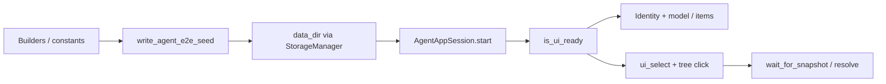

# Agent E2E Seed Inventory (PYPOST-857)

## Overview

Shared **seeded workspace** for the agent e2e environment pack. After
bootstrap into an isolated `AgentAppSession` whose `data_dir` was pre-written
with this seed, scenarios can assume the inventory below without hand-building
collections, environments, or sample requests.

Source of truth for ids/names: `pypost/fixtures/agent_e2e_seed.py`. This page
mirrors that inventory for humans and agents. It implements the seeded
workspace area of the [environment contract](agent_e2e_env.md)
([PYPOST-857](https://pypost.atlassian.net/browse/PYPOST-857)).

## Architecture

| Component | Role |
| --- | --- |
| Inventory constants | Fixed ids/names/URLs in `pypost/fixtures/agent_e2e_seed.py` |
| `build_agent_e2e_seed_collection()` | Pure builder for the seed `Collection` (GET + POST) |
| `build_agent_e2e_seed_environments()` | Pure builder for the seed `Environment` list |
| `write_agent_e2e_seed(data_dir)` | Persist via `StorageManager` before session start |
| `tests/helpers/agent_e2e_seed.py` | Temp dirs + re-exports for product-facing tests |
| `tests/helpers/agent_e2e_tree.py` | Viewport `visualRect` click; delegates DisplayRole walk to `pypost.agent.tree_index` |
| `tests/test_agent_e2e_seed.py` | Identity + drive-then-snapshot / resolve proof |



Seed must be on disk **before** `AgentAppSession.start()` so the normal
startup load surfaces it when the UI becomes ready. Post-start UI hand-building
is out of scope for the shared seed path.

Shared pytest session packaging is PYPOST-858. HTTP determinism is
PYPOST-859 ([agent_e2e_http.md](agent_e2e_http.md)). Callers that inject
`config_dir` / `data_dir` own cleanup.

## API / Usage

### Preferred: shared seeded fixture (PYPOST-858)

For single-session product proofs, inject `seeded_agent_e2e_session` (see
[agent_e2e.md](agent_e2e.md)). It writes this inventory before start and
yields a ready `AgentAppSession`.

```python
def test_seeded(seeded_agent_e2e_session):
    assert seeded_agent_e2e_session.window.is_ui_ready
```

### How to seed (direct writer)

```python
from pathlib import Path
from pypost.agent import AgentAppSession
from pypost.fixtures.agent_e2e_seed import write_agent_e2e_seed

write_agent_e2e_seed(Path(data_dir))  # before start()
with AgentAppSession(
    offscreen=True,
    config_dir=Path(config_dir),
    data_dir=Path(data_dir),
) as session:
    assert session.window.is_ui_ready
```

### Test helper (multi-session / custom dirs)

Use when a test needs two sessions or non-fixture control of dirs:

```python
from pypost.agent import AgentAppSession
from tests.helpers.agent_e2e_seed import seeded_agent_dirs

with seeded_agent_dirs() as (config_dir, data_dir):
    with AgentAppSession(
        offscreen=True,
        config_dir=config_dir,
        data_dir=data_dir,
    ) as session:
        assert session.window.is_ui_ready
```

### `write_agent_e2e_seed(data_dir)`

Persist the documented seed into `data_dir` via `StorageManager`.

- **data_dir**: Writable workspace root (collections + environments.json).
- **Returns**: `None`. Raises on persist failure after logging
  `agent_e2e_seed_failed`.
- **Side effects**: Writes one collection JSON and `environments.json`; emits
  `agent_e2e_seed_completed` on success.

### Builders

- `build_agent_e2e_seed_collection()` → `Collection` with GET + POST samples.
- `build_agent_e2e_seed_environments()` → `[Environment]` with plaintext
  `base_url` only.

Prefer constants from the fixture module (or the test helper re-exports) in
asserts — do not hard-code ids in new scenarios.

### How to run tests

```bash
make test-agent-e2e
# or one module:
make test-agent-e2e PYTEST_ARGS="tests/test_agent_e2e_seed.py -v"
# drive-then-snapshot soft proof only:
make test-agent-e2e PYTEST_ARGS=\
  "tests/test_agent_e2e_seed.py::test_seed_drive_then_snapshot_active_env_and_open_get -v"
```

## Inventory after bootstrap

| Kind | Id | Display name | Notes |
| --- | --- | --- | --- |
| Collection | `agent-e2e-seed-collection` | `Agent E2E Seed` | One collection |
| Environment | `agent-e2e-seed-env` | `Agent E2E` | Plaintext vars only |
| Request | `agent-e2e-seed-get` | `Seed GET` | `GET {{base_url}}/get` |
| Request | `agent-e2e-seed-post` | `Seed POST` | `POST {{base_url}}/post` + JSON body |

Environment variable:

| Key | Value |
| --- | --- |
| `base_url` | `https://example.test` |

Tree row labels use `{method} {name}` (e.g. `GET Seed GET`). The env selector
lists `Agent E2E`; without a restored `last_environment_id` the active
selection stays `No Environment` (**present ≠ active**). Selecting `Agent E2E`
via agent `ui_select` makes it active so `base_url` participates in template
resolution; the URL field still stores `{{base_url}}/get` (resolved at Send /
via `TemplateService`, not rewritten in the line edit).

No secrets, no live hosts as the primary HTTP path (determinism: PYPOST-859).

## Proof strategy

After ready, tests prove seed in two complementary ways (see
`tests/test_agent_e2e_seed.py`):

1. **Identity + model / items (PYPOST-857 baseline)** — `COLLECTION_TREE` /
   `ENV_SELECTOR` identity plus model / combo-item enumeration. Does **not**
   use blank-ready `ui_snapshot` name scan, and not disk-write asserts alone.
2. **Drive-then-snapshot + resolve (PYPOST-863 soft FR2/FR3)** — After
   documenting present ≠ active (`Agent E2E` listed, current text still
   `No Environment`), `session.ui_select(ENV_SELECTOR, "Agent E2E")` and a
   viewport click on `GET Seed GET` (`tests/helpers/agent_e2e_tree.py`), then
   `wait_for_snapshot` until method / URL / active env match inventory, and
   `TemplateService.render_string("{{base_url}}/get", current_variables)`
   equals `https://example.test/get`.

Failure path (PYPOST-862): `test_write_agent_e2e_seed_logs_failure_and_reraises`
mocks `StorageManager` persist failure, asserts ERROR
`agent_e2e_seed_failed` via `caplog` on logger
`pypost.fixtures.agent_e2e_seed`, and confirms the exception is re-raised.

Inventory drift guard (PYPOST-864):
`tests/test_agent_e2e_seed_inventory_doc.py` asserts each published
inventory constant (`SEED_*` ids, names, `base_url`, GET/POST URL templates)
appears in this page's Inventory section. Pure unit (no Qt / `agent_e2e`
marker). Run:

```bash
make test PYTEST_ARGS="tests/test_agent_e2e_seed_inventory_doc.py -v"
```

## Configuration

| Setting | Notes |
| --- | --- |
| `data_dir` | Must receive seed **before** `AgentAppSession.start()` |
| `config_dir` | Separate injectable dir; seed does not write config |
| Offscreen Qt | Prefer `make test-agent-e2e` (`QT_QPA_PLATFORM=offscreen`) |
| Inventory | Fixed in fixture module; sync with this page (PYPOST-864 guard) |

No product settings or env vars gate the seed writer. Logging follows
[logging.md](logging.md) (`agent_e2e_seed_completed` /
`agent_e2e_seed_failed`).

## Troubleshooting

- **Seed missing after ready** — Same `data_dir` for write and session;
  write before `start()`.
- **Present ≠ active env** — `Agent E2E` is listed; active may stay
  `No Environment` without `last_environment_id` or an explicit
  `ui_select`. Soft proof:
  `test_seed_drive_then_snapshot_active_env_and_open_get`.
- **Assert on snapshot names only** — Use identity + model/item enum for
  presence; blank-ready snapshot is selection-scoped. After select/open,
  snapshot may assert current combo / URL / method values.
- **Tree row click** — Rows are not widgets; use
  `tests/helpers/agent_e2e_tree.click_tree_row_by_text` (or expand then
  click) rather than `ui_click(COLLECTION_TREE)`. To set current selection
  only (without viewport click), use `session.ui_select(COLLECTION_TREE, …)`
  (PYPOST-916).
- **Persist / disk errors** — Grep `agent_e2e_seed_failed` (and
  `storage_*`); exception is re-raised. Covered by
  `test_write_agent_e2e_seed_logs_failure_and_reraises`.
- **Confused with golden blank dir** — Golden uses empty `data_dir`;
  seed is the env-pack workspace path.
- **Module not in make target** — Listed under `make test-agent-e2e`;
  see [agent_e2e.md](agent_e2e.md).
- **Doc ↔ code inventory drift** — Change `SEED_*` in
  `pypost/fixtures/agent_e2e_seed.py` and this page together. CI guard:
  `tests/test_agent_e2e_seed_inventory_doc.py` (PYPOST-864).

## Related

- [Agent E2E Environment Contract](agent_e2e_env.md)
- [Agent UI E2E](agent_e2e.md)
- [Agent App Lifecycle](agent_lifecycle.md)
- [Logging Event Naming](logging.md)
