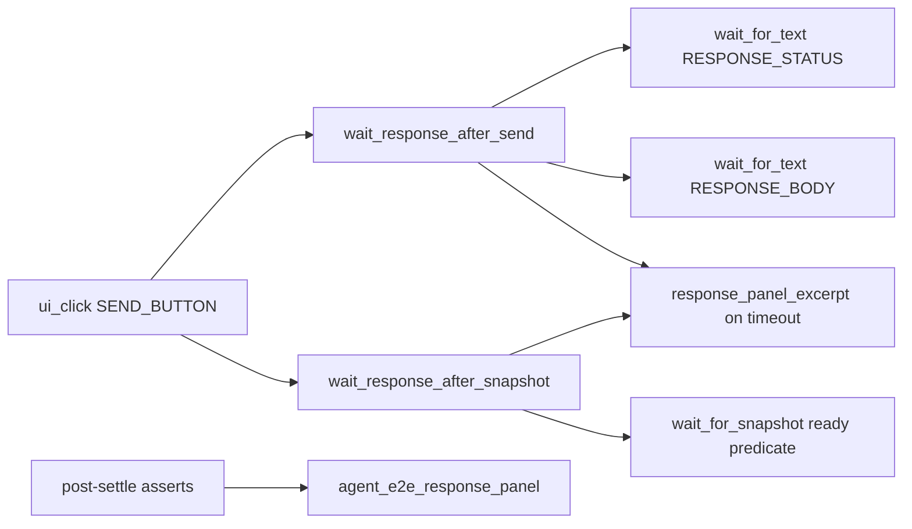

# Agent E2E Send Settle Helpers (PYPOST-948)

## Overview

Shared helpers for **Send → response readiness** in sibling agent UI e2e
scenarios. After Click Send, tests wait for status and body text on catalog
widget ids (`RESPONSE_STATUS` / `RESPONSE_BODY`) instead of polling a
sanitize-coupled panel snapshot predicate.

Golden e2e (PYPOST-920) still uses inline tab-scoped `wait_for_text`; sibling
modules import this helper for DRY timeout diagnostics. Post-settle cardinality
asserts still walk `RESPONSE_PANEL` via
[response-panel helpers](agent_e2e_response_panel.md).

## Architecture

| Piece | Role |
| --- | --- |
| `tests/helpers/agent_e2e_send_settle.py` | `wait_response_after_send`, `wait_response_after_snapshot`, `json_response_body_display` |
| `tests/test_agent_e2e_response_panel.py` | Convention lock on mandatory Send modules |
| Sibling Send modules | Call text-wait or snapshot helper after `ui_click(SEND_BUTTON)` |



Mandatory modules guarded by
`test_send_modules_use_identity_scoped_text_wait_settle`:

- `test_agent_e2e_double_response_body.py`
- `test_agent_e2e_presentation_matrix.py`
- `test_agent_e2e_http_env.py`

Optional: `test_agent_e2e_http_seed_post.py` (tree-open Send uses
`in_current_tab=True` on helper and session waits — PYPOST-949).

Snapshot Send settle (mapping multi-URL, PYPOST-956):

- `test_agent_e2e_http_mapping_multi_url.py` — guarded by
  `test_snapshot_send_settle_modules_use_shared_helper`.

## API / Usage

```python
from tests.helpers.agent_e2e_send_settle import (
    json_response_body_display,
    wait_response_after_send,
    wait_response_after_snapshot,
)

_BODY_DISPLAY = json_response_body_display('{"ok": true}')

session.ui_click(SEND_BUTTON)
wait_response_after_send(
    session,
    status_label="Status: 200",
    body_text=_BODY_DISPLAY,
    step="wait_response_after_send",
)
# post-settle: joined_panel_values / count asserts unchanged
```

### `json_response_body_display(raw: str) -> str`

Pretty-print JSON as shown in `RESPONSE_BODY` (`indent=2`, matching
`ResponseView.display_response`). Use for **readiness waits**; compact
snapshot tokens may still differ for post-settle joins.

### `wait_response_after_send(session, *, status_label, body_text, step, …)`

Wait for status label then body text on catalog ids via
`session.wait_for_text(..., in_current_tab=…)`. Defaults to window root;
pass `in_current_tab=True` when the active request tab differs from
window-first match (seed POST tree-open path).

On `UiWaitTimeoutError`, re-raises with `step`, `response_excerpt`, and merged
diagnostics (same contract as golden timeout wrapping).

| Parameter | Default | Notes |
| --- | --- | --- |
| `timeout` | `SEND_SETTLE_TIMEOUT_S` (15 s) | From `tests.helpers.agent_e2e_send` |
| `message_prefix` | `"Send settle failed"` | Prepended to timeout message |
| `diagnostics_extra` | `None` | Merged into raised diagnostics |
| `in_current_tab` | `False` | Passed to `session.wait_for_text` (PYPOST-949) |

Streaming scenarios (double-body, presentation matrix) may still sleep ~100 ms
after settle so a late chunk flush does not affect post-settle counts.

### `wait_response_after_snapshot(session, ready, *, step, …)`

Wait for a snapshot readiness predicate via `session.wait_for_snapshot`. Use
when panel-walk readiness (compact JSON in joined panel values) is required —
mapping multi-URL Send (PYPOST-901).

On `UiWaitTimeoutError`, re-raises with step **in the message string** (mapping
contract):

```text
{message_prefix} ({step}): {exc}; response_excerpt={excerpt!r}
```

Diagnostics match text-wait: merge `exc.diagnostics`, set `"step"` and
`"response_excerpt"`, preserve `timeout_s` and `condition`.

| Parameter | Default | Notes |
| --- | --- | --- |
| `timeout` | `SEND_SETTLE_TIMEOUT_S` (15 s) | Companion passes `FORCED_SETTLE_TIMEOUT_S` (0.05 s) |
| `message_prefix` | `"Send settle failed"` | Mapping uses `"mapping multi-URL Send settle failed"` |
| `diagnostics_extra` | `None` | Merged into raised diagnostics |

```python
get_snap = wait_response_after_snapshot(
    session,
    _get_response_ready,
    step="wait_response_after_mapping_get_send",
    message_prefix="mapping multi-URL Send settle failed",
)
```

Forced-timeout companion:

```python
with pytest.raises(UiWaitTimeoutError) as exc_info:
    wait_response_after_snapshot(
        session,
        lambda _: False,
        step="wait_response_after_mapping_get_send",
        message_prefix="mapping multi-URL Send settle failed",
        timeout=FORCED_SETTLE_TIMEOUT_S,
    )
```

## Configuration

None beyond shared agent e2e timeouts. Import paths:

- `tests.helpers.agent_e2e_send_settle`
- Widget ids: `pypost.ui.widget_ids.RESPONSE_STATUS`, `RESPONSE_BODY`

## Running the convention lock

```bash
make test PYTEST_ARGS="tests/test_agent_e2e_response_panel.py::test_send_modules_use_identity_scoped_text_wait_settle -v"
make test PYTEST_ARGS="tests/test_agent_e2e_response_panel.py -k snapshot_send_settle -v"
```

## Troubleshooting

| Symptom | Check |
| --- | --- |
| Convention lock fails on `_response_ready` | Replace `wait_for_snapshot(_response_ready)` with helper or twin `wait_for_text` on status/body ids |
| Body wait timeout, status ok | Expected body must be **display form** (`json_response_body_display`), not compact snapshot JSON |
| Wrong tab matched | Multi-tab Send: pass `in_current_tab=True` on helper or `session.wait_for_text` |
| Timeout lacks `step` / excerpt | Call via `wait_response_after_send` or `wait_response_after_snapshot`, not bare waits, when diagnostics matter |
| Snapshot settle convention lock fails | Remove local `_wait_response`; import `wait_response_after_snapshot` |
| Mapping message missing `(step)` | Snapshot helper embeds step in message; text-wait helper does not |
| Post-settle count wrong | Settle helper does not replace panel walk asserts; confirm chunk-flush delay if streaming stub |

## See also

- [Agent UI E2E](agent_e2e.md)
- [Agent Golden E2E](agent_golden_e2e.md)
- [Agent E2E Response-Panel Helpers](agent_e2e_response_panel.md)
- [UI Settle / Wait Helpers](ui_wait.md)
- [UI Widget Identity](ui_identity.md)
